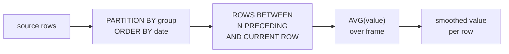

# :material-chart-bell-curve-cumulative: Moving Average

Smooth out short-term fluctuations and reveal trends by averaging values over a sliding window of rows or a time-based range — essential for financial analysis, sensor smoothing, and demand forecasting.

---

## :material-sitemap: Execution Flow



---

## :material-pin: Syntax

### Row-based (fixed number of rows)

```sql
AVG(value) OVER (
    PARTITION BY group_col
    ORDER BY order_col
    ROWS BETWEEN N PRECEDING AND CURRENT ROW
) AS moving_avg_n
```

### Range-based (time interval)

```sql
AVG(value) OVER (
    PARTITION BY group_col
    ORDER BY CAST(date_col AS LONG)
    RANGE BETWEEN 86400 * 6 PRECEDING AND CURRENT ROW
) AS moving_avg_7d
```

| Element | Purpose |
|---------|---------|
| `ROWS BETWEEN N PRECEDING AND CURRENT ROW` | Sliding window of exactly N+1 rows (current + N prior) |
| `ROWS BETWEEN N PRECEDING AND N FOLLOWING` | Centred window of 2N+1 rows |
| `RANGE BETWEEN` | Logical range based on the `ORDER BY` value (useful for gaps in dates) |
| `PARTITION BY` | Restart the window for each group |

!!! note "ROWS vs RANGE"
    `ROWS BETWEEN 6 PRECEDING AND CURRENT ROW` always uses exactly 7 rows regardless of date gaps. `RANGE BETWEEN` uses a logical interval, so it adapts when dates are missing — but requires a numeric or timestamp `ORDER BY` column. For most moving average use cases with continuous daily data, `ROWS` is simpler and sufficient.

---

## :material-magnify: Behavior

1. **Partial windows at the start** — the first N rows in each partition have fewer than N+1 rows in the frame; `AVG()` still computes correctly over however many rows are available, but the average is less smoothed.
2. **NULL handling** — `AVG()` ignores `NULL` values, so the window effectively shrinks; if all rows in the frame are `NULL`, the result is `NULL`.
3. **Deterministic ordering** — if multiple rows share the same `ORDER BY` value, add a tie-breaker to guarantee repeatable results.
4. **Frame boundary** — `CURRENT ROW` includes the current row in the average; use `1 PRECEDING AND 1 PRECEDING` style to exclude it (trailing-only average).

---

## :material-database: Sample Data

### Dataset 1: Daily stock prices

```sql
CREATE OR REPLACE TEMP VIEW stock_prices AS
SELECT * FROM VALUES
    ('ACME', DATE '2024-06-03', 142.50, 3200000),
    ('ACME', DATE '2024-06-04', 145.20, 2800000),
    ('ACME', DATE '2024-06-05', 143.80, 3500000),
    ('ACME', DATE '2024-06-06', 148.10, 4100000),
    ('ACME', DATE '2024-06-07', 147.50, 3800000),
    ('ACME', DATE '2024-06-10', 150.30, 4500000),
    ('ACME', DATE '2024-06-11', 149.70, 3900000),
    ('ACME', DATE '2024-06-12', 152.40, 5200000),
    ('ACME', DATE '2024-06-13', 151.20, 4800000),
    ('ACME', DATE '2024-06-14', 155.00, 6100000),
    ('ACME', DATE '2024-06-17', 153.80, 4200000),
    ('ACME', DATE '2024-06-18', 156.50, 5500000),
    ('BOLT', DATE '2024-06-03',  38.20, 1500000),
    ('BOLT', DATE '2024-06-04',  37.80, 1200000),
    ('BOLT', DATE '2024-06-05',  39.10, 1800000),
    ('BOLT', DATE '2024-06-06',  38.50, 1600000),
    ('BOLT', DATE '2024-06-07',  40.20, 2100000),
    ('BOLT', DATE '2024-06-10',  41.00, 2400000),
    ('BOLT', DATE '2024-06-11',  40.50, 1900000),
    ('BOLT', DATE '2024-06-12',  42.30, 2800000),
    ('BOLT', DATE '2024-06-13',  41.80, 2200000),
    ('BOLT', DATE '2024-06-14',  43.50, 3000000),
    ('BOLT', DATE '2024-06-17',  42.90, 2500000),
    ('BOLT', DATE '2024-06-18',  44.10, 2900000)
AS t(ticker, trade_date, close_price, volume);
```

### Dataset 2: Weekly retail sales

```sql
CREATE OR REPLACE TEMP VIEW weekly_sales AS
SELECT * FROM VALUES
    ('Electronics', DATE '2024-01-07', 28500.00),
    ('Electronics', DATE '2024-01-14', 31200.00),
    ('Electronics', DATE '2024-01-21', 29800.00),
    ('Electronics', DATE '2024-01-28', 34500.00),
    ('Electronics', DATE '2024-02-04', 32100.00),
    ('Electronics', DATE '2024-02-11', 36800.00),
    ('Electronics', DATE '2024-02-18', 33500.00),
    ('Electronics', DATE '2024-02-25', 38200.00),
    ('Electronics', DATE '2024-03-03', 35400.00),
    ('Electronics', DATE '2024-03-10', 40100.00),
    ('Electronics', DATE '2024-03-17', 37600.00),
    ('Electronics', DATE '2024-03-24', 42000.00),
    ('Clothing',    DATE '2024-01-07', 15200.00),
    ('Clothing',    DATE '2024-01-14', 14800.00),
    ('Clothing',    DATE '2024-01-21', 16500.00),
    ('Clothing',    DATE '2024-01-28', 18200.00),
    ('Clothing',    DATE '2024-02-04', 17100.00),
    ('Clothing',    DATE '2024-02-11', 19500.00),
    ('Clothing',    DATE '2024-02-18', 21000.00),
    ('Clothing',    DATE '2024-02-25', 20200.00),
    ('Clothing',    DATE '2024-03-03', 22800.00),
    ('Clothing',    DATE '2024-03-10', 21500.00),
    ('Clothing',    DATE '2024-03-17', 24000.00),
    ('Clothing',    DATE '2024-03-24', 23200.00)
AS t(category, week_start, revenue);
```

### Dataset 3: Hourly server response times

```sql
CREATE OR REPLACE TEMP VIEW response_times AS
SELECT * FROM VALUES
    ('api-gw', TIMESTAMP '2024-04-10 08:00:00', 120),
    ('api-gw', TIMESTAMP '2024-04-10 09:00:00', 135),
    ('api-gw', TIMESTAMP '2024-04-10 10:00:00', 245),
    ('api-gw', TIMESTAMP '2024-04-10 11:00:00', 180),
    ('api-gw', TIMESTAMP '2024-04-10 12:00:00', 310),
    ('api-gw', TIMESTAMP '2024-04-10 13:00:00', 420),
    ('api-gw', TIMESTAMP '2024-04-10 14:00:00', 350),
    ('api-gw', TIMESTAMP '2024-04-10 15:00:00', 280),
    ('api-gw', TIMESTAMP '2024-04-10 16:00:00', 190),
    ('api-gw', TIMESTAMP '2024-04-10 17:00:00', 160),
    ('api-gw', TIMESTAMP '2024-04-10 18:00:00', 140),
    ('api-gw', TIMESTAMP '2024-04-10 19:00:00', 125)
AS t(service, ts, p95_ms);
```

---

## :material-flask-outline: Practical Examples

### 1 — Simple Moving Average (SMA): 3-day and 5-day

```sql
SELECT
    ticker,
    trade_date,
    close_price,
    ROUND(AVG(close_price) OVER (
        PARTITION BY ticker
        ORDER BY trade_date
        ROWS BETWEEN 2 PRECEDING AND CURRENT ROW
    ), 2) AS sma_3,
    ROUND(AVG(close_price) OVER (
        PARTITION BY ticker
        ORDER BY trade_date
        ROWS BETWEEN 4 PRECEDING AND CURRENT ROW
    ), 2) AS sma_5
FROM stock_prices
ORDER BY ticker, trade_date;
```

??? success "Expected output"

    | ticker | trade_date | close_price | sma_3 | sma_5 |
    |--------|------------|-------------|-------|-------|
    | ACME | 2024-06-03 | 142.50 | 142.50 | 142.50 |
    | ACME | 2024-06-04 | 145.20 | 143.85 | 143.85 |
    | ACME | 2024-06-05 | 143.80 | 143.83 | 143.83 |
    | ACME | 2024-06-06 | 148.10 | 145.70 | 144.90 |
    | ACME | 2024-06-07 | 147.50 | 146.47 | 145.42 |
    | ACME | 2024-06-10 | 150.30 | 148.63 | 146.98 |
    | ACME | 2024-06-11 | 149.70 | 149.17 | 147.88 |
    | ACME | 2024-06-12 | 152.40 | 150.80 | 149.58 |
    | ACME | 2024-06-13 | 151.20 | 151.10 | 150.22 |
    | ACME | 2024-06-14 | 155.00 | 152.87 | 151.72 |
    | ACME | 2024-06-17 | 153.80 | 153.33 | 152.42 |
    | ACME | 2024-06-18 | 156.50 | 155.10 | 153.78 |
    | BOLT | 2024-06-03 | 38.20 | 38.20 | 38.20 |
    | BOLT | 2024-06-04 | 37.80 | 38.00 | 38.00 |
    | BOLT | 2024-06-05 | 39.10 | 38.37 | 38.37 |
    | BOLT | 2024-06-06 | 38.50 | 38.47 | 38.40 |
    | BOLT | 2024-06-07 | 40.20 | 39.27 | 38.76 |
    | BOLT | 2024-06-10 | 41.00 | 39.90 | 39.32 |
    | BOLT | 2024-06-11 | 40.50 | 40.57 | 39.86 |
    | BOLT | 2024-06-12 | 42.30 | 41.27 | 40.50 |
    | BOLT | 2024-06-13 | 41.80 | 41.53 | 41.16 |
    | BOLT | 2024-06-14 | 43.50 | 42.53 | 41.82 |
    | BOLT | 2024-06-17 | 42.90 | 42.73 | 42.20 |
    | BOLT | 2024-06-18 | 44.10 | 43.50 | 42.92 |

### 2 — SMA crossover signal (golden cross / death cross)

A classic trading signal: when the short-term average crosses above the long-term average (bullish) or below (bearish):

```sql
WITH averages AS (
    SELECT
        ticker,
        trade_date,
        close_price,
        ROUND(AVG(close_price) OVER (
            PARTITION BY ticker ORDER BY trade_date
            ROWS BETWEEN 2 PRECEDING AND CURRENT ROW
        ), 2) AS sma_3,
        ROUND(AVG(close_price) OVER (
            PARTITION BY ticker ORDER BY trade_date
            ROWS BETWEEN 4 PRECEDING AND CURRENT ROW
        ), 2) AS sma_5
    FROM stock_prices
),
with_prev AS (
    SELECT
        *,
        LAG(sma_3) OVER (PARTITION BY ticker ORDER BY trade_date) AS prev_sma_3,
        LAG(sma_5) OVER (PARTITION BY ticker ORDER BY trade_date) AS prev_sma_5
    FROM averages
)
SELECT
    ticker,
    trade_date,
    close_price,
    sma_3,
    sma_5,
    CASE
        WHEN prev_sma_3 <= prev_sma_5 AND sma_3 > sma_5 THEN 'BULLISH CROSS'
        WHEN prev_sma_3 >= prev_sma_5 AND sma_3 < sma_5 THEN 'BEARISH CROSS'
        ELSE NULL
    END AS signal
FROM with_prev
ORDER BY ticker, trade_date;
```

??? success "Expected output"

    | ticker | trade_date | close_price | sma_3 | sma_5 | signal |
    |--------|------------|-------------|-------|-------|--------|
    | ACME | 2024-06-03 | 142.50 | 142.50 | 142.50 | NULL |
    | ACME | 2024-06-04 | 145.20 | 143.85 | 143.85 | NULL |
    | ACME | 2024-06-05 | 143.80 | 143.83 | 143.83 | NULL |
    | ACME | 2024-06-06 | 148.10 | 145.70 | 144.90 | NULL |
    | ACME | 2024-06-07 | 147.50 | 146.47 | 145.42 | NULL |
    | ACME | 2024-06-10 | 150.30 | 148.63 | 146.98 | NULL |
    | ACME | 2024-06-11 | 149.70 | 149.17 | 147.88 | NULL |
    | ACME | 2024-06-12 | 152.40 | 150.80 | 149.58 | NULL |
    | ACME | 2024-06-13 | 151.20 | 151.10 | 150.22 | NULL |
    | ACME | 2024-06-14 | 155.00 | 152.87 | 151.72 | NULL |
    | ACME | 2024-06-17 | 153.80 | 153.33 | 152.42 | NULL |
    | ACME | 2024-06-18 | 156.50 | 155.10 | 153.78 | NULL |
    | ... | | | | | |

!!! tip "Real-world crossover"
    In production, the SMA windows are typically larger (e.g., 50-day vs 200-day). This example uses small windows to demonstrate the pattern with limited sample data.

### 3 — Weighted Moving Average (WMA)

Give more weight to recent values — recent days matter more than older ones:

```sql
SELECT
    ticker,
    trade_date,
    close_price,
    ROUND(
        (
            3 * close_price +
            2 * LAG(close_price, 1) OVER (PARTITION BY ticker ORDER BY trade_date) +
            1 * LAG(close_price, 2) OVER (PARTITION BY ticker ORDER BY trade_date)
        ) / 6.0
    , 2) AS wma_3
FROM stock_prices
ORDER BY ticker, trade_date;
```

??? success "Expected output"

    | ticker | trade_date | close_price | wma_3 |
    |--------|------------|-------------|-------|
    | ACME | 2024-06-03 | 142.50 | NULL |
    | ACME | 2024-06-04 | 145.20 | NULL |
    | ACME | 2024-06-05 | 143.80 | 143.97 |
    | ACME | 2024-06-06 | 148.10 | 146.22 |
    | ACME | 2024-06-07 | 147.50 | 146.88 |
    | ACME | 2024-06-10 | 150.30 | 149.28 |
    | ACME | 2024-06-11 | 149.70 | 149.72 |
    | ACME | 2024-06-12 | 152.40 | 151.22 |
    | ACME | 2024-06-13 | 151.20 | 151.35 |
    | ACME | 2024-06-14 | 155.00 | 153.37 |
    | ACME | 2024-06-17 | 153.80 | 153.97 |
    | ACME | 2024-06-18 | 156.50 | 155.55 |
    | ... | | | |

!!! note "WMA formula"
    For a 3-period WMA, weights are `3, 2, 1` (sum = 6). The most recent row gets weight 3, one row back gets 2, two rows back gets 1. The first N-1 rows return `NULL` because `LAG` cannot look back far enough.

### 4 — Exponential Moving Average (EMA) approximation

Spark SQL has no built-in EMA, but it can be approximated by combining `SUM` with exponential decay weights:

```sql
WITH indexed AS (
    SELECT
        ticker,
        trade_date,
        close_price,
        ROW_NUMBER() OVER (PARTITION BY ticker ORDER BY trade_date) AS rn,
        COUNT(*) OVER (PARTITION BY ticker) AS total_rows
    FROM stock_prices
),
ema_calc AS (
    SELECT
        a.ticker,
        a.trade_date,
        a.close_price,
        ROUND(
            SUM(b.close_price * POW(1 - 2.0 / (3 + 1), a.rn - b.rn))
            / SUM(POW(1 - 2.0 / (3 + 1), a.rn - b.rn))
        , 2) AS ema_3
    FROM indexed a
    JOIN indexed b
        ON a.ticker = b.ticker
        AND b.rn <= a.rn
    GROUP BY a.ticker, a.trade_date, a.close_price, a.rn
)
SELECT ticker, trade_date, close_price, ema_3
FROM ema_calc
ORDER BY ticker, trade_date;
```

??? success "Expected output"

    | ticker | trade_date | close_price | ema_3 |
    |--------|------------|-------------|-------|
    | ACME | 2024-06-03 | 142.50 | 142.50 |
    | ACME | 2024-06-04 | 145.20 | 144.30 |
    | ACME | 2024-06-05 | 143.80 | 143.96 |
    | ACME | 2024-06-06 | 148.10 | 146.69 |
    | ACME | 2024-06-07 | 147.50 | 147.24 |
    | ... | | | |

!!! warning "Self-join cost"
    The EMA approximation uses a self-join that is O(n^2) per partition. For large datasets, compute EMA iteratively in PySpark or use a UDF instead.

### 5 — 4-week moving average for retail sales

```sql
SELECT
    category,
    week_start,
    revenue,
    ROUND(AVG(revenue) OVER (
        PARTITION BY category
        ORDER BY week_start
        ROWS BETWEEN 3 PRECEDING AND CURRENT ROW
    ), 2) AS ma_4wk,
    ROUND(revenue - AVG(revenue) OVER (
        PARTITION BY category
        ORDER BY week_start
        ROWS BETWEEN 3 PRECEDING AND CURRENT ROW
    ), 2) AS deviation_from_ma
FROM weekly_sales
ORDER BY category, week_start;
```

??? success "Expected output"

    | category | week_start | revenue | ma_4wk | deviation_from_ma |
    |----------|------------|---------|--------|-------------------|
    | Clothing | 2024-01-07 | 15200.00 | 15200.00 | 0.00 |
    | Clothing | 2024-01-14 | 14800.00 | 15000.00 | -200.00 |
    | Clothing | 2024-01-21 | 16500.00 | 15500.00 | 1000.00 |
    | Clothing | 2024-01-28 | 18200.00 | 16175.00 | 2025.00 |
    | Clothing | 2024-02-04 | 17100.00 | 16650.00 | 450.00 |
    | Clothing | 2024-02-11 | 19500.00 | 17825.00 | 1675.00 |
    | Clothing | 2024-02-18 | 21000.00 | 18950.00 | 2050.00 |
    | Clothing | 2024-02-25 | 20200.00 | 19450.00 | 750.00 |
    | Clothing | 2024-03-03 | 22800.00 | 20875.00 | 1925.00 |
    | Clothing | 2024-03-10 | 21500.00 | 21375.00 | 125.00 |
    | Clothing | 2024-03-17 | 24000.00 | 22125.00 | 1875.00 |
    | Clothing | 2024-03-24 | 23200.00 | 22875.00 | 325.00 |
    | Electronics | 2024-01-07 | 28500.00 | 28500.00 | 0.00 |
    | Electronics | 2024-01-14 | 31200.00 | 29850.00 | 1350.00 |
    | Electronics | 2024-01-21 | 29800.00 | 29833.33 | -33.33 |
    | Electronics | 2024-01-28 | 34500.00 | 31000.00 | 3500.00 |
    | Electronics | 2024-02-04 | 32100.00 | 31900.00 | 200.00 |
    | Electronics | 2024-02-11 | 36800.00 | 33300.00 | 3500.00 |
    | Electronics | 2024-02-18 | 33500.00 | 34225.00 | -725.00 |
    | Electronics | 2024-02-25 | 38200.00 | 35150.00 | 3050.00 |
    | Electronics | 2024-03-03 | 35400.00 | 35975.00 | -575.00 |
    | Electronics | 2024-03-10 | 40100.00 | 36800.00 | 3300.00 |
    | Electronics | 2024-03-17 | 37600.00 | 37825.00 | -225.00 |
    | Electronics | 2024-03-24 | 42000.00 | 38775.00 | 3225.00 |

### 6 — Centred Moving Average (symmetric window)

A centred window looks both backward and forward — useful for offline trend analysis where future data is available:

```sql
SELECT
    category,
    week_start,
    revenue,
    ROUND(AVG(revenue) OVER (
        PARTITION BY category
        ORDER BY week_start
        ROWS BETWEEN 2 PRECEDING AND 2 FOLLOWING
    ), 2) AS centred_ma_5
FROM weekly_sales
ORDER BY category, week_start;
```

??? success "Expected output"

    | category | week_start | revenue | centred_ma_5 |
    |----------|------------|---------|--------------|
    | Clothing | 2024-01-07 | 15200.00 | 15500.00 |
    | Clothing | 2024-01-14 | 14800.00 | 16175.00 |
    | Clothing | 2024-01-21 | 16500.00 | 16360.00 |
    | Clothing | 2024-01-28 | 18200.00 | 17220.00 |
    | Clothing | 2024-02-04 | 17100.00 | 18460.00 |
    | Clothing | 2024-02-11 | 19500.00 | 19200.00 |
    | Clothing | 2024-02-18 | 21000.00 | 20120.00 |
    | Clothing | 2024-02-25 | 20200.00 | 21100.00 |
    | Clothing | 2024-03-03 | 22800.00 | 21900.00 |
    | Clothing | 2024-03-10 | 21500.00 | 22875.00 |
    | Clothing | 2024-03-17 | 24000.00 | 22900.00 |
    | Clothing | 2024-03-24 | 23200.00 | 22900.00 |
    | ... | | | |

!!! note "Edge effects"
    At partition boundaries the window shrinks. The first and last rows use only 3 values; the second and second-to-last use 4. Be aware of this when interpreting edge values.

### 7 — Moving min / max / stddev (Bollinger-style bands)

Compute a moving average with upper and lower bands based on standard deviation:

```sql
SELECT
    ticker,
    trade_date,
    close_price,
    ROUND(AVG(close_price) OVER w, 2) AS sma_5,
    ROUND(AVG(close_price) OVER w + 2 * STDDEV(close_price) OVER w, 2) AS upper_band,
    ROUND(AVG(close_price) OVER w - 2 * STDDEV(close_price) OVER w, 2) AS lower_band,
    MIN(close_price) OVER w AS moving_low,
    MAX(close_price) OVER w AS moving_high
FROM stock_prices
WINDOW w AS (
    PARTITION BY ticker
    ORDER BY trade_date
    ROWS BETWEEN 4 PRECEDING AND CURRENT ROW
)
ORDER BY ticker, trade_date;
```

??? success "Expected output"

    | ticker | trade_date | close_price | sma_5 | upper_band | lower_band | moving_low | moving_high |
    |--------|------------|-------------|-------|------------|------------|------------|-------------|
    | ACME | 2024-06-03 | 142.50 | 142.50 | NULL | NULL | 142.50 | 142.50 |
    | ACME | 2024-06-04 | 145.20 | 143.85 | 147.66 | 140.04 | 142.50 | 145.20 |
    | ACME | 2024-06-05 | 143.80 | 143.83 | 147.54 | 140.13 | 142.50 | 145.20 |
    | ACME | 2024-06-06 | 148.10 | 144.90 | 149.36 | 140.44 | 142.50 | 148.10 |
    | ACME | 2024-06-07 | 147.50 | 145.42 | 149.87 | 140.97 | 142.50 | 148.10 |
    | ACME | 2024-06-10 | 150.30 | 146.98 | 150.84 | 143.12 | 143.80 | 150.30 |
    | ACME | 2024-06-11 | 149.70 | 147.88 | 151.55 | 144.21 | 143.80 | 150.30 |
    | ... | | | | | | | |

!!! tip "Named WINDOW clause"
    The `WINDOW w AS (...)` clause avoids repeating the same frame specification in every aggregate. All window functions that reference `w` share the identical partition, order, and frame.

### 8 — Moving volume-weighted average price (VWAP)

Weight the price by volume to compute a VWAP over a sliding window:

```sql
SELECT
    ticker,
    trade_date,
    close_price,
    volume,
    ROUND(
        SUM(close_price * volume) OVER w / SUM(volume) OVER w
    , 2) AS vwap_5
FROM stock_prices
WINDOW w AS (
    PARTITION BY ticker
    ORDER BY trade_date
    ROWS BETWEEN 4 PRECEDING AND CURRENT ROW
)
ORDER BY ticker, trade_date;
```

??? success "Expected output"

    | ticker | trade_date | close_price | volume | vwap_5 |
    |--------|------------|-------------|--------|--------|
    | ACME | 2024-06-03 | 142.50 | 3200000 | 142.50 |
    | ACME | 2024-06-04 | 145.20 | 2800000 | 143.76 |
    | ACME | 2024-06-05 | 143.80 | 3500000 | 143.74 |
    | ACME | 2024-06-06 | 148.10 | 4100000 | 145.04 |
    | ACME | 2024-06-07 | 147.50 | 3800000 | 145.61 |
    | ACME | 2024-06-10 | 150.30 | 4500000 | 147.47 |
    | ACME | 2024-06-11 | 149.70 | 3900000 | 148.16 |
    | ACME | 2024-06-12 | 152.40 | 5200000 | 149.98 |
    | ACME | 2024-06-13 | 151.20 | 4800000 | 150.45 |
    | ACME | 2024-06-14 | 155.00 | 6100000 | 152.12 |
    | ACME | 2024-06-17 | 153.80 | 4200000 | 152.60 |
    | ACME | 2024-06-18 | 156.50 | 5500000 | 153.80 |
    | ... | | | | |

### 9 — SLA breach detection: moving p95 latency

Use a 3-hour moving average to detect sustained latency spikes:

```sql
SELECT
    service,
    ts,
    p95_ms,
    ROUND(AVG(p95_ms) OVER (
        ORDER BY ts
        ROWS BETWEEN 2 PRECEDING AND CURRENT ROW
    ), 0) AS ma_3h_p95,
    CASE
        WHEN AVG(p95_ms) OVER (
            ORDER BY ts
            ROWS BETWEEN 2 PRECEDING AND CURRENT ROW
        ) > 250 THEN 'SLA BREACH'
        ELSE 'OK'
    END AS sla_status
FROM response_times
ORDER BY ts;
```

??? success "Expected output"

    | service | ts | p95_ms | ma_3h_p95 | sla_status |
    |---------|-----|--------|-----------|------------|
    | api-gw | 2024-04-10 08:00 | 120 | 120 | OK |
    | api-gw | 2024-04-10 09:00 | 135 | 128 | OK |
    | api-gw | 2024-04-10 10:00 | 245 | 167 | OK |
    | api-gw | 2024-04-10 11:00 | 180 | 187 | OK |
    | api-gw | 2024-04-10 12:00 | 310 | 245 | OK |
    | api-gw | 2024-04-10 13:00 | 420 | 303 | SLA BREACH |
    | api-gw | 2024-04-10 14:00 | 350 | 360 | SLA BREACH |
    | api-gw | 2024-04-10 15:00 | 280 | 350 | SLA BREACH |
    | api-gw | 2024-04-10 16:00 | 190 | 273 | SLA BREACH |
    | api-gw | 2024-04-10 17:00 | 160 | 210 | OK |
    | api-gw | 2024-04-10 18:00 | 140 | 163 | OK |
    | api-gw | 2024-04-10 19:00 | 125 | 142 | OK |

### 10 — Comparing multiple window sizes side by side

```sql
SELECT
    ticker,
    trade_date,
    close_price,
    ROUND(AVG(close_price) OVER (
        PARTITION BY ticker ORDER BY trade_date
        ROWS BETWEEN 2 PRECEDING AND CURRENT ROW
    ), 2) AS sma_3,
    ROUND(AVG(close_price) OVER (
        PARTITION BY ticker ORDER BY trade_date
        ROWS BETWEEN 4 PRECEDING AND CURRENT ROW
    ), 2) AS sma_5,
    ROUND(AVG(close_price) OVER (
        PARTITION BY ticker ORDER BY trade_date
        ROWS BETWEEN 9 PRECEDING AND CURRENT ROW
    ), 2) AS sma_10,
    ROUND(AVG(close_price) OVER (
        PARTITION BY ticker ORDER BY trade_date
        ROWS BETWEEN UNBOUNDED PRECEDING AND CURRENT ROW
    ), 2) AS cumulative_avg
FROM stock_prices
ORDER BY ticker, trade_date;
```

??? success "Expected output"

    | ticker | trade_date | close_price | sma_3 | sma_5 | sma_10 | cumulative_avg |
    |--------|------------|-------------|-------|-------|--------|----------------|
    | ACME | 2024-06-03 | 142.50 | 142.50 | 142.50 | 142.50 | 142.50 |
    | ACME | 2024-06-04 | 145.20 | 143.85 | 143.85 | 143.85 | 143.85 |
    | ACME | 2024-06-05 | 143.80 | 143.83 | 143.83 | 143.83 | 143.83 |
    | ACME | 2024-06-06 | 148.10 | 145.70 | 144.90 | 144.90 | 144.90 |
    | ACME | 2024-06-07 | 147.50 | 146.47 | 145.42 | 145.42 | 145.42 |
    | ACME | 2024-06-10 | 150.30 | 148.63 | 146.98 | 146.23 | 146.23 |
    | ACME | 2024-06-11 | 149.70 | 149.17 | 147.88 | 146.73 | 146.73 |
    | ACME | 2024-06-12 | 152.40 | 150.80 | 149.58 | 147.44 | 147.44 |
    | ACME | 2024-06-13 | 151.20 | 151.10 | 150.22 | 147.86 | 147.86 |
    | ACME | 2024-06-14 | 155.00 | 152.87 | 151.72 | 148.57 | 148.57 |
    | ACME | 2024-06-17 | 153.80 | 153.33 | 152.42 | 149.60 | 149.50 |
    | ACME | 2024-06-18 | 156.50 | 155.10 | 153.78 | 150.84 | 149.67 |
    | ... | | | | | | |

!!! tip "Wider windows = smoother trend"
    SMA-3 tracks the price closely (noisy), while cumulative average is the smoothest but least responsive to recent changes. Choose the window size based on the balance of responsiveness vs noise reduction your use case requires.

---

## :material-shield-outline: Behavior Notes

!!! warning "Partial windows at partition edges"
    The first N-1 rows in each partition have incomplete windows. `AVG()` still computes a result, but it is based on fewer data points and may be misleading. Consider filtering these rows out, or flag them with `COUNT(*) OVER (... ROWS BETWEEN N PRECEDING AND CURRENT ROW) < N+1`.

!!! warning "Gaps in time series"
    `ROWS BETWEEN 6 PRECEDING` always looks at 6 prior **rows**, not 6 prior **days**. If your data has missing dates (weekends, holidays), a "7-day" moving average based on `ROWS` will actually span more than 7 calendar days. Use `RANGE BETWEEN` with a numeric ordering column for true calendar-based windows.

!!! tip "Named WINDOW for readability"
    When multiple aggregates share the same frame, use `WINDOW w AS (...)` at the end of the query and reference `OVER w` in each aggregate. This reduces duplication and makes the intent clearer.

---

## :material-brain: When to Use

| Scenario | Pattern |
|----------|---------|
| Stock price trend smoothing | `AVG(price) OVER (... ROWS BETWEEN N PRECEDING AND CURRENT ROW)` |
| Sales demand forecasting | 4-week or 13-week moving average on weekly revenue |
| Bollinger bands / volatility | SMA +/- 2 * `STDDEV()` over the same window |
| VWAP (volume-weighted average) | `SUM(price*vol) OVER w / SUM(vol) OVER w` |
| SLA / latency monitoring | Moving average + `CASE WHEN > threshold` |
| Weighted moving average | `LAG()` with manual weights (3, 2, 1) |
| Exponential moving average | Self-join with decay weights (expensive; prefer UDF for large data) |
| Centred moving average | `ROWS BETWEEN N PRECEDING AND N FOLLOWING` (offline analysis only) |
| Compare multiple horizons | Side-by-side SMA-3, SMA-5, SMA-10 in one query |
| Detect crossover signals | `LAG(sma_short)` vs `LAG(sma_long)` to find crosses |

---

!!! note "Related"
    See this technique applied end-to-end alongside running totals and LAG/LEAD in
    [Rolling Analysis](../application/enrichment/rolling/index.md).
