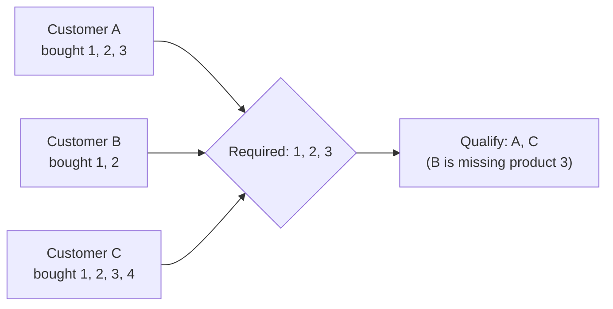

# :material-set-square: Relational Division

Find entities that satisfy **every** member of a required set — "customers who bought
all products in category X," "candidates with every required skill," "students who
passed every exam." This is the relational-algebra **division** operator: given a
dividend (purchases) and a divisor (required products), return the rows in the dividend
whose per-key value set is a **superset** of the divisor.

______________________________________________________________________

## :material-sitemap: The Shape of the Problem



Unlike a plain `JOIN` + `GROUP BY` (which answers "bought **any** of X"), division
answers "bought **all** of X" — extra purchases outside the required set don't
disqualify a customer (see Customer C above, who also bought product 4).

______________________________________________________________________

## :material-database: Sample Data

```sql
-- purchases — one row per (customer, product) they've bought
CREATE OR REPLACE TEMP VIEW purchases AS
SELECT * FROM VALUES
  ('A', 1), ('A', 2), ('A', 3),
  ('B', 1), ('B', 2),
  ('C', 1), ('C', 2), ('C', 3), ('C', 4),
  ('D', 2), ('D', 3)
AS t(customer_id, product_id);

-- required_products — the divisor: every product a qualifying customer must own
CREATE OR REPLACE TEMP VIEW required_products AS
SELECT * FROM VALUES (1), (2), (3) AS t(product_id);
```

| customer_id | products bought | qualifies?                    |
| ----------- | --------------- | ----------------------------- |
| A           | 1, 2, 3         | ✅ exact match                |
| B           | 1, 2            | ❌ missing 3                  |
| C           | 1, 2, 3, 4      | ✅ superset (extra 4 is fine) |
| D           | 2, 3            | ❌ missing 1                  |

______________________________________________________________________

## :material-numeric-1-circle: Approach 1 — `JOIN` + `HAVING COUNT(DISTINCT ...)` (recommended)

Join purchases to the required set, group by customer, and require that the number of
**distinct matched** products equals the size of the divisor:

```sql
SELECT
    p.customer_id
FROM purchases p
JOIN required_products r
    ON p.product_id = r.product_id
GROUP BY p.customer_id
HAVING COUNT(DISTINCT p.product_id) = (SELECT COUNT(*) FROM required_products);
```

```text
+-----------+
|customer_id|
+-----------+
|          C|
|          A|
+-----------+
```

Verified against the sample data above — only `A` and `C` qualify, exactly as expected.
`COUNT(DISTINCT ...)` is essential here, not `COUNT(*)`: a customer with a duplicate
purchase of the same product (e.g. bought product 1 twice) must not be over-counted.
Verified: a customer with rows `(G,1), (G,1), (G,2), (G,3)` produces `raw_rows = 4` but
`COUNT(DISTINCT product_id) = 3` — the correct match count against a 3-item divisor.

!!! tip "Why `HAVING count = subquery`, not a hardcoded literal"

    `(SELECT COUNT(*) FROM required_products)` keeps the query correct if the required
    set changes size — hardcoding `= 3` silently breaks the moment someone adds or
    removes a required product.

### `EXPLAIN FORMATTED` — one table scan

```text
AdaptiveSparkPlan
+- Project
   +- Filter (count(DISTINCT product_id) = Subquery)
      +- HashAggregate            -- final count(DISTINCT) per customer
         +- Exchange
            +- HashAggregate      -- partial count(DISTINCT) per customer
               +- HashAggregate   -- dedupe (customer_id, product_id) pairs
                  +- Exchange
                     +- HashAggregate
                        +- Project
                           +- BroadcastHashJoin Inner BuildRight
                              :- LocalTableScan  -- purchases
                              +- BroadcastExchange
                                 +- LocalTableScan  -- required_products
```

Verified with `EXPLAIN FORMATTED`: `purchases` is scanned **once**. The double
`HashAggregate` pair (dedupe, then partial/final count) is Catalyst's standard
two-phase execution strategy for `COUNT(DISTINCT ...)` — not a sign of an extra table
scan.

______________________________________________________________________

## :material-numeric-2-circle: Approach 2 — Cross Join + Double `LEFT ANTI JOIN`

The classic textbook formulation of relational division is a **double negation**:
"there is no required product that the customer has *not* bought." In T-SQL/PostgreSQL
this is usually written as nested correlated `NOT EXISTS` subqueries. Written that way
in Spark SQL, it **fails to resolve**:

```sql
-- ❌ Fails on Spark: correlated reference to `c.customer_id` from two levels
-- of subquery nesting down is not supported.
WITH customers AS (SELECT DISTINCT customer_id FROM purchases)
SELECT c.customer_id
FROM customers c
WHERE NOT EXISTS (
    SELECT 1 FROM required_products r
    WHERE NOT EXISTS (
        SELECT 1 FROM purchases p
        WHERE p.customer_id = c.customer_id   -- references TWO levels up
          AND p.product_id = r.product_id
    )
);
-- AnalysisException: [UNRESOLVED_COLUMN.WITH_SUGGESTION]
-- A column, variable, or function parameter with name `c`.`customer_id`
-- cannot be resolved.
```

!!! warning "Verified Spark limitation: no double-nested correlated subqueries"

    Tested directly against Spark 4.2: the outer `NOT EXISTS` correlates fine to `c`,
    but the *inner* `NOT EXISTS` cannot see past its immediate parent to reach `c` —
    Spark's subquery resolver only propagates the correlation one level down. This
    two-level correlated `NOT EXISTS` idiom, common in PostgreSQL/SQL Server tutorials,
    simply does not translate to Spark SQL as written. Rewrite it as a join, as below.

The join-based equivalent avoids nested correlation entirely by materializing "missing
(customer, product) combinations" with a `CROSS JOIN` + `LEFT ANTI JOIN`, then
anti-joining customers against that missing set:

```sql
WITH customers AS (
    SELECT DISTINCT customer_id FROM purchases
),
required_combos AS (
    -- every (customer, required product) pair that *should* exist if they qualify
    SELECT c.customer_id, r.product_id
    FROM customers c
    CROSS JOIN required_products r
),
missing AS (
    -- required combos the customer never actually purchased
    SELECT rc.customer_id
    FROM required_combos rc
    LEFT ANTI JOIN purchases p
        ON p.customer_id = rc.customer_id
       AND p.product_id = rc.product_id
)
SELECT c.customer_id
FROM customers c
LEFT ANTI JOIN missing m
    ON c.customer_id = m.customer_id;
```

```text
+-----------+
|customer_id|
+-----------+
|          A|
|          C|
+-----------+
```

Verified identical to Approach 1. `EXPLAIN FORMATTED` shows `BroadcastNestedLoopJoin Cross` (materializing the required combos) followed by two `BroadcastHashJoin LeftAnti`
stages — more operators than Approach 1's single scan, and the cross join grows with
`(distinct customers) × (required set size)`, which is fine for small divisors but
should be avoided if the required set is large.

______________________________________________________________________

## :material-scale-balance: Choosing Between the Two

| Approach                               | Table scans of dividend               | Extra cost                              | When to prefer                                                        |
| -------------------------------------- | ------------------------------------- | --------------------------------------- | --------------------------------------------------------------------- |
| `JOIN` + `HAVING COUNT(DISTINCT ...)`  | 1                                     | Two-phase `COUNT(DISTINCT)` aggregation | Default choice — simplest, cheapest, no cross join                    |
| `CROSS JOIN` + double `LEFT ANTI JOIN` | 1 (plus a materialized cross product) | Cross join scales with divisor size     | Divisor is small and fixed; team prefers explicit "no gaps" semantics |
| Nested correlated `NOT EXISTS`         | —                                     | **Does not run on Spark**               | Never — use one of the above instead                                  |

!!! note "Same shape, many domains"

    This pattern generalizes far beyond purchases: "students who passed every required
    exam," "candidates with every required certification," "servers with every required
    patch installed," "orders containing every item in a bundle SKU." In every case the
    divisor is the required set, the dividend is the actual-membership table, and
    `HAVING COUNT(DISTINCT matched_key) = (SELECT COUNT(*) FROM divisor)` is the
    one-scan solution.

______________________________________________________________________

## :material-database-search: [Databricks] Real-World Example — System Tables

!!! note "[Databricks] Unity Catalog system tables"

    `system.access.audit` is a built-in Unity Catalog table (no sample data setup
    needed) that records real workspace actions over time. An account admin must
    `GRANT USE CATALOG, USE SCHEMA, SELECT ON SCHEMA system.access TO <principal>`
    before these queries will return rows.

### 3 — Users who performed every required cluster action

```sql
-- [Databricks] Requires SELECT on system.access.audit
WITH required_actions AS (
    SELECT * FROM VALUES
        ('createCluster'),
        ('startCluster'),
        ('terminateCluster')
    AS t(action_name)
),
matched_actions AS (
    SELECT
        user_identity.email AS user_email,
        action_name
    FROM system.access.audit
    WHERE event_date >= DATE_SUB(CURRENT_DATE(), 30)
      AND service_name = 'clusters'
      AND user_identity.email IS NOT NULL
      AND action_name IN (SELECT action_name FROM required_actions)
)
SELECT user_email
FROM matched_actions
GROUP BY user_email
HAVING COUNT(DISTINCT action_name) = (SELECT COUNT(*) FROM required_actions)
ORDER BY user_email;
-- Result (illustrative):
-- user_email          
-- --------------------
-- alice@datacorp.com  
-- carol@datacorp.com
```

!!! tip "A natural production use of division"

    Replace the three hard-coded cluster actions with any required action set — grant,
    revoke, create, delete, run, or approve steps — and the same relational-division
    pattern answers "who completed every required action?" against live audit logs.

______________________________________________________________________

## :material-alert-outline: Common Pitfalls

| Pitfall                                                                 | Why it's wrong                                                                                                                                                                                                                                                                                        |
| ----------------------------------------------------------------------- | ----------------------------------------------------------------------------------------------------------------------------------------------------------------------------------------------------------------------------------------------------------------------------------------------------- |
| `COUNT(p.product_id) = ...` instead of `COUNT(DISTINCT ...)`            | Duplicate purchases of the same product inflate the count past the divisor size, hiding customers who bought a required product multiple times as if it were a genuine over-match, and can also let a customer with fewer *distinct* products than required slip through if duplicates pad the total. |
| Hardcoding the divisor size (`= 3`)                                     | Silently wrong the moment the required set changes; use `(SELECT COUNT(*) FROM required_products)`.                                                                                                                                                                                                   |
| Using an `INNER JOIN` and forgetting it drops non-matching products     | Correct here — division is defined only in terms of products the customer *did* buy that are in the required set, so an inner join is intentional, not a bug.                                                                                                                                         |
| Writing nested correlated `NOT EXISTS` from a Postgres/SQL Server habit | Does not resolve on Spark (see verified limitation above) — rewrite as a join.                                                                                                                                                                                                                        |
