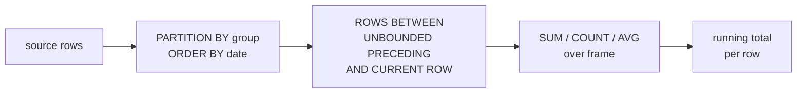

# :material-sigma: Running Total

Compute cumulative sums, counts, and other progressive aggregations over ordered data using window functions — the foundation for balance sheets, inventory tracking, and budget burn-down reports.

---

## :material-sitemap: Execution Flow



---

## :material-pin: Syntax

```sql
SUM(amount) OVER (
    PARTITION BY group_col
    ORDER BY order_col
    ROWS BETWEEN UNBOUNDED PRECEDING AND CURRENT ROW
) AS running_total
```

| Element | Purpose |
|---------|---------|
| `PARTITION BY` | Restart the running total for each group |
| `ORDER BY` | Determines the accumulation order |
| `ROWS BETWEEN UNBOUNDED PRECEDING AND CURRENT ROW` | Include every row from the partition start up to the current row |

!!! note "Default frame"
    When `ORDER BY` is present but no frame clause is specified, Spark uses `RANGE BETWEEN UNBOUNDED PRECEDING AND CURRENT ROW` by default. This groups ties together, which can cause unexpected results if the `ORDER BY` column has duplicates. Always specify `ROWS BETWEEN ...` explicitly for deterministic running totals.

---

## :material-magnify: Behavior

1. **Deterministic accumulation** — with `ROWS BETWEEN`, each row adds exactly one increment regardless of ties in the `ORDER BY` column.
2. **Partition isolation** — the running total resets at each new partition boundary; cross-partition accumulation requires removing `PARTITION BY`.
3. **NULL handling** — `SUM()` over a window ignores `NULL` values; the running total stays flat when a row has `NULL` amount.
4. **Frame variants** — `ROWS` counts physical rows; `RANGE` groups logically equal values. For running totals, `ROWS` is almost always correct.

---

## :material-database: Sample Data

### Dataset 1: Daily account transactions

```sql
CREATE OR REPLACE TEMP VIEW transactions AS
SELECT * FROM VALUES
    ('Checking', DATE '2024-01-01', 'Opening balance', 5000.00),
    ('Checking', DATE '2024-01-03', 'Grocery store',   -120.50),
    ('Checking', DATE '2024-01-05', 'Salary deposit',  3200.00),
    ('Checking', DATE '2024-01-07', 'Electric bill',   -185.00),
    ('Checking', DATE '2024-01-10', 'ATM withdrawal',  -300.00),
    ('Checking', DATE '2024-01-12', 'Online transfer',  500.00),
    ('Checking', DATE '2024-01-15', 'Insurance',       -450.00),
    ('Checking', DATE '2024-01-18', 'Freelance income', 800.00),
    ('Checking', DATE '2024-01-20', 'Restaurant',       -95.00),
    ('Checking', DATE '2024-01-25', 'Rent payment',   -1500.00),
    ('Savings',  DATE '2024-01-01', 'Opening balance', 10000.00),
    ('Savings',  DATE '2024-01-05', 'Interest',           42.50),
    ('Savings',  DATE '2024-01-10', 'Transfer in',      1000.00),
    ('Savings',  DATE '2024-01-15', 'Interest',           46.20),
    ('Savings',  DATE '2024-01-20', 'Emergency fund',   -500.00),
    ('Savings',  DATE '2024-01-25', 'Transfer in',       750.00)
AS t(account, txn_date, description, amount);
```

### Dataset 2: Monthly department budget spend

```sql
CREATE OR REPLACE TEMP VIEW budget_spend AS
SELECT * FROM VALUES
    ('Engineering', DATE '2024-01-01',  45000.00, 300000.00),
    ('Engineering', DATE '2024-02-01',  52000.00, 300000.00),
    ('Engineering', DATE '2024-03-01',  48000.00, 300000.00),
    ('Engineering', DATE '2024-04-01',  55000.00, 300000.00),
    ('Engineering', DATE '2024-05-01',  51000.00, 300000.00),
    ('Engineering', DATE '2024-06-01',  49000.00, 300000.00),
    ('Marketing',   DATE '2024-01-01',  22000.00, 150000.00),
    ('Marketing',   DATE '2024-02-01',  28000.00, 150000.00),
    ('Marketing',   DATE '2024-03-01',  35000.00, 150000.00),
    ('Marketing',   DATE '2024-04-01',  18000.00, 150000.00),
    ('Marketing',   DATE '2024-05-01',  25000.00, 150000.00),
    ('Marketing',   DATE '2024-06-01',  22000.00, 150000.00)
AS t(department, spend_month, amount, annual_budget);
```

### Dataset 3: Daily product inventory movements

```sql
CREATE OR REPLACE TEMP VIEW inventory_movements AS
SELECT * FROM VALUES
    ('Widget-A', DATE '2024-03-01', 'receive',  500),
    ('Widget-A', DATE '2024-03-03', 'ship',    -120),
    ('Widget-A', DATE '2024-03-05', 'ship',     -80),
    ('Widget-A', DATE '2024-03-07', 'receive',  200),
    ('Widget-A', DATE '2024-03-10', 'ship',    -150),
    ('Widget-A', DATE '2024-03-12', 'return',    30),
    ('Widget-A', DATE '2024-03-15', 'ship',    -200),
    ('Widget-A', DATE '2024-03-18', 'receive',  300),
    ('Widget-B', DATE '2024-03-01', 'receive',  300),
    ('Widget-B', DATE '2024-03-04', 'ship',     -90),
    ('Widget-B', DATE '2024-03-06', 'ship',     -60),
    ('Widget-B', DATE '2024-03-09', 'receive',  150),
    ('Widget-B', DATE '2024-03-11', 'ship',    -100),
    ('Widget-B', DATE '2024-03-14', 'ship',    -130),
    ('Widget-B', DATE '2024-03-17', 'receive',  250)
AS t(product, movement_date, movement_type, qty);
```

---

## :material-flask-outline: Practical Examples

### 1 — Basic running balance (bank account)

```sql
SELECT
    account,
    txn_date,
    description,
    amount,
    SUM(amount) OVER (
        PARTITION BY account
        ORDER BY txn_date
        ROWS BETWEEN UNBOUNDED PRECEDING AND CURRENT ROW
    ) AS running_balance
FROM transactions
ORDER BY account, txn_date;
```

??? success "Expected output"

    | account | txn_date | description | amount | running_balance |
    |---------|----------|-------------|--------|-----------------|
    | Checking | 2024-01-01 | Opening balance | 5000.00 | 5000.00 |
    | Checking | 2024-01-03 | Grocery store | -120.50 | 4879.50 |
    | Checking | 2024-01-05 | Salary deposit | 3200.00 | 8079.50 |
    | Checking | 2024-01-07 | Electric bill | -185.00 | 7894.50 |
    | Checking | 2024-01-10 | ATM withdrawal | -300.00 | 7594.50 |
    | Checking | 2024-01-12 | Online transfer | 500.00 | 8094.50 |
    | Checking | 2024-01-15 | Insurance | -450.00 | 7644.50 |
    | Checking | 2024-01-18 | Freelance income | 800.00 | 8444.50 |
    | Checking | 2024-01-20 | Restaurant | -95.00 | 8349.50 |
    | Checking | 2024-01-25 | Rent payment | -1500.00 | 6849.50 |
    | Savings | 2024-01-01 | Opening balance | 10000.00 | 10000.00 |
    | Savings | 2024-01-05 | Interest | 42.50 | 10042.50 |
    | Savings | 2024-01-10 | Transfer in | 1000.00 | 11042.50 |
    | Savings | 2024-01-15 | Interest | 46.20 | 11088.70 |
    | Savings | 2024-01-20 | Emergency fund | -500.00 | 10588.70 |
    | Savings | 2024-01-25 | Transfer in | 750.00 | 11338.70 |

### 2 — Running count and running average

```sql
SELECT
    account,
    txn_date,
    amount,
    COUNT(*) OVER (
        PARTITION BY account
        ORDER BY txn_date
        ROWS BETWEEN UNBOUNDED PRECEDING AND CURRENT ROW
    ) AS txn_number,
    ROUND(AVG(amount) OVER (
        PARTITION BY account
        ORDER BY txn_date
        ROWS BETWEEN UNBOUNDED PRECEDING AND CURRENT ROW
    ), 2) AS running_avg
FROM transactions
ORDER BY account, txn_date;
```

??? success "Expected output"

    | account | txn_date | amount | txn_number | running_avg |
    |---------|----------|--------|------------|-------------|
    | Checking | 2024-01-01 | 5000.00 | 1 | 5000.00 |
    | Checking | 2024-01-03 | -120.50 | 2 | 2439.75 |
    | Checking | 2024-01-05 | 3200.00 | 3 | 2693.17 |
    | Checking | 2024-01-07 | -185.00 | 4 | 1973.63 |
    | Checking | 2024-01-10 | -300.00 | 5 | 1518.90 |
    | ... | | | | |
    | Savings | 2024-01-01 | 10000.00 | 1 | 10000.00 |
    | Savings | 2024-01-05 | 42.50 | 2 | 5021.25 |
    | ... | | | | |

### 3 — Budget burn-down with remaining percentage

```sql
SELECT
    department,
    spend_month,
    amount AS monthly_spend,
    SUM(amount) OVER (
        PARTITION BY department
        ORDER BY spend_month
        ROWS BETWEEN UNBOUNDED PRECEDING AND CURRENT ROW
    ) AS cumulative_spend,
    annual_budget,
    annual_budget - SUM(amount) OVER (
        PARTITION BY department
        ORDER BY spend_month
        ROWS BETWEEN UNBOUNDED PRECEDING AND CURRENT ROW
    ) AS budget_remaining,
    ROUND(
        SUM(amount) OVER (
            PARTITION BY department
            ORDER BY spend_month
            ROWS BETWEEN UNBOUNDED PRECEDING AND CURRENT ROW
        ) * 100.0 / annual_budget, 1
    ) AS pct_consumed
FROM budget_spend
ORDER BY department, spend_month;
```

??? success "Expected output"

    | department | spend_month | monthly_spend | cumulative_spend | annual_budget | budget_remaining | pct_consumed |
    |------------|-------------|---------------|------------------|---------------|------------------|--------------|
    | Engineering | 2024-01-01 | 45000.00 | 45000.00 | 300000.00 | 255000.00 | 15.0 |
    | Engineering | 2024-02-01 | 52000.00 | 97000.00 | 300000.00 | 203000.00 | 32.3 |
    | Engineering | 2024-03-01 | 48000.00 | 145000.00 | 300000.00 | 155000.00 | 48.3 |
    | Engineering | 2024-04-01 | 55000.00 | 200000.00 | 300000.00 | 100000.00 | 66.7 |
    | Engineering | 2024-05-01 | 51000.00 | 251000.00 | 300000.00 | 49000.00 | 83.7 |
    | Engineering | 2024-06-01 | 49000.00 | 300000.00 | 300000.00 | 0.00 | 100.0 |
    | Marketing | 2024-01-01 | 22000.00 | 22000.00 | 150000.00 | 128000.00 | 14.7 |
    | Marketing | 2024-02-01 | 28000.00 | 50000.00 | 150000.00 | 100000.00 | 33.3 |
    | Marketing | 2024-03-01 | 35000.00 | 85000.00 | 150000.00 | 65000.00 | 56.7 |
    | Marketing | 2024-04-01 | 18000.00 | 103000.00 | 150000.00 | 47000.00 | 68.7 |
    | Marketing | 2024-05-01 | 25000.00 | 128000.00 | 150000.00 | 22000.00 | 85.3 |
    | Marketing | 2024-06-01 | 22000.00 | 150000.00 | 150000.00 | 0.00 | 100.0 |

### 4 — Inventory running stock level

```sql
SELECT
    product,
    movement_date,
    movement_type,
    qty,
    SUM(qty) OVER (
        PARTITION BY product
        ORDER BY movement_date
        ROWS BETWEEN UNBOUNDED PRECEDING AND CURRENT ROW
    ) AS stock_on_hand
FROM inventory_movements
ORDER BY product, movement_date;
```

??? success "Expected output"

    | product | movement_date | movement_type | qty | stock_on_hand |
    |---------|---------------|---------------|-----|---------------|
    | Widget-A | 2024-03-01 | receive | 500 | 500 |
    | Widget-A | 2024-03-03 | ship | -120 | 380 |
    | Widget-A | 2024-03-05 | ship | -80 | 300 |
    | Widget-A | 2024-03-07 | receive | 200 | 500 |
    | Widget-A | 2024-03-10 | ship | -150 | 350 |
    | Widget-A | 2024-03-12 | return | 30 | 380 |
    | Widget-A | 2024-03-15 | ship | -200 | 180 |
    | Widget-A | 2024-03-18 | receive | 300 | 480 |
    | Widget-B | 2024-03-01 | receive | 300 | 300 |
    | Widget-B | 2024-03-04 | ship | -90 | 210 |
    | Widget-B | 2024-03-06 | ship | -60 | 150 |
    | Widget-B | 2024-03-09 | receive | 150 | 300 |
    | Widget-B | 2024-03-11 | ship | -100 | 200 |
    | Widget-B | 2024-03-14 | ship | -130 | 70 |
    | Widget-B | 2024-03-17 | receive | 250 | 320 |

### 5 — Low-stock alert using running total

Flag rows where the running stock drops below a reorder threshold:

```sql
WITH stock AS (
    SELECT
        product,
        movement_date,
        movement_type,
        qty,
        SUM(qty) OVER (
            PARTITION BY product
            ORDER BY movement_date
            ROWS BETWEEN UNBOUNDED PRECEDING AND CURRENT ROW
        ) AS stock_on_hand
    FROM inventory_movements
)
SELECT
    product,
    movement_date,
    movement_type,
    qty,
    stock_on_hand,
    CASE WHEN stock_on_hand < 200 THEN 'REORDER' ELSE 'OK' END AS stock_status
FROM stock
ORDER BY product, movement_date;
```

??? success "Expected output"

    | product | movement_date | movement_type | qty | stock_on_hand | stock_status |
    |---------|---------------|---------------|-----|---------------|--------------|
    | Widget-A | 2024-03-01 | receive | 500 | 500 | OK |
    | Widget-A | 2024-03-03 | ship | -120 | 380 | OK |
    | Widget-A | 2024-03-05 | ship | -80 | 300 | OK |
    | Widget-A | 2024-03-07 | receive | 200 | 500 | OK |
    | Widget-A | 2024-03-10 | ship | -150 | 350 | OK |
    | Widget-A | 2024-03-12 | return | 30 | 380 | OK |
    | Widget-A | 2024-03-15 | ship | -200 | 180 | REORDER |
    | Widget-A | 2024-03-18 | receive | 300 | 480 | OK |
    | Widget-B | 2024-03-01 | receive | 300 | 300 | OK |
    | Widget-B | 2024-03-04 | ship | -90 | 210 | OK |
    | Widget-B | 2024-03-06 | ship | -60 | 150 | REORDER |
    | Widget-B | 2024-03-09 | receive | 150 | 300 | OK |
    | Widget-B | 2024-03-11 | ship | -100 | 200 | OK |
    | Widget-B | 2024-03-14 | ship | -130 | 70 | REORDER |
    | Widget-B | 2024-03-17 | receive | 250 | 320 | OK |

### 6 — Running percentage of total

Show each transaction as a percentage of the overall account activity:

```sql
SELECT
    account,
    txn_date,
    description,
    amount,
    SUM(ABS(amount)) OVER (
        PARTITION BY account
        ORDER BY txn_date
        ROWS BETWEEN UNBOUNDED PRECEDING AND CURRENT ROW
    ) AS cumulative_volume,
    SUM(ABS(amount)) OVER (PARTITION BY account) AS total_volume,
    ROUND(
        SUM(ABS(amount)) OVER (
            PARTITION BY account
            ORDER BY txn_date
            ROWS BETWEEN UNBOUNDED PRECEDING AND CURRENT ROW
        ) * 100.0 / SUM(ABS(amount)) OVER (PARTITION BY account), 1
    ) AS cumulative_pct
FROM transactions
ORDER BY account, txn_date;
```

??? success "Expected output"

    | account | txn_date | description | amount | cumulative_volume | total_volume | cumulative_pct |
    |---------|----------|-------------|--------|-------------------|--------------|----------------|
    | Checking | 2024-01-01 | Opening balance | 5000.00 | 5000.00 | 11850.50 | 42.2 |
    | Checking | 2024-01-03 | Grocery store | -120.50 | 5120.50 | 11850.50 | 43.2 |
    | Checking | 2024-01-05 | Salary deposit | 3200.00 | 8320.50 | 11850.50 | 70.2 |
    | ... | | | | | | |

### 7 — Running total with conditional reset (credits vs debits)

Separate running totals for credits and debits within each account:

```sql
SELECT
    account,
    txn_date,
    description,
    amount,
    SUM(CASE WHEN amount > 0 THEN amount ELSE 0 END) OVER (
        PARTITION BY account
        ORDER BY txn_date
        ROWS BETWEEN UNBOUNDED PRECEDING AND CURRENT ROW
    ) AS running_credits,
    SUM(CASE WHEN amount < 0 THEN amount ELSE 0 END) OVER (
        PARTITION BY account
        ORDER BY txn_date
        ROWS BETWEEN UNBOUNDED PRECEDING AND CURRENT ROW
    ) AS running_debits
FROM transactions
ORDER BY account, txn_date;
```

??? success "Expected output"

    | account | txn_date | description | amount | running_credits | running_debits |
    |---------|----------|-------------|--------|-----------------|----------------|
    | Checking | 2024-01-01 | Opening balance | 5000.00 | 5000.00 | 0.00 |
    | Checking | 2024-01-03 | Grocery store | -120.50 | 5000.00 | -120.50 |
    | Checking | 2024-01-05 | Salary deposit | 3200.00 | 8200.00 | -120.50 |
    | Checking | 2024-01-07 | Electric bill | -185.00 | 8200.00 | -305.50 |
    | Checking | 2024-01-10 | ATM withdrawal | -300.00 | 8200.00 | -605.50 |
    | Checking | 2024-01-12 | Online transfer | 500.00 | 8700.00 | -605.50 |
    | Checking | 2024-01-15 | Insurance | -450.00 | 8700.00 | -1055.50 |
    | Checking | 2024-01-18 | Freelance income | 800.00 | 9500.00 | -1055.50 |
    | Checking | 2024-01-20 | Restaurant | -95.00 | 9500.00 | -1150.50 |
    | Checking | 2024-01-25 | Rent payment | -1500.00 | 9500.00 | -2650.50 |
    | ... | | | | | |

### 8 — Running minimum and maximum balance

Track the all-time high and low balance alongside the running balance:

```sql
WITH balances AS (
    SELECT
        account,
        txn_date,
        description,
        amount,
        SUM(amount) OVER (
            PARTITION BY account
            ORDER BY txn_date
            ROWS BETWEEN UNBOUNDED PRECEDING AND CURRENT ROW
        ) AS running_balance
    FROM transactions
)
SELECT
    account,
    txn_date,
    description,
    amount,
    running_balance,
    MIN(running_balance) OVER (
        PARTITION BY account
        ORDER BY txn_date
        ROWS BETWEEN UNBOUNDED PRECEDING AND CURRENT ROW
    ) AS min_balance_so_far,
    MAX(running_balance) OVER (
        PARTITION BY account
        ORDER BY txn_date
        ROWS BETWEEN UNBOUNDED PRECEDING AND CURRENT ROW
    ) AS max_balance_so_far
FROM balances
ORDER BY account, txn_date;
```

??? success "Expected output"

    | account | txn_date | description | amount | running_balance | min_balance_so_far | max_balance_so_far |
    |---------|----------|-------------|--------|-----------------|--------------------|--------------------|
    | Checking | 2024-01-01 | Opening balance | 5000.00 | 5000.00 | 5000.00 | 5000.00 |
    | Checking | 2024-01-03 | Grocery store | -120.50 | 4879.50 | 4879.50 | 5000.00 |
    | Checking | 2024-01-05 | Salary deposit | 3200.00 | 8079.50 | 4879.50 | 8079.50 |
    | Checking | 2024-01-07 | Electric bill | -185.00 | 7894.50 | 4879.50 | 8079.50 |
    | Checking | 2024-01-10 | ATM withdrawal | -300.00 | 7594.50 | 4879.50 | 8079.50 |
    | Checking | 2024-01-12 | Online transfer | 500.00 | 8094.50 | 4879.50 | 8094.50 |
    | Checking | 2024-01-15 | Insurance | -450.00 | 7644.50 | 4879.50 | 8094.50 |
    | Checking | 2024-01-18 | Freelance income | 800.00 | 8444.50 | 4879.50 | 8444.50 |
    | Checking | 2024-01-20 | Restaurant | -95.00 | 8349.50 | 4879.50 | 8444.50 |
    | Checking | 2024-01-25 | Rent payment | -1500.00 | 6849.50 | 4879.50 | 8444.50 |
    | ... | | | | | | |

### 9 — Cumulative distinct count (running unique products shipped)

```sql
CREATE OR REPLACE TEMP VIEW order_lines AS
SELECT * FROM VALUES
    (DATE '2024-06-01', 'Widget-A'),
    (DATE '2024-06-01', 'Widget-B'),
    (DATE '2024-06-02', 'Widget-A'),
    (DATE '2024-06-02', 'Widget-C'),
    (DATE '2024-06-03', 'Widget-B'),
    (DATE '2024-06-03', 'Widget-D'),
    (DATE '2024-06-04', 'Widget-A'),
    (DATE '2024-06-04', 'Widget-D'),
    (DATE '2024-06-05', 'Widget-E')
AS t(order_date, product);

SELECT
    order_date,
    COUNT(DISTINCT product) AS daily_products,
    SIZE(COLLECT_SET(product) OVER (
        ORDER BY order_date
        ROWS BETWEEN UNBOUNDED PRECEDING AND CURRENT ROW
    )) AS cumulative_unique_products
FROM order_lines
GROUP BY order_date
ORDER BY order_date;
```

!!! warning "COLLECT_SET in window"
    `COLLECT_SET` inside a window function works in Spark SQL but returns an array. Wrap with `SIZE()` to get the running distinct count. For very large cardinalities, consider a self-join approach instead.

??? success "Expected output"

    | order_date | daily_products | cumulative_unique_products |
    |------------|----------------|----------------------------|
    | 2024-06-01 | 2 | 2 |
    | 2024-06-02 | 2 | 3 |
    | 2024-06-03 | 2 | 4 |
    | 2024-06-04 | 2 | 4 |
    | 2024-06-05 | 1 | 5 |

### 10 — Global running total (no partition)

Compute a grand running total across all accounts, ordered by date:

```sql
SELECT
    account,
    txn_date,
    description,
    amount,
    SUM(amount) OVER (
        ORDER BY txn_date, account
        ROWS BETWEEN UNBOUNDED PRECEDING AND CURRENT ROW
    ) AS global_running_total
FROM transactions
ORDER BY txn_date, account;
```

??? success "Expected output"

    | account | txn_date | description | amount | global_running_total |
    |---------|----------|-------------|--------|----------------------|
    | Checking | 2024-01-01 | Opening balance | 5000.00 | 5000.00 |
    | Savings | 2024-01-01 | Opening balance | 10000.00 | 15000.00 |
    | Checking | 2024-01-03 | Grocery store | -120.50 | 14879.50 |
    | Checking | 2024-01-05 | Salary deposit | 3200.00 | 18079.50 |
    | Savings | 2024-01-05 | Interest | 42.50 | 18122.00 |
    | Checking | 2024-01-07 | Electric bill | -185.00 | 17937.00 |
    | Checking | 2024-01-10 | ATM withdrawal | -300.00 | 17637.00 |
    | Savings | 2024-01-10 | Transfer in | 1000.00 | 18637.00 |
    | Checking | 2024-01-12 | Online transfer | 500.00 | 19137.00 |
    | Checking | 2024-01-15 | Insurance | -450.00 | 18687.00 |
    | Savings | 2024-01-15 | Interest | 46.20 | 18733.20 |
    | Checking | 2024-01-18 | Freelance income | 800.00 | 19533.20 |
    | Checking | 2024-01-20 | Restaurant | -95.00 | 19438.20 |
    | Savings | 2024-01-20 | Emergency fund | -500.00 | 18938.20 |
    | Checking | 2024-01-25 | Rent payment | -1500.00 | 17438.20 |
    | Savings | 2024-01-25 | Transfer in | 750.00 | 18188.20 |

---

## :material-shield-outline: Behavior Notes

!!! warning "ROWS vs RANGE with duplicate ORDER BY values"
    If two rows share the same `ORDER BY` value, `RANGE BETWEEN UNBOUNDED PRECEDING AND CURRENT ROW` includes **both** rows in the frame for each of them, making the running total jump by the combined amount. Use `ROWS BETWEEN` for strict row-by-row accumulation.

!!! warning "ORDER BY must be deterministic"
    If multiple rows share the same date, the accumulation order within that date is non-deterministic. Add a tie-breaker column (e.g., `ORDER BY txn_date, order_id`) to guarantee repeatable results.

!!! tip "Performance"
    Running total window functions require a full sort within each partition. For very large datasets, ensure the `ORDER BY` column is low-cardinality or pre-sorted, and keep `PARTITION BY` granularity appropriate to limit shuffle sizes.

---

## :material-brain: When to Use

| Scenario | Pattern |
|----------|---------|
| Bank account balance over time | `SUM(amount) OVER (PARTITION BY account ORDER BY date ROWS ...)` |
| Budget burn-down tracking | Running total vs fixed budget, compute remaining percentage |
| Inventory stock level | `SUM(qty) OVER (PARTITION BY product ORDER BY date ROWS ...)` |
| Cumulative revenue / sales | `SUM(revenue) OVER (ORDER BY month ROWS ...)` |
| Running average (moving cumulative) | `AVG(amount) OVER (... ROWS BETWEEN UNBOUNDED PRECEDING AND CURRENT ROW)` |
| Low-stock / threshold alerting | CTE with running total + `CASE WHEN` filter |
| Running min/max watermark | `MIN()` / `MAX()` over the same cumulative frame |
| Pareto (80/20) analysis | Running total percentage of grand total |
| Progressive distinct count | `SIZE(COLLECT_SET(col) OVER (...))` |
