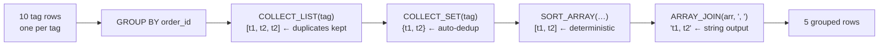

# :material-format-list-group: String Aggregation

Combine string values across rows into a single value — equivalent to `GROUP_CONCAT` / `STRING_AGG` in other databases — using `COLLECT_LIST`, `COLLECT_SET`, and `ARRAY_JOIN`.

---

## :material-sitemap: Aggregation Flow



---

## :material-animation-play: Interactive Demo

> Hover any row on the left to highlight the corresponding grouped result on the right (and vice versa).  
> Duplicate tags (like `gift` on order #101) collapse into one entry in `COLLECT_SET`.

<div id="viz-string-agg" class="ts-viz"></div>

---

## :material-toy-brick: Sample Data

```sql
-- order_tags — each order can have multiple tags (one row per tag)
CREATE OR REPLACE TEMP VIEW order_tags AS
SELECT * FROM VALUES
  (101, 'alice',  'express'),
  (101, 'alice',  'gift'),
  (101, 'alice',  'gift'),       -- duplicate tag on same order
  (102, 'bob',    'express'),
  (103, 'alice',  'standard'),
  (103, 'alice',  'fragile'),
  (104, 'carol',  'express'),
  (104, 'carol',  'fragile'),
  (104, 'carol',  'priority'),
  (105, 'bob',    'standard')
AS t(order_id, customer, tag);
```

| order_id | customer | tag |
|---------|---------|-----|
| 101 | alice | express |
| 101 | alice | gift |
| 101 | alice | gift |
| 103 | alice | standard |
| 103 | alice | fragile |
| 104 | carol | express, fragile, priority |
| … | … | … |

---

## :material-numeric-1-circle: Pattern 1 — COLLECT_LIST + ARRAY_JOIN (all values, with duplicates)

```sql
SELECT
    order_id,
    customer,
    COLLECT_LIST(tag)           AS tags_array,
    ARRAY_JOIN(COLLECT_LIST(tag), ', ') AS tags_csv
FROM order_tags
GROUP BY order_id, customer
ORDER BY order_id;
-- Result:
-- order_id | customer | tags_array                    | tags_csv
-- ---------|----------|-------------------------------|---------------------------
-- 101      | alice    | [express, gift, gift]          | express, gift, gift
-- 102      | bob      | [express]                      | express
-- 103      | alice    | [standard, fragile]            | standard, fragile
-- 104      | carol    | [express, fragile, priority]   | express, fragile, priority
-- 105      | bob      | [standard]                     | standard
```

---

## :material-numeric-2-circle: Pattern 2 — COLLECT_SET + ARRAY_JOIN (distinct values only)

`COLLECT_SET` automatically deduplicates — equivalent to `STRING_AGG(DISTINCT ...)`.

```sql
SELECT
    order_id,
    customer,
    COLLECT_SET(tag)                            AS unique_tags,
    ARRAY_JOIN(COLLECT_SET(tag), ', ')          AS unique_tags_csv,
    SIZE(COLLECT_SET(tag))                      AS tag_count
FROM order_tags
GROUP BY order_id, customer
ORDER BY order_id;
-- Result:
-- order_id | customer | unique_tags                   | unique_tags_csv             | tag_count
-- ---------|----------|-------------------------------|-----------------------------|----------
-- 101      | alice    | [express, gift]                | express, gift               |  2   ← deduped
-- 102      | bob      | [express]                      | express                     |  1
-- 103      | alice    | [fragile, standard]            | fragile, standard           |  2
-- 104      | carol    | [express, fragile, priority]   | express, fragile, priority  |  3
-- 105      | bob      | [standard]                     | standard                    |  1
```

---

## :material-numeric-3-circle: Pattern 3 — Sorted string aggregation

`COLLECT_LIST` does not guarantee order. Sort with `SORT_ARRAY` for deterministic output.

```sql
SELECT
    order_id,
    customer,
    ARRAY_JOIN(SORT_ARRAY(COLLECT_SET(tag)), ', ') AS tags_sorted
FROM order_tags
GROUP BY order_id, customer
ORDER BY order_id;
-- Result:
-- order_id | customer | tags_sorted
-- ---------|----------|------------------------------
-- 101      | alice    | express, gift
-- 102      | bob      | express
-- 103      | alice    | fragile, standard
-- 104      | carol    | express, fragile, priority
-- 105      | bob      | standard
```

---

## :material-numeric-4-circle: Pattern 4 — Aggregate per customer (one row per customer)

```sql
SELECT
    customer,
    COUNT(DISTINCT order_id)                               AS order_count,
    ARRAY_JOIN(SORT_ARRAY(COLLECT_SET(tag)), ' | ')        AS all_tags_used,
    SIZE(COLLECT_SET(tag))                                 AS distinct_tags
FROM order_tags
GROUP BY customer
ORDER BY customer;
-- Result:
-- customer | order_count | all_tags_used                           | distinct_tags
-- ---------|-------------|------------------------------------------|---------------
-- alice    | 2           | express | fragile | gift | standard      |  4
-- bob      | 2           | express | standard                       |  2
-- carol    | 1           | express | fragile | priority              |  3
```

---

## :material-numeric-5-circle: Pattern 5 — AGGREGATE HOF for custom string join

Use the higher-order function `AGGREGATE` when you need custom separator logic (e.g., skip a specific value, apply a transform).

```sql
SELECT
    order_id,
    customer,
    AGGREGATE(
        SORT_ARRAY(COLLECT_SET(tag)),   -- input array
        CAST('' AS STRING),             -- zero value (accumulator start)
        (acc, t) -> CASE
                        WHEN acc = '' THEN t
                        ELSE acc || ' / ' || t
                    END                 -- merge function
    ) AS custom_joined_tags
FROM order_tags
GROUP BY order_id, customer
ORDER BY order_id;
-- Result:
-- order_id | customer | custom_joined_tags
-- ---------|----------|-----------------------------
-- 101      | alice    | express / gift
-- 102      | bob      | express
-- 103      | alice    | fragile / standard
-- 104      | carol    | express / fragile / priority
-- 105      | bob      | standard
```

---

## :material-numeric-6-circle: Pattern 6 — Flatten grouped CSV back to rows

Reverse string aggregation: split a comma-separated column back into individual rows.

```sql
-- aggregated_orders — a denormalized table with CSV tags
CREATE OR REPLACE TEMP VIEW aggregated_orders AS
SELECT * FROM VALUES
  (101, 'alice', 'express,gift'),
  (103, 'alice', 'standard,fragile'),
  (104, 'carol', 'express,fragile,priority')
AS t(order_id, customer, tags_csv);

-- Split CSV back to rows using EXPLODE + SPLIT
SELECT
    order_id,
    customer,
    TRIM(tag) AS tag
FROM aggregated_orders
LATERAL VIEW EXPLODE(SPLIT(tags_csv, ',')) AS tag
ORDER BY order_id, tag;
-- Result:
-- order_id | customer | tag
-- ---------|----------|----------
-- 101      | alice    | express
-- 101      | alice    | gift
-- 103      | alice    | fragile
-- 103      | alice    | standard
-- 104      | carol    | express
-- 104      | carol    | fragile
-- 104      | carol    | priority
```

---

## :material-swap-horizontal: Functions Compared

| Function | Duplicates | Ordered | Use when |
|----------|-----------|---------|----------|
| `COLLECT_LIST(col)` | Yes | Insertion order (non-deterministic) | Need all values including duplicates |
| `COLLECT_SET(col)` | No (auto-dedup) | Unspecified | Need distinct values |
| `SORT_ARRAY(COLLECT_SET(col))` | No | Ascending | Deterministic distinct values |
| `ARRAY_JOIN(arr, sep)` | — | Preserves array order | Convert array → string |
| `AGGREGATE(arr, ...)` | Depends on input | Depends on input | Custom separator / transform logic |

---

## :material-lightbulb-outline: When to Use

| Scenario | Pattern |
|----------|---------|
| Concatenate all tag values per key | `COLLECT_LIST` + `ARRAY_JOIN` |
| Deduplicated tag list per key | `COLLECT_SET` + `ARRAY_JOIN` |
| Sorted, deterministic output | `SORT_ARRAY(COLLECT_SET(...))` |
| Custom separator or value transform | `AGGREGATE` HOF |
| Normalize CSV column back to rows | `EXPLODE(SPLIT(col, ','))` |
