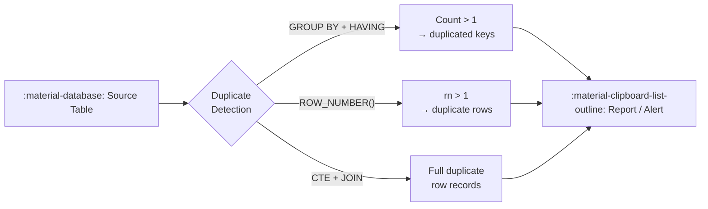

# :material-magnify: Finding Duplicates

Identify duplicate rows in Spark SQL / Databricks SQL using `GROUP BY HAVING`,
window functions, and subquery patterns. All techniques work on Delta and Parquet tables.

---

## :material-sitemap: Overview



---

## :material-database: Sample Data

```sql
-- Students table with duplicate enrollments
CREATE OR REPLACE TEMP VIEW students AS
SELECT * FROM VALUES
  (1,  'Alice',   20, 'CS',      DATE('2024-01-10')),
  (2,  'Bob',     22, 'Math',    DATE('2024-01-12')),
  (3,  'Alice',   20, 'CS',      DATE('2024-02-15')),
  (4,  'Charlie', 21, 'Physics', DATE('2024-01-20')),
  (5,  'Bob',     22, 'Math',    DATE('2024-03-01')),
  (6,  'Alice',   20, 'CS',      DATE('2024-03-10')),
  (7,  'Diana',   23, 'CS',      DATE('2024-01-18')),
  (8,  'Charlie', 21, 'Physics', DATE('2024-02-28'))
AS students(id, name, age, department, created_at);
```

```sql
-- Users table with duplicate emails
CREATE OR REPLACE TEMP VIEW users AS
SELECT * FROM VALUES
  (101, 'alice@example.com', 'Alice Smith',  'active',   TIMESTAMP('2024-01-10 09:00:00')),
  (102, 'bob@example.com',   'Bob Jones',    'active',   TIMESTAMP('2024-01-12 10:30:00')),
  (103, 'alice@example.com', 'Alice S.',     'pending',  TIMESTAMP('2024-02-15 14:00:00')),
  (104, 'carol@example.com', 'Carol White',  'active',   TIMESTAMP('2024-01-20 08:00:00')),
  (105, 'bob@example.com',   'Bob J.',       'inactive', TIMESTAMP('2024-03-01 11:00:00')),
  (106, 'alice@example.com', 'Alice Smith',  'active',   TIMESTAMP('2024-03-10 16:00:00'))
AS users(id, email, full_name, status, created_at);
```

---

## :material-pin: Approach Comparison

| Approach | Returns | Best For |
|----------|---------|----------|
| `GROUP BY HAVING COUNT(*) > 1` | Key values only | Quick frequency audit |
| `ROW_NUMBER() WHERE rn > 1` | Full duplicate rows | Exact row inspection |
| `CTE + INNER JOIN` | Full rows joined back | Retrieving all columns |
| `IN (subquery)` | Full rows | Simple single-key duplication |
| `COUNT(DISTINCT) = COUNT(*)` | Boolean | Candidate primary key check |

---

## :material-magnify: Approach 1 — GROUP BY + HAVING (key frequency)

Find which key values appear more than once.

```sql
SELECT
    name,
    age,
    COUNT(*) AS duplicate_count
FROM students
GROUP BY name, age
HAVING COUNT(*) > 1
ORDER BY duplicate_count DESC;
```

??? success "Expected output"

    | name    | age | duplicate_count |
    |---------|-----|-----------------|
    | Alice   | 20  | 3               |
    | Bob     | 22  | 2               |
    | Charlie | 21  | 2               |

!!! note
    Returns only the key columns, not the full rows. Use this to audit which
    values are duplicated and how many times.

---

## :material-magnify: Approach 2 — CTE + INNER JOIN (full rows)

Retrieve every column for all duplicated records.

```sql
WITH duplicated_keys AS (
    SELECT
        name,
        age
    FROM students
    GROUP BY name, age
    HAVING COUNT(*) > 1
)
SELECT s.*
FROM students AS s
INNER JOIN duplicated_keys AS d
    ON s.name = d.name
    AND s.age = d.age
ORDER BY s.name, s.id;
```

??? success "Expected output"

    | id | name    | age | department | created_at |
    |----|---------|-----|------------|------------|
    | 1  | Alice   | 20  | CS         | 2024-01-10 |
    | 3  | Alice   | 20  | CS         | 2024-02-15 |
    | 6  | Alice   | 20  | CS         | 2024-03-10 |
    | 2  | Bob     | 22  | Math       | 2024-01-12 |
    | 5  | Bob     | 22  | Math       | 2024-03-01 |
    | 4  | Charlie | 21  | Physics    | 2024-01-20 |
    | 8  | Charlie | 21  | Physics    | 2024-02-28 |

---

## :material-magnify: Approach 3 — ROW_NUMBER() (identify specific duplicate rows)

Label every occurrence with a row number; rows with `rn > 1` are duplicates.

```sql
SELECT *
FROM (
    SELECT
        *,
        ROW_NUMBER() OVER (
            PARTITION BY name, age    -- (1)!
            ORDER BY created_at ASC   -- (2)!
        ) AS rn
    FROM students
)
WHERE rn > 1; -- (3)!
```

1. Partition by the key that defines a duplicate.
2. The first row (`rn = 1`) is the one you want to **keep**; all others are duplicates.
3. Return only the duplicate rows — invert to `rn = 1` to get de-duplicated output.

??? success "Expected output"

    | id | name    | age | department | created_at | rn |
    |----|---------|-----|------------|------------|----|
    | 3  | Alice   | 20  | CS         | 2024-02-15 | 2  |
    | 6  | Alice   | 20  | CS         | 2024-03-10 | 3  |
    | 5  | Bob     | 22  | Math       | 2024-03-01 | 2  |
    | 8  | Charlie | 21  | Physics    | 2024-02-28 | 2  |

---

## :material-magnify: Approach 4 — IN subquery (single-column key)

Convenient for a single key column.

```sql
SELECT *
FROM users
WHERE email IN (
    SELECT email
    FROM users
    GROUP BY email
    HAVING COUNT(*) > 1
)
ORDER BY email, id;
```

??? success "Expected output"

    | id  | email            | full_name   | status   | created_at          |
    |-----|------------------|-------------|----------|---------------------|
    | 101 | alice@example.com | Alice Smith | active   | 2024-01-10 09:00:00 |
    | 103 | alice@example.com | Alice S.    | pending  | 2024-02-15 14:00:00 |
    | 106 | alice@example.com | Alice Smith | active   | 2024-03-10 16:00:00 |
    | 102 | bob@example.com   | Bob Jones   | active   | 2024-01-12 10:30:00 |
    | 105 | bob@example.com   | Bob J.      | inactive | 2024-03-01 11:00:00 |

!!! warning
    Avoid `IN` with multi-column composite keys — concatenation can cause false
    positives. Use the CTE + JOIN approach instead.

---

## :material-magnify: Approach 5 — Candidate Primary Key check

Verify whether a column (or combination) could serve as a primary key.

```sql
SELECT
    COUNT(DISTINCT id) = COUNT(*) AS id_is_unique,           -- (1)!
    COUNT(DISTINCT email) = COUNT(*) AS email_is_unique      -- (2)!
FROM users;
```

1. `true` — `id` is unique across all rows.
2. `false` — `email` has duplicates, cannot serve as primary key.

??? success "Expected output"

    | id_is_unique | email_is_unique |
    |--------------|-----------------|
    | true         | false           |

---

## :material-magnify: Approach 6 — Duplicate count summary

Get a high-level view of data quality.

```sql
SELECT
    COUNT(*) AS total_rows,
    COUNT(*) - COUNT(DISTINCT name, age) AS duplicate_rows,
    ROUND(
        (COUNT(*) - COUNT(DISTINCT name, age)) * 100.0 / COUNT(*), 1
    ) AS duplicate_pct
FROM students;
```

??? success "Expected output"

    | total_rows | duplicate_rows | duplicate_pct |
    |------------|----------------|---------------|
    | 8          | 4              | 50.0          |

---

## :material-flask-outline: Full Example with Sample Data

```sql
--8<-- "sql/application/duplicate/finding/find-duplicate.sql"
```

---

## :material-brain: When to Use

| Scenario | Recommended Approach |
|----------|---------------------|
| Quick audit — how many duplicates? | `GROUP BY HAVING COUNT(*) > 1` |
| Need all columns of duplicate rows | `CTE + INNER JOIN` |
| Need to tag and review specific rows | `ROW_NUMBER() WHERE rn > 1` |
| Single-column key, small table | `IN (subquery)` |
| Validate uniqueness of a column | `COUNT(DISTINCT) = COUNT(*)` |
| Data quality metrics | `COUNT(*) - COUNT(DISTINCT ...)` |

!!! tip "Performance"
    `GROUP BY HAVING` is the fastest — it scans the table once.
    `ROW_NUMBER()` is preferred when you also need to de-duplicate in the same query.
