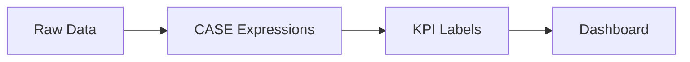

# :material-chart-line: Analytics

Apply CASE expressions, KPI banding, NULL ordering, and text formatting for dashboard-ready output.

______________________________________________________________________

## :material-sitemap: Overview



______________________________________________________________________

## :material-pin: Quick Reference

| Technique            | Use Case                              | Key Function                   |
| -------------------- | ------------------------------------- | ------------------------------ |
| CASE thresholds      | KPI metrics and alert banding         | `CASE WHEN ... THEN ...`       |
| Nested CASE          | Multi-tier classification             | Nested `CASE WHEN`             |
| NULLS FIRST / LAST   | Controlled NULL placement in ORDER BY | `ORDER BY col NULLS FIRST`     |
| LEFT / LPAD / CONCAT | Formatted text output                 | `LEFT()`, `LPAD()`, `CONCAT()` |

______________________________________________________________________

## :material-magnify: Examples

### KPI and Alerts

Band numeric metrics into KPI labels using CASE expressions.

```sql
--8<-- "sql/application/analytics/kpi_and_alerts.sql"
```

______________________________________________________________________

### Categorization

Multi-tier classification using nested CASE expressions.

```sql
--8<-- "sql/application/analytics/categorization.sql"
```

______________________________________________________________________

### NULL Ordering

Control NULL placement in sorted result sets.

```sql
--8<-- "sql/application/analytics/null_ordering.sql"
```

______________________________________________________________________

### Text Formatting

Truncate, pad, and concatenate strings for formatted report output.

```sql
--8<-- "sql/application/analytics/text_formatting.sql"
```

______________________________________________________________________

## :material-database-search: [Databricks] Real-World Example — System Tables

!!! note "[Databricks] Unity Catalog system tables"

    `system.query.history` is a built-in Unity Catalog system table, so no sample data
    setup is required. An account admin must `GRANT USE CATALOG, USE SCHEMA, SELECT ON SCHEMA system.query TO <principal>` before these queries will return rows.

### KPI banding for real query history

```sql
-- [Databricks] Requires SELECT on system.query.history
SELECT
    workspace_id,
    statement_type,
    COUNT(*) AS query_count,
    ROUND(AVG(total_duration_ms) / 1000.0, 1) AS avg_duration_seconds,
    CASE
        WHEN AVG(total_duration_ms) >= 300000 THEN 'critical'
        WHEN AVG(total_duration_ms) >= 60000 THEN 'watch'
        ELSE 'healthy'
    END AS duration_band,
    CONCAT('ws-', LPAD(CAST(workspace_id AS STRING), 10, '0')) AS workspace_label
FROM system.query.history
WHERE start_time >= CURRENT_TIMESTAMP() - INTERVAL 7 DAYS
GROUP BY workspace_id, statement_type
ORDER BY avg_duration_seconds DESC NULLS LAST;
-- Result (illustrative):
-- workspace_id | statement_type | query_count | avg_duration_seconds | duration_band | workspace_label
-- ------------|----------------|-------------|----------------------|---------------|-----------------
-- 123456789   | SELECT         | 418         | 72.4                 | watch         | ws-0123456789
-- 123456789   | MERGE          | 19          | 338.9                | critical      | ws-0123456789
-- 987654321   | INSERT         | 61          | 18.7                 | healthy       | ws-0987654321
```

!!! tip "Same CASE pattern, production metrics"

    The same `CASE`, `NULLS LAST`, and string-formatting techniques used on sample KPI
    tables also work on `system.query.history` when you need dashboard-friendly labels
    and alert bands for real query-performance reporting.

______________________________________________________________________

## :material-brain: When to Use

| Scenario                             | Recommended Approach                    |
| ------------------------------------ | --------------------------------------- |
| KPI banding (Low / Medium / High)    | `kpi_and_alerts` pattern                |
| Custom categories from numeric range | `categorization` with nested CASE       |
| NULL placement in sorted output      | `null_ordering` with NULLS FIRST / LAST |
| Text truncation and padding          | `text_formatting` with LEFT / LPAD      |

!!! note

    NULLS FIRST / NULLS LAST is a Spark SQL extension; combine with ORDER BY for deterministic NULL placement.
