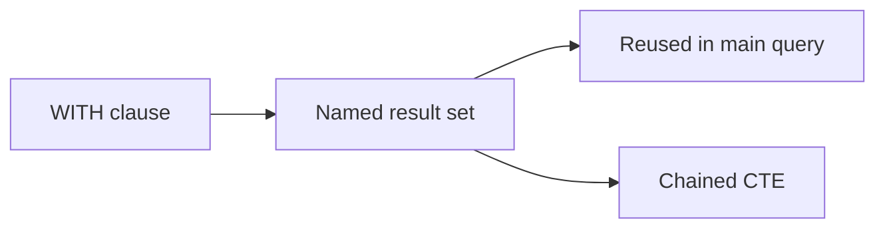

# :material-table-refresh: CTE

Break complex queries into readable, reusable named result sets using Common Table Expressions.

______________________________________________________________________

## :material-sitemap: Overview



______________________________________________________________________

## :material-pin: Quick Reference

| Technique    | Use Case                 | Key Function              |
| ------------ | ------------------------ | ------------------------- |
| Single CTE   | Simple intermediate step | `WITH name AS (...)`      |
| Multi-CTE    | Pipeline stages          | Multiple `WITH` blocks    |
| Chained CTEs | Sequential transforms    | CTE referencing prior CTE |
| Nested CTEs  | Scoped sub-logic         | CTE inside CTE definition |

______________________________________________________________________

## :material-magnify: Examples

### CTE Basics

Single and multi-CTE patterns for intermediate calculations.

```sql
--8<-- "sql/application/cte/cte_basics.sql"
```

______________________________________________________________________

### CTE Advanced

Chained CTEs and reuse patterns for complex multi-step pipelines.

```sql
--8<-- "sql/application/cte/cte_advanced.sql"
```

______________________________________________________________________

## :material-database-search: [Databricks] Real-World Example — System Tables

!!! note "[Databricks] Unity Catalog system tables"

    `system.billing.usage` is a built-in Unity Catalog system table, so no synthetic
    setup is needed. An account admin must `GRANT USE CATALOG, USE SCHEMA, SELECT ON SCHEMA system.billing TO <principal>` before these queries will return rows.

### Chained CTEs for workspace cost and usage staging

```sql
-- [Databricks] Requires SELECT on system.billing.usage
WITH recent_usage AS (
    SELECT
        workspace_id,
        sku_name,
        usage_date,
        usage_quantity
    FROM system.billing.usage
    WHERE usage_date >= DATE_SUB(CURRENT_DATE(), 30)
),
daily_workspace_usage AS (
    SELECT
        workspace_id,
        usage_date,
        SUM(usage_quantity) AS daily_quantity
    FROM recent_usage
    GROUP BY workspace_id, usage_date
),
workspace_summary AS (
    SELECT
        workspace_id,
        COUNT(*) AS active_days,
        ROUND(AVG(daily_quantity), 2) AS avg_daily_quantity,
        ROUND(MAX(daily_quantity), 2) AS peak_daily_quantity
    FROM daily_workspace_usage
    GROUP BY workspace_id
)
SELECT workspace_id, active_days, avg_daily_quantity, peak_daily_quantity
FROM workspace_summary
ORDER BY peak_daily_quantity DESC;
-- Result (illustrative):
-- workspace_id | active_days | avg_daily_quantity | peak_daily_quantity
-- ------------|-------------|--------------------|--------------------
-- 123456789   | 30          | 184.62             | 392.40
-- 987654321   | 28          | 96.15              | 205.75
```

!!! tip "Readable production pipelines"

    Real billing analysis often needs one stage for row filtering, another for daily
    aggregation, and a final stage for reporting. Chained CTEs keep that production
    shape readable without changing the underlying pattern.

______________________________________________________________________

## :material-brain: When to Use

| Scenario                            | Recommended Approach            |
| ----------------------------------- | ------------------------------- |
| Break a complex query into steps    | Use CTEs for each logical stage |
| Reuse a subquery result             | Name it as a CTE                |
| Build readable multi-step pipelines | Chain CTEs sequentially         |

!!! tip

    CTEs are not materialised by default in Spark SQL — the optimizer may inline them. Use Delta temp views if materialisation is needed.
