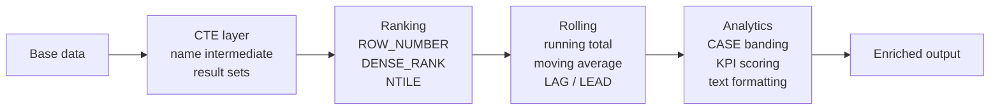

# :material-chart-bar: Enrichment

Add computed columns, rankings, running calculations, and derived context using
window functions, CTEs, and subqueries.

---

## :material-sitemap: Pipeline Flow

---

## :material-book-open-variant: In This Section

| Page | Problem | Technique |
|------|---------|-----------|
| [Ranking](ranking/index.md) | Top-N, percentiles, buckets | `ROW_NUMBER`, `RANK`, `NTILE` |
| [Rolling Analysis](rolling/index.md) | Running totals, moving averages | `SUM/AVG OVER`, `LAG`, `LEAD` |
| [Analytics](analytics/index.md) | KPI banding, formatting | `CASE`, `FORMAT_NUMBER`, `CONCAT` |
| [CTE](cte/index.md) | Readable multi-step queries | `WITH ... AS (...)` |
| [Subqueries](subquery/index.md) | Correlated filters, EXISTS anti-joins | `EXISTS`, `IN`, scalar subquery |
| [Derived Tables](derived_table/index.md) | Inline aggregation layers | Subquery in `FROM` |

---

## :material-lightbulb-outline: When to Use

- Gold layer transformations — add business context to clean data.
- Dashboard preparation — compute ranks, running totals, KPI bands.
- Complex queries — break logic into readable CTEs instead of deep nesting.
