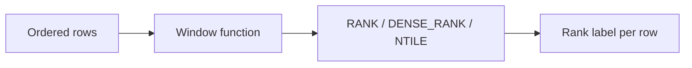

# :material-podium: Ranking

Rank rows, segment into equal buckets, and compute percentiles with window functions.

______________________________________________________________________

## :material-sitemap: Overview



______________________________________________________________________

## :material-pin: Quick Reference

| Technique       | Use Case                             | Key Function                                       |
| --------------- | ------------------------------------ | -------------------------------------------------- |
| RANK()          | Ranking with gaps on ties            | `RANK() OVER (ORDER BY col DESC)`                  |
| DENSE_RANK()    | Ranking without gaps on ties         | `DENSE_RANK() OVER (ORDER BY col DESC)`            |
| NTILE(n)        | Divide rows into equal-size buckets  | `NTILE(4) OVER (ORDER BY col)`                     |
| PERCENTILE_CONT | Continuous (interpolated) percentile | `PERCENTILE_CONT(0.5) WITHIN GROUP (ORDER BY col)` |
| PERCENTILE_DISC | Discrete (actual value) percentile   | `PERCENTILE_DISC(0.5) WITHIN GROUP (ORDER BY col)` |

______________________________________________________________________

## :material-magnify: Examples

!!! note "RANK & DENSE_RANK live in the canonical page"

    Basic ranking with ties (`RANK`, `DENSE_RANK`, `ROW_NUMBER`) and top-N filtering are
    covered in depth in [Top-N Per Group](../../../ranking/top-n.md). This page focuses on
    the **bucketing and percentile** functions not covered there.

### NTILE Segments

Divide the result set into equal-sized quantile buckets.

```sql
--8<-- "sql/application/ranking/ntile_segments.sql"
```

______________________________________________________________________

### Percentile and Median

Compute continuous and discrete percentiles including the median.

```sql
--8<-- "sql/application/ranking/percentile_median.sql"
```

______________________________________________________________________

## :material-database-search: [Databricks] Real-World Example — System Tables

!!! note "[Databricks] Unity Catalog system tables"

    `system.query.history` is a built-in Unity Catalog system table, so no sample data
    load is required. An account admin must `GRANT USE CATALOG, USE SCHEMA, SELECT ON SCHEMA system.query TO <principal>` before these queries will return rows.

### NTILE quartiles for real query durations

```sql
-- [Databricks] Requires SELECT on system.query.history
SELECT
    workspace_id,
    statement_id,
    statement_type,
    total_duration_ms,
    NTILE(4) OVER (
        PARTITION BY statement_type
        ORDER BY total_duration_ms DESC
    ) AS duration_quartile
FROM system.query.history
WHERE start_time >= CURRENT_TIMESTAMP() - INTERVAL 7 DAYS
  AND total_duration_ms IS NOT NULL;
-- Result (illustrative):
-- workspace_id | statement_id | statement_type | total_duration_ms | duration_quartile
-- ------------|--------------|----------------|-------------------|------------------
-- 123456789   | 01ef...      | SELECT         | 842000            | 1
-- 123456789   | 01eg...      | SELECT         | 401000            | 2
-- 987654321   | 01eh...      | SELECT         | 95000             | 4
```

### Median and p95 runtime by statement type

```sql
-- [Databricks] Requires SELECT on system.query.history
SELECT
    statement_type,
    ROUND(PERCENTILE_CONT(0.5) WITHIN GROUP (ORDER BY total_duration_ms) / 1000.0, 1) AS median_seconds,
    ROUND(PERCENTILE_CONT(0.95) WITHIN GROUP (ORDER BY total_duration_ms) / 1000.0, 1) AS p95_seconds,
    ROUND(PERCENTILE_DISC(0.95) WITHIN GROUP (ORDER BY total_duration_ms) / 1000.0, 1) AS p95_observed_seconds
FROM system.query.history
WHERE start_time >= CURRENT_TIMESTAMP() - INTERVAL 7 DAYS
  AND total_duration_ms IS NOT NULL
GROUP BY statement_type
ORDER BY p95_seconds DESC NULLS LAST;
-- Result (illustrative):
-- statement_type | median_seconds | p95_seconds | p95_observed_seconds
-- ---------------|----------------|-------------|----------------------
-- MERGE          | 41.6           | 318.4       | 321.0
-- SELECT         | 3.8            | 44.2        | 45.0
```

!!! tip "Ranking beyond top-N"

    The same window-ranking ideas used on synthetic classroom data also help profile
    production query fleets. Quartiles and percentiles on `system.query.history` are a
    natural next step after basic `RANK()`/`ROW_NUMBER()` recipes.

______________________________________________________________________

## :material-brain: When to Use

| Scenario                  | Recommended Approach                       |
| ------------------------- | ------------------------------------------ |
| Top-N per group           | `RANK` / `DENSE_RANK` + filter on rank ≤ N |
| Divide into even segments | `NTILE(n)`                                 |
| Median value              | `PERCENTILE_CONT(0.5)`                     |
| Quartiles / deciles       | `NTILE(4)` / `NTILE(10)`                   |

!!! tip

    Use DENSE_RANK when you need consecutive integers with no gap after ties. Use RANK when you need to see the true positional gap.

!!! note "Related"

    This page covers ranking *window functions* as an enrichment step. For the
    canonical, self-contained recipes see [Top-N](../../../ranking/top-n.md) and
    [Pagination](../../../ranking/pagination.md).
