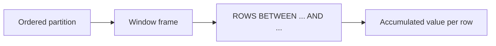

# :material-chart-bell-curve: Rolling Analysis

Running totals, moving averages, `LAG`/`LEAD` comparisons, and cumulative distributions
computed with window functions — the enrichment stage of a pipeline.

______________________________________________________________________

## :material-sitemap: Overview



______________________________________________________________________

## :material-map-marker-path: Canonical Deep-Dives

Most rolling-window techniques have a dedicated, self-contained page with full sample
data and result output. Use those as the source of truth; this page only adds the
distribution functions not covered elsewhere.

| Technique                                     | Canonical page                                                                  |
| --------------------------------------------- | ------------------------------------------------------------------------------- |
| Running / cumulative total                    | [Running Total](../../../aggregation/running-total.md)                          |
| Moving / rolling average                      | [Moving Average](../../../aggregation/moving-average.md)                        |
| `ROW_NUMBER` unique IDs & dedup               | [Top-N Per Group](../../../ranking/top-n.md)                                    |
| `LAG` / `LEAD` period comparison              | [LAG & LEAD](../../../timeseries/analysis/lag-and-lead.md)                      |
| Missing-date spine (`SEQUENCE` + `LEFT JOIN`) | [Gap Fill](../../../timeseries/analysis/gap-filling.md)                         |
| `FIRST_VALUE` / `LAST_VALUE` boundary fill    | [Gap Fill — forward/backward fill](../../../timeseries/analysis/gap-filling.md) |

______________________________________________________________________

## :material-magnify: Distribution Ranking (unique to this page)

### CUME_DIST and PERCENT_RANK

Calculate the cumulative distribution and relative rank of each row within an ordered
partition — useful for "top X%" thresholds and percentile banding.

```sql
--8<-- "sql/application/rolling/08_cume_dist_percent_rank.sql"
```

- `CUME_DIST()` — fraction of rows with a value **≤** the current row (0 < d ≤ 1).
- `PERCENT_RANK()` — relative rank as `(rank - 1) / (rows - 1)` (0 ≤ r ≤ 1).

______________________________________________________________________

## :material-brain: When to Use

| Scenario                       | Recommended Approach                                       |
| ------------------------------ | ---------------------------------------------------------- |
| Cumulative totals              | [Running Total](../../../aggregation/running-total.md)     |
| Moving average                 | [Moving Average](../../../aggregation/moving-average.md)   |
| Period-over-period comparison  | [LAG & LEAD](../../../timeseries/analysis/lag-and-lead.md) |
| Gap detection / date spine     | [Gap Fill](../../../timeseries/analysis/gap-filling.md)    |
| "Top X%" / percentile position | `CUME_DIST` / `PERCENT_RANK` (above)                       |

!!! warning

    `LAST_VALUE()` requires `ROWS BETWEEN UNBOUNDED PRECEDING AND UNBOUNDED FOLLOWING`
    (or an explicit frame) — the default frame stops at `CURRENT ROW`.
