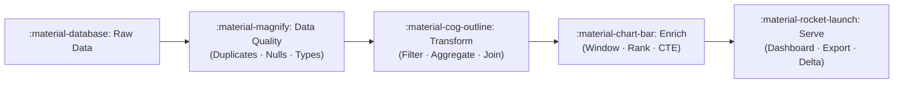

# :material-application: Application Patterns

Practical Spark SQL and Databricks SQL recipes for real-world data engineering
pipelines. Each section solves a specific problem with production-ready queries,
inline sample data, and expected output.

---

## :material-sitemap: Architecture



---

## :material-animation-play: Interactive Pipeline

Click a stage to explore its patterns.

<div id="viz-app-pipeline" class="ts-viz"></div>

---

## :material-pin: Pattern Catalogue

| Group | Description | Contents |
|-------|-------------|----------|
| [:material-magnify: Data Quality](data_quality/index.md) | Find and resolve duplicate rows | Finding duplicates, deduplication strategies |
| [:material-cog-outline: Transformation](transformation/index.md) | Shape, filter, aggregate, and pivot data | Filter, aggregation, grouping sets, pivot |
| [:material-chart-bar: Enrichment](enrichment/index.md) | Add rankings, running calculations, derived context | Ranking, rolling analysis, analytics, CTE, subqueries |
| [:material-format-text: Types & Formats](types_and_formats/index.md) | Type conversions, date parsing, struct operations | Numeric, date strings, keys & structs, map key replacement |
| [:material-clock-time-four: Temporal](temporal/index.md) | Date hierarchies, time bands, seasonal patterns | Time series analysis |

---

## :material-flask-outline: Quick-Start Examples

### De-duplicate with Window Function

```sql
WITH ranked AS (
    SELECT
        *,
        ROW_NUMBER() OVER (PARTITION BY id ORDER BY updated_at DESC) AS rn -- (1)!
    FROM source_table
)
SELECT * FROM ranked WHERE rn = 1; -- (2)!
```

1. Assign row 1 to the most recent record per `id`.
2. Keep only the latest row per key — all others are filtered out.

---

### Hierarchical Totals with ROLLUP

```sql
SELECT
    YEAR(saledate) AS sale_year,
    QUARTER(saledate) AS sale_quarter,
    ROUND(SUM(saleprice), 2) AS total_revenue
FROM allsales
GROUP BY ROLLUP (YEAR(saledate), QUARTER(saledate)); -- (1)!
```

1. Produces detail rows + year subtotals + a grand total; `NULL` marks rolled-up levels.

---

### Running Total with Window

```sql
SELECT
    saledate,
    saleprice,
    SUM(saleprice) OVER ( -- (1)!
        ORDER BY saledate
        ROWS BETWEEN UNBOUNDED PRECEDING AND CURRENT ROW
    ) AS running_total
FROM allsales;
```

1. Cumulative sum from the first row up to and including the current row.

---

## :material-brain: Decision Guide

| Need | Use |
|------|-----|
| Remove duplicate rows | `ROW_NUMBER()` + `WHERE rn = 1` |
| Summarise at multiple levels | `ROLLUP` or `GROUPING SETS` |
| Cumulative / running metric | Window with `ROWS BETWEEN UNBOUNDED PRECEDING` |
| Top-N per group | `RANK()` or `DENSE_RANK()` + filter |
| Random exploration sample | `TABLESAMPLE (5 PERCENT)` |
| Reuse intermediate results | CTE (`WITH` clause) |
| Rotate rows to columns | `PIVOT` |

!!! tip "Performance first"
    Prefer `GROUPING SETS` over `CUBE` when you only need specific combinations.
    Use CTEs to avoid repeating expensive subqueries. Push filters as early as
    possible — before joins and aggregations.
