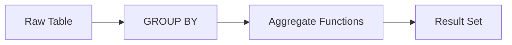

# :material-sigma: Aggregation

Summarise raw sales data using GROUP BY, conditional aggregation, and boolean aggregates.

______________________________________________________________________

## :material-sitemap: Overview



______________________________________________________________________

## :material-pin: Quick Reference

| Technique                | Use Case                               | Key Function                       |
| ------------------------ | -------------------------------------- | ---------------------------------- |
| SUM / AVG / MIN / MAX    | Total and average sales metrics        | `SUM()`, `AVG()`, `MIN()`, `MAX()` |
| GROUP BY multi-column    | Breakdown by make and model            | `GROUP BY col1, col2`              |
| COUNT variants           | Row counts including / excluding NULLs | `COUNT(*)`, `COUNT(col)`           |
| HAVING filter            | Keep only groups above a threshold     | `HAVING SUM(...) > n`              |
| Threshold per group      | Conditional counts within groups       | `COUNT(CASE WHEN ...)`             |
| Cross-column aggregation | Aggregate across related columns       | Multi-column `SUM` / `CASE`        |
| BOOL_AND / BOOL_OR       | Boolean aggregation over a group       | `BOOL_AND()`, `BOOL_OR()`          |

______________________________________________________________________

## :material-magnify: Examples

### Basic Aggregates

Standard SUM, AVG, MIN, MAX over the sales table.

```sql
--8<-- "sql/application/aggregation/basic_aggregates.sql"
```

______________________________________________________________________

### Grouped Aggregations

Aggregate metrics grouped by make and model.

```sql
--8<-- "sql/application/aggregation/grouped_aggregations.sql"
```

______________________________________________________________________

### COUNT Operations

Difference between `COUNT(*)` and `COUNT(column)` with NULL behaviour.

```sql
--8<-- "sql/application/aggregation/count_operations.sql"
```

______________________________________________________________________

### HAVING Filters

Filter grouped results to only those meeting a minimum threshold.

```sql
--8<-- "sql/application/aggregation/having_filters.sql"
```

______________________________________________________________________

!!! note "Conditional aggregation lives in the canonical page"

    `SUM(CASE WHEN ...)` / `COUNT(CASE WHEN ...)` threshold aggregation and the
    `CASE` vs `IF` vs `FILTER` comparison are covered in depth in
    [Conditional Aggregation](../../../aggregation/conditional-agg.md).

### Cross-Column Aggregation

Aggregate across multiple related columns in a single pass.

```sql
--8<-- "sql/application/aggregation/cross_column_aggregation.sql"
```

______________________________________________________________________

### Boolean Aggregations

Use BOOL_AND and BOOL_OR to reduce boolean expressions across a group.

```sql
--8<-- "sql/application/aggregation/bool_aggregations.sql"
```

______________________________________________________________________

## :material-database-search: [Databricks] Real-World Example — System Tables

!!! note "[Databricks] Unity Catalog system tables"

    `system.billing.usage` is a built-in Unity Catalog system table, so you can group
    real usage rows directly. An account admin must `GRANT USE CATALOG, USE SCHEMA, SELECT ON SCHEMA system.billing TO <principal>` before these queries will return
    rows.

### Aggregate billed quantity by SKU

```sql
-- [Databricks] Requires SELECT on system.billing.usage
SELECT
    sku_name,
    COUNT(*) AS record_count,
    COUNT(DISTINCT workspace_id) AS workspace_count,
    ROUND(SUM(usage_quantity), 2) AS total_quantity,
    ROUND(AVG(usage_quantity), 4) AS avg_row_quantity
FROM system.billing.usage
WHERE usage_date >= DATE_SUB(CURRENT_DATE(), 30)
GROUP BY sku_name
HAVING SUM(usage_quantity) > 0
ORDER BY total_quantity DESC;
-- Result (illustrative):
-- sku_name                  | record_count | workspace_count | total_quantity | avg_row_quantity
-- --------------------------|--------------|-----------------|----------------|-----------------
-- PREMIUM_JOBS_COMPUTE      | 4821         | 14              | 18492.75       | 3.8353
-- SERVERLESS_SQL            | 1032         | 11              | 6150.20        | 5.9595
```

!!! tip "Same GROUP BY, higher-value data"

    Production system tables are still just rows to group. The same `SUM`, `AVG`,
    `COUNT`, and `HAVING` patterns used on sample sales data become cost, workload,
    and fleet-utilisation summaries on `system.billing.usage`.

______________________________________________________________________

## :material-brain: When to Use

| Scenario                        | Recommended Approach          |
| ------------------------------- | ----------------------------- |
| Summarise total sales revenue   | `SUM` / `AVG` with `GROUP BY` |
| Conditional totals per segment  | `HAVING` clause               |
| Boolean flag across a group     | `BOOL_AND` / `BOOL_OR`        |
| Grouped statistics by dimension | `GROUP BY` multi-column       |
| Min / max per group             | `MIN` / `MAX` with `GROUP BY` |

!!! tip

    Use FILTER (WHERE ...) with aggregate functions for conditional aggregation without CASE WHEN.

!!! note "Related"

    This page covers `GROUP BY` aggregation as a transformation step. For canonical,
    self-contained deep-dives see [Conditional Aggregation](../../../aggregation/conditional-agg.md)
    and [String Aggregation](../../../aggregation/string-agg.md).
