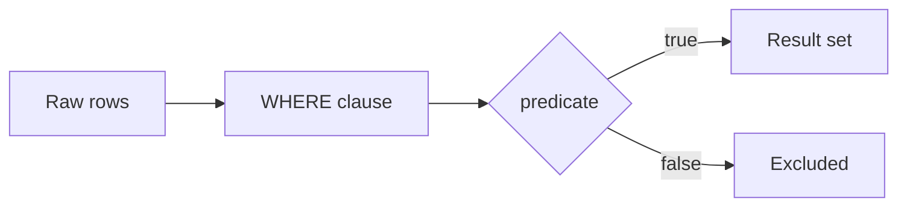

# :material-filter: Filter

Apply boolean logic, text patterns, NULL handling, and regex predicates in WHERE clauses.

______________________________________________________________________

## :material-sitemap: Overview



______________________________________________________________________

## :material-pin: Quick Reference

| Technique           | Use Case                                  | Key Function                        |
| ------------------- | ----------------------------------------- | ----------------------------------- |
| AND / OR / NOT / IN | Combine multiple boolean conditions       | `AND`, `OR`, `NOT`, `IN (...)`      |
| Text + numeric      | Mixed predicate on string and number cols | `=`, `>`, `<`, `LIKE`               |
| LIKE / wildcards    | Pattern matching on string columns        | `LIKE '%pattern%'`                  |
| IS NULL / COALESCE  | NULL-safe filtering                       | `IS NULL`, `COALESCE(col, default)` |
| RLIKE / REGEXP      | Regex pattern matching                    | `RLIKE 'pattern'`                   |

______________________________________________________________________

## :material-magnify: Examples

### AND / OR Filters

Combine multiple conditions using boolean operators.

```sql
--8<-- "sql/application/filter/and_or_filters.sql"
```

______________________________________________________________________

### Text and Number Filters

Mix string and numeric predicates in a single WHERE clause.

```sql
--8<-- "sql/application/filter/text_number_filters.sql"
```

______________________________________________________________________

### Wildcard Searches

Use LIKE with `%` and `_` wildcards for partial string matching.

```sql
--8<-- "sql/application/filter/wildcard_searches.sql"
```

______________________________________________________________________

### NULL Filters

Handle NULL values safely in filter predicates.

```sql
--8<-- "sql/application/filter/null_filters.sql"
```

______________________________________________________________________

### Regex Filters

Apply regular expression patterns with RLIKE for advanced text filtering.

```sql
--8<-- "sql/application/filter/regex_filters.sql"
```

______________________________________________________________________

## :material-database-search: [Databricks] Real-World Example — System Tables

!!! note "[Databricks] Unity Catalog system tables"

    `system.access.audit` is a built-in Unity Catalog system table that stores real
    audit events. An account admin must `GRANT USE CATALOG, USE SCHEMA, SELECT ON SCHEMA system.access TO <principal>` before these queries will return rows.

### Filter failed audit actions

```sql
-- [Databricks] Requires SELECT on system.access.audit
SELECT
    event_time,
    workspace_id,
    user_identity.email AS user_email,
    service_name,
    action_name,
    response.status_code AS status_code,
    response.error_message AS error_message
FROM system.access.audit
WHERE event_date >= DATE_SUB(CURRENT_DATE(), 7)
  AND response.status_code >= 400
  AND service_name IN ('clusters', 'sql', 'jobs')
  AND action_name RLIKE 'create|update|delete'
ORDER BY event_time DESC;
-- Result (illustrative):
-- event_time           | workspace_id | user_email         | service_name | action_name | status_code | error_message
-- ---------------------|--------------|--------------------|--------------|-------------|-------------|--------------
-- 2024-07-02 09:41:03  | 123456789    | analyst@example.com| sql          | createQuery | 403         | PERMISSION_DENIED
-- 2024-07-02 08:14:10  | 123456789    | ops@example.com    | clusters     | delete      | 409         | CLUSTER_BUSY
```

!!! tip "Real predicates, same WHERE clause"

    Audit tables are ideal for demonstrating mixed predicates because they combine
    dates, nested fields, `IN` lists, and regex-friendly action names in one real
    production dataset.

______________________________________________________________________

## :material-brain: When to Use

| Scenario                | Recommended Approach      |
| ----------------------- | ------------------------- |
| Multiple conditions     | `AND` / `OR` combinations |
| Partial string match    | `LIKE` with wildcards     |
| Regex needed            | `RLIKE`                   |
| NULL-safe filter        | `IS NULL` / `IS NOT NULL` |
| Exclude a set of values | `NOT IN (...)`            |

!!! warning

    NOT IN with a subquery that can return NULL will exclude all rows. Use NOT EXISTS instead.
