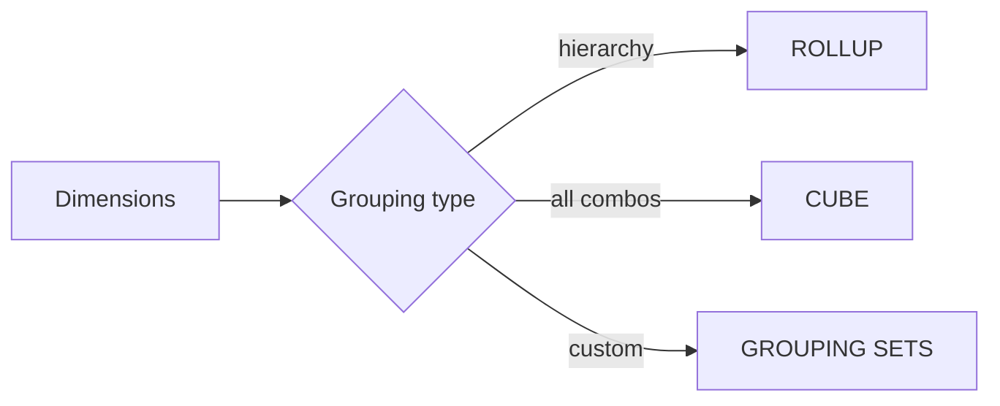

# :material-set-all: Grouping

Generate hierarchical subtotals, cross-dimensional aggregations, and custom grouping combinations.

______________________________________________________________________

## :material-sitemap: Overview



______________________________________________________________________

## :material-pin: Quick Reference

| Technique     | Use Case                              | Key Function                  |
| ------------- | ------------------------------------- | ----------------------------- |
| ROLLUP        | Hierarchical subtotals (Year → Month) | `GROUP BY ROLLUP(col1, col2)` |
| CUBE          | All dimension combinations            | `GROUP BY CUBE(col1, col2)`   |
| GROUPING SETS | Custom combination selection          | `GROUP BY GROUPING SETS(...)` |
| GROUPING()    | Label subtotal rows                   | `GROUPING(col)`               |

| Need                     | Use           |
| ------------------------ | ------------- |
| Hierarchy (Year → Month) | ROLLUP        |
| All combinations         | CUBE          |
| Selected combinations    | GROUPING SETS |
| Performance-sensitive    | GROUPING SETS |

______________________________________________________________________

## :material-magnify: Examples

### ROLLUP — Hierarchical Totals

Drill-down subtotals from year down to month with grand total.

```sql
--8<-- "sql/application/grouping/rollup_hierarchical_totals.sql"
```

______________________________________________________________________

### CUBE — Cross-Dimensional Aggregation

Produce totals for every combination of dimensions.

```sql
--8<-- "sql/application/grouping/cube_cross_dimensional.sql"
```

______________________________________________________________________

### GROUPING SETS — Custom Combinations

Select only the specific grouping combinations you need.

```sql
--8<-- "sql/application/grouping/grouping_sets_custom.sql"
```

______________________________________________________________________

## :material-database-search: [Databricks] Real-World Example — System Tables

!!! note "[Databricks] Unity Catalog system tables"

    `system.billing.usage` is a built-in Unity Catalog system table, so no synthetic
    setup is needed. An account admin must `GRANT USE CATALOG, USE SCHEMA, SELECT ON SCHEMA system.billing TO <principal>` before these queries will return rows.

### ROLLUP for workspace and SKU subtotals

```sql
-- [Databricks] Requires SELECT on system.billing.usage
SELECT
    CASE WHEN GROUPING(workspace_id) = 1 THEN 'ALL_WORKSPACES' ELSE CAST(workspace_id AS STRING) END AS workspace_id_label,
    CASE WHEN GROUPING(sku_name) = 1 THEN 'ALL_SKUS' ELSE sku_name END AS sku_name_label,
    ROUND(SUM(usage_quantity), 2) AS total_quantity
FROM system.billing.usage
WHERE usage_date >= DATE_SUB(CURRENT_DATE(), 30)
GROUP BY ROLLUP(workspace_id, sku_name)
ORDER BY workspace_id_label, sku_name_label;
-- Result (illustrative):
-- workspace_id_label | sku_name_label          | total_quantity
-- -------------------|-------------------------|---------------
-- 123456789          | PREMIUM_JOBS_COMPUTE    | 3210.50
-- 123456789          | SERVERLESS_SQL          | 1185.25
-- 123456789          | ALL_SKUS                | 4395.75
-- ALL_WORKSPACES     | ALL_SKUS                | 28642.10
```

!!! tip "Hierarchies on production billing"

    `ROLLUP`, `CUBE`, and `GROUPING SETS` become especially useful on system tables,
    where analysts often need both per-workspace detail and account-level subtotals in
    the same report.

______________________________________________________________________

## :material-brain: When to Use

| Scenario                      | Recommended Approach |
| ----------------------------- | -------------------- |
| Drill-down report             | `ROLLUP`             |
| Cross-tab report              | `CUBE`               |
| Only some combinations needed | `GROUPING SETS`      |
| Flag subtotal rows in output  | `GROUPING()`         |

!!! tip

    GROUPING SETS is the most flexible and most performant — ROLLUP and CUBE are syntactic sugar that expands to GROUPING SETS internally.
