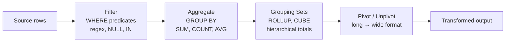

# :material-cog-outline: Transformation

Shape, filter, aggregate, and pivot raw data into analysis-ready structures.

---

## :material-sitemap: Pipeline Flow

---

## :material-book-open-variant: In This Section

| Page | Problem | Technique |
|------|---------|-----------|
| [Filter](filter/index.md) | Boolean logic, text patterns, NULL handling | `WHERE`, `LIKE`, `RLIKE`, `IN` |
| [Aggregation](aggregation/index.md) | Summarise data by groups | `GROUP BY`, `HAVING`, conditional `SUM` |
| [Grouping](grouping/index.md) | Hierarchical subtotals | `GROUPING SETS`, `ROLLUP`, `CUBE` |
| [Pivot](pivot/index.md) | Rotate rows ↔ columns | `PIVOT`, `UNPIVOT` |

---

## :material-lightbulb-outline: When to Use

- ETL pipelines — clean and reshape landing zone data for the silver layer.
- Report generation — aggregate and pivot data for dashboards.
- Feature engineering — build ML features from raw event logs.
