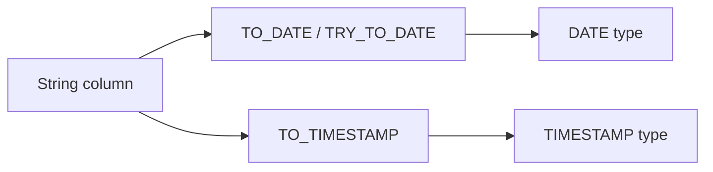

# :material-calendar-text: Date Strings

Parse, convert, and format date strings using TO_DATE, TO_TIMESTAMP, and DATE_FORMAT.

______________________________________________________________________

## :material-sitemap: Overview



______________________________________________________________________

## :material-pin: Quick Reference

| Technique    | Use Case                               | Key Function                  |
| ------------ | -------------------------------------- | ----------------------------- |
| TO_DATE      | Parse a date string into DATE type     | `TO_DATE(col, 'format')`      |
| TO_TIMESTAMP | Parse a datetime string into TIMESTAMP | `TO_TIMESTAMP(col, 'format')` |
| DATE_FORMAT  | Format a date value back to string     | `DATE_FORMAT(col, 'format')`  |
| TRY_TO_DATE  | Safe parse — returns NULL on error     | `TRY_TO_DATE(col, 'format')`  |

______________________________________________________________________

## :material-magnify: Examples

### Reading Date Strings

Parse varchar date columns and format them for downstream use.

```sql
--8<-- "sql/application/date_string/reading_date_strings.sql"
```

______________________________________________________________________

## :material-database-search: [Databricks] Real-World Example — System Tables

!!! note "[Databricks] Unity Catalog system tables"

    `system.access.audit` is a built-in Unity Catalog system table with typed date and
    timestamp columns already populated. An account admin must `GRANT USE CATALOG, USE SCHEMA, SELECT ON SCHEMA system.access TO <principal>` before these queries will
    return rows.

### Parse string parameters and format audit timestamps

```sql
-- [Databricks] Requires SELECT on system.access.audit
SELECT
    event_date,
    DATE_FORMAT(event_time, 'yyyy-MM-dd HH:mm:ss') AS event_time_text,
    DATE_FORMAT(event_time, 'E') AS event_day_name,
    user_identity.email AS user_email,
    action_name
FROM system.access.audit
WHERE event_date BETWEEN TO_DATE('2024-07-01', 'yyyy-MM-dd')
                    AND TO_DATE('2024-07-07', 'yyyy-MM-dd')
ORDER BY event_time DESC;
-- Result (illustrative):
-- event_date  | event_time_text     | event_day_name | user_email           | action_name
-- ------------|---------------------|----------------|----------------------|------------
-- 2024-07-02  | 2024-07-02 09:41:03 | Tue            | analyst@example.com  | runCommand
-- 2024-07-02  | 2024-07-02 08:14:10 | Tue            | ops@example.com      | create
```

!!! tip "Typed system columns still need formatting"

    Real system tables often already store proper `DATE` and `TIMESTAMP` values. The
    same conversion functions are still useful for parsing string parameters and for
    producing report-friendly text output.

______________________________________________________________________

## :material-brain: When to Use

| Scenario                            | Recommended Approach           |
| ----------------------------------- | ------------------------------ |
| Source data stored as varchar dates | `TO_DATE` / `TRY_TO_DATE`      |
| Need formatted date output          | `DATE_FORMAT`                  |
| Prevent parse errors in ETL         | `TRY_TO_DATE` for safe parsing |

!!! warning

    Always use TRY_TO_DATE in ETL pipelines to avoid runtime errors from malformed date strings.
