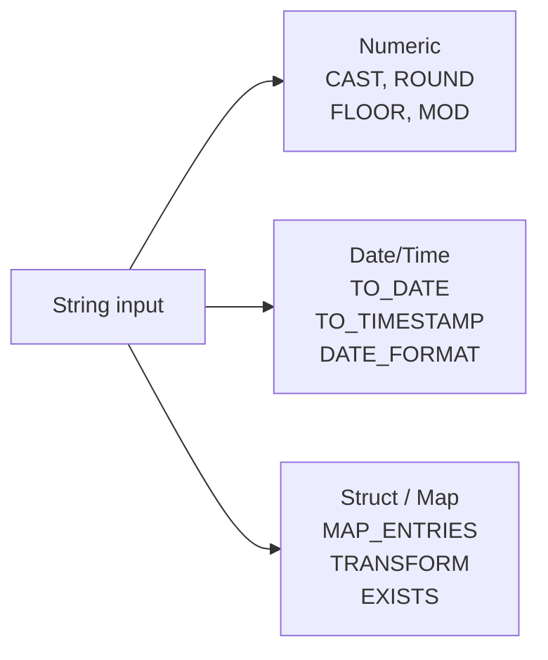

# :material-format-text: Types & Formats

Handle type conversions, numeric precision, date parsing, and complex key/struct operations.

---

## :material-sitemap: Common Conversions

---

## :material-book-open-variant: In This Section

| Page | Problem | Technique |
|------|---------|-----------|
| [Numeric](numeric/index.md) | Rounding, divide-by-zero, sequences | `ROUND`, `COALESCE`, `SEQUENCE` |
| [Date Strings](date_string/index.md) | Parse and format dates | `TO_DATE`, `DATE_FORMAT`, `TO_TIMESTAMP` |
| [Keys & Structs](key_n_struct/index.md) | Dynamic key existence in MAPs | `MAP_ENTRIES`, `EXISTS` |
| [Replace Map Key](replace_key/map/replace_map_key.md) | Remap MAP keys atomically | `TRANSFORM`, `AGGREGATE` |

---

## :material-lightbulb-outline: When to Use

- Schema evolution — handle mixed types from upstream sources.
- Data quality — validate numeric ranges, date formats, key integrity.
- Complex types — manipulate arrays, maps, and structs in Delta tables.
