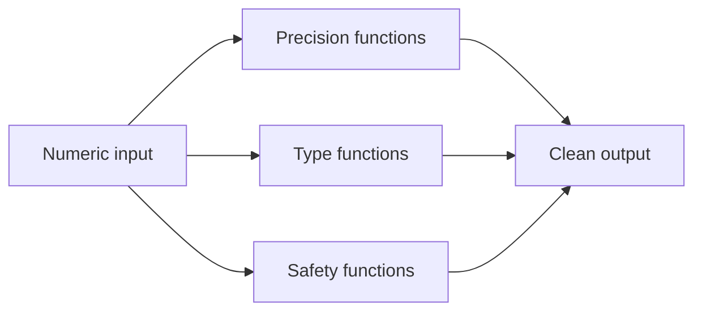

# :material-numeric: Numeric

Precision rounding, type handling, divide-by-zero guards, modulo, number sequences, and string-to-number conversion.

______________________________________________________________________

## :material-sitemap: Overview



______________________________________________________________________

## :material-pin: Quick Reference

| Technique                       | Use Case                  | Key Function                         |
| ------------------------------- | ------------------------- | ------------------------------------ |
| ROUND / FLOOR / CEIL / TRUNCATE | Decimal precision control | `ROUND(col, n)`, `FLOOR()`, `CEIL()` |
| INT / BIGINT / DECIMAL / DOUBLE | Numeric type reference    | `CAST(col AS DECIMAL(p,s))`          |
| NULLIF / CASE                   | Divide-by-zero guard      | `NULLIF(denominator, 0)`             |
| MOD / REMAINDER                 | Modulo operations         | `MOD(col, n)`                        |
| SEQUENCE                        | Generate a number series  | `SEQUENCE(start, stop, step)`        |
| RAND / TABLESAMPLE              | Random row sampling       | `RAND()`, `TABLESAMPLE(n PERCENT)`   |
| CAST / TRY_CAST                 | Convert string to number  | `TRY_CAST(col AS INT)`               |

______________________________________________________________________

## :material-magnify: Examples

### Decimal Operations

ROUND, FLOOR, CEIL, and TRUNCATE for financial precision.

```sql
--8<-- "sql/application/numeric/decimal_operations.sql"
```

______________________________________________________________________

### Numeric Datatypes

Reference for INT, BIGINT, DECIMAL, FLOAT, and DOUBLE behaviour.

```sql
--8<-- "sql/application/numeric/numeric_datatypes.sql"
```

______________________________________________________________________

### Divide-by-Zero Errors

Guard against division by zero using NULLIF and CASE.

```sql
--8<-- "sql/application/numeric/divide_zero_errors.sql"
```

______________________________________________________________________

### Modulo Financial

Apply modulo arithmetic for financial bucketing.

```sql
--8<-- "sql/application/numeric/modulo_financial.sql"
```

______________________________________________________________________

### Tally Table Sequence

Generate a number series with SEQUENCE for gap-filling and tally tables.

```sql
--8<-- "sql/application/numeric/tally_table_sequence.sql"
```

______________________________________________________________________

### Random Sampling

Sample rows randomly using RAND and TABLESAMPLE.

```sql
--8<-- "sql/application/numeric/random_sampling.sql"
```

______________________________________________________________________

### Numbers as Text

Cast and validate string columns that contain numeric values.

```sql
--8<-- "sql/application/numeric/numbers_as_text.sql"
```

______________________________________________________________________

## :material-database-search: [Databricks] Real-World Example — System Tables

!!! note "[Databricks] Unity Catalog system tables"

    `system.billing.usage` is a built-in Unity Catalog system table with real numeric
    measures such as `usage_quantity`. An account admin must `GRANT USE CATALOG, USE SCHEMA, SELECT ON SCHEMA system.billing TO <principal>` before these queries will
    return rows.

### Rounding, casting, and ratio guards on billed usage

```sql
-- [Databricks] Requires SELECT on system.billing.usage
WITH sku_totals AS (
    SELECT
        sku_name,
        SUM(usage_quantity) AS total_quantity
    FROM system.billing.usage
    WHERE usage_date >= DATE_SUB(CURRENT_DATE(), 30)
    GROUP BY sku_name
),
account_total AS (
    SELECT SUM(total_quantity) AS all_quantity
    FROM sku_totals
)
SELECT
    sku_name,
    CAST(ROUND(total_quantity, 2) AS DECIMAL(18, 2)) AS rounded_quantity,
    MOD(CAST(ROUND(total_quantity, 0) AS BIGINT), 10) AS bucket_mod_10,
    ROUND(total_quantity * 100.0 / NULLIF(all_quantity, 0), 2) AS pct_of_account
FROM sku_totals
CROSS JOIN account_total
ORDER BY rounded_quantity DESC;
-- Result (illustrative):
-- sku_name                  | rounded_quantity | bucket_mod_10 | pct_of_account
-- --------------------------|------------------|---------------|---------------
-- PREMIUM_JOBS_COMPUTE      | 18492.75         | 3             | 52.18
-- SERVERLESS_SQL            | 6150.20          | 0             | 17.35
```

!!! tip "Numeric hygiene matters more in production"

    Real billing data makes rounding, casting, and divide-by-zero guards more than an
    academic exercise. The same numeric functions keep operational and finance-facing
    reports stable when volumes change over time.

______________________________________________________________________

## :material-brain: When to Use

| Scenario                     | Recommended Approach     |
| ---------------------------- | ------------------------ |
| Financial rounding           | `ROUND` / `TRUNCATE`     |
| Avoid divide-by-zero         | `NULLIF(denominator, 0)` |
| Random exploration sample    | `RAND()` / `TABLESAMPLE` |
| Generate a number range      | `SEQUENCE`               |
| Source column stored as text | `TRY_CAST`               |

!!! warning

    FLOAT and DOUBLE are approximate types — use DECIMAL(p, s) for financial calculations that require exact precision.
