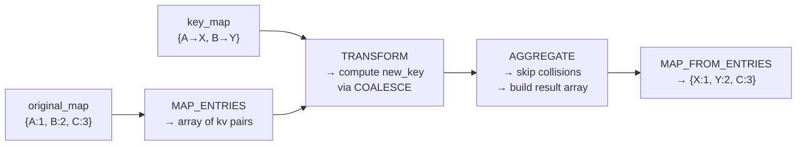

# :material-swap-horizontal: Replace Map Key

Remap keys inside a Databricks SQL `MAP` column without losing values. The
pattern uses `MAP_ENTRIES`, `TRANSFORM`, and `AGGREGATE` higher-order functions
to apply a lookup map atomically — no UDF required.

!!! note "Map entry order"
    Map entry iteration order is not guaranteed in Spark SQL. Results below are
    conceptual; the **values** are always correct even if key order varies.

## :material-sitemap: How It Works



---

## :material-pin: Algorithm Summary

For each `(original_key, value)` pair in `original_map`:

1. Compute `new_key = COALESCE(key_map[original_key], original_key)`.
2. If `new_key` already exists in `original_map` **and** `new_key != original_key` — **skip** (collision avoidance).
3. Otherwise emit `(new_key, value)`.
4. If two entries produce the same `new_key`, the **last** one wins (iteration order of `MAP_ENTRIES`).

---

## :material-flask-outline: Behaviour Reference

| Scenario | key_map | original_map | Expected output | Notes |
|----------|---------|-------------|-----------------|-------|
| Simple remap | `A->X, B->Y` | `{A:1, B:2, C:3}` | `{X:1, Y:2, C:3}` | Unmapped keys pass through |
| Collision | `A->X` | `{A:1, X:9}` | `{X:9}` | Remap skipped; A:1 dropped |
| Duplicate target | `A->Z, B->Z` | `{A:1, B:2}` | `{Z:2}` | Last entry wins |
| Identity + remap | `A->A, B->B, C->K` | `{A:10, B:20, C:30}` | `{A:10, B:20, K:30}` | Identity is no-op |
| Missing key | `Z->Q, C->K` | `{A:1, B:2}` | `{A:1, B:2}` | Extra key_map entries ignored |
| Empty key_map | `{}` | `{A:foo, B:bar}` | `{A:foo, B:bar}` | No-op |
| Empty original_map | any | `{}` | `{}` | Nothing to remap |
| Whitespace | `" Tenant"->"+Tenant"` | `{" Tenant":1}` | `{Tenant:1}` | Exact match required |
| Case sensitivity | `env->ENV` | `{Env:1, env:2}` | `{Env:1, ENV:2}` | Env != env |
| NULL value | `A->X` | `{A:null, B:bbb}` | `{X:null, B:bbb}` | Value NULL preserved |
| Mixed complex | `U->X (collides), A->Z, B->Z` | `{U:100, X:999, A:10, B:20, C:30}` | `{X:999, Z:20, C:30}` | Collision skip + last wins |
| No chaining | `A->B, B->C` | `{A:1, B:2, C:3}` | `{C:3}` | Both collide; only C remains |

            {                 echo ___BEGIN___COMMAND_OUTPUT_MARKER___;                 PS1=;PS2=;unset HISTFILE;                 EC=0;                 echo ___BEGIN___COMMAND_DONE_MARKER___0;             }! warning "No chain remapping"
    The algorithm is **single-hop**. `A -> B -> C` is not applied transitively.
    For multi-hop remapping, run the query in successive passes until the output equals the input.

---

## :material-magnify: SQL Implementation

```sql
--8<-- "sql/application/map_key_replace/v5/map_key_replace_v5.sql"
```

---

## :material-brain: Tips and Variations

| Need | Approach |
|------|----------|
| Preserve original key on collision | Append original pair instead of discarding |
| Multi-hop remapping | Run iteratively until output equals input |
| Case-insensitive matching | Wrap keys with `LOWER()` in both maps |
| Audit remapped keys | Add a TRANSFORM pass emitting (old_key, new_key) pairs |

            {                 echo ___BEGIN___COMMAND_OUTPUT_MARKER___;                 PS1=;PS2=;unset HISTFILE;                 EC=0;                 echo ___BEGIN___COMMAND_DONE_MARKER___0;             }! success "Good fit"
    - Renaming tenant/environment identifiers stored as map keys
    - Normalising ad-hoc tag keys from external systems
    - Applying a canonical alias table to raw map columns

            {                 echo ___BEGIN___COMMAND_OUTPUT_MARKER___;                 PS1=;PS2=;unset HISTFILE;                 EC=0;                 echo ___BEGIN___COMMAND_DONE_MARKER___0;             }! failure "Not a good fit"
    - Simple scalar column renames — use `withColumnRenamed` or `AS` alias
    - Maps with thousands of keys — AGGREGATE HOF has linear cost per row
