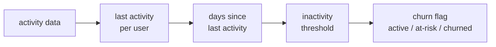

# :material-account-arrow-right: Churn Detection

Identify users, customers, or subscribers who have stopped engaging — using inactivity windows, subscription lapses, and behavioural decay signals to flag churn before or after it occurs.

---

## :material-sitemap: Execution Flow



---

## :material-code-tags: Syntax

### Inactivity-based churn

```sql
WITH params AS (
    SELECT DATE '2024-06-15' AS reference_date
),
last_activity AS (
    SELECT
        user_id,
        MAX(activity_date) AS last_activity_date
    FROM user_activity_log
    GROUP BY user_id
)
SELECT
    l.user_id,
    l.last_activity_date,
    DATEDIFF(p.reference_date, l.last_activity_date) AS days_since_last_activity,
    CASE
        WHEN DATEDIFF(p.reference_date, l.last_activity_date) <= 30 THEN 'active'
        WHEN DATEDIFF(p.reference_date, l.last_activity_date) <= 60 THEN 'at-risk'
        ELSE 'churned'
    END AS churn_status
FROM last_activity l
CROSS JOIN params p;
```

### Subscription-lapse churn

```sql
WITH customers AS (
    SELECT DISTINCT customer_id, customer_name
    FROM subscription_history
),
active_subscriptions AS (
    SELECT DISTINCT customer_id
    FROM subscription_history
    WHERE end_date IS NULL
)
SELECT
    c.customer_id,
    c.customer_name,
    CASE
        WHEN a.customer_id IS NULL THEN 'churned'
        ELSE 'active'
    END AS subscription_status
FROM customers c
LEFT JOIN active_subscriptions a
    ON c.customer_id = a.customer_id;
```

| Step | SQL element | Why it matters |
|------|-------------|----------------|
| 1 | `MAX(activity_date)` | Collapses many events to the most recent engagement date per user. |
| 2 | `DATEDIFF(reference_date, last_activity_date)` | Converts recency into an interpretable inactivity window in days. |
| 3 | `CASE` thresholds | Maps raw day counts into operational buckets such as active, at-risk, and churned. |
| 4 | `LEFT JOIN active_subscriptions` | Flags subscription churn when no active subscription row exists for a customer. |
| 5 | Combine both signals | Separates true disengagement from billing-only or activity-only edge cases. |

---

## :material-magnify: Behavior

1. **Recency-first classification** — churn models usually begin with the last observed activity date because it is cheap to compute and easy to explain.
2. **Thresholds are policy, not truth** — the same user can be active in a monthly billing product and churned in a daily habit app, depending on the chosen window.
3. **Subscription and usage can disagree** — a user may still be paying but already be behaviourally churned, or may cancel and later return.
4. **First activity is often a signup proxy** — when true signup dates are missing, many churn analyses use `MIN(activity_date)` as the start of the lifecycle.
5. **Decay signals lead churn** — a sharp drop in monthly engagement often appears before a full inactivity breach.

---

## :material-database: Sample Data

### Dataset 1: User activity log

```sql
CREATE OR REPLACE TEMP VIEW user_activity_log AS
SELECT * FROM VALUES
    ('u01', 'Alice', DATE '2024-03-01', 'login',          'premium'),
    ('u01', 'Alice', DATE '2024-04-15', 'purchase',       'premium'),
    ('u01', 'Alice', DATE '2024-06-10', 'page_view',      'premium'),
    ('u01', 'Alice', DATE '2024-06-14', 'login',          'premium'),
    ('u01', 'Alice', DATE '2024-06-15', 'purchase',       'premium'),
    ('u02', 'Ben',   DATE '2024-03-10', 'login',          'basic'),
    ('u02', 'Ben',   DATE '2024-05-31', 'purchase',       'basic'),
    ('u02', 'Ben',   DATE '2024-06-08', 'page_view',      'basic'),
    ('u03', 'Cara',  DATE '2024-04-01', 'login',          'free'),
    ('u03', 'Cara',  DATE '2024-05-20', 'page_view',      'free'),
    ('u04', 'Diego', DATE '2024-03-15', 'login',          'premium'),
    ('u04', 'Diego', DATE '2024-04-28', 'support_ticket', 'premium'),
    ('u05', 'Emma',  DATE '2024-03-01', 'login',          'basic'),
    ('u05', 'Emma',  DATE '2024-03-20', 'purchase',       'basic'),
    ('u05', 'Emma',  DATE '2024-03-30', 'page_view',      'basic'),
    ('u06', 'Farah', DATE '2024-03-12', 'login',          'free'),
    ('u07', 'Gabe',  DATE '2024-04-15', 'login',          'premium'),
    ('u07', 'Gabe',  DATE '2024-06-02', 'purchase',       'premium'),
    ('u08', 'Hana',  DATE '2024-04-20', 'login',          'basic'),
    ('u08', 'Hana',  DATE '2024-05-01', 'support_ticket', 'basic')
AS t(user_id, user_name, activity_date, activity_type, plan_type);
```

### Dataset 2: Subscription history

```sql
CREATE OR REPLACE TEMP VIEW subscription_history AS
SELECT * FROM VALUES
    ('sub_1001', 'u01', 'Alice', 'premium', DATE '2024-01-01', NULL,              79.00, NULL),
    ('sub_1002', 'u02', 'Ben',   'basic',   DATE '2024-02-01', DATE '2024-05-31', 39.00, 'too_expensive'),
    ('sub_1003', 'u03', 'Cara',  'premium', DATE '2024-01-15', DATE '2024-04-30', 79.00, 'downgraded'),
    ('sub_1004', 'u03', 'Cara',  'basic',   DATE '2024-05-01', NULL,              39.00, NULL),
    ('sub_1005', 'u04', 'Diego', 'basic',   DATE '2024-02-01', DATE '2024-03-15', 39.00, 'budget_constraints'),
    ('sub_1006', 'u04', 'Diego', 'basic',   DATE '2024-05-01', NULL,              39.00, NULL),
    ('sub_1007', 'u05', 'Emma',  'premium', DATE '2024-03-10', DATE '2024-04-20', 79.00, 'missing_features'),
    ('sub_1008', 'u06', 'Farah', 'basic',   DATE '2024-01-20', DATE '2024-02-29', 39.00, 'non_payment'),
    ('sub_1009', 'u07', 'Gabe',  'basic',   DATE '2024-04-01', NULL,              39.00, NULL),
    ('sub_1010', 'u08', 'Hana',  'basic',   DATE '2024-03-01', DATE '2024-04-30', 39.00, 'upgraded'),
    ('sub_1011', 'u08', 'Hana',  'premium', DATE '2024-05-01', NULL,              79.00, NULL)
AS t(subscription_id, customer_id, customer_name, plan, start_date, end_date, monthly_rate, cancellation_reason);
```

### Dataset 3: Monthly engagement scores

```sql
CREATE OR REPLACE TEMP VIEW monthly_engagement_scores AS
SELECT * FROM VALUES
    ('u01', 'Alice', DATE '2024-01-01', 18, 4, 90, 1),
    ('u01', 'Alice', DATE '2024-02-01', 16, 3, 80, 1),
    ('u01', 'Alice', DATE '2024-03-01', 13, 3, 68, 1),
    ('u01', 'Alice', DATE '2024-04-01', 10, 2, 52, 1),
    ('u01', 'Alice', DATE '2024-05-01',  7, 1, 38, 2),
    ('u01', 'Alice', DATE '2024-06-01',  4, 0, 20, 2),
    ('u04', 'Diego', DATE '2024-01-01', 10, 1, 55, 1),
    ('u04', 'Diego', DATE '2024-02-01', 11, 1, 57, 1),
    ('u04', 'Diego', DATE '2024-03-01', 10, 1, 58, 1),
    ('u04', 'Diego', DATE '2024-04-01',  9, 1, 56, 1),
    ('u04', 'Diego', DATE '2024-05-01', 10, 1, 57, 1),
    ('u04', 'Diego', DATE '2024-06-01',  9, 1, 55, 1),
    ('u05', 'Emma',  DATE '2024-01-01', 12, 2, 70, 1),
    ('u05', 'Emma',  DATE '2024-02-01', 13, 2, 72, 1),
    ('u05', 'Emma',  DATE '2024-03-01', 12, 2, 69, 1),
    ('u05', 'Emma',  DATE '2024-04-01', 11, 1, 60, 1),
    ('u05', 'Emma',  DATE '2024-05-01',  0, 0,  0, 0),
    ('u05', 'Emma',  DATE '2024-06-01',  0, 0,  0, 0),
    ('u07', 'Gabe',  DATE '2024-01-01',  5, 0, 20, 0),
    ('u07', 'Gabe',  DATE '2024-02-01',  6, 0, 24, 0),
    ('u07', 'Gabe',  DATE '2024-03-01',  8, 1, 32, 0),
    ('u07', 'Gabe',  DATE '2024-04-01', 10, 1, 45, 0),
    ('u07', 'Gabe',  DATE '2024-05-01', 12, 2, 58, 1),
    ('u07', 'Gabe',  DATE '2024-06-01', 15, 2, 70, 1)
AS t(user_id, user_name, month, login_count, purchase_count, page_views, support_tickets);
```

---

## :material-flask-outline: Practical Examples

### 1 — Basic inactivity-based churn

```sql
WITH params AS (
    SELECT DATE '2024-06-15' AS reference_date
),
last_activity AS (
    SELECT
        user_id,
        user_name,
        MAX(plan_type) AS plan_type,
        MAX(activity_date) AS last_activity_date
    FROM user_activity_log
    GROUP BY user_id, user_name
)
SELECT
    l.user_id,
    l.user_name,
    l.plan_type,
    l.last_activity_date,
    DATEDIFF(p.reference_date, l.last_activity_date) AS days_since_last_activity,
    CASE
        WHEN DATEDIFF(p.reference_date, l.last_activity_date) <= 30 THEN 'active'
        WHEN DATEDIFF(p.reference_date, l.last_activity_date) <= 60 THEN 'at-risk'
        ELSE 'churned'
    END AS churn_status
FROM last_activity l
CROSS JOIN params p
ORDER BY l.user_id;
```

??? success "Expected output"

    | user_id | user_name | plan_type | last_activity_date | days_since_last_activity | churn_status |
    |---------|-----------|-----------|--------------------|--------------------------|--------------|
    | u01 | Alice | premium | 2024-06-15 | 0 | active |
    | u02 | Ben | basic | 2024-06-08 | 7 | active |
    | u03 | Cara | free | 2024-05-20 | 26 | active |
    | u04 | Diego | premium | 2024-04-28 | 48 | at-risk |
    | u05 | Emma | basic | 2024-03-30 | 77 | churned |
    | u06 | Farah | free | 2024-03-12 | 95 | churned |
    | u07 | Gabe | premium | 2024-06-02 | 13 | active |
    | u08 | Hana | basic | 2024-05-01 | 45 | at-risk |

### 2 — Churn rate calculation

```sql
WITH params AS (
    SELECT DATE '2024-06-15' AS reference_date
),
user_status AS (
    SELECT
        user_id,
        CASE
            WHEN DATEDIFF(p.reference_date, MAX(activity_date)) <= 30 THEN 'active'
            WHEN DATEDIFF(p.reference_date, MAX(activity_date)) <= 60 THEN 'at-risk'
            ELSE 'churned'
        END AS churn_status
    FROM user_activity_log
    CROSS JOIN params p
    GROUP BY user_id, p.reference_date
)
SELECT
    churn_status,
    COUNT(*) AS users_in_bucket,
    ROUND(COUNT(*) * 100.0 / SUM(COUNT(*)) OVER (), 1) AS pct_of_users
FROM user_status
GROUP BY churn_status
ORDER BY CASE churn_status
    WHEN 'active' THEN 1
    WHEN 'at-risk' THEN 2
    ELSE 3
END;
```

??? success "Expected output"

    | churn_status | users_in_bucket | pct_of_users |
    |--------------|-----------------|--------------|
    | active | 4 | 50.0 |
    | at-risk | 2 | 25.0 |
    | churned | 2 | 25.0 |

### 3 — Subscription churn detection

```sql
WITH active_subscriptions AS (
    SELECT DISTINCT customer_id
    FROM subscription_history
    WHERE end_date IS NULL
),
latest_subscription AS (
    SELECT
        customer_id,
        customer_name,
        plan,
        end_date,
        monthly_rate,
        cancellation_reason,
        ROW_NUMBER() OVER (
            PARTITION BY customer_id
            ORDER BY COALESCE(end_date, DATE '9999-12-31') DESC, start_date DESC
        ) AS rn
    FROM subscription_history
)
SELECT
    l.customer_id,
    l.customer_name,
    l.plan AS last_plan,
    l.end_date,
    l.monthly_rate,
    l.cancellation_reason
FROM latest_subscription l
LEFT JOIN active_subscriptions a
    ON l.customer_id = a.customer_id
WHERE l.rn = 1
  AND a.customer_id IS NULL
ORDER BY l.customer_id;
```

??? success "Expected output"

    | customer_id | customer_name | last_plan | end_date | monthly_rate | cancellation_reason |
    |-------------|---------------|-----------|----------|--------------|---------------------|
    | u02 | Ben | basic | 2024-05-31 | 39.0 | too_expensive |
    | u05 | Emma | premium | 2024-04-20 | 79.0 | missing_features |
    | u06 | Farah | basic | 2024-02-29 | 39.0 | non_payment |

### 4 — Churn by plan type

```sql
WITH params AS (
    SELECT DATE '2024-06-15' AS reference_date
),
user_status AS (
    SELECT
        user_id,
        MAX(user_name) AS user_name,
        MAX(plan_type) AS plan_type,
        CASE
            WHEN DATEDIFF(p.reference_date, MAX(activity_date)) <= 30 THEN 'active'
            WHEN DATEDIFF(p.reference_date, MAX(activity_date)) <= 60 THEN 'at-risk'
            ELSE 'churned'
        END AS churn_status
    FROM user_activity_log
    CROSS JOIN params p
    GROUP BY user_id, p.reference_date
)
SELECT
    plan_type,
    COUNT(*) AS users_in_plan,
    SUM(CASE WHEN churn_status = 'active' THEN 1 ELSE 0 END) AS active_users,
    SUM(CASE WHEN churn_status = 'at-risk' THEN 1 ELSE 0 END) AS at_risk_users,
    SUM(CASE WHEN churn_status = 'churned' THEN 1 ELSE 0 END) AS churned_users,
    ROUND(
        SUM(CASE WHEN churn_status = 'churned' THEN 1 ELSE 0 END) * 100.0 / COUNT(*),
        1
    ) AS churn_rate_pct
FROM user_status
GROUP BY plan_type
ORDER BY plan_type;
```

??? success "Expected output"

    | plan_type | users_in_plan | active_users | at_risk_users | churned_users | churn_rate_pct |
    |-----------|---------------|--------------|---------------|---------------|----------------|
    | basic | 3 | 1 | 1 | 1 | 33.3 |
    | free | 2 | 1 | 0 | 1 | 50.0 |
    | premium | 3 | 2 | 1 | 0 | 0.0 |

### 5 — Days-to-churn distribution

```sql
WITH params AS (
    SELECT DATE '2024-06-15' AS reference_date
),
user_lifecycle AS (
    SELECT
        user_id,
        MAX(user_name) AS user_name,
        MIN(activity_date) AS signup_date,
        MAX(activity_date) AS last_activity_date,
        DATEDIFF(MAX(activity_date), MIN(activity_date)) AS days_active_before_churn,
        DATEDIFF(p.reference_date, MAX(activity_date)) AS days_since_last_activity
    FROM user_activity_log
    CROSS JOIN params p
    GROUP BY user_id, p.reference_date
)
SELECT
    user_id,
    user_name,
    signup_date,
    last_activity_date,
    days_active_before_churn,
    CASE
        WHEN days_active_before_churn <= 30 THEN '0-30 days'
        WHEN days_active_before_churn <= 60 THEN '31-60 days'
        ELSE '61+ days'
    END AS churn_bucket
FROM user_lifecycle
WHERE days_since_last_activity >= 61
ORDER BY days_active_before_churn DESC, user_id;
```

??? success "Expected output"

    | user_id | user_name | signup_date | last_activity_date | days_active_before_churn | churn_bucket |
    |---------|-----------|-------------|--------------------|--------------------------|--------------|
    | u05 | Emma | 2024-03-01 | 2024-03-30 | 29 | 0-30 days |
    | u06 | Farah | 2024-03-12 | 2024-03-12 | 0 | 0-30 days |

### 6 — Engagement decay detection

```sql
WITH monthly_totals AS (
    SELECT
        user_id,
        user_name,
        month,
        login_count + purchase_count + page_views + support_tickets AS engagement_total
    FROM monthly_engagement_scores
),
changes AS (
    SELECT
        user_id,
        user_name,
        month,
        engagement_total,
        LAG(engagement_total) OVER (
            PARTITION BY user_id
            ORDER BY month
        ) AS prev_engagement_total
    FROM monthly_totals
)
SELECT
    user_id,
    user_name,
    month,
    prev_engagement_total,
    engagement_total,
    ROUND(
        (prev_engagement_total - engagement_total) * 100.0 / prev_engagement_total,
        1
    ) AS drop_pct
FROM changes
WHERE prev_engagement_total > 0
  AND (prev_engagement_total - engagement_total) * 1.0 / prev_engagement_total > 0.5
ORDER BY user_id, month;
```

??? success "Expected output"

    | user_id | user_name | month | prev_engagement_total | engagement_total | drop_pct |
    |---------|-----------|-------|-----------------------|------------------|----------|
    | u05 | Emma | 2024-05-01 | 73 | 0 | 100.0 |

### 7 — Churn risk scoring

```sql
WITH params AS (
    SELECT DATE '2024-06-15' AS reference_date
),
activity_summary AS (
    SELECT
        user_id,
        MAX(user_name) AS user_name,
        MAX(activity_date) AS last_activity_date,
        COUNT(*) AS activity_events
    FROM user_activity_log
    WHERE user_id IN ('u01', 'u04', 'u05', 'u07')
    GROUP BY user_id
),
engagement_trend AS (
    SELECT
        user_id,
        MAX(CASE WHEN month = DATE '2024-04-01' THEN login_count + purchase_count + page_views + support_tickets END) AS apr_total,
        MAX(CASE WHEN month = DATE '2024-06-01' THEN login_count + purchase_count + page_views + support_tickets END) AS jun_total
    FROM monthly_engagement_scores
    GROUP BY user_id
)
SELECT
    a.user_id,
    a.user_name,
    DATEDIFF(p.reference_date, a.last_activity_date) AS days_since_last_activity,
    a.activity_events,
    e.apr_total,
    e.jun_total,
    (
        CASE
            WHEN DATEDIFF(p.reference_date, a.last_activity_date) >= 61 THEN 50
            WHEN DATEDIFF(p.reference_date, a.last_activity_date) >= 31 THEN 30
            ELSE 0
        END
        + CASE
            WHEN a.activity_events <= 1 THEN 20
            WHEN a.activity_events = 2 THEN 10
            ELSE 0
        END
        + CASE
            WHEN e.jun_total < e.apr_total * 0.5 THEN 30
            WHEN e.jun_total < e.apr_total * 0.8 THEN 15
            ELSE 0
        END
    ) AS risk_score,
    CASE
        WHEN (
            CASE
                WHEN DATEDIFF(p.reference_date, a.last_activity_date) >= 61 THEN 50
                WHEN DATEDIFF(p.reference_date, a.last_activity_date) >= 31 THEN 30
                ELSE 0
            END
            + CASE
                WHEN a.activity_events <= 1 THEN 20
                WHEN a.activity_events = 2 THEN 10
                ELSE 0
            END
            + CASE
                WHEN e.jun_total < e.apr_total * 0.5 THEN 30
                WHEN e.jun_total < e.apr_total * 0.8 THEN 15
                ELSE 0
            END
        ) >= 60 THEN 'high'
        WHEN (
            CASE
                WHEN DATEDIFF(p.reference_date, a.last_activity_date) >= 61 THEN 50
                WHEN DATEDIFF(p.reference_date, a.last_activity_date) >= 31 THEN 30
                ELSE 0
            END
            + CASE
                WHEN a.activity_events <= 1 THEN 20
                WHEN a.activity_events = 2 THEN 10
                ELSE 0
            END
            + CASE
                WHEN e.jun_total < e.apr_total * 0.5 THEN 30
                WHEN e.jun_total < e.apr_total * 0.8 THEN 15
                ELSE 0
            END
        ) >= 30 THEN 'medium'
        ELSE 'low'
    END AS risk_band
FROM activity_summary a
JOIN engagement_trend e
    ON a.user_id = e.user_id
CROSS JOIN params p
ORDER BY risk_score DESC, a.user_id;
```

??? success "Expected output"

    | user_id | user_name | days_since_last_activity | activity_events | apr_total | jun_total | risk_score | risk_band |
    |---------|-----------|--------------------------|-----------------|-----------|-----------|------------|-----------|
    | u05 | Emma | 77 | 3 | 73 | 0 | 80 | high |
    | u04 | Diego | 48 | 2 | 67 | 66 | 40 | medium |
    | u01 | Alice | 0 | 5 | 65 | 26 | 30 | medium |
    | u07 | Gabe | 13 | 2 | 56 | 88 | 10 | low |

### 8 — Revenue impact of churn

```sql
WITH cancellations AS (
    SELECT
        CAST(DATE_TRUNC('MONTH', end_date) AS DATE) AS cancellation_month,
        monthly_rate
    FROM subscription_history
    WHERE end_date IS NOT NULL
      AND cancellation_reason NOT IN ('upgraded', 'downgraded')
)
SELECT
    cancellation_month,
    SUM(monthly_rate) AS lost_mrr,
    SUM(SUM(monthly_rate)) OVER (
        ORDER BY cancellation_month
        ROWS BETWEEN UNBOUNDED PRECEDING AND CURRENT ROW
    ) AS cumulative_lost_mrr
FROM cancellations
GROUP BY cancellation_month
ORDER BY cancellation_month;
```

??? success "Expected output"

    | cancellation_month | lost_mrr | cumulative_lost_mrr |
    |--------------------|----------|---------------------|
    | 2024-02-01 | 39.0 | 39.0 |
    | 2024-03-01 | 39.0 | 78.0 |
    | 2024-04-01 | 79.0 | 157.0 |
    | 2024-05-01 | 39.0 | 196.0 |

### 9 — Win-back candidates

```sql
WITH params AS (
    SELECT DATE '2024-06-15' AS reference_date
),
user_lifecycle AS (
    SELECT
        user_id,
        MAX(user_name) AS user_name,
        COUNT(*) AS activity_events,
        MIN(activity_date) AS signup_date,
        MAX(activity_date) AS last_activity_date,
        DATEDIFF(MAX(activity_date), MIN(activity_date)) AS days_active_before_churn,
        DATEDIFF(p.reference_date, MAX(activity_date)) AS days_since_last_activity
    FROM user_activity_log
    CROSS JOIN params p
    GROUP BY user_id, p.reference_date
)
SELECT
    user_id,
    user_name,
    activity_events,
    days_active_before_churn,
    days_since_last_activity,
    'high-prior-engagement' AS recovery_segment
FROM user_lifecycle
WHERE days_since_last_activity >= 61
  AND activity_events >= 3
ORDER BY days_since_last_activity DESC;
```

??? success "Expected output"

    | user_id | user_name | activity_events | days_active_before_churn | days_since_last_activity | recovery_segment |
    |---------|-----------|-----------------|--------------------------|--------------------------|------------------|
    | u05 | Emma | 3 | 29 | 77 | high-prior-engagement |

### 10 — Cohort churn curve

```sql
WITH params AS (
    SELECT DATE '2024-06-15' AS reference_date
),
user_lifecycle AS (
    SELECT
        user_id,
        MIN(activity_date) AS signup_date,
        MAX(activity_date) AS last_activity_date,
        DATEDIFF(MAX(activity_date), MIN(activity_date)) AS lifespan_days,
        CASE
            WHEN DATEDIFF(p.reference_date, MAX(activity_date)) >= 61 THEN 1
            ELSE 0
        END AS churned_flag
    FROM user_activity_log
    CROSS JOIN params p
    GROUP BY user_id, p.reference_date
)
SELECT
    CAST(DATE_TRUNC('MONTH', signup_date) AS DATE) AS signup_month,
    COUNT(*) AS cohort_size,
    ROUND(SUM(CASE WHEN churned_flag = 1 AND lifespan_days <= 30 THEN 1 ELSE 0 END) * 100.0 / COUNT(*), 1) AS churn_30d_pct,
    ROUND(SUM(CASE WHEN churned_flag = 1 AND lifespan_days <= 60 THEN 1 ELSE 0 END) * 100.0 / COUNT(*), 1) AS churn_60d_pct,
    ROUND(SUM(CASE WHEN churned_flag = 1 AND lifespan_days <= 90 THEN 1 ELSE 0 END) * 100.0 / COUNT(*), 1) AS churn_90d_pct
FROM user_lifecycle
GROUP BY CAST(DATE_TRUNC('MONTH', signup_date) AS DATE)
ORDER BY signup_month;
```

??? success "Expected output"

    | signup_month | cohort_size | churn_30d_pct | churn_60d_pct | churn_90d_pct |
    |--------------|-------------|---------------|---------------|---------------|
    | 2024-03-01 | 5 | 40.0 | 40.0 | 40.0 |
    | 2024-04-01 | 3 | 0.0 | 0.0 | 0.0 |

---

## :material-shield-outline: Behavior Notes

!!! warning
    Inactivity thresholds must be domain-specific: a daily-use app, a B2B workflow tool, and a monthly subscription service should not share the same churn window.

!!! tip
    Combine activity-based and subscription-based signals for a complete picture; a user can still have an active subscription while already showing zero engagement.

!!! note
    Churn is usually most useful at the cohort or segment level, where trend shifts and intervention opportunities are easier to prioritise than one-off individual flags.

!!! warning
    Beware of seasonal effects — inactivity during holidays, school breaks, or annual renewal cycles can look like churn when it is only temporary dormancy.

!!! tip
    Use month-over-month engagement decay with `LAG` as an early warning layer before users cross a hard inactivity threshold.

---

## :material-brain: When to Use

| Scenario | Approach |
|----------|----------|
| Inactivity-based churn flagging | Compute `MAX(activity_date)` per user, then classify with `DATEDIFF` windows. |
| Subscription lapse detection | `LEFT JOIN` active subscription rows and treat missing matches as churned. |
| Churn rate by segment | Group churn flags by plan, geography, acquisition channel, or lifecycle stage. |
| Revenue impact analysis | Sum cancelled `monthly_rate` or ARR by cancellation month and segment. |
| Win-back targeting | Filter churned users with historically high activity, purchases, or long tenure. |
| Engagement decay early warning | Compare current month activity to prior months with `LAG`. |
| Cohort survival analysis | Use first activity or signup month and track churn within 30/60/90-day windows. |
| Churn risk scoring / prioritisation | Blend recency, frequency, and trend signals into one operational score. |
| Product change monitoring | Measure whether launches, pricing changes, or outages increase churn in affected cohorts. |
