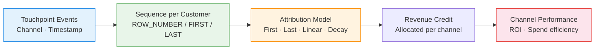

# :material-chart-arc: Attribution Modeling

Assign **revenue credit to marketing channels** along the customer journey — compare
first-touch, last-touch, linear, and time-decay models to understand which touchpoints
truly drive conversions.

______________________________________________________________________

## :material-sitemap: Attribution Flow



______________________________________________________________________

## :material-code-tags: Syntax

### Sample data

```sql
CREATE OR REPLACE TEMP VIEW touchpoints AS
SELECT * FROM VALUES
  (1, 'alice', 'Organic Search', TIMESTAMP '2024-03-01 09:00:00'),
  (2, 'alice', 'Email',          TIMESTAMP '2024-03-05 14:00:00'),
  (3, 'alice', 'Paid Search',    TIMESTAMP '2024-03-10 11:00:00'),
  (4, 'alice', 'Direct',         TIMESTAMP '2024-03-12 16:00:00'),
  (5, 'bob',   'Social',         TIMESTAMP '2024-03-02 10:00:00'),
  (6, 'bob',   'Paid Search',    TIMESTAMP '2024-03-08 09:00:00'),
  (7, 'bob',   'Email',          TIMESTAMP '2024-03-14 12:00:00'),
  (8, 'carol', 'Organic Search', TIMESTAMP '2024-03-03 08:00:00'),
  (9, 'carol', 'Referral',       TIMESTAMP '2024-03-07 15:00:00'),
  (10,'carol', 'Paid Search',    TIMESTAMP '2024-03-09 10:00:00'),
  (11,'carol', 'Direct',         TIMESTAMP '2024-03-11 17:00:00'),
  (12,'carol', 'Email',          TIMESTAMP '2024-03-13 09:00:00')
AS t(touch_id, customer_id, channel, touch_time);

CREATE OR REPLACE TEMP VIEW conversions AS
SELECT * FROM VALUES
  ('alice', 250.00, TIMESTAMP '2024-03-12 16:30:00'),
  ('bob',   180.00, TIMESTAMP '2024-03-14 12:30:00'),
  ('carol', 420.00, TIMESTAMP '2024-03-13 09:15:00')
AS t(customer_id, revenue, conversion_time);
```

______________________________________________________________________

### First-touch attribution

All credit goes to the **first** channel that introduced the customer.

```sql
WITH first_touch AS (
    SELECT
        t.customer_id,
        t.channel,
        ROW_NUMBER() OVER (
            PARTITION BY t.customer_id
            ORDER BY t.touch_time ASC
        )                                          AS touch_rank
    FROM touchpoints t
    JOIN conversions c ON t.customer_id = c.customer_id
    WHERE t.touch_time <= c.conversion_time
)
SELECT
    ft.channel,
    COUNT(*)                                       AS conversions,
    ROUND(SUM(c.revenue), 2)                       AS attributed_revenue
FROM first_touch ft
JOIN conversions c ON ft.customer_id = c.customer_id
WHERE ft.touch_rank = 1
GROUP BY ft.channel
ORDER BY attributed_revenue DESC;
-- Result:
-- +---------------+-----------+--------------------+
-- |channel        |conversions|attributed_revenue  |
-- +---------------+-----------+--------------------+
-- |Organic Search |2          |670.00              |
-- |Social         |1          |180.00              |
-- +---------------+-----------+--------------------+
```

______________________________________________________________________

### Last-touch attribution

All credit goes to the **last** channel before conversion.

```sql
WITH last_touch AS (
    SELECT
        t.customer_id,
        t.channel,
        ROW_NUMBER() OVER (
            PARTITION BY t.customer_id
            ORDER BY t.touch_time DESC
        )                                          AS touch_rank
    FROM touchpoints t
    JOIN conversions c ON t.customer_id = c.customer_id
    WHERE t.touch_time <= c.conversion_time
)
SELECT
    lt.channel,
    COUNT(*)                                       AS conversions,
    ROUND(SUM(c.revenue), 2)                       AS attributed_revenue
FROM last_touch lt
JOIN conversions c ON lt.customer_id = c.customer_id
WHERE lt.touch_rank = 1
GROUP BY lt.channel
ORDER BY attributed_revenue DESC;
-- Result:
-- +--------+-----------+--------------------+
-- |channel |conversions|attributed_revenue  |
-- +--------+-----------+--------------------+
-- |Direct  |1          |250.00              |
-- |Email   |2          |600.00              |
-- +--------+-----------+--------------------+
```

______________________________________________________________________

### Linear attribution

Revenue is split **equally** across all touchpoints in the journey.

```sql
WITH touch_counts AS (
    SELECT
        t.customer_id,
        t.channel,
        c.revenue,
        COUNT(*) OVER (PARTITION BY t.customer_id) AS total_touches
    FROM touchpoints t
    JOIN conversions c ON t.customer_id = c.customer_id
    WHERE t.touch_time <= c.conversion_time
)
SELECT
    channel,
    COUNT(*)                                       AS touch_count,
    ROUND(SUM(revenue / total_touches), 2)         AS attributed_revenue
FROM touch_counts
GROUP BY channel
ORDER BY attributed_revenue DESC;
-- Result:
-- +---------------+-----------+--------------------+
-- |channel        |touch_count|attributed_revenue  |
-- +---------------+-----------+--------------------+
-- |Paid Search    |3          |226.67              |
-- |Email          |3          |201.67              |
-- |Organic Search |2          |146.50              |
-- |Direct         |2          |146.50              |
-- |Social         |1          |45.00               |
-- |Referral       |1          |84.00               |
-- +---------------+-----------+--------------------+
```

______________________________________________________________________

### Time-decay attribution

More recent touchpoints receive **exponentially more credit** — using a half-life decay function.

```sql
WITH touch_decay AS (
    SELECT
        t.customer_id,
        t.channel,
        t.touch_time,
        c.revenue,
        c.conversion_time,
        -- Days between touch and conversion
        DATEDIFF(c.conversion_time, t.touch_time)  AS days_before,
        -- Decay weight: half-life of 7 days
        POW(2, -DATEDIFF(c.conversion_time, t.touch_time) / 7.0)
                                                   AS decay_weight
    FROM touchpoints t
    JOIN conversions c ON t.customer_id = c.customer_id
    WHERE t.touch_time <= c.conversion_time
),
normalised AS (
    SELECT
        *,
        decay_weight / SUM(decay_weight) OVER (
            PARTITION BY customer_id
        )                                          AS normalised_weight
    FROM touch_decay
)
SELECT
    channel,
    COUNT(*)                                       AS touch_count,
    ROUND(SUM(normalised_weight), 3)               AS total_weight,
    ROUND(SUM(revenue * normalised_weight), 2)     AS attributed_revenue
FROM normalised
GROUP BY channel
ORDER BY attributed_revenue DESC;
```

______________________________________________________________________

### Model comparison report

Compare all four models side-by-side for executive reporting.

```sql
WITH sequenced AS (
    SELECT
        t.customer_id,
        t.channel,
        t.touch_time,
        c.revenue,
        c.conversion_time,
        ROW_NUMBER() OVER (
            PARTITION BY t.customer_id ORDER BY t.touch_time ASC
        )                                          AS asc_rank,
        ROW_NUMBER() OVER (
            PARTITION BY t.customer_id ORDER BY t.touch_time DESC
        )                                          AS desc_rank,
        COUNT(*) OVER (PARTITION BY t.customer_id) AS total_touches,
        POW(2, -DATEDIFF(c.conversion_time, t.touch_time) / 7.0)
                                                   AS decay_weight,
        SUM(POW(2, -DATEDIFF(c.conversion_time, t.touch_time) / 7.0))
            OVER (PARTITION BY t.customer_id)      AS total_decay
    FROM touchpoints t
    JOIN conversions c ON t.customer_id = c.customer_id
    WHERE t.touch_time <= c.conversion_time
)
SELECT
    channel,
    -- First touch
    ROUND(SUM(CASE WHEN asc_rank = 1 THEN revenue ELSE 0 END), 2)
                                                   AS first_touch_rev,
    -- Last touch
    ROUND(SUM(CASE WHEN desc_rank = 1 THEN revenue ELSE 0 END), 2)
                                                   AS last_touch_rev,
    -- Linear
    ROUND(SUM(revenue / total_touches), 2)         AS linear_rev,
    -- Time decay
    ROUND(SUM(revenue * decay_weight / total_decay), 2)
                                                   AS time_decay_rev
FROM sequenced
GROUP BY channel
ORDER BY time_decay_rev DESC;
```

______________________________________________________________________

## :material-information-outline: Key Concepts

| Model           | Logic                                | Best For                          |
| --------------- | ------------------------------------ | --------------------------------- |
| **First Touch** | 100% credit to first interaction     | Measuring awareness channels      |
| **Last Touch**  | 100% credit to last interaction      | Measuring conversion closers      |
| **Linear**      | Equal credit to all touchpoints      | Balanced multi-channel view       |
| **Time Decay**  | Exponential weight favouring recency | Campaigns with short sales cycles |

!!! tip "Half-life tuning"

    The time-decay model uses `POW(2, -days / half_life)`. A 7-day half-life
    means a touchpoint 7 days before conversion gets 50% weight of the final
    touch. Adjust the half-life to match your typical sales cycle.

!!! warning "Attribution window"

    Always filter touchpoints to a lookback window (e.g., 30 or 90 days before
    conversion). Without this, ancient touchpoints dilute credit unreasonably.

______________________________________________________________________

## :material-lightbulb-outline: When to Use

| Scenario                      | Recommended Model                                      |
| ----------------------------- | ------------------------------------------------------ |
| Brand awareness budget        | First Touch — credits discovery channels               |
| Performance marketing ROI     | Last Touch — credits conversion closers                |
| Multi-channel strategy        | Linear — shows full journey contribution               |
| Short sales cycle (< 14 days) | Time Decay — recency matters most                      |
| Model comparison              | Run all four side-by-side and compare channel rankings |

______________________________________________________________________

## :material-speedometer: Performance Notes

| Tip                                             | Reason                                    |
| ----------------------------------------------- | ----------------------------------------- |
| Pre-join touchpoints with conversions           | Reduces repeated self-joins across models |
| Filter lookback window early                    | Fewer rows in window functions            |
| Broadcast the conversions table                 | Typically small compared to touchpoints   |
| Materialise the sequenced CTE                   | Reused by all four attribution models     |
| Partition by conversion event if multi-purchase | Prevents cross-conversion contamination   |

______________________________________________________________________

## :material-database-search: [Databricks] Real-World Example — System Tables

!!! note "[Databricks] Unity Catalog system tables"

    `system.billing.usage` is a built-in Unity Catalog system table, so no synthetic
    sample data is required. Because Unity Catalog does not have a literal customer
    table, this example explicitly reframes each `workspace_id` (or `custom_tags['Tenant']`
    in shared workspaces) as the "customer", each `sku_name` usage day as a touchpoint,
    and total monthly `usage_quantity` as the conversion value. An account admin must
    `GRANT USE CATALOG, USE SCHEMA, SELECT ON SCHEMA system.billing TO <principal>`
    before these queries will return rows. This is an illustrative adaptation of
    attribution modeling, not a finance-grade cost allocation model.

### First-touch attribution for workspace usage

```sql
-- [Databricks] Requires SELECT on system.billing.usage
WITH workspace_sku_days AS (
    SELECT
        workspace_id,
        sku_name,
        usage_date,
        SUM(usage_quantity) AS daily_dbu
    FROM system.billing.usage
    WHERE usage_date >= DATE_SUB(CURRENT_DATE(), 30)
      AND usage_unit = 'DBU'
    GROUP BY workspace_id, sku_name, usage_date
),
workspace_totals AS (
    SELECT
        workspace_id,
        ROUND(SUM(daily_dbu), 2) AS total_workspace_dbu,
        MAX(usage_date) AS conversion_date
    FROM workspace_sku_days
    GROUP BY workspace_id
),
first_touch AS (
    SELECT
        d.workspace_id,
        d.sku_name,
        ROW_NUMBER() OVER (
            PARTITION BY d.workspace_id
            ORDER BY d.usage_date ASC, d.sku_name
        ) AS touch_rank
    FROM workspace_sku_days d
    JOIN workspace_totals t
        ON d.workspace_id = t.workspace_id
    WHERE d.usage_date <= t.conversion_date
)
SELECT
    ft.sku_name,
    COUNT(*) AS workspaces,
    ROUND(SUM(t.total_workspace_dbu), 2) AS attributed_dbu
FROM first_touch ft
JOIN workspace_totals t
    ON ft.workspace_id = t.workspace_id
WHERE ft.touch_rank = 1
GROUP BY ft.sku_name
ORDER BY attributed_dbu DESC;
-- Result (illustrative):
-- sku_name              | workspaces | attributed_dbu
-- ----------------------|------------|---------------
-- ALL_PURPOSE_COMPUTE   | 14         | 9280.40
-- SERVERLESS_SQL        | 9          | 5175.20
-- PREMIUM_JOBS_COMPUTE  | 6          | 3011.75
```

### Last-touch attribution for workspace usage

```sql
-- [Databricks] Requires SELECT on system.billing.usage
WITH workspace_sku_days AS (
    SELECT
        workspace_id,
        sku_name,
        usage_date,
        SUM(usage_quantity) AS daily_dbu
    FROM system.billing.usage
    WHERE usage_date >= DATE_SUB(CURRENT_DATE(), 30)
      AND usage_unit = 'DBU'
    GROUP BY workspace_id, sku_name, usage_date
),
workspace_totals AS (
    SELECT
        workspace_id,
        ROUND(SUM(daily_dbu), 2) AS total_workspace_dbu,
        MAX(usage_date) AS conversion_date
    FROM workspace_sku_days
    GROUP BY workspace_id
),
last_touch AS (
    SELECT
        d.workspace_id,
        d.sku_name,
        ROW_NUMBER() OVER (
            PARTITION BY d.workspace_id
            ORDER BY d.usage_date DESC, d.sku_name DESC
        ) AS touch_rank
    FROM workspace_sku_days d
    JOIN workspace_totals t
        ON d.workspace_id = t.workspace_id
    WHERE d.usage_date <= t.conversion_date
)
SELECT
    lt.sku_name,
    COUNT(*) AS workspaces,
    ROUND(SUM(t.total_workspace_dbu), 2) AS attributed_dbu
FROM last_touch lt
JOIN workspace_totals t
    ON lt.workspace_id = t.workspace_id
WHERE lt.touch_rank = 1
GROUP BY lt.sku_name
ORDER BY attributed_dbu DESC;
-- Result (illustrative):
-- sku_name              | workspaces | attributed_dbu
-- ----------------------|------------|---------------
-- SERVERLESS_SQL        | 12         | 8840.10
-- PREMIUM_JOBS_COMPUTE  | 10         | 5488.25
-- ALL_PURPOSE_COMPUTE   | 7          | 3138.00
```

!!! tip "Same journey logic, real platform usage"

    The core pattern is the same as marketing attribution: order touchpoints per
    customer, pick the first or last one with `ROW_NUMBER()`, then roll up the
    attributed value. On production system tables, that lets you compare which
    Databricks SKUs tend to introduce workspace usage versus which ones close it.

______________________________________________________________________

## :material-arrow-right: Related

- [Funnel Analysis](funnel-analysis.md) — step-by-step conversion measurement
- [Path Analysis](path-analysis.md) — navigation sequence tracking
- [Period Comparison](../sequence/period-comparison.md) — LAG/LEAD for time-based comparisons
- [Customer Lifetime Value](clv.md) — value-weighted attribution targets
