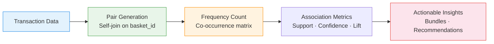

# :material-cart: Basket Analysis

Find **products frequently purchased together** — enabling cross-sell recommendations,
store layout optimisation, and bundle pricing strategies.

______________________________________________________________________

## :material-sitemap: Analysis Flow



______________________________________________________________________

## :material-code-tags: Syntax

### Sample data

```sql
CREATE OR REPLACE TEMP VIEW basket_items AS
SELECT * FROM VALUES
  (1, 'Milk'),    (1, 'Bread'),   (1, 'Butter'),
  (2, 'Milk'),    (2, 'Bread'),   (2, 'Eggs'),
  (3, 'Bread'),   (3, 'Butter'),  (3, 'Jam'),
  (4, 'Milk'),    (4, 'Bread'),   (4, 'Butter'),  (4, 'Eggs'),
  (5, 'Milk'),    (5, 'Eggs'),    (5, 'Cheese'),
  (6, 'Bread'),   (6, 'Butter'),
  (7, 'Milk'),    (7, 'Bread'),   (7, 'Butter'),  (7, 'Cheese'),
  (8, 'Eggs'),    (8, 'Cheese'),  (8, 'Milk')
AS t(basket_id, product);
```

______________________________________________________________________

### Product pair generation (self-join)

Generate all unique product pairs within the same basket.

```sql
SELECT
    a.product                                      AS product_a,
    b.product                                      AS product_b,
    COUNT(DISTINCT a.basket_id)                    AS co_occurrence
FROM basket_items a
JOIN basket_items b
    ON a.basket_id = b.basket_id
    AND a.product < b.product
GROUP BY a.product, b.product
ORDER BY co_occurrence DESC;
-- Result:
-- +----------+----------+---------------+
-- |product_a |product_b |co_occurrence  |
-- +----------+----------+---------------+
-- |Bread     |Milk      |5              |
-- |Butter    |Bread     |4              |
-- |Butter    |Milk      |3              |
-- |Eggs      |Milk      |3              |
-- |Bread     |Eggs      |2              |
-- |...       |...       |...            |
-- +----------+----------+---------------+
```

______________________________________________________________________

### Association metrics (support, confidence, lift)

Calculate classic market basket metrics for each product pair.

```sql
WITH total_baskets AS (
    SELECT COUNT(DISTINCT basket_id) AS n FROM basket_items
),
product_freq AS (
    SELECT
        product,
        COUNT(DISTINCT basket_id)                  AS baskets_with
    FROM basket_items
    GROUP BY product
),
pair_freq AS (
    SELECT
        a.product                                  AS product_a,
        b.product                                  AS product_b,
        COUNT(DISTINCT a.basket_id)                AS pair_count
    FROM basket_items a
    JOIN basket_items b
        ON a.basket_id = b.basket_id
        AND a.product < b.product
    GROUP BY a.product, b.product
)
SELECT
    pf.product_a,
    pf.product_b,
    pf.pair_count,
    -- Support: P(A ∩ B)
    ROUND(pf.pair_count * 1.0 / tb.n, 3)          AS support,
    -- Confidence: P(B | A)
    ROUND(
        pf.pair_count * 1.0 / fa.baskets_with, 3
    )                                              AS confidence_a_to_b,
    -- Lift: P(A ∩ B) / (P(A) × P(B))
    ROUND(
        (pf.pair_count * 1.0 / tb.n)
        / ((fa.baskets_with * 1.0 / tb.n) * (fb.baskets_with * 1.0 / tb.n)),
        3
    )                                              AS lift
FROM pair_freq pf
CROSS JOIN total_baskets tb
JOIN product_freq fa ON pf.product_a = fa.product
JOIN product_freq fb ON pf.product_b = fb.product
ORDER BY lift DESC;
```

______________________________________________________________________

### Top-N recommendations per product

For each product, find the top 3 most associated products.

```sql
WITH pair_metrics AS (
    SELECT
        a.product                                  AS source_product,
        b.product                                  AS recommended,
        COUNT(DISTINCT a.basket_id)                AS co_occurrence,
        ROW_NUMBER() OVER (
            PARTITION BY a.product
            ORDER BY COUNT(DISTINCT a.basket_id) DESC
        )                                          AS rank
    FROM basket_items a
    JOIN basket_items b
        ON a.basket_id = b.basket_id
        AND a.product != b.product
    GROUP BY a.product, b.product
)
SELECT
    source_product,
    recommended,
    co_occurrence
FROM pair_metrics
WHERE rank <= 3
ORDER BY source_product, rank;
```

______________________________________________________________________

### Frequent itemsets (3-product combinations)

Extend beyond pairs to find frequent triples.

```sql
SELECT
    a.product                                      AS product_1,
    b.product                                      AS product_2,
    c.product                                      AS product_3,
    COUNT(DISTINCT a.basket_id)                    AS frequency
FROM basket_items a
JOIN basket_items b
    ON a.basket_id = b.basket_id
    AND a.product < b.product
JOIN basket_items c
    ON a.basket_id = c.basket_id
    AND b.product < c.product
GROUP BY a.product, b.product, c.product
HAVING COUNT(DISTINCT a.basket_id) >= 2
ORDER BY frequency DESC;
-- Result:
-- +----------+----------+----------+-----------+
-- |product_1 |product_2 |product_3 |frequency  |
-- +----------+----------+----------+-----------+
-- |Bread     |Butter    |Milk      |3          |
-- |Bread     |Eggs      |Milk      |2          |
-- +----------+----------+----------+-----------+
```

______________________________________________________________________

## :material-information-outline: Key Concepts

| Metric         | Formula                                 | Interpretation                                             |
| -------------- | --------------------------------------- | ---------------------------------------------------------- |
| **Support**    | `P(A ∩ B) = pair_count / total_baskets` | How common is the pair overall                             |
| **Confidence** | `P(B\|A) = pair_count / baskets_with_A` | If A is bought, how likely is B                            |
| **Lift**       | `support / (P(A) × P(B))`               | >1 = positive association, 1 = independent, \<1 = negative |

!!! tip "Filter by minimum support"

    In large catalogues, most pairs have near-zero support. Filter to
    `support >= 0.01` (1%) to focus on commercially meaningful associations.

!!! note "Self-join ordering trick"

    `a.product < b.product` ensures each pair appears only once (Bread-Milk,
    not also Milk-Bread), halving the output and avoiding duplicates.

______________________________________________________________________

## :material-lightbulb-outline: When to Use

| Scenario                   | Action                                                    |
| -------------------------- | --------------------------------------------------------- |
| Cross-sell recommendations | "Customers who bought X also bought Y"                    |
| Bundle pricing             | Discount frequently co-purchased items as a package       |
| Store layout               | Place high-lift pairs in proximity                        |
| Inventory planning         | Stock associated items together for fulfilment efficiency |
| Promotional campaigns      | Feature complementary products in same campaign           |

______________________________________________________________________

## :material-speedometer: Performance Notes

| Tip                                                | Reason                                                        |
| -------------------------------------------------- | ------------------------------------------------------------- |
| Filter to minimum basket size ≥ 2                  | Single-item baskets cannot form pairs                         |
| Use `product < product` not `!=`                   | Halves the join output; eliminates duplicate pairs            |
| Pre-aggregate product frequency                    | Avoids repeated full scans for support calculation            |
| Limit triple/quad generation to high-support pairs | Self-join cost grows combinatorially                          |
| Broadcast small product dimension                  | `/*+ BROADCAST(product_freq) */` for large transaction tables |

______________________________________________________________________

## :material-database-search: [Databricks] Real-World Example — System Tables

!!! note "[Databricks] Unity Catalog system tables"

    `system.billing.usage` is a built-in Unity Catalog system table, so no synthetic
    sample data is required. Because Unity Catalog does not have a literal customer
    basket table, this example explicitly reframes each `workspace_id` (or
    `custom_tags['Tenant']`) as the "customer" and each `(workspace_id, usage_date)`
    combination as the basket. The products inside that basket are the distinct
    `sku_name` values used on that day. An account admin must `GRANT USE CATALOG, USE SCHEMA, SELECT ON SCHEMA system.billing TO <principal>` before these queries
    will return rows.

### Product pair generation from daily workspace usage

```sql
-- [Databricks] Requires SELECT on system.billing.usage
WITH daily_skus AS (
    SELECT DISTINCT
        workspace_id,
        usage_date,
        sku_name
    FROM system.billing.usage
    WHERE usage_date >= DATE_SUB(CURRENT_DATE(), 30)
      AND usage_unit = 'DBU'
)
SELECT
    a.sku_name AS product_a,
    b.sku_name AS product_b,
    COUNT(*) AS co_occurrence
FROM daily_skus a
JOIN daily_skus b
    ON a.workspace_id = b.workspace_id
    AND a.usage_date = b.usage_date
    AND a.sku_name < b.sku_name
GROUP BY a.sku_name, b.sku_name
ORDER BY co_occurrence DESC, product_a, product_b;
-- Result (illustrative):
-- product_a             | product_b             | co_occurrence
-- ----------------------|-----------------------|--------------
-- ALL_PURPOSE_COMPUTE   | DBSQL_SERVERLESS      | 62
-- ALL_PURPOSE_COMPUTE   | PREMIUM_JOBS_COMPUTE  | 49
-- DBSQL_SERVERLESS      | PREMIUM_JOBS_COMPUTE  | 37
```

### Association metrics for SKU pairs

```sql
-- [Databricks] Requires SELECT on system.billing.usage
WITH daily_skus AS (
    SELECT DISTINCT
        workspace_id,
        usage_date,
        CONCAT(CAST(workspace_id AS STRING), '::', CAST(usage_date AS STRING)) AS basket_id,
        sku_name
    FROM system.billing.usage
    WHERE usage_date >= DATE_SUB(CURRENT_DATE(), 30)
      AND usage_unit = 'DBU'
),
total_baskets AS (
    SELECT COUNT(DISTINCT basket_id) AS n FROM daily_skus
),
product_freq AS (
    SELECT
        sku_name,
        COUNT(DISTINCT basket_id) AS baskets_with
    FROM daily_skus
    GROUP BY sku_name
),
pair_freq AS (
    SELECT
        a.sku_name AS product_a,
        b.sku_name AS product_b,
        COUNT(DISTINCT a.basket_id) AS pair_count
    FROM daily_skus a
    JOIN daily_skus b
        ON a.basket_id = b.basket_id
        AND a.sku_name < b.sku_name
    GROUP BY a.sku_name, b.sku_name
)
SELECT
    pf.product_a,
    pf.product_b,
    pf.pair_count,
    ROUND(pf.pair_count * 1.0 / tb.n, 3) AS support,
    ROUND(pf.pair_count * 1.0 / fa.baskets_with, 3) AS confidence_a_to_b,
    ROUND(
        (pf.pair_count * 1.0 / tb.n)
        / ((fa.baskets_with * 1.0 / tb.n) * (fb.baskets_with * 1.0 / tb.n)),
        3
    ) AS lift
FROM pair_freq pf
CROSS JOIN total_baskets tb
JOIN product_freq fa
    ON pf.product_a = fa.sku_name
JOIN product_freq fb
    ON pf.product_b = fb.sku_name
ORDER BY lift DESC, pair_count DESC;
-- Result (illustrative):
-- product_a            | product_b            | pair_count | support | confidence_a_to_b | lift
-- ---------------------|----------------------|------------|---------|-------------------|------
-- ALL_PURPOSE_COMPUTE  | DBSQL_SERVERLESS     | 62         | 0.184   | 0.611             | 1.420
-- DBSQL_SERVERLESS     | PREMIUM_JOBS_COMPUTE | 37         | 0.110   | 0.402             | 1.275
```

!!! tip "Same co-occurrence pattern, real usage baskets"

    The query shape does not change: deduplicate basket contents, self-join within the
    basket, and aggregate pair frequency or lift. On production system tables, that same
    pattern surfaces which Databricks SKUs are commonly used together by the same
    workspace on the same day.

______________________________________________________________________

## :material-arrow-right: Related

- [RFM Segmentation](rfm-segmentation.md) — segment customers by purchase behaviour
- [Customer Lifetime Value](clv.md) — estimate total customer value
- [Conditional Aggregation](../aggregation/conditional-agg.md) — pivot techniques used in co-occurrence matrices
