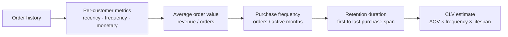

# :material-cash-multiple: Customer Lifetime Value (CLV)

Estimate the **total value a customer generates** over their entire relationship
with your business — using purchase frequency, average order value, and retention
duration to predict future revenue contribution.

______________________________________________________________________

## :material-sitemap: Execution Flow



______________________________________________________________________

## :material-code-tags: Syntax

### Core CLV metrics per customer

```sql
WITH customer_metrics AS (
    SELECT
        customer_id,
        COUNT(*)                                           AS total_orders,
        ROUND(SUM(amount), 2)                              AS total_revenue,
        ROUND(AVG(amount), 2)                              AS avg_order_value,
        MIN(order_date)                                    AS first_purchase,
        MAX(order_date)                                    AS last_purchase,
        DATEDIFF(MAX(order_date), MIN(order_date))         AS lifespan_days,
        ROUND(
            DATEDIFF(MAX(order_date), MIN(order_date)) / 30.0,
            1
        )                                                  AS lifespan_months
    FROM orders
    GROUP BY customer_id
)
SELECT
    customer_id,
    total_orders,
    total_revenue,
    avg_order_value,
    first_purchase,
    last_purchase,
    lifespan_months,
    -- Purchase frequency: orders per month
    ROUND(
        CASE WHEN lifespan_months > 0
             THEN total_orders / lifespan_months
             ELSE total_orders
        END, 2
    )                                                      AS orders_per_month,
    -- Simple CLV: AOV × frequency × projected lifespan (e.g., 24 months)
    ROUND(
        avg_order_value
        * (CASE WHEN lifespan_months > 0
                THEN total_orders / lifespan_months
                ELSE total_orders END)
        * 24,
        2
    )                                                      AS projected_clv_24m
FROM customer_metrics
ORDER BY projected_clv_24m DESC;
```

______________________________________________________________________

### Cohort-based CLV

Compare lifetime value across signup cohorts to measure improvements over time.

```sql
WITH cohorts AS (
    SELECT
        customer_id,
        DATE_TRUNC('month', MIN(order_date)) AS cohort_month
    FROM orders
    GROUP BY customer_id
),
customer_revenue AS (
    SELECT
        c.cohort_month,
        o.customer_id,
        SUM(o.amount)                                      AS lifetime_revenue,
        COUNT(*)                                           AS lifetime_orders,
        DATEDIFF(MAX(o.order_date), MIN(o.order_date))     AS lifespan_days
    FROM orders o
    JOIN cohorts c ON o.customer_id = c.customer_id
    GROUP BY c.cohort_month, o.customer_id
)
SELECT
    cohort_month,
    COUNT(*)                                               AS customers,
    ROUND(AVG(lifetime_revenue), 2)                        AS avg_clv,
    ROUND(PERCENTILE_APPROX(lifetime_revenue, 0.5), 2)    AS median_clv,
    ROUND(AVG(lifetime_orders), 1)                         AS avg_orders,
    ROUND(AVG(lifespan_days / 30.0), 1)                    AS avg_lifespan_months
FROM customer_revenue
GROUP BY cohort_month
ORDER BY cohort_month;
```

______________________________________________________________________

### CLV segmentation with NTILE

Bucket customers into value tiers for targeted marketing.

```sql
WITH customer_clv AS (
    SELECT
        customer_id,
        SUM(amount)                                        AS total_revenue,
        COUNT(*)                                           AS total_orders,
        ROUND(AVG(amount), 2)                              AS avg_order_value,
        DATEDIFF(MAX(order_date), MIN(order_date)) / 30.0  AS lifespan_months
    FROM orders
    GROUP BY customer_id
)
SELECT
    customer_id,
    total_revenue,
    total_orders,
    avg_order_value,
    lifespan_months,
    NTILE(5) OVER (ORDER BY total_revenue DESC)            AS value_tier,
    CASE NTILE(5) OVER (ORDER BY total_revenue DESC)
        WHEN 1 THEN 'Platinum'
        WHEN 2 THEN 'Gold'
        WHEN 3 THEN 'Silver'
        WHEN 4 THEN 'Bronze'
        ELSE 'At-Risk'
    END                                                    AS tier_label
FROM customer_clv
ORDER BY total_revenue DESC;
```

______________________________________________________________________

### RFM-based CLV scoring

Combine Recency, Frequency, and Monetary scores for a composite CLV indicator.

```sql
WITH params AS (
    SELECT DATE '2024-06-30' AS reference_date
),
rfm AS (
    SELECT
        customer_id,
        DATEDIFF(p.reference_date, MAX(order_date))        AS recency_days,
        COUNT(*)                                           AS frequency,
        ROUND(SUM(amount), 2)                              AS monetary
    FROM orders
    CROSS JOIN params p
    GROUP BY customer_id, p.reference_date
),
scored AS (
    SELECT
        customer_id,
        recency_days,
        frequency,
        monetary,
        NTILE(5) OVER (ORDER BY recency_days ASC)          AS r_score,
        NTILE(5) OVER (ORDER BY frequency DESC)            AS f_score,
        NTILE(5) OVER (ORDER BY monetary DESC)             AS m_score
    FROM rfm
)
SELECT
    customer_id,
    recency_days,
    frequency,
    monetary,
    r_score,
    f_score,
    m_score,
    ROUND((r_score + f_score + m_score) / 3.0, 2)         AS composite_score,
    CASE
        WHEN r_score >= 4 AND f_score >= 4 AND m_score >= 4 THEN 'Champion'
        WHEN r_score >= 3 AND f_score >= 3                   THEN 'Loyal'
        WHEN r_score >= 4 AND f_score <= 2                   THEN 'New High-Value'
        WHEN r_score <= 2 AND f_score >= 3                   THEN 'At Risk'
        ELSE 'Nurture'
    END                                                    AS segment
FROM scored
ORDER BY composite_score DESC;
```

______________________________________________________________________

## :material-information-outline: Key Concepts

| Metric                    | Formula                                    | Interpretation            |
| ------------------------- | ------------------------------------------ | ------------------------- |
| Average Order Value (AOV) | `total_revenue / total_orders`             | Spending per transaction  |
| Purchase Frequency        | `total_orders / lifespan_months`           | How often they buy        |
| Retention Duration        | `last_purchase - first_purchase`           | How long they stay active |
| Simple CLV                | `AOV × frequency × projected_lifespan`     | Expected future revenue   |
| RFM Score                 | Quintile of recency + frequency + monetary | Composite value indicator |

!!! tip "Projected vs historical CLV"

    Historical CLV sums past revenue. Projected CLV multiplies current behaviour
    by an expected future lifespan. Use projected CLV for marketing budget allocation;
    use historical CLV for reporting and segmentation.

______________________________________________________________________

## :material-lightbulb-outline: When to Use

| Scenario                    | Approach                                                      |
| --------------------------- | ------------------------------------------------------------- |
| Marketing budget allocation | Invest more in high-CLV customer acquisition channels         |
| Churn prevention            | Prioritise retention efforts for high-CLV at-risk customers   |
| Pricing strategy            | Understand price sensitivity by CLV tier                      |
| Product recommendations     | Tailor offers based on predicted lifetime spend               |
| Cohort comparison           | Measure whether newer cohorts have higher CLV than older ones |

______________________________________________________________________

## :material-speedometer: Performance Notes

| Tip                                          | Reason                                             |
| -------------------------------------------- | -------------------------------------------------- |
| Pre-aggregate orders to customer level first | Reduces row count before window/NTILE computations |
| Use `PERCENTILE_APPROX` over `PERCENTILE`    | Approximate is much faster on large datasets       |
| Partition NTILE by region/segment if needed  | Avoids global sort across all customers            |
| Filter to recent orders (e.g., last 2 years) | Excludes inactive customers that skew averages     |

______________________________________________________________________

## :material-database-search: [Databricks] Real-World Example — System Tables

!!! note "[Databricks] Unity Catalog system tables"

    `system.billing.usage` is a built-in Unity Catalog system table, so no synthetic
    sample data is needed. For a CLV-style analysis, treat each `workspace_id` or
    `custom_tags['Tenant']` as the "customer" and recurring billing usage as the
    value signal. The examples below use `usage_quantity` with `usage_unit = 'DBU'`
    as a simple spend proxy. An account admin must
    `GRANT USE CATALOG, USE SCHEMA, SELECT ON SCHEMA system.billing TO <principal>`
    before these queries will return rows.

### 1 — Historical and projected value per workspace

```sql
-- [Databricks] Requires SELECT on system.billing.usage
WITH workspace_value AS (
    SELECT
        workspace_id,
        MIN(usage_date) AS first_usage_date,
        MAX(usage_date) AS last_usage_date,
        ROUND(SUM(usage_quantity), 2) AS historical_usage_value,
        ROUND(
            GREATEST(DATEDIFF(MAX(usage_date), MIN(usage_date)) / 30.0, 1.0),
            1
        ) AS lifespan_months
    FROM system.billing.usage
    WHERE usage_date >= DATE_SUB(CURRENT_DATE(), 365)
      AND usage_unit = 'DBU'
    GROUP BY workspace_id
),
workspace_metrics AS (
    SELECT
        workspace_id,
        first_usage_date,
        last_usage_date,
        historical_usage_value,
        lifespan_months,
        ROUND(historical_usage_value / lifespan_months, 2) AS usage_value_per_month
    FROM workspace_value
)
SELECT
    workspace_id,
    first_usage_date,
    last_usage_date,
    historical_usage_value,
    lifespan_months,
    usage_value_per_month,
    ROUND(historical_usage_value + usage_value_per_month * 3, 2) AS projected_clv_90d
FROM workspace_metrics
ORDER BY projected_clv_90d DESC;
-- Result (illustrative):
-- workspace_id | historical_usage_value | lifespan_months | usage_value_per_month | projected_clv_90d
-- -------------|------------------------|-----------------|-----------------------|------------------
-- 123456789    | 18420.50               | 11.8            | 1561.06               | 23103.68
-- 987654321    | 7420.00                | 6.0             | 1236.67               | 11130.01
```

### 2 — Tenant value tiers with projected CLV

```sql
-- [Databricks] Requires SELECT on system.billing.usage
WITH tenant_value AS (
    SELECT
        custom_tags['Tenant'] AS tenant,
        ROUND(SUM(usage_quantity), 2) AS historical_usage_value,
        ROUND(
            GREATEST(DATEDIFF(MAX(usage_date), MIN(usage_date)) / 30.0, 1.0),
            1
        ) AS lifespan_months
    FROM system.billing.usage
    WHERE usage_date >= DATE_SUB(CURRENT_DATE(), 365)
      AND usage_unit = 'DBU'
      AND custom_tags['Tenant'] IS NOT NULL
    GROUP BY custom_tags['Tenant']
),
tenant_clv AS (
    SELECT
        tenant,
        historical_usage_value,
        ROUND(historical_usage_value / lifespan_months, 2) AS usage_value_per_month,
        ROUND(
            historical_usage_value + (historical_usage_value / lifespan_months) * 6,
            2
        ) AS projected_clv_180d
    FROM tenant_value
)
SELECT
    tenant,
    historical_usage_value,
    usage_value_per_month,
    projected_clv_180d,
    NTILE(5) OVER (ORDER BY projected_clv_180d DESC) AS value_tier
FROM tenant_clv
ORDER BY projected_clv_180d DESC;
-- Result (illustrative):
-- tenant   | historical_usage_value | usage_value_per_month | projected_clv_180d | value_tier
-- ---------|------------------------|-----------------------|--------------------|-----------
-- acme-co  | 22110.00               | 1842.50               | 33165.00           | 1
-- globex   | 14640.00               | 1220.00               | 21960.00           | 2
-- initech  | 3180.00                | 530.00                | 6360.00            | 5
```

!!! tip "The same CLV pattern generalises to real billing entities"

    Historical value, monthly value rate, projected value, and `NTILE` segmentation
    all stay the same when you move from synthetic orders to system tables. The only
    change is the business entity: a Databricks workspace or tenant becomes the
    "customer" whose long-term usage value you measure.

______________________________________________________________________

## :material-arrow-right: Related

- [Retention Analysis](retention.md) — cohort-based return rates
- [Churn Detection](churn-detection.md) — identify customers about to leave
- [ABC Classification](abc-classification.md) — Pareto-based customer segmentation
- [Survival Analysis](survival-analysis.md) — time-to-churn modelling
