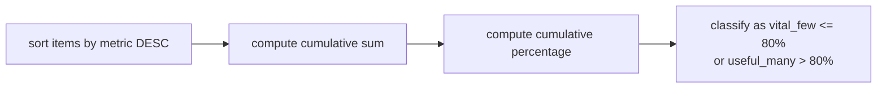

# :material-chart-bell-curve-cumulative: Pareto (80/20) Analysis

Identify the vital few items that contribute the majority of a metric — the classic 80/20 rule for revenue concentration, defect analysis, and resource prioritisation.

---

## :material-sitemap: Execution Flow



---

## :material-code-tags: Syntax

```sql
WITH pareto_base AS (
    SELECT
        item_id,
        item_name,
        metric_value,
        ROW_NUMBER() OVER (
            ORDER BY metric_value DESC, item_id
        ) AS metric_rank,
        SUM(metric_value) OVER () AS total_metric,
        SUM(metric_value) OVER (
            ORDER BY metric_value DESC, item_id
            ROWS BETWEEN UNBOUNDED PRECEDING AND CURRENT ROW
        ) AS cumulative_metric
    FROM source_table
),
classified AS (
    SELECT
        item_id,
        item_name,
        metric_value,
        metric_rank,
        cumulative_metric,
        ROUND(cumulative_metric * 100.0 / total_metric, 1) AS cumulative_pct,
        ROUND(
            LAG(cumulative_metric, 1, 0) OVER (ORDER BY metric_rank) * 100.0 / total_metric,
            1
        ) AS previous_pct
    FROM pareto_base
)
SELECT
    item_id,
    item_name,
    metric_value,
    metric_rank,
    cumulative_metric,
    cumulative_pct,
    CASE
        WHEN previous_pct < 80 THEN 'vital_few'
        ELSE 'useful_many'
    END AS pareto_band
FROM classified
ORDER BY metric_rank;
```

| Element | Purpose |
|---------|---------|
| `ORDER BY metric_value DESC, item_id` | Sorts highest contributors first and adds deterministic tie-breaking |
| `SUM(metric_value) OVER ()` | Computes the denominator for percentage calculations |
| `SUM(...) OVER (ORDER BY ... ROWS BETWEEN UNBOUNDED PRECEDING AND CURRENT ROW)` | Builds the cumulative running total |
| `LAG(cumulative_metric, 1, 0)` | Detects the first row that crosses the 80% line |
| `CASE WHEN previous_pct < 80` | Includes the crossing row in the `vital_few` set |

---

## :material-magnify: Behavior

1. **Tie handling matters** — if multiple rows share the same metric, add a stable secondary sort such as `item_id` or `item_name` so the Pareto order is repeatable.
2. **80% is stepwise, not continuous** — cumulative percentages jump in discrete row increments, so the first row after 80% often lands above the threshold.
3. **Choose the cutoff rule explicitly** — `cumulative_pct <= 80` is stricter, while `previous_pct < 80` includes the first row that crosses 80%.
4. **Aggregate before ranking** — for ticket categories, products, or customers with multiple raw rows, summarise to the analysis grain first, then apply the Pareto window logic.
5. **NULL and zero totals need guards** — filter `NULL` metrics and protect divisions with `NULLIF(total_metric, 0)` when the source can be empty or all-zero.

---

## :material-database: Sample Data

### Dataset 1: Product sales

```sql
CREATE OR REPLACE TEMP VIEW product_sales AS
SELECT * FROM VALUES
    ('P101', 'Laptop Pro',          'Electronics', 120000.00,  240),
    ('P102', 'Wireless Earbuds',    'Electronics',  85000.00, 1700),
    ('P103', 'Standing Desk',       'Furniture',    76000.00,  190),
    ('P104', 'Espresso Machine',    'Home',         64000.00,  320),
    ('P105', 'Office Chair',        'Furniture',    52000.00,  410),
    ('P106', 'Air Purifier',        'Home',         41000.00,  560),
    ('P107', 'Mechanical Keyboard', 'Accessories',  33000.00,  880),
    ('P108', 'Monitor Arm',         'Accessories',  21000.00,  740),
    ('P109', 'Desk Lamp',           'Home',         14000.00,  950),
    ('P110', 'USB-C Cable',         'Accessories',   9000.00, 2200)
AS t(product_id, product_name, category, revenue, units_sold);
```

### Dataset 2: Support tickets

```sql
CREATE OR REPLACE TEMP VIEW support_tickets AS
SELECT * FROM VALUES
    ('Login',        'Password Reset', 320, 210.0),
    ('Login',        'MFA Failure',    180, 165.0),
    ('Billing',      'Invoice Error',  260, 340.0),
    ('Billing',      'Refund Request', 140, 280.0),
    ('Performance',  'Slow Dashboard', 190, 420.0),
    ('Performance',  'Job Timeout',    120, 360.0),
    ('Data Quality', 'Missing Records',110, 390.0),
    ('Data Quality', 'Duplicate Rows',  75, 250.0),
    ('Integrations', 'Webhook Failure', 95, 300.0)
AS t(ticket_category, subcategory, ticket_count, resolution_hours);
```

### Dataset 3: Customer revenue

```sql
CREATE OR REPLACE TEMP VIEW customer_revenue AS
SELECT * FROM VALUES
    ('C001', 'Apex Retail',        'Enterprise', 250000.00),
    ('C002', 'Northstar Health',   'Enterprise', 210000.00),
    ('C003', 'BlueWave Logistics', 'Mid-Market', 160000.00),
    ('C004', 'Summit Foods',       'Mid-Market', 140000.00),
    ('C005', 'Urban Bloom',        'SMB',         95000.00),
    ('C006', 'Vertex Energy',      'Enterprise',  90000.00),
    ('C007', 'CloudVista',         'SMB',         70000.00),
    ('C008', 'GreenLeaf Co',       'SMB',         55000.00),
    ('C009', 'Horizon Labs',       'Mid-Market',  40000.00),
    ('C010', 'BrightMart',         'SMB',         30000.00)
AS t(customer_id, customer_name, segment, annual_revenue);
```

---

## :material-flask-outline: Practical Examples

### 1 — Basic Pareto by product revenue

```sql
WITH product_pareto AS (
    SELECT
        product_id,
        product_name,
        category,
        revenue,
        ROW_NUMBER() OVER (
            ORDER BY revenue DESC, product_id
        ) AS revenue_rank,
        SUM(revenue) OVER () AS total_revenue,
        SUM(revenue) OVER (
            ORDER BY revenue DESC, product_id
            ROWS BETWEEN UNBOUNDED PRECEDING AND CURRENT ROW
        ) AS cumulative_revenue
    FROM product_sales
),
classified AS (
    SELECT
        product_id,
        product_name,
        category,
        revenue,
        revenue_rank,
        cumulative_revenue,
        total_revenue,
        LAG(cumulative_revenue, 1, 0) OVER (ORDER BY revenue_rank) AS previous_cumulative_revenue
    FROM product_pareto
)
SELECT
    product_id,
    product_name,
    category,
    revenue,
    revenue_rank,
    ROUND(cumulative_revenue * 100.0 / total_revenue, 1) AS cumulative_revenue_pct,
    CASE
        WHEN previous_cumulative_revenue < total_revenue * 0.8 THEN 'vital_few'
        ELSE 'useful_many'
    END AS pareto_band
FROM classified
ORDER BY revenue_rank;
```

??? success "Expected output"

    | product_id | product_name | category | revenue | revenue_rank | cumulative_revenue_pct | pareto_band |
    |------------|--------------|----------|---------|--------------|------------------------|-------------|
    | P101 | Laptop Pro | Electronics | 120000.00 | 1 | 23.3 | vital_few |
    | P102 | Wireless Earbuds | Electronics | 85000.00 | 2 | 39.8 | vital_few |
    | P103 | Standing Desk | Furniture | 76000.00 | 3 | 54.6 | vital_few |
    | P104 | Espresso Machine | Home | 64000.00 | 4 | 67.0 | vital_few |
    | P105 | Office Chair | Furniture | 52000.00 | 5 | 77.1 | vital_few |
    | P106 | Air Purifier | Home | 41000.00 | 6 | 85.0 | vital_few |
    | P107 | Mechanical Keyboard | Accessories | 33000.00 | 7 | 91.5 | useful_many |
    | P108 | Monitor Arm | Accessories | 21000.00 | 8 | 95.5 | useful_many |
    | P109 | Desk Lamp | Home | 14000.00 | 9 | 98.3 | useful_many |
    | P110 | USB-C Cable | Accessories | 9000.00 | 10 | 100.0 | useful_many |

### 2 — Exact 80/20 cutoff line

```sql
WITH product_pareto AS (
    SELECT
        product_id,
        product_name,
        revenue,
        ROW_NUMBER() OVER (
            ORDER BY revenue DESC, product_id
        ) AS revenue_rank,
        SUM(revenue) OVER () AS total_revenue,
        SUM(revenue) OVER (
            ORDER BY revenue DESC, product_id
            ROWS BETWEEN UNBOUNDED PRECEDING AND CURRENT ROW
        ) AS cumulative_revenue
    FROM product_sales
),
cutoff_compare AS (
    SELECT
        product_name,
        revenue_rank,
        revenue,
        ROUND(
            LAG(cumulative_revenue, 1, 0) OVER (ORDER BY revenue_rank) * 100.0 / total_revenue,
            1
        ) AS previous_pct,
        ROUND(cumulative_revenue * 100.0 / total_revenue, 1) AS cumulative_pct
    FROM product_pareto
)
SELECT
    product_name,
    revenue_rank,
    revenue,
    previous_pct,
    cumulative_pct,
    CASE
        WHEN cumulative_pct <= 80 THEN 'vital_few'
        ELSE 'useful_many'
    END AS strict_le_80,
    CASE
        WHEN previous_pct < 80 THEN 'vital_few'
        ELSE 'useful_many'
    END AS include_crossing_80
FROM cutoff_compare
ORDER BY revenue_rank;
```

??? success "Expected output"

    | product_name | revenue_rank | revenue | previous_pct | cumulative_pct | strict_le_80 | include_crossing_80 |
    |--------------|--------------|---------|--------------|----------------|--------------|---------------------|
    | Laptop Pro | 1 | 120000.00 | 0.0 | 23.3 | vital_few | vital_few |
    | Wireless Earbuds | 2 | 85000.00 | 23.3 | 39.8 | vital_few | vital_few |
    | Standing Desk | 3 | 76000.00 | 39.8 | 54.6 | vital_few | vital_few |
    | Espresso Machine | 4 | 64000.00 | 54.6 | 67.0 | vital_few | vital_few |
    | Office Chair | 5 | 52000.00 | 67.0 | 77.1 | vital_few | vital_few |
    | Air Purifier | 6 | 41000.00 | 77.1 | 85.0 | useful_many | vital_few |
    | Mechanical Keyboard | 7 | 33000.00 | 85.0 | 91.5 | useful_many | useful_many |
    | Monitor Arm | 8 | 21000.00 | 91.5 | 95.5 | useful_many | useful_many |
    | Desk Lamp | 9 | 14000.00 | 95.5 | 98.3 | useful_many | useful_many |
    | USB-C Cable | 10 | 9000.00 | 98.3 | 100.0 | useful_many | useful_many |

### 3 — Pareto by category

```sql
WITH category_pareto AS (
    SELECT
        category,
        product_id,
        product_name,
        revenue,
        ROW_NUMBER() OVER (
            PARTITION BY category
            ORDER BY revenue DESC, product_id
        ) AS revenue_rank,
        SUM(revenue) OVER (PARTITION BY category) AS category_revenue,
        SUM(revenue) OVER (
            PARTITION BY category
            ORDER BY revenue DESC, product_id
            ROWS BETWEEN UNBOUNDED PRECEDING AND CURRENT ROW
        ) AS cumulative_revenue
    FROM product_sales
),
classified AS (
    SELECT
        category,
        product_name,
        revenue,
        revenue_rank,
        category_revenue,
        cumulative_revenue,
        LAG(cumulative_revenue, 1, 0) OVER (
            PARTITION BY category
            ORDER BY revenue_rank
        ) AS previous_cumulative_revenue
    FROM category_pareto
)
SELECT
    category,
    product_name,
    revenue,
    ROUND(cumulative_revenue * 100.0 / category_revenue, 1) AS cumulative_pct,
    CASE
        WHEN previous_cumulative_revenue < category_revenue * 0.8 THEN 'vital_few'
        ELSE 'useful_many'
    END AS pareto_band
FROM classified
ORDER BY category, revenue_rank;
```

??? success "Expected output"

    | category | product_name | revenue | cumulative_pct | pareto_band |
    |----------|--------------|---------|----------------|-------------|
    | Accessories | Mechanical Keyboard | 33000.00 | 52.4 | vital_few |
    | Accessories | Monitor Arm | 21000.00 | 85.7 | vital_few |
    | Accessories | USB-C Cable | 9000.00 | 100.0 | useful_many |
    | Electronics | Laptop Pro | 120000.00 | 58.5 | vital_few |
    | Electronics | Wireless Earbuds | 85000.00 | 100.0 | vital_few |
    | Furniture | Standing Desk | 76000.00 | 59.4 | vital_few |
    | Furniture | Office Chair | 52000.00 | 100.0 | vital_few |
    | Home | Espresso Machine | 64000.00 | 53.8 | vital_few |
    | Home | Air Purifier | 41000.00 | 88.2 | vital_few |
    | Home | Desk Lamp | 14000.00 | 100.0 | useful_many |

### 4 — Support ticket Pareto by category

```sql
WITH category_totals AS (
    SELECT
        ticket_category,
        SUM(ticket_count) AS ticket_count,
        SUM(resolution_hours) AS total_resolution_hours
    FROM support_tickets
    GROUP BY ticket_category
),
ticket_pareto AS (
    SELECT
        ticket_category,
        ticket_count,
        total_resolution_hours,
        ROW_NUMBER() OVER (
            ORDER BY ticket_count DESC, ticket_category
        ) AS category_rank,
        SUM(ticket_count) OVER () AS total_tickets,
        SUM(ticket_count) OVER (
            ORDER BY ticket_count DESC, ticket_category
            ROWS BETWEEN UNBOUNDED PRECEDING AND CURRENT ROW
        ) AS cumulative_tickets
    FROM category_totals
),
classified AS (
    SELECT
        ticket_category,
        ticket_count,
        total_resolution_hours,
        category_rank,
        total_tickets,
        cumulative_tickets,
        LAG(cumulative_tickets, 1, 0) OVER (ORDER BY category_rank) AS previous_cumulative_tickets
    FROM ticket_pareto
)
SELECT
    ticket_category,
    ticket_count,
    ROUND(total_resolution_hours, 1) AS total_resolution_hours,
    ROUND(ticket_count * 100.0 / total_tickets, 1) AS ticket_share_pct,
    ROUND(cumulative_tickets * 100.0 / total_tickets, 1) AS cumulative_pct,
    CASE
        WHEN previous_cumulative_tickets < total_tickets * 0.8 THEN 'vital_few'
        ELSE 'useful_many'
    END AS pareto_band
FROM classified
ORDER BY category_rank;
```

??? success "Expected output"

    | ticket_category | ticket_count | total_resolution_hours | ticket_share_pct | cumulative_pct | pareto_band |
    |-----------------|--------------|------------------------|------------------|----------------|-------------|
    | Login | 500 | 375.0 | 33.6 | 33.6 | vital_few |
    | Billing | 400 | 620.0 | 26.8 | 60.4 | vital_few |
    | Performance | 310 | 780.0 | 20.8 | 81.2 | vital_few |
    | Data Quality | 185 | 640.0 | 12.4 | 93.6 | useful_many |
    | Integrations | 95 | 300.0 | 6.4 | 100.0 | useful_many |

### 5 — Customer revenue concentration

```sql
WITH customer_pareto AS (
    SELECT
        customer_id,
        customer_name,
        annual_revenue,
        ROW_NUMBER() OVER (
            ORDER BY annual_revenue DESC, customer_id
        ) AS revenue_rank,
        COUNT(*) OVER () AS total_customers,
        SUM(annual_revenue) OVER () AS total_revenue,
        SUM(annual_revenue) OVER (
            ORDER BY annual_revenue DESC, customer_id
            ROWS BETWEEN UNBOUNDED PRECEDING AND CURRENT ROW
        ) AS cumulative_revenue
    FROM customer_revenue
),
classified AS (
    SELECT
        customer_id,
        customer_name,
        annual_revenue,
        revenue_rank,
        total_customers,
        total_revenue,
        cumulative_revenue,
        LAG(cumulative_revenue, 1, 0) OVER (ORDER BY revenue_rank) AS previous_cumulative_revenue
    FROM customer_pareto
)
SELECT
    total_customers,
    revenue_rank AS customers_to_reach_80_pct,
    ROUND(revenue_rank * 100.0 / total_customers, 1) AS pct_of_customers,
    cumulative_revenue AS revenue_at_cutoff,
    ROUND(cumulative_revenue * 100.0 / total_revenue, 1) AS cutoff_revenue_pct
FROM classified
WHERE previous_cumulative_revenue < total_revenue * 0.8
  AND cumulative_revenue >= total_revenue * 0.8;
```

??? success "Expected output"

    | total_customers | customers_to_reach_80_pct | pct_of_customers | revenue_at_cutoff | cutoff_revenue_pct |
    |-----------------|---------------------------|------------------|-------------------|--------------------|
    | 10 | 6 | 60.0 | 945000.00 | 82.9 |

### 6 — Dual Pareto for revenue and units

```sql
WITH revenue_ranked AS (
    SELECT
        product_id,
        product_name,
        revenue,
        ROW_NUMBER() OVER (
            ORDER BY revenue DESC, product_id
        ) AS revenue_rank,
        SUM(revenue) OVER () AS total_revenue,
        SUM(revenue) OVER (
            ORDER BY revenue DESC, product_id
            ROWS BETWEEN UNBOUNDED PRECEDING AND CURRENT ROW
        ) AS cumulative_revenue
    FROM product_sales
),
units_ranked AS (
    SELECT
        product_id,
        product_name,
        units_sold,
        ROW_NUMBER() OVER (
            ORDER BY units_sold DESC, product_id
        ) AS units_rank,
        SUM(units_sold) OVER () AS total_units,
        SUM(units_sold) OVER (
            ORDER BY units_sold DESC, product_id
            ROWS BETWEEN UNBOUNDED PRECEDING AND CURRENT ROW
        ) AS cumulative_units
    FROM product_sales
)
SELECT
    r.product_name,
    r.revenue_rank,
    ROUND(r.cumulative_revenue * 100.0 / r.total_revenue, 1) AS cumulative_revenue_pct,
    u.units_rank,
    ROUND(u.cumulative_units * 100.0 / u.total_units, 1) AS cumulative_units_pct
FROM revenue_ranked r
INNER JOIN units_ranked u
    ON r.product_id = u.product_id
ORDER BY r.revenue_rank;
```

??? success "Expected output"

    | product_name | revenue_rank | cumulative_revenue_pct | units_rank | cumulative_units_pct |
    |--------------|--------------|------------------------|------------|----------------------|
    | Laptop Pro | 1 | 23.3 | 9 | 97.7 |
    | Wireless Earbuds | 2 | 39.8 | 2 | 47.6 |
    | Standing Desk | 3 | 54.6 | 10 | 100.0 |
    | Espresso Machine | 4 | 67.0 | 8 | 94.7 |
    | Office Chair | 5 | 77.1 | 7 | 90.8 |
    | Air Purifier | 6 | 85.0 | 6 | 85.8 |
    | Mechanical Keyboard | 7 | 91.5 | 4 | 70.0 |
    | Monitor Arm | 8 | 95.5 | 5 | 79.0 |
    | Desk Lamp | 9 | 98.3 | 3 | 59.2 |
    | USB-C Cable | 10 | 100.0 | 1 | 26.9 |

### 7 — Pareto with long-tail rollup into Other

```sql
WITH product_pareto AS (
    SELECT
        product_id,
        product_name,
        revenue,
        units_sold,
        ROW_NUMBER() OVER (
            ORDER BY revenue DESC, product_id
        ) AS revenue_rank,
        SUM(revenue) OVER () AS total_revenue,
        SUM(revenue) OVER (
            ORDER BY revenue DESC, product_id
            ROWS BETWEEN UNBOUNDED PRECEDING AND CURRENT ROW
        ) AS cumulative_revenue
    FROM product_sales
),
classified AS (
    SELECT
        product_name,
        revenue,
        units_sold,
        CASE
            WHEN LAG(cumulative_revenue, 1, 0) OVER (ORDER BY revenue_rank) < total_revenue * 0.8
                THEN product_name
            ELSE 'Other'
        END AS bucket
    FROM product_pareto
)
SELECT
    bucket,
    SUM(revenue) AS revenue,
    SUM(units_sold) AS units_sold,
    CASE
        WHEN bucket = 'Other' THEN 'useful_many'
        ELSE 'vital_few'
    END AS pareto_band
FROM classified
GROUP BY bucket
ORDER BY CASE WHEN bucket = 'Other' THEN 1 ELSE 0 END, revenue DESC;
```

??? success "Expected output"

    | bucket | revenue | units_sold | pareto_band |
    |--------|---------|------------|-------------|
    | Laptop Pro | 120000.00 | 240 | vital_few |
    | Wireless Earbuds | 85000.00 | 1700 | vital_few |
    | Standing Desk | 76000.00 | 190 | vital_few |
    | Espresso Machine | 64000.00 | 320 | vital_few |
    | Office Chair | 52000.00 | 410 | vital_few |
    | Air Purifier | 41000.00 | 560 | vital_few |
    | Other | 77000.00 | 4770 | useful_many |

### 8 — Pareto index and Gini-like concentration ratio

```sql
WITH stats AS (
    SELECT
        COUNT(*) AS customer_count,
        SUM(annual_revenue) AS total_revenue
    FROM customer_revenue
),
ranked_desc AS (
    SELECT
        customer_id,
        annual_revenue,
        ROW_NUMBER() OVER (
            ORDER BY annual_revenue DESC, customer_id
        ) AS revenue_rank,
        s.customer_count,
        s.total_revenue
    FROM customer_revenue
    CROSS JOIN stats s
),
top_share AS (
    SELECT
        MAX(customer_count) AS customer_count,
        ROUND(
            SUM(CASE WHEN revenue_rank <= CEIL(customer_count * 0.2) THEN annual_revenue ELSE 0 END)
                * 100.0 / MAX(total_revenue),
            1
        ) AS top_20_customer_share_pct,
        ROUND(
            SUM(CASE WHEN revenue_rank <= CEIL(customer_count * 0.5) THEN annual_revenue ELSE 0 END)
                * 100.0 / MAX(total_revenue),
            1
        ) AS top_50_customer_share_pct
    FROM ranked_desc
),
ranked_asc AS (
    SELECT
        customer_id,
        annual_revenue,
        ROW_NUMBER() OVER (
            ORDER BY annual_revenue ASC, customer_id
        ) AS revenue_rank,
        s.customer_count,
        s.total_revenue,
        SUM(annual_revenue) OVER (
            ORDER BY annual_revenue ASC, customer_id
            ROWS BETWEEN UNBOUNDED PRECEDING AND CURRENT ROW
        ) AS cumulative_revenue
    FROM customer_revenue
    CROSS JOIN stats s
),
lorenz_curve AS (
    SELECT
        revenue_rank * 1.0 / customer_count AS x,
        cumulative_revenue * 1.0 / total_revenue AS y,
        LAG(revenue_rank * 1.0 / customer_count, 1, 0.0) OVER (ORDER BY revenue_rank) AS prev_x,
        LAG(cumulative_revenue * 1.0 / total_revenue, 1, 0.0) OVER (ORDER BY revenue_rank) AS prev_y
    FROM ranked_asc
),
gini_like AS (
    SELECT
        ROUND(1 - 2 * SUM((y + prev_y) * (x - prev_x) / 2), 3) AS gini_like_ratio
    FROM lorenz_curve
)
SELECT
    t.customer_count,
    t.top_20_customer_share_pct,
    t.top_50_customer_share_pct,
    ROUND(t.top_20_customer_share_pct / 20.0, 2) AS pareto_index,
    g.gini_like_ratio
FROM top_share t
CROSS JOIN gini_like g;
```

??? success "Expected output"

    | customer_count | top_20_customer_share_pct | top_50_customer_share_pct | pareto_index | gini_like_ratio |
    |----------------|---------------------------|---------------------------|--------------|-----------------|
    | 10 | 40.4 | 75.0 | 2.02 | 0.343 |

### 9 — Pareto over time by period

```sql
WITH period_sales AS (
    SELECT * FROM VALUES
        ('2024-Q1', 'Laptop Pro',       90000.00),
        ('2024-Q1', 'Wireless Earbuds', 70000.00),
        ('2024-Q1', 'Standing Desk',    60000.00),
        ('2024-Q1', 'Espresso Machine', 35000.00),
        ('2024-Q1', 'Office Chair',     20000.00),
        ('2024-Q2', 'Laptop Pro',      160000.00),
        ('2024-Q2', 'Wireless Earbuds', 80000.00),
        ('2024-Q2', 'Standing Desk',    20000.00),
        ('2024-Q2', 'Espresso Machine', 12000.00),
        ('2024-Q2', 'Office Chair',      8000.00)
    AS t(sales_period, product_name, revenue)
),
period_pareto AS (
    SELECT
        sales_period,
        product_name,
        revenue,
        ROW_NUMBER() OVER (
            PARTITION BY sales_period
            ORDER BY revenue DESC, product_name
        ) AS revenue_rank,
        COUNT(*) OVER (PARTITION BY sales_period) AS product_count,
        SUM(revenue) OVER (PARTITION BY sales_period) AS total_revenue,
        SUM(revenue) OVER (
            PARTITION BY sales_period
            ORDER BY revenue DESC, product_name
            ROWS BETWEEN UNBOUNDED PRECEDING AND CURRENT ROW
        ) AS cumulative_revenue
    FROM period_sales
),
classified AS (
    SELECT
        sales_period,
        revenue_rank,
        product_count,
        total_revenue,
        cumulative_revenue,
        LAG(cumulative_revenue, 1, 0) OVER (
            PARTITION BY sales_period
            ORDER BY revenue_rank
        ) AS previous_cumulative_revenue
    FROM period_pareto
)
SELECT
    sales_period,
    product_count,
    revenue_rank AS products_to_reach_80_pct,
    ROUND(revenue_rank * 100.0 / product_count, 1) AS pct_of_products,
    cumulative_revenue AS revenue_at_cutoff,
    ROUND(cumulative_revenue * 100.0 / total_revenue, 1) AS cutoff_revenue_pct
FROM classified
WHERE previous_cumulative_revenue < total_revenue * 0.8
  AND cumulative_revenue >= total_revenue * 0.8
ORDER BY sales_period;
```

??? success "Expected output"

    | sales_period | product_count | products_to_reach_80_pct | pct_of_products | revenue_at_cutoff | cutoff_revenue_pct |
    |--------------|---------------|---------------------------|-----------------|-------------------|--------------------|
    | 2024-Q1 | 5 | 3 | 60.0 | 220000.00 | 80.0 |
    | 2024-Q2 | 5 | 2 | 40.0 | 240000.00 | 85.7 |

### 10 — Inverse Pareto for the least valuable 20%

```sql
WITH tail_pareto AS (
    SELECT
        product_id,
        product_name,
        revenue,
        ROW_NUMBER() OVER (
            ORDER BY revenue ASC, product_id
        ) AS low_rank,
        SUM(revenue) OVER () AS total_revenue,
        SUM(revenue) OVER (
            ORDER BY revenue ASC, product_id
            ROWS BETWEEN UNBOUNDED PRECEDING AND CURRENT ROW
        ) AS cumulative_bottom_revenue
    FROM product_sales
),
classified AS (
    SELECT
        product_name,
        revenue,
        low_rank,
        total_revenue,
        cumulative_bottom_revenue,
        LAG(cumulative_bottom_revenue, 1, 0) OVER (ORDER BY low_rank) AS previous_bottom_revenue
    FROM tail_pareto
)
SELECT
    product_name,
    revenue,
    low_rank,
    ROUND(cumulative_bottom_revenue * 100.0 / total_revenue, 1) AS cumulative_bottom_pct,
    CASE
        WHEN previous_bottom_revenue < total_revenue * 0.2 THEN 'least_valuable_20'
        ELSE 'core_revenue'
    END AS pareto_band
FROM classified
WHERE previous_bottom_revenue < total_revenue * 0.2
ORDER BY low_rank;
```

??? success "Expected output"

    | product_name | revenue | low_rank | cumulative_bottom_pct | pareto_band |
    |--------------|---------|----------|-----------------------|-------------|
    | USB-C Cable | 9000.00 | 1 | 1.7 | least_valuable_20 |
    | Desk Lamp | 14000.00 | 2 | 4.5 | least_valuable_20 |
    | Monitor Arm | 21000.00 | 3 | 8.5 | least_valuable_20 |
    | Mechanical Keyboard | 33000.00 | 4 | 15.0 | least_valuable_20 |
    | Air Purifier | 41000.00 | 5 | 22.9 | least_valuable_20 |

---

## :material-shield-outline: Behavior Notes

!!! warning "Ties can move the boundary"
    When two items have the same metric near the cutoff, the choice of secondary sort key decides which row crosses 80% first. Add a deterministic tie-breaker so repeated runs do not reshuffle the `vital_few` set.

!!! tip "Choose the cutoff policy before publishing results"
    Teams often mean different things by "the 80% contributors." Decide whether you want the strict `cumulative_pct <= 80` rule or the inclusive "first row crossing 80%" rule, then use that rule consistently in dashboards and downstream alerts.

!!! note "Analyse at the right grain"
    Pareto analysis is usually more useful after aggregation. Roll transactions up to product, ticket category, customer, supplier, or defect type first, then rank the resulting totals.

!!! warning "Guard against NULL, zero, and negative metrics"
    Filter `NULL` metrics, handle zero totals safely, and decide whether refunds or negative adjustments belong in the metric before ranking. Mixed-sign values can produce misleading cumulative percentages.

---

## :material-brain: When to Use

| Scenario | Approach |
|----------|----------|
| Product portfolio prioritisation | Rank products by revenue or margin and isolate the small set that drives most commercial impact. |
| Customer concentration analysis | Measure how many customers account for most revenue before setting retention or account-management strategy. |
| Support backlog reduction | Aggregate ticket volume by category or root cause and focus remediation on the highest-frequency drivers. |
| Defect root-cause analysis | Count bugs by subsystem, component, or failure mode to target the few sources behind most incidents. |
| Supplier spend review | Rank vendors by annual spend to find the relationships that dominate procurement cost. |
| Marketing channel optimisation | Compare leads, pipeline, or conversion value by channel to find the highest-yield acquisition sources. |
| Long-tail SKU cleanup | Use inverse Pareto on low-revenue items to identify candidates for discontinuation or bundling. |
| Capacity planning | Rank services, jobs, or queues by resource consumption to focus tuning on the biggest consumers first. |
| Executive reporting | Summarise concentration with cutoff counts, top-share percentages, and a Gini-like ratio in one compact view. |
