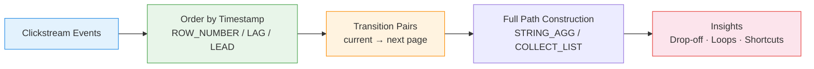

# :material-map-marker-path: Path Analysis

Track **user navigation sequences** through pages or steps — identify common paths,
drop-off points, and conversion shortcuts using window functions and string aggregation.

______________________________________________________________________

## :material-sitemap: Analysis Flow



______________________________________________________________________

## :material-code-tags: Syntax

### Sample data

```sql
CREATE OR REPLACE TEMP VIEW page_events AS
SELECT * FROM VALUES
  (1, 'alice', 'Home',     TIMESTAMP '2024-03-01 10:00:00'),
  (2, 'alice', 'Search',   TIMESTAMP '2024-03-01 10:02:00'),
  (3, 'alice', 'Product',  TIMESTAMP '2024-03-01 10:05:00'),
  (4, 'alice', 'Cart',     TIMESTAMP '2024-03-01 10:08:00'),
  (5, 'alice', 'Checkout', TIMESTAMP '2024-03-01 10:12:00'),
  (6, 'bob',   'Home',     TIMESTAMP '2024-03-01 11:00:00'),
  (7, 'bob',   'Search',   TIMESTAMP '2024-03-01 11:01:00'),
  (8, 'bob',   'Product',  TIMESTAMP '2024-03-01 11:04:00'),
  (9, 'bob',   'Home',     TIMESTAMP '2024-03-01 11:06:00'),
  (10,'bob',   'Search',   TIMESTAMP '2024-03-01 11:08:00'),
  (11,'bob',   'Product',  TIMESTAMP '2024-03-01 11:10:00'),
  (12,'bob',   'Cart',     TIMESTAMP '2024-03-01 11:13:00'),
  (13,'carol', 'Home',     TIMESTAMP '2024-03-01 12:00:00'),
  (14,'carol', 'Product',  TIMESTAMP '2024-03-01 12:03:00'),
  (15,'carol', 'Checkout', TIMESTAMP '2024-03-01 12:07:00'),
  (16,'dave',  'Home',     TIMESTAMP '2024-03-01 13:00:00'),
  (17,'dave',  'Search',   TIMESTAMP '2024-03-01 13:02:00'),
  (18,'dave',  'Home',     TIMESTAMP '2024-03-01 13:05:00')
AS t(event_id, user_id, page, event_time);
```

______________________________________________________________________

### Page transitions with LEAD

Identify what page each user visits next.

```sql
SELECT
    user_id,
    page                                           AS current_page,
    LEAD(page) OVER (
        PARTITION BY user_id ORDER BY event_time
    )                                              AS next_page,
    LEAD(event_time) OVER (
        PARTITION BY user_id ORDER BY event_time
    )                                              AS next_time,
    ROUND(
        (UNIX_TIMESTAMP(LEAD(event_time) OVER (
            PARTITION BY user_id ORDER BY event_time
        )) - UNIX_TIMESTAMP(event_time)) / 60.0, 1
    )                                              AS minutes_to_next
FROM page_events
ORDER BY user_id, event_time;
```

______________________________________________________________________

### Transition frequency matrix

Count how often each page-to-page transition occurs across all users.

```sql
WITH transitions AS (
    SELECT
        page                                       AS from_page,
        LEAD(page) OVER (
            PARTITION BY user_id ORDER BY event_time
        )                                          AS to_page
    FROM page_events
)
SELECT
    from_page,
    to_page,
    COUNT(*)                                       AS transition_count,
    ROUND(
        COUNT(*) * 100.0
        / SUM(COUNT(*)) OVER (PARTITION BY from_page),
        1
    )                                              AS pct_of_exits
FROM transitions
WHERE to_page IS NOT NULL
GROUP BY from_page, to_page
ORDER BY from_page, transition_count DESC;
-- Result:
-- +-----------+---------+----------------+-------------+
-- |from_page  |to_page  |transition_count|pct_of_exits |
-- +-----------+---------+----------------+-------------+
-- |Home       |Search   |4               |66.7         |
-- |Home       |Product  |1               |16.7         |
-- |Home       |Home     |1               |16.7         |
-- |Search     |Product  |4               |100.0        |
-- |Product    |Cart     |3               |60.0         |
-- |Product    |Home     |1               |20.0         |
-- |Product    |Checkout |1               |20.0         |
-- |Cart       |Checkout |2               |100.0        |
-- +-----------+---------+----------------+-------------+
```

______________________________________________________________________

### Full path construction per user

Build the complete navigation path as a string.

```sql
WITH ordered AS (
    SELECT
        user_id,
        page,
        ROW_NUMBER() OVER (
            PARTITION BY user_id ORDER BY event_time
        ) AS step_num
    FROM page_events
)
SELECT
    user_id,
    COUNT(*)                                       AS path_length,
    ARRAY_JOIN(
        COLLECT_LIST(page) OVER (
            PARTITION BY user_id
            ORDER BY step_num
            ROWS BETWEEN UNBOUNDED PRECEDING AND UNBOUNDED FOLLOWING
        ),
        ' → '
    )                                              AS full_path
FROM ordered
WHERE step_num = 1
ORDER BY user_id;
-- Result:
-- +---------+------------+---------------------------------------------+
-- |user_id  |path_length |full_path                                    |
-- +---------+------------+---------------------------------------------+
-- |alice    |5           |Home → Search → Product → Cart → Checkout    |
-- |bob      |7           |Home → Search → Product → Home → Search → ...|
-- |carol    |3           |Home → Product → Checkout                    |
-- |dave     |3           |Home → Search → Home                         |
-- +---------+------------+---------------------------------------------+
```

!!! note "Alternative: GROUP BY approach"

    ```sql
    SELECT
        user_id,
        ARRAY_JOIN(COLLECT_LIST(page), ' → ') AS full_path
    FROM (
        SELECT * FROM page_events
        ORDER BY user_id, event_time
    )
    GROUP BY user_id;
    ```

______________________________________________________________________

### Drop-off analysis with LAG

Find where users exit without reaching a conversion goal.

```sql
WITH user_paths AS (
    SELECT
        user_id,
        page,
        ROW_NUMBER() OVER (
            PARTITION BY user_id ORDER BY event_time
        )                                          AS step_num,
        ROW_NUMBER() OVER (
            PARTITION BY user_id ORDER BY event_time DESC
        )                                          AS reverse_rank
    FROM page_events
),
exits AS (
    SELECT user_id, page AS exit_page
    FROM user_paths
    WHERE reverse_rank = 1
)
SELECT
    exit_page,
    COUNT(*)                                       AS exit_count,
    COUNT(CASE WHEN exit_page != 'Checkout' THEN 1 END)
                                                   AS unconverted_exits,
    ROUND(
        COUNT(*) * 100.0
        / (SELECT COUNT(DISTINCT user_id) FROM page_events),
        1
    )                                              AS exit_pct
FROM exits
GROUP BY exit_page
ORDER BY exit_count DESC;
```

______________________________________________________________________

### Loop detection

Identify users who revisit a page (potential confusion or friction).

```sql
WITH sequenced AS (
    SELECT
        user_id,
        page,
        LAG(page) OVER (
            PARTITION BY user_id ORDER BY event_time
        )                                          AS prev_page,
        event_time
    FROM page_events
)
SELECT
    user_id,
    prev_page                                      AS from_page,
    page                                           AS back_to,
    event_time
FROM sequenced
WHERE page = prev_page
   OR page IN (
       SELECT page FROM page_events pe2
       WHERE pe2.user_id = sequenced.user_id
         AND pe2.event_time < sequenced.event_time
   )
ORDER BY user_id, event_time;
```

______________________________________________________________________

## :material-information-outline: Key Concepts

| Technique                     | Function                  | Purpose                    |
| ----------------------------- | ------------------------- | -------------------------- |
| `LEAD()`                      | Next page in sequence     | Forward transitions        |
| `LAG()`                       | Previous page in sequence | Back-navigation / loops    |
| `COLLECT_LIST` + `ARRAY_JOIN` | Aggregate path as string  | Full journey visualisation |
| `ROW_NUMBER()`                | Step ordering             | Position within session    |
| Transition matrix             | `COUNT` + `SUM OVER`      | Page-to-page probability   |

!!! tip "Session boundaries"

    In real clickstream data, add a session timeout (e.g., 30 min gap) to split
    long-running sessions. Use the gaps-and-islands pattern to detect session breaks.

______________________________________________________________________

## :material-lightbulb-outline: When to Use

| Scenario                | Action                                             |
| ----------------------- | -------------------------------------------------- |
| Conversion optimisation | Find shortest paths to checkout; remove friction   |
| UX analysis             | Detect back-button loops indicating confusion      |
| A/B testing             | Compare navigation paths between experiment groups |
| Content recommendations | Suggest next page based on common transitions      |
| Funnel debugging        | Identify where users deviate from expected flow    |

______________________________________________________________________

## :material-speedometer: Performance Notes

| Tip                                          | Reason                                                |
| -------------------------------------------- | ----------------------------------------------------- |
| Partition by `user_id` + `session_id`        | Prevents cross-session contamination                  |
| Filter to relevant page types                | Excludes API calls, static assets                     |
| Use `COLLECT_LIST` with `ORDER BY` in window | Guarantees correct path ordering                      |
| Limit path length for aggregation            | Unbounded `COLLECT_LIST` can OOM on long sessions     |
| Pre-filter by date range                     | Clickstream tables grow fast; always bound temporally |

______________________________________________________________________

## :material-database-search: [Databricks] Real-World Example — System Tables

!!! note "[Databricks] Unity Catalog system tables"

    `system.access.audit` is a built-in Unity Catalog table (no synthetic sample
    data setup needed) that records real workspace activity. An account admin must
    `GRANT USE CATALOG, USE SCHEMA, SELECT ON SCHEMA system.access TO <principal>`
    before these queries will return rows.

### Most common 2-step service/action transitions

```sql
-- [Databricks] Requires SELECT on system.access.audit
WITH sequenced AS (
    SELECT
        event_date,
        workspace_id,
        user_identity.email AS user_email,
        CONCAT(service_name, '/', action_name) AS current_step,
        LEAD(CONCAT(service_name, '/', action_name)) OVER (
            PARTITION BY event_date, user_identity.email
            ORDER BY event_time
        ) AS next_step
    FROM system.access.audit
    WHERE event_date >= DATE_SUB(CURRENT_DATE(), 7)
      AND user_identity.email IS NOT NULL
)
SELECT
    current_step,
    next_step,
    COUNT(*) AS path_count,
    ROUND(
        COUNT(*) * 100.0
        / SUM(COUNT(*)) OVER (PARTITION BY current_step),
        1
    ) AS pct_of_exits
FROM sequenced
WHERE next_step IS NOT NULL
GROUP BY current_step, next_step
ORDER BY path_count DESC, current_step, next_step
LIMIT 10;
-- Result (illustrative):
-- current_step               | next_step                  | path_count | pct_of_exits
-- ---------------------------|----------------------------|------------|-------------
-- clusters/createCluster     | clusters/startCluster      | 415        | 78.2
-- clusters/startCluster      | notebook/runCommand        | 392        | 74.8
-- notebook/runCommand        | clusters/terminateCluster  | 281        | 61.4
```

### Most common 3-step paths per user-day

```sql
-- [Databricks] Requires SELECT on system.access.audit
WITH sequenced AS (
    SELECT
        event_date,
        user_identity.email AS user_email,
        CONCAT(service_name, '/', action_name) AS step_1,
        LEAD(CONCAT(service_name, '/', action_name), 1) OVER (
            PARTITION BY event_date, user_identity.email
            ORDER BY event_time
        ) AS step_2,
        LEAD(CONCAT(service_name, '/', action_name), 2) OVER (
            PARTITION BY event_date, user_identity.email
            ORDER BY event_time
        ) AS step_3
    FROM system.access.audit
    WHERE event_date >= DATE_SUB(CURRENT_DATE(), 7)
      AND user_identity.email IS NOT NULL
)
SELECT
    CONCAT(step_1, ' → ', step_2, ' → ', step_3) AS path_3,
    COUNT(*) AS users_following_path
FROM sequenced
WHERE step_2 IS NOT NULL
  AND step_3 IS NOT NULL
GROUP BY path_3
ORDER BY users_following_path DESC, path_3
LIMIT 10;
-- Result (illustrative):
-- path_3                                                            | users_following_path
-- ------------------------------------------------------------------|---------------------
-- clusters/createCluster → clusters/startCluster → notebook/runCommand | 244
-- clusters/startCluster → notebook/runCommand → clusters/terminateCluster | 201
-- workspace/listNotebookFiles → notebook/runCommand → notebook/runCommand | 97
```

!!! tip "Same path logic, production audit trails"

    The `LEAD()`-based sequence construction is identical to the page-flow
    examples above — only the ordered events come from `system.access.audit`
    instead of a synthetic clickstream table. The same technique scales to real
    production path analysis for service and action sequences.

______________________________________________________________________

## :material-arrow-right: Related

- [Funnel Analysis](funnel-analysis.md) — step-by-step conversion rates
- [Gaps & Islands](../sequence/gaps-islands.md) — session boundary detection
- [Period Comparison](../sequence/period-comparison.md) — LAG/LEAD for time comparisons
- [Retention Analysis](retention.md) — do users come back after their journey
