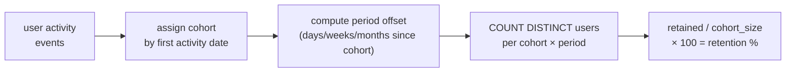

# :material-account-reactivate: Retention Analysis

Measure how many users return after their first interaction — cohort-based retention tables, N-day retention curves, and churn detection — the core metric for product-market fit and customer lifecycle management.

---

## :material-sitemap: Execution Flow



---

## :material-pin: Syntax

### Classic cohort retention

```sql
WITH cohorts AS (
    SELECT user_id, MIN(activity_date) AS cohort_date
    FROM activity
    GROUP BY user_id
),
periods AS (
    SELECT
        c.user_id,
        c.cohort_date,
        a.activity_date,
        DATEDIFF(a.activity_date, c.cohort_date) AS days_since_signup
    FROM cohorts c
    JOIN activity a ON c.user_id = a.user_id
)
SELECT
    cohort_date,
    COUNT(DISTINCT CASE WHEN days_since_signup = 0 THEN user_id END) AS d0,
    COUNT(DISTINCT CASE WHEN days_since_signup = 1 THEN user_id END) AS d1,
    COUNT(DISTINCT CASE WHEN days_since_signup = 7 THEN user_id END) AS d7,
    COUNT(DISTINCT CASE WHEN days_since_signup = 30 THEN user_id END) AS d30
FROM periods
GROUP BY cohort_date
ORDER BY cohort_date;
```

| Term | Definition |
|------|------------|
| **Cohort** | Group of users who share a common start date (signup, first purchase, etc.) |
| **Period offset** | Time elapsed since the cohort date (day 0, day 1, week 1, month 1, etc.) |
| **Retention rate** | Percentage of the cohort that was active in a given period |
| **Churn** | 1 - retention rate; the fraction of users who did not return |

---

## :material-magnify: Behavior

1. **Day 0 = 100%** — by definition, every user in a cohort is active on their cohort date, so day-0 retention is always 100%.
2. **Distinct counting** — a user active multiple times on the same day counts only once per period.
3. **Cohort granularity** — daily cohorts give the finest detail but produce many rows; weekly or monthly cohorts are more practical for reporting.
4. **Unbounded retention** — "day 7" means exactly day 7, not "within the first 7 days." For cumulative retention (active any time within the first 7 days), use `days_since_signup <= 7`.

---

## :material-database: Sample Data

### Dataset 1: Daily user activity (app engagement)

```sql
CREATE OR REPLACE TEMP VIEW user_activity AS
SELECT * FROM VALUES
    ('u01', DATE '2024-06-01', 'login'),
    ('u01', DATE '2024-06-01', 'view_feed'),
    ('u01', DATE '2024-06-02', 'login'),
    ('u01', DATE '2024-06-03', 'login'),
    ('u01', DATE '2024-06-05', 'login'),
    ('u01', DATE '2024-06-08', 'login'),
    ('u01', DATE '2024-06-15', 'login'),
    ('u02', DATE '2024-06-01', 'login'),
    ('u02', DATE '2024-06-02', 'login'),
    ('u02', DATE '2024-06-04', 'login'),
    ('u02', DATE '2024-06-08', 'login'),
    ('u03', DATE '2024-06-01', 'login'),
    ('u03', DATE '2024-06-02', 'login'),
    ('u03', DATE '2024-06-03', 'login'),
    ('u04', DATE '2024-06-01', 'login'),
    ('u04', DATE '2024-06-03', 'login'),
    ('u05', DATE '2024-06-02', 'login'),
    ('u05', DATE '2024-06-03', 'login'),
    ('u05', DATE '2024-06-04', 'login'),
    ('u05', DATE '2024-06-05', 'login'),
    ('u05', DATE '2024-06-09', 'login'),
    ('u05', DATE '2024-06-16', 'login'),
    ('u06', DATE '2024-06-02', 'login'),
    ('u06', DATE '2024-06-03', 'login'),
    ('u06', DATE '2024-06-09', 'login'),
    ('u07', DATE '2024-06-02', 'login'),
    ('u07', DATE '2024-06-04', 'login'),
    ('u08', DATE '2024-06-03', 'login'),
    ('u08', DATE '2024-06-04', 'login'),
    ('u08', DATE '2024-06-05', 'login'),
    ('u08', DATE '2024-06-10', 'login'),
    ('u08', DATE '2024-06-17', 'login'),
    ('u09', DATE '2024-06-03', 'login'),
    ('u09', DATE '2024-06-05', 'login'),
    ('u10', DATE '2024-06-03', 'login')
AS t(user_id, activity_date, event);
```

### Dataset 2: Monthly subscription activity

```sql
CREATE OR REPLACE TEMP VIEW subscription_activity AS
SELECT * FROM VALUES
    ('cust_A', DATE '2024-01-15', 49.99),
    ('cust_A', DATE '2024-02-15', 49.99),
    ('cust_A', DATE '2024-03-15', 49.99),
    ('cust_A', DATE '2024-04-15', 49.99),
    ('cust_A', DATE '2024-05-15', 49.99),
    ('cust_A', DATE '2024-06-15', 49.99),
    ('cust_B', DATE '2024-01-20', 49.99),
    ('cust_B', DATE '2024-02-20', 49.99),
    ('cust_B', DATE '2024-03-20', 49.99),
    ('cust_C', DATE '2024-02-01', 29.99),
    ('cust_C', DATE '2024-03-01', 29.99),
    ('cust_C', DATE '2024-04-01', 29.99),
    ('cust_C', DATE '2024-05-01', 29.99),
    ('cust_D', DATE '2024-02-10', 29.99),
    ('cust_D', DATE '2024-03-10', 29.99),
    ('cust_E', DATE '2024-03-05', 49.99),
    ('cust_E', DATE '2024-04-05', 49.99),
    ('cust_E', DATE '2024-05-05', 49.99),
    ('cust_E', DATE '2024-06-05', 49.99),
    ('cust_F', DATE '2024-03-15', 29.99),
    ('cust_G', DATE '2024-04-01', 49.99),
    ('cust_G', DATE '2024-05-01', 49.99),
    ('cust_G', DATE '2024-06-01', 49.99),
    ('cust_H', DATE '2024-04-20', 29.99),
    ('cust_H', DATE '2024-05-20', 29.99)
AS t(customer_id, payment_date, amount);
```

### Dataset 3: Weekly product usage

```sql
CREATE OR REPLACE TEMP VIEW product_usage AS
SELECT * FROM VALUES
    ('org_1', 'Pro',   DATE '2024-07-01', 142),
    ('org_1', 'Pro',   DATE '2024-07-08', 158),
    ('org_1', 'Pro',   DATE '2024-07-15', 135),
    ('org_1', 'Pro',   DATE '2024-07-22', 161),
    ('org_1', 'Pro',   DATE '2024-07-29', 149),
    ('org_2', 'Pro',   DATE '2024-07-01', 88),
    ('org_2', 'Pro',   DATE '2024-07-08', 72),
    ('org_2', 'Pro',   DATE '2024-07-15', 45),
    ('org_3', 'Basic', DATE '2024-07-01', 210),
    ('org_3', 'Basic', DATE '2024-07-08', 195),
    ('org_3', 'Basic', DATE '2024-07-15', 220),
    ('org_3', 'Basic', DATE '2024-07-22', 188),
    ('org_4', 'Basic', DATE '2024-07-08', 65),
    ('org_4', 'Basic', DATE '2024-07-15', 50),
    ('org_4', 'Basic', DATE '2024-07-22', 42),
    ('org_4', 'Basic', DATE '2024-07-29', 38),
    ('org_5', 'Pro',   DATE '2024-07-08', 120),
    ('org_5', 'Pro',   DATE '2024-07-15', 115),
    ('org_5', 'Pro',   DATE '2024-07-22', 130),
    ('org_5', 'Pro',   DATE '2024-07-29', 108)
AS t(org_id, plan, week_start, api_calls);
```

---

## :material-flask-outline: Practical Examples

### 1 — Classic daily cohort retention table

```sql
WITH cohorts AS (
    SELECT user_id, MIN(activity_date) AS cohort_date
    FROM user_activity
    GROUP BY user_id
),
periods AS (
    SELECT
        c.cohort_date,
        c.user_id,
        DATEDIFF(a.activity_date, c.cohort_date) AS day_offset
    FROM cohorts c
    JOIN user_activity a ON c.user_id = a.user_id
)
SELECT
    cohort_date,
    COUNT(DISTINCT user_id) AS cohort_size,
    COUNT(DISTINCT CASE WHEN day_offset = 1 THEN user_id END) AS d1,
    COUNT(DISTINCT CASE WHEN day_offset = 2 THEN user_id END) AS d2,
    COUNT(DISTINCT CASE WHEN day_offset = 3 THEN user_id END) AS d3,
    COUNT(DISTINCT CASE WHEN day_offset = 7 THEN user_id END) AS d7,
    COUNT(DISTINCT CASE WHEN day_offset = 14 THEN user_id END) AS d14
FROM periods
GROUP BY cohort_date
ORDER BY cohort_date;
```

??? success "Expected output"

    | cohort_date | cohort_size | d1 | d2 | d3 | d7 | d14 |
    |-------------|-------------|----|----|----|----|-----|
    | 2024-06-01 | 4 | 3 | 2 | 1 | 2 | 1 |
    | 2024-06-02 | 3 | 2 | 1 | 1 | 2 | 1 |
    | 2024-06-03 | 3 | 2 | 2 | 0 | 1 | 1 |

### 2 — Retention rates as percentages

```sql
WITH cohorts AS (
    SELECT user_id, MIN(activity_date) AS cohort_date
    FROM user_activity
    GROUP BY user_id
),
periods AS (
    SELECT c.cohort_date, c.user_id,
        DATEDIFF(a.activity_date, c.cohort_date) AS day_offset
    FROM cohorts c
    JOIN user_activity a ON c.user_id = a.user_id
),
counts AS (
    SELECT
        cohort_date,
        COUNT(DISTINCT user_id) AS cohort_size,
        COUNT(DISTINCT CASE WHEN day_offset = 1 THEN user_id END) AS d1,
        COUNT(DISTINCT CASE WHEN day_offset = 2 THEN user_id END) AS d2,
        COUNT(DISTINCT CASE WHEN day_offset = 3 THEN user_id END) AS d3,
        COUNT(DISTINCT CASE WHEN day_offset = 7 THEN user_id END) AS d7,
        COUNT(DISTINCT CASE WHEN day_offset = 14 THEN user_id END) AS d14
    FROM periods
    GROUP BY cohort_date
)
SELECT
    cohort_date,
    cohort_size,
    ROUND(d1 * 100.0 / cohort_size, 1) AS d1_pct,
    ROUND(d2 * 100.0 / cohort_size, 1) AS d2_pct,
    ROUND(d3 * 100.0 / cohort_size, 1) AS d3_pct,
    ROUND(d7 * 100.0 / cohort_size, 1) AS d7_pct,
    ROUND(d14 * 100.0 / cohort_size, 1) AS d14_pct
FROM counts
ORDER BY cohort_date;
```

??? success "Expected output"

    | cohort_date | cohort_size | d1_pct | d2_pct | d3_pct | d7_pct | d14_pct |
    |-------------|-------------|--------|--------|--------|--------|---------|
    | 2024-06-01 | 4 | 75.0 | 50.0 | 25.0 | 50.0 | 25.0 |
    | 2024-06-02 | 3 | 66.7 | 33.3 | 33.3 | 66.7 | 33.3 |
    | 2024-06-03 | 3 | 66.7 | 66.7 | 0.0 | 33.3 | 33.3 |

### 3 — Weekly cohort retention (unpivoted for BI tools)

One row per cohort-week combination — easy to chart:

```sql
WITH cohorts AS (
    SELECT user_id, DATE_TRUNC('week', MIN(activity_date)) AS cohort_week
    FROM user_activity
    GROUP BY user_id
),
activity_weeks AS (
    SELECT DISTINCT
        c.user_id,
        c.cohort_week,
        DATE_TRUNC('week', a.activity_date) AS activity_week
    FROM cohorts c
    JOIN user_activity a ON c.user_id = a.user_id
),
periods AS (
    SELECT
        cohort_week,
        user_id,
        CAST(DATEDIFF(activity_week, cohort_week) / 7 AS INT) AS week_offset
    FROM activity_weeks
)
SELECT
    cohort_week,
    week_offset,
    COUNT(DISTINCT user_id) AS active_users,
    FIRST(cohort_size) AS cohort_size,
    ROUND(COUNT(DISTINCT user_id) * 100.0 / FIRST(cohort_size), 1) AS retention_pct
FROM periods
JOIN (
    SELECT cohort_week, COUNT(DISTINCT user_id) AS cohort_size
    FROM periods WHERE week_offset = 0
    GROUP BY cohort_week
) sizes USING (cohort_week)
GROUP BY cohort_week, week_offset, cohort_size
ORDER BY cohort_week, week_offset;
```

??? success "Expected output"

    | cohort_week | week_offset | active_users | cohort_size | retention_pct |
    |-------------|-------------|--------------|-------------|---------------|
    | 2024-06-01 | 0 | 10 | 10 | 100.0 |
    | 2024-06-01 | 1 | 8 | 10 | 80.0 |
    | 2024-06-01 | 2 | 4 | 10 | 40.0 |

### 4 — Monthly subscription retention

```sql
WITH cohorts AS (
    SELECT
        customer_id,
        DATE_TRUNC('month', MIN(payment_date)) AS cohort_month
    FROM subscription_activity
    GROUP BY customer_id
),
periods AS (
    SELECT
        c.customer_id,
        c.cohort_month,
        DATE_TRUNC('month', s.payment_date) AS payment_month,
        MONTHS_BETWEEN(DATE_TRUNC('month', s.payment_date), c.cohort_month) AS month_offset
    FROM cohorts c
    JOIN subscription_activity s ON c.customer_id = s.customer_id
),
cohort_sizes AS (
    SELECT cohort_month, COUNT(DISTINCT customer_id) AS cohort_size
    FROM cohorts
    GROUP BY cohort_month
)
SELECT
    p.cohort_month,
    cs.cohort_size,
    CAST(p.month_offset AS INT) AS month_num,
    COUNT(DISTINCT p.customer_id) AS retained,
    ROUND(COUNT(DISTINCT p.customer_id) * 100.0 / cs.cohort_size, 1) AS retention_pct
FROM periods p
JOIN cohort_sizes cs ON p.cohort_month = cs.cohort_month
GROUP BY p.cohort_month, cs.cohort_size, CAST(p.month_offset AS INT)
ORDER BY p.cohort_month, month_num;
```

??? success "Expected output"

    | cohort_month | cohort_size | month_num | retained | retention_pct |
    |--------------|-------------|-----------|----------|---------------|
    | 2024-01-01 | 2 | 0 | 2 | 100.0 |
    | 2024-01-01 | 2 | 1 | 2 | 100.0 |
    | 2024-01-01 | 2 | 2 | 2 | 100.0 |
    | 2024-01-01 | 2 | 3 | 1 | 50.0 |
    | 2024-01-01 | 2 | 4 | 1 | 50.0 |
    | 2024-01-01 | 2 | 5 | 1 | 50.0 |
    | 2024-02-01 | 2 | 0 | 2 | 100.0 |
    | 2024-02-01 | 2 | 1 | 2 | 100.0 |
    | 2024-02-01 | 2 | 2 | 1 | 50.0 |
    | 2024-02-01 | 2 | 3 | 1 | 50.0 |
    | 2024-03-01 | 2 | 0 | 2 | 100.0 |
    | 2024-03-01 | 2 | 1 | 2 | 100.0 |
    | 2024-03-01 | 2 | 2 | 1 | 50.0 |
    | 2024-03-01 | 2 | 3 | 1 | 50.0 |
    | 2024-04-01 | 2 | 0 | 2 | 100.0 |
    | 2024-04-01 | 2 | 1 | 2 | 100.0 |
    | 2024-04-01 | 2 | 2 | 1 | 50.0 |

### 5 — Revenue retention (dollar retention rate)

Track retained revenue, not just retained users:

```sql
WITH cohorts AS (
    SELECT
        customer_id,
        DATE_TRUNC('month', MIN(payment_date)) AS cohort_month,
        SUM(CASE WHEN DATE_TRUNC('month', payment_date) = DATE_TRUNC('month', MIN(payment_date))
                 THEN amount ELSE 0 END) AS initial_revenue
    FROM subscription_activity
    GROUP BY customer_id
),
monthly AS (
    SELECT
        c.cohort_month,
        CAST(MONTHS_BETWEEN(DATE_TRUNC('month', s.payment_date), c.cohort_month) AS INT) AS month_num,
        SUM(s.amount) AS period_revenue
    FROM cohorts c
    JOIN subscription_activity s ON c.customer_id = s.customer_id
    GROUP BY c.cohort_month, CAST(MONTHS_BETWEEN(DATE_TRUNC('month', s.payment_date), c.cohort_month) AS INT)
),
cohort_revenue AS (
    SELECT cohort_month, SUM(initial_revenue) AS cohort_initial_revenue
    FROM cohorts
    GROUP BY cohort_month
)
SELECT
    m.cohort_month,
    cr.cohort_initial_revenue,
    m.month_num,
    ROUND(m.period_revenue, 2) AS period_revenue,
    ROUND(m.period_revenue * 100.0 / cr.cohort_initial_revenue, 1) AS dollar_retention_pct
FROM monthly m
JOIN cohort_revenue cr ON m.cohort_month = cr.cohort_month
ORDER BY m.cohort_month, m.month_num;
```

??? success "Expected output"

    | cohort_month | cohort_initial_revenue | month_num | period_revenue | dollar_retention_pct |
    |--------------|------------------------|-----------|----------------|----------------------|
    | 2024-01-01 | 99.98 | 0 | 99.98 | 100.0 |
    | 2024-01-01 | 99.98 | 1 | 99.98 | 100.0 |
    | 2024-01-01 | 99.98 | 2 | 99.98 | 100.0 |
    | 2024-01-01 | 99.98 | 3 | 49.99 | 50.0 |
    | 2024-01-01 | 99.98 | 4 | 49.99 | 50.0 |
    | 2024-01-01 | 99.98 | 5 | 49.99 | 50.0 |
    | ... | | | | |

!!! tip "Net dollar retention > 100%"
    In SaaS, if upsells exceed churn revenue, dollar retention can exceed 100%. This metric is more valuable than user retention for measuring business health.

### 6 — N-day retention curve (d1 through d14)

Compute retention for each day from signup, useful for retention curve visualization:

```sql
WITH cohorts AS (
    SELECT user_id, MIN(activity_date) AS cohort_date
    FROM user_activity
    GROUP BY user_id
),
day_offsets AS (
    SELECT EXPLODE(SEQUENCE(0, 14)) AS day_num
),
retention AS (
    SELECT
        d.day_num,
        COUNT(DISTINCT c.user_id) AS cohort_size,
        COUNT(DISTINCT CASE
            WHEN EXISTS (
                SELECT 1 FROM user_activity a
                WHERE a.user_id = c.user_id
                AND DATEDIFF(a.activity_date, c.cohort_date) = d.day_num
            ) THEN c.user_id
        END) AS retained
    FROM cohorts c
    CROSS JOIN day_offsets d
    GROUP BY d.day_num
)
SELECT
    day_num,
    cohort_size,
    retained,
    ROUND(retained * 100.0 / cohort_size, 1) AS retention_pct
FROM retention
ORDER BY day_num;
```

??? success "Expected output"

    | day_num | cohort_size | retained | retention_pct |
    |---------|-------------|----------|---------------|
    | 0 | 10 | 10 | 100.0 |
    | 1 | 10 | 7 | 70.0 |
    | 2 | 10 | 6 | 60.0 |
    | 3 | 10 | 3 | 30.0 |
    | 4 | 10 | 3 | 30.0 |
    | 5 | 10 | 1 | 10.0 |
    | 6 | 10 | 0 | 0.0 |
    | 7 | 10 | 4 | 40.0 |
    | 8 | 10 | 0 | 0.0 |
    | ... | | | |

### 7 — Churn detection (users who stopped returning)

Identify users whose last activity was more than 7 days ago:

```sql
WITH user_last_seen AS (
    SELECT
        user_id,
        MIN(activity_date) AS first_seen,
        MAX(activity_date) AS last_seen,
        DATEDIFF(DATE '2024-06-20', MAX(activity_date)) AS days_inactive
    FROM user_activity
    GROUP BY user_id
)
SELECT
    user_id,
    first_seen,
    last_seen,
    days_inactive,
    DATEDIFF(last_seen, first_seen) AS lifetime_days,
    CASE
        WHEN days_inactive <= 3 THEN 'active'
        WHEN days_inactive <= 7 THEN 'at_risk'
        WHEN days_inactive <= 14 THEN 'dormant'
        ELSE 'churned'
    END AS status
FROM user_last_seen
ORDER BY days_inactive DESC;
```

??? success "Expected output"

    | user_id | first_seen | last_seen | days_inactive | lifetime_days | status |
    |---------|------------|-----------|---------------|---------------|--------|
    | u04 | 2024-06-01 | 2024-06-03 | 17 | 2 | churned |
    | u10 | 2024-06-03 | 2024-06-03 | 17 | 0 | churned |
    | u03 | 2024-06-01 | 2024-06-03 | 17 | 2 | churned |
    | u07 | 2024-06-02 | 2024-06-04 | 16 | 2 | churned |
    | u09 | 2024-06-03 | 2024-06-05 | 15 | 2 | churned |
    | u02 | 2024-06-01 | 2024-06-08 | 12 | 7 | dormant |
    | u06 | 2024-06-02 | 2024-06-09 | 11 | 7 | dormant |
    | u08 | 2024-06-03 | 2024-06-17 | 3 | 14 | at_risk |
    | u01 | 2024-06-01 | 2024-06-15 | 5 | 14 | at_risk |
    | u05 | 2024-06-02 | 2024-06-16 | 4 | 14 | at_risk |

### 8 — Churn summary by cohort

```sql
WITH cohorts AS (
    SELECT user_id, MIN(activity_date) AS cohort_date
    FROM user_activity
    GROUP BY user_id
),
user_status AS (
    SELECT
        c.user_id,
        c.cohort_date,
        MAX(a.activity_date) AS last_seen,
        DATEDIFF(DATE '2024-06-20', MAX(a.activity_date)) AS days_inactive,
        CASE
            WHEN DATEDIFF(DATE '2024-06-20', MAX(a.activity_date)) > 7 THEN 'churned'
            ELSE 'retained'
        END AS status
    FROM cohorts c
    JOIN user_activity a ON c.user_id = a.user_id
    GROUP BY c.user_id, c.cohort_date
)
SELECT
    cohort_date,
    COUNT(*) AS cohort_size,
    SUM(CASE WHEN status = 'retained' THEN 1 ELSE 0 END) AS retained,
    SUM(CASE WHEN status = 'churned' THEN 1 ELSE 0 END) AS churned,
    ROUND(SUM(CASE WHEN status = 'churned' THEN 1 ELSE 0 END) * 100.0 / COUNT(*), 1) AS churn_rate_pct
FROM user_status
GROUP BY cohort_date
ORDER BY cohort_date;
```

??? success "Expected output"

    | cohort_date | cohort_size | retained | churned | churn_rate_pct |
    |-------------|-------------|----------|---------|----------------|
    | 2024-06-01 | 4 | 1 | 3 | 75.0 |
    | 2024-06-02 | 3 | 1 | 2 | 66.7 |
    | 2024-06-03 | 3 | 1 | 2 | 66.7 |

### 9 — Engagement decay (average days active per period)

```sql
WITH cohorts AS (
    SELECT user_id, MIN(activity_date) AS cohort_date
    FROM user_activity
    GROUP BY user_id
),
weekly AS (
    SELECT
        c.user_id,
        c.cohort_date,
        CAST(DATEDIFF(a.activity_date, c.cohort_date) / 7 AS INT) AS week_num,
        COUNT(DISTINCT a.activity_date) AS days_active
    FROM cohorts c
    JOIN user_activity a ON c.user_id = a.user_id
    GROUP BY c.user_id, c.cohort_date, CAST(DATEDIFF(a.activity_date, c.cohort_date) / 7 AS INT)
)
SELECT
    week_num,
    COUNT(DISTINCT user_id) AS users_present,
    ROUND(AVG(days_active), 1) AS avg_days_active,
    SUM(days_active) AS total_active_days
FROM weekly
GROUP BY week_num
ORDER BY week_num;
```

??? success "Expected output"

    | week_num | users_present | avg_days_active | total_active_days |
    |----------|---------------|-----------------|-------------------|
    | 0 | 10 | 2.5 | 25 |
    | 1 | 8 | 1.4 | 11 |
    | 2 | 4 | 1.0 | 4 |

!!! note "Engagement depth"
    Week 0 users averaged 2.5 active days out of 7; by week 1 it dropped to 1.4. This metric reveals not just *if* users return, but *how much* they engage — a more nuanced view than binary retention.

### 10 — Product usage retention by plan tier

```sql
WITH cohorts AS (
    SELECT
        org_id,
        plan,
        MIN(week_start) AS cohort_week
    FROM product_usage
    GROUP BY org_id, plan
),
periods AS (
    SELECT
        c.org_id,
        c.plan,
        c.cohort_week,
        p.week_start,
        CAST(DATEDIFF(p.week_start, c.cohort_week) / 7 AS INT) AS week_offset,
        p.api_calls
    FROM cohorts c
    JOIN product_usage p
        ON c.org_id = p.org_id AND c.plan = p.plan
)
SELECT
    plan,
    week_offset,
    COUNT(DISTINCT org_id) AS active_orgs,
    ROUND(AVG(api_calls), 0) AS avg_api_calls,
    SUM(api_calls) AS total_api_calls
FROM periods
GROUP BY plan, week_offset
ORDER BY plan, week_offset;
```

??? success "Expected output"

    | plan | week_offset | active_orgs | avg_api_calls | total_api_calls |
    |------|-------------|-------------|---------------|-----------------|
    | Basic | 0 | 2 | 138 | 275 |
    | Basic | 1 | 2 | 123 | 245 |
    | Basic | 2 | 2 | 115 | 230 |
    | Basic | 3 | 2 | 94 | 187 |
    | Pro | 0 | 3 | 117 | 350 |
    | Pro | 1 | 3 | 115 | 345 |
    | Pro | 2 | 2 | 146 | 291 |
    | Pro | 3 | 2 | 129 | 257 |

!!! tip "Usage-weighted retention"
    org_2 (Pro) disappears after week 2 — their api_calls were declining (88 -> 72 -> 45). Tracking usage volume alongside retention reveals "quiet churn" where users are still technically active but disengaging.

---

## :material-shield-outline: Behavior Notes

!!! warning "Cohort date is assignment date, not calendar date"
    Each user's cohort is based on their *first* activity. A "day 7" retention check for a user who signed up June 1 means June 8. Do not confuse cohort-relative offsets with absolute calendar dates.

!!! warning "Incomplete cohorts"
    Recent cohorts will have artificially low retention at later periods simply because not enough time has passed. Filter out cohorts that are too young: `WHERE DATEDIFF(CURRENT_DATE(), cohort_date) >= 14` for a d14 retention report.

!!! tip "Retention vs stickiness"
    Retention answers "did the user come back?" Stickiness (DAU/MAU ratio) answers "how frequently does the user come back?" Both are important — a user who returns once in 30 days is "retained" but not "sticky."

!!! tip "Materialise cohort assignments"
    Computing `MIN(activity_date)` per user on every query is expensive. Materialise a `user_cohorts` Delta table during ETL and join against it for all retention analyses.

---

## :material-brain: When to Use

| Scenario | Pattern |
|----------|---------|
| Day-N retention table (d1/d7/d30) | Cohort + `DATEDIFF` + conditional `COUNT DISTINCT` |
| Retention percentage matrix | Divide retained count by cohort size |
| Weekly/monthly cohort retention | `DATE_TRUNC` cohort assignment + period offsets |
| Subscription revenue retention | Dollar retention rate per cohort month |
| Retention curve (d0 through d14) | `SEQUENCE` + `CROSS JOIN` for all day offsets |
| Churn detection | Last-seen date + inactivity threshold |
| Churn rate by cohort | Count churned/retained per cohort |
| Engagement decay tracking | Average days-active per week-offset |
| Plan-level usage retention | Retention grouped by product tier |
| BI-friendly unpivoted output | One row per cohort-period pair (not pivoted columns) |
