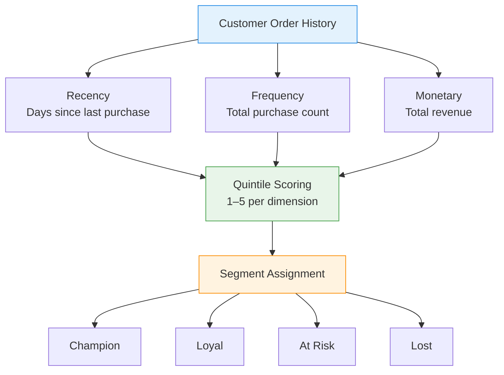

# :material-account-star: RFM Segmentation

Segment customers by **Recency**, **Frequency**, and **Monetary** value — the most
widely used framework for behavioural customer segmentation in retail and e-commerce.

______________________________________________________________________

## :material-sitemap: RFM Flow



______________________________________________________________________

## :material-code-tags: Syntax

### Base RFM metrics

```sql
CREATE OR REPLACE TEMP VIEW rfm_base AS
WITH params AS (
    SELECT DATE '2024-06-30' AS reference_date
)
SELECT
    customer_id,
    DATEDIFF(p.reference_date, MAX(order_date))    AS recency_days,
    COUNT(*)                                       AS frequency,
    ROUND(SUM(amount), 2)                          AS monetary
FROM orders
CROSS JOIN params p
GROUP BY customer_id, p.reference_date;
```

______________________________________________________________________

### Quintile scoring

Assign each customer a 1–5 score per dimension using `NTILE`.

```sql
CREATE OR REPLACE TEMP VIEW rfm_scored AS
SELECT
    customer_id,
    recency_days,
    frequency,
    monetary,
    -- Lower recency = better → order ASC so rank 5 = most recent
    NTILE(5) OVER (ORDER BY recency_days ASC)      AS r_score,
    NTILE(5) OVER (ORDER BY frequency DESC)        AS f_score,
    NTILE(5) OVER (ORDER BY monetary DESC)         AS m_score
FROM rfm_base;
```

______________________________________________________________________

### Segment assignment

Map score combinations to actionable business segments.

```sql
SELECT
    customer_id,
    recency_days,
    frequency,
    monetary,
    r_score,
    f_score,
    m_score,
    CONCAT(r_score, f_score, m_score)              AS rfm_cell,
    ROUND((r_score + f_score + m_score) / 3.0, 2)  AS composite_score,
    CASE
        WHEN r_score >= 4 AND f_score >= 4 AND m_score >= 4
            THEN 'Champion'
        WHEN r_score >= 4 AND f_score >= 3
            THEN 'Loyal'
        WHEN r_score >= 4 AND f_score <= 2
            THEN 'New Customer'
        WHEN r_score >= 3 AND m_score >= 4
            THEN 'Big Spender'
        WHEN r_score <= 2 AND f_score >= 3
            THEN 'At Risk'
        WHEN r_score <= 2 AND f_score <= 2
            THEN 'Lost'
        ELSE 'Nurture'
    END                                            AS segment
FROM rfm_scored
ORDER BY composite_score DESC;
```

______________________________________________________________________

### Segment summary report

Aggregate segment-level metrics for executive reporting.

```sql
WITH segmented AS (
    SELECT
        *,
        CASE
            WHEN r_score >= 4 AND f_score >= 4 AND m_score >= 4 THEN 'Champion'
            WHEN r_score >= 4 AND f_score >= 3                   THEN 'Loyal'
            WHEN r_score >= 4 AND f_score <= 2                   THEN 'New Customer'
            WHEN r_score >= 3 AND m_score >= 4                   THEN 'Big Spender'
            WHEN r_score <= 2 AND f_score >= 3                   THEN 'At Risk'
            WHEN r_score <= 2 AND f_score <= 2                   THEN 'Lost'
            ELSE 'Nurture'
        END AS segment
    FROM rfm_scored
)
SELECT
    segment,
    COUNT(*)                                       AS customers,
    ROUND(AVG(recency_days), 0)                    AS avg_recency,
    ROUND(AVG(frequency), 1)                       AS avg_frequency,
    ROUND(AVG(monetary), 2)                        AS avg_monetary,
    ROUND(SUM(monetary), 2)                        AS total_revenue,
    ROUND(
        SUM(monetary) * 100.0
        / SUM(SUM(monetary)) OVER (),
        1
    )                                              AS revenue_pct
FROM segmented
GROUP BY segment
ORDER BY avg_monetary DESC;
```

______________________________________________________________________

## :material-information-outline: Key Concepts

| Dimension     | Measures                 | Good Score (5) Means    |
| ------------- | ------------------------ | ----------------------- |
| **Recency**   | Days since last purchase | Purchased very recently |
| **Frequency** | Total number of orders   | Buys often              |
| **Monetary**  | Total spend (revenue)    | High lifetime spend     |

!!! tip "Why quintiles?"

    NTILE(5) divides customers into 5 equal buckets per dimension, giving
    125 possible RFM cells (5×5×5). This is granular enough for actionable
    segmentation without over-fragmenting small customer bases.

!!! note "Score direction matters"

    Recency is scored in **ascending** order (fewer days = higher score),
    while frequency and monetary are scored in **descending** order
    (more = higher score).

______________________________________________________________________

## :material-lightbulb-outline: When to Use

| Scenario                  | Action                                                              |
| ------------------------- | ------------------------------------------------------------------- |
| Email marketing campaigns | Target Champions with loyalty rewards, At-Risk with win-back offers |
| Budget allocation         | Invest retention spend proportional to segment revenue contribution |
| Product recommendations   | Personalise based on segment purchase patterns                      |
| Churn early warning       | Monitor customers migrating from Loyal → At Risk                    |
| New vs repeat strategy    | Separate acquisition (New Customer) from retention (Champion/Loyal) |

______________________________________________________________________

## :material-speedometer: Performance Notes

| Tip                                              | Reason                                                      |
| ------------------------------------------------ | ----------------------------------------------------------- |
| Pre-filter to active window (e.g., last 2 years) | Excludes truly churned customers that skew NTILE boundaries |
| Use `PERCENTILE_APPROX` for large datasets       | Faster than exact quantile for score thresholds             |
| Partition by region/business unit if needed      | Prevents global sort; enables local segmentation            |
| Materialise `rfm_scored` as a table              | Avoids recomputing NTILE for downstream dashboards          |

______________________________________________________________________

## :material-database-search: [Databricks] Real-World Example — System Tables

!!! note "[Databricks] Unity Catalog system tables"

    `system.billing.usage` is a built-in Unity Catalog system table, so no
    synthetic sample data is needed. Reframe each `workspace_id` (or
    `custom_tags['Tenant']`) as the "customer" and treat billable usage
    (`usage_quantity`) as the monetary signal. An account admin must
    `GRANT USE CATALOG, USE SCHEMA, SELECT ON SCHEMA system.billing TO <principal>` before these queries will return rows.

### 1 — Workspace RFM scores from billing activity

```sql
-- [Databricks] Requires SELECT on system.billing.usage
WITH rfm_base AS (
    SELECT
        workspace_id,
        DATEDIFF(CURRENT_DATE(), MAX(usage_date)) AS recency_days,
        COUNT(DISTINCT usage_date) AS frequency_days,
        ROUND(SUM(usage_quantity), 2) AS monetary_usage
    FROM system.billing.usage
    WHERE usage_date >= DATE_SUB(CURRENT_DATE(), 180)
    GROUP BY workspace_id
),
scored AS (
    SELECT
        workspace_id,
        recency_days,
        frequency_days,
        monetary_usage,
        NTILE(4) OVER (ORDER BY recency_days ASC) AS r_score,
        NTILE(4) OVER (ORDER BY frequency_days DESC) AS f_score,
        NTILE(4) OVER (ORDER BY monetary_usage DESC) AS m_score
    FROM rfm_base
)
SELECT
    workspace_id,
    recency_days,
    frequency_days,
    monetary_usage,
    r_score,
    f_score,
    m_score,
    CONCAT(r_score, f_score, m_score) AS rfm_cell
FROM scored
ORDER BY r_score DESC, f_score DESC, m_score DESC, workspace_id
LIMIT 10;
-- Result (illustrative):
-- workspace_id | recency_days | frequency_days | monetary_usage | r_score | f_score | m_score | rfm_cell
-- -------------|--------------|----------------|----------------|---------|---------|---------|---------
-- 123456789    | 1            | 88             | 18420.5        | 4       | 4       | 4       | 444
-- 987654321    | 3            | 76             | 12995.2        | 4       | 4       | 3       | 443
-- 555555555    | 17           | 24             | 3105.8         | 2       | 2       | 2       | 222
```

### 2 — Tenant segment summary

```sql
-- [Databricks] Requires SELECT on system.billing.usage
WITH rfm_base AS (
    SELECT
        custom_tags['Tenant'] AS tenant,
        DATEDIFF(CURRENT_DATE(), MAX(usage_date)) AS recency_days,
        COUNT(DISTINCT usage_date) AS frequency_days,
        ROUND(SUM(usage_quantity), 2) AS monetary_usage
    FROM system.billing.usage
    WHERE usage_date >= DATE_SUB(CURRENT_DATE(), 180)
      AND custom_tags['Tenant'] IS NOT NULL
    GROUP BY custom_tags['Tenant']
),
scored AS (
    SELECT
        tenant,
        recency_days,
        frequency_days,
        monetary_usage,
        NTILE(4) OVER (ORDER BY recency_days ASC) AS r_score,
        NTILE(4) OVER (ORDER BY frequency_days DESC) AS f_score,
        NTILE(4) OVER (ORDER BY monetary_usage DESC) AS m_score
    FROM rfm_base
),
segmented AS (
    SELECT
        tenant,
        monetary_usage,
        CASE
            WHEN r_score >= 3 AND f_score >= 3 AND m_score >= 3 THEN 'Power User'
            WHEN r_score >= 3 AND f_score >= 2 THEN 'Growing'
            WHEN r_score <= 2 AND f_score >= 3 THEN 'At Risk'
            ELSE 'Occasional'
        END AS segment
    FROM scored
)
SELECT
    segment,
    COUNT(*) AS tenants,
    ROUND(AVG(monetary_usage), 2) AS avg_usage,
    ROUND(SUM(monetary_usage), 2) AS total_usage
FROM segmented
GROUP BY segment
ORDER BY total_usage DESC;
-- Result (illustrative):
-- segment    | tenants | avg_usage | total_usage
-- -----------|---------|-----------|------------
-- Power User | 4       | 14522.38  | 58089.52
-- Growing    | 7       | 6210.41   | 43472.87
-- At Risk    | 3       | 5175.20   | 15525.60
-- Occasional | 5       | 1180.44   | 5902.20
```

!!! tip "Why this works on system tables"

    RFM only needs a last activity date, repeated activity count, and cumulative
    value. Billing system tables provide all three, so the same segmentation
    logic used for shoppers or subscribers generalises cleanly to workspaces and
    tenant-tag chargeback views.

______________________________________________________________________

## :material-arrow-right: Related

- [Customer Lifetime Value](clv.md) — includes RFM-based CLV scoring
- [Churn Detection](churn-detection.md) — identify At-Risk customers before they leave
- [Retention Analysis](retention.md) — cohort-based return rates
- [ABC Classification](abc-classification.md) — Pareto-based revenue segmentation
