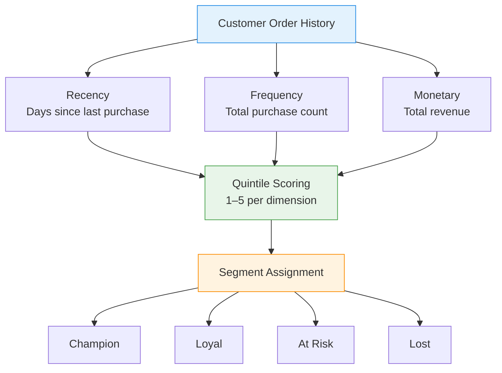

# :material-account-star: RFM Segmentation

Segment customers by **Recency**, **Frequency**, and **Monetary** value — the most
widely used framework for behavioural customer segmentation in retail and e-commerce.

---

## :material-sitemap: RFM Flow



---

## :material-code-tags: Syntax

### Base RFM metrics

```sql
CREATE OR REPLACE TEMP VIEW rfm_base AS
WITH params AS (
    SELECT DATE '2024-06-30' AS reference_date
)
SELECT
    customer_id,
    DATEDIFF(p.reference_date, MAX(order_date))    AS recency_days,
    COUNT(*)                                       AS frequency,
    ROUND(SUM(amount), 2)                          AS monetary
FROM orders
CROSS JOIN params p
GROUP BY customer_id, p.reference_date;
```

---

### Quintile scoring

Assign each customer a 1–5 score per dimension using `NTILE`.

```sql
CREATE OR REPLACE TEMP VIEW rfm_scored AS
SELECT
    customer_id,
    recency_days,
    frequency,
    monetary,
    -- Lower recency = better → order ASC so rank 5 = most recent
    NTILE(5) OVER (ORDER BY recency_days ASC)      AS r_score,
    NTILE(5) OVER (ORDER BY frequency DESC)        AS f_score,
    NTILE(5) OVER (ORDER BY monetary DESC)         AS m_score
FROM rfm_base;
```

---

### Segment assignment

Map score combinations to actionable business segments.

```sql
SELECT
    customer_id,
    recency_days,
    frequency,
    monetary,
    r_score,
    f_score,
    m_score,
    CONCAT(r_score, f_score, m_score)              AS rfm_cell,
    ROUND((r_score + f_score + m_score) / 3.0, 2)  AS composite_score,
    CASE
        WHEN r_score >= 4 AND f_score >= 4 AND m_score >= 4
            THEN 'Champion'
        WHEN r_score >= 4 AND f_score >= 3
            THEN 'Loyal'
        WHEN r_score >= 4 AND f_score <= 2
            THEN 'New Customer'
        WHEN r_score >= 3 AND m_score >= 4
            THEN 'Big Spender'
        WHEN r_score <= 2 AND f_score >= 3
            THEN 'At Risk'
        WHEN r_score <= 2 AND f_score <= 2
            THEN 'Lost'
        ELSE 'Nurture'
    END                                            AS segment
FROM rfm_scored
ORDER BY composite_score DESC;
```

---

### Segment summary report

Aggregate segment-level metrics for executive reporting.

```sql
WITH segmented AS (
    SELECT
        *,
        CASE
            WHEN r_score >= 4 AND f_score >= 4 AND m_score >= 4 THEN 'Champion'
            WHEN r_score >= 4 AND f_score >= 3                   THEN 'Loyal'
            WHEN r_score >= 4 AND f_score <= 2                   THEN 'New Customer'
            WHEN r_score >= 3 AND m_score >= 4                   THEN 'Big Spender'
            WHEN r_score <= 2 AND f_score >= 3                   THEN 'At Risk'
            WHEN r_score <= 2 AND f_score <= 2                   THEN 'Lost'
            ELSE 'Nurture'
        END AS segment
    FROM rfm_scored
)
SELECT
    segment,
    COUNT(*)                                       AS customers,
    ROUND(AVG(recency_days), 0)                    AS avg_recency,
    ROUND(AVG(frequency), 1)                       AS avg_frequency,
    ROUND(AVG(monetary), 2)                        AS avg_monetary,
    ROUND(SUM(monetary), 2)                        AS total_revenue,
    ROUND(
        SUM(monetary) * 100.0
        / SUM(SUM(monetary)) OVER (),
        1
    )                                              AS revenue_pct
FROM segmented
GROUP BY segment
ORDER BY avg_monetary DESC;
```

---

## :material-information-outline: Key Concepts

| Dimension | Measures | Good Score (5) Means |
|-----------|----------|---------------------|
| **Recency** | Days since last purchase | Purchased very recently |
| **Frequency** | Total number of orders | Buys often |
| **Monetary** | Total spend (revenue) | High lifetime spend |

!!! tip "Why quintiles?"
    NTILE(5) divides customers into 5 equal buckets per dimension, giving
    125 possible RFM cells (5×5×5). This is granular enough for actionable
    segmentation without over-fragmenting small customer bases.

!!! note "Score direction matters"
    Recency is scored in **ascending** order (fewer days = higher score),
    while frequency and monetary are scored in **descending** order
    (more = higher score).

---

## :material-lightbulb-outline: When to Use

| Scenario | Action |
|----------|--------|
| Email marketing campaigns | Target Champions with loyalty rewards, At-Risk with win-back offers |
| Budget allocation | Invest retention spend proportional to segment revenue contribution |
| Product recommendations | Personalise based on segment purchase patterns |
| Churn early warning | Monitor customers migrating from Loyal → At Risk |
| New vs repeat strategy | Separate acquisition (New Customer) from retention (Champion/Loyal) |

---

## :material-speedometer: Performance Notes

| Tip | Reason |
|-----|--------|
| Pre-filter to active window (e.g., last 2 years) | Excludes truly churned customers that skew NTILE boundaries |
| Use `PERCENTILE_APPROX` for large datasets | Faster than exact quantile for score thresholds |
| Partition by region/business unit if needed | Prevents global sort; enables local segmentation |
| Materialise `rfm_scored` as a table | Avoids recomputing NTILE for downstream dashboards |

---

## :material-arrow-right: Related

- [Customer Lifetime Value](clv.md) — includes RFM-based CLV scoring
- [Churn Detection](churn_detection.md) — identify At-Risk customers before they leave
- [Retention Analysis](retention.md) — cohort-based return rates
- [ABC Classification](abc_classification.md) — Pareto-based revenue segmentation
