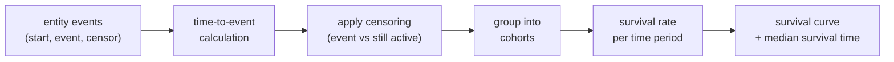

# :material-timer-sand: Survival Analysis

Measure **how long until an event occurs** — customer churn, equipment failure,
employee attrition — using time-to-event calculations, censoring logic, and
cohort-based tracking, all in pure Spark SQL.

______________________________________________________________________

## :material-sitemap: Execution Flow



______________________________________________________________________

## :material-code-tags: Syntax

### Time-to-event calculation

Compute the number of days from each entity's start date to the event
(or to the observation cutoff for censored records).

```sql
WITH params AS (
    SELECT DATE '2024-06-30' AS observation_end
),
time_to_event AS (
    SELECT
        c.customer_id,
        c.signup_date,
        c.churn_date,
        CASE
            WHEN c.churn_date IS NOT NULL
                THEN DATEDIFF(c.churn_date, c.signup_date)
            ELSE DATEDIFF(p.observation_end, c.signup_date)
        END AS days_to_event,
        CASE
            WHEN c.churn_date IS NOT NULL THEN 1
            ELSE 0
        END AS event_occurred  -- 1 = churned, 0 = censored (still active)
    FROM customers c
    CROSS JOIN params p
)
SELECT * FROM time_to_event
ORDER BY days_to_event;
```

| Column           | Meaning                                                            |
| ---------------- | ------------------------------------------------------------------ |
| `days_to_event`  | Duration from signup to churn (or observation end if still active) |
| `event_occurred` | 1 = event observed, 0 = right-censored                             |

______________________________________________________________________

### Kaplan-Meier survival curve (discrete periods)

Estimate the probability of surviving past each time period using the
Kaplan-Meier method — the most common non-parametric survival estimator.

```sql
WITH params AS (
    SELECT DATE '2024-06-30' AS observation_end
),
time_to_event AS (
    SELECT
        customer_id,
        signup_date,
        churn_date,
        CASE
            WHEN churn_date IS NOT NULL
                THEN DATEDIFF(churn_date, signup_date)
            ELSE DATEDIFF(observation_end, signup_date)
        END AS days_to_event,
        CASE WHEN churn_date IS NOT NULL THEN 1 ELSE 0 END AS event_occurred
    FROM customers
    CROSS JOIN params
),
-- Bucket into monthly periods
periods AS (
    SELECT
        customer_id,
        FLOOR(days_to_event / 30) AS period,  -- 30-day buckets
        event_occurred
    FROM time_to_event
),
-- Count events and censored per period
period_stats AS (
    SELECT
        period,
        COUNT(*)                                         AS exiting,
        SUM(event_occurred)                              AS events,
        SUM(CASE WHEN event_occurred = 0 THEN 1 ELSE 0 END) AS censored
    FROM periods
    GROUP BY period
),
-- At-risk population decreases each period
at_risk AS (
    SELECT
        period,
        events,
        censored,
        exiting,
        SUM(exiting) OVER (ORDER BY period
                           ROWS BETWEEN UNBOUNDED PRECEDING AND 1 PRECEDING)
            AS cumulative_exits_before
    FROM period_stats
),
survival AS (
    SELECT
        period,
        events,
        censored,
        (SELECT COUNT(*) FROM periods) - COALESCE(cumulative_exits_before, 0) AS n_at_risk,
        ROUND(
            1.0 - (events * 1.0 /
                   ((SELECT COUNT(*) FROM periods) - COALESCE(cumulative_exits_before, 0))),
            4
        ) AS period_survival_rate
    FROM at_risk
)
SELECT
    period,
    n_at_risk,
    events,
    censored,
    period_survival_rate,
    ROUND(
        EXP(SUM(LN(period_survival_rate)) OVER (ORDER BY period
                ROWS BETWEEN UNBOUNDED PRECEDING AND CURRENT ROW)),
        4
    ) AS cumulative_survival
FROM survival
ORDER BY period;
```

| Step | SQL element               | Why it matters                                                                                  |
| ---- | ------------------------- | ----------------------------------------------------------------------------------------------- |
| 1    | `DATEDIFF` + `CASE`       | Computes time-to-event, handling right-censored records that haven't experienced the event yet. |
| 2    | `FLOOR(days / 30)`        | Discretises continuous time into monthly periods for the survival table.                        |
| 3    | `SUM(exiting) OVER (...)` | Tracks the cumulative number of exits to compute the at-risk population at each period.         |
| 4    | `1 - events / n_at_risk`  | Kaplan-Meier period survival probability — accounts for censoring.                              |
| 5    | `EXP(SUM(LN(...)))`       | Cumulative product of period survival rates = overall survival curve.                           |

______________________________________________________________________

### Cohort-based survival

Track survival rates by signup cohort to compare different time periods or
A/B test groups.

```sql
WITH params AS (
    SELECT DATE '2024-06-30' AS observation_end
),
cohorts AS (
    SELECT
        customer_id,
        DATE_TRUNC('month', signup_date) AS cohort_month,
        CASE
            WHEN churn_date IS NOT NULL
                THEN FLOOR(DATEDIFF(churn_date, signup_date) / 30)
            ELSE FLOOR(DATEDIFF(observation_end, signup_date) / 30)
        END AS period,
        CASE WHEN churn_date IS NOT NULL THEN 1 ELSE 0 END AS event_occurred
    FROM customers
    CROSS JOIN params
),
cohort_sizes AS (
    SELECT cohort_month, COUNT(*) AS cohort_size
    FROM cohorts
    GROUP BY cohort_month
),
survived AS (
    SELECT
        c.cohort_month,
        p.period_num,
        COUNT(CASE WHEN c.period >= p.period_num THEN 1 END) AS still_active
    FROM cohorts c
    CROSS JOIN (
        SELECT EXPLODE(SEQUENCE(0, 11)) AS period_num
    ) p
    GROUP BY c.cohort_month, p.period_num
)
SELECT
    s.cohort_month,
    cs.cohort_size,
    s.period_num,
    s.still_active,
    ROUND(s.still_active * 100.0 / cs.cohort_size, 1) AS survival_pct
FROM survived s
JOIN cohort_sizes cs ON s.cohort_month = cs.cohort_month
ORDER BY s.cohort_month, s.period_num;
```

______________________________________________________________________

### Median survival time

Find the period at which cumulative survival drops below 50%.

```sql
WITH survival_curve AS (
    -- (use the Kaplan-Meier query above as a CTE)
    SELECT period, cumulative_survival
    FROM kaplan_meier_result
)
SELECT
    MIN(period) AS median_survival_period
FROM survival_curve
WHERE cumulative_survival <= 0.5;
```

!!! tip "Interpreting median survival"

    The median survival time is the point at which half the population has
    experienced the event. If the survival curve never drops below 50%,
    the median is undefined (more than half the population is censored).

______________________________________________________________________

## :material-information-outline: Key Concepts

### Right-censoring

A record is **right-censored** when the event has not yet occurred at the
time of observation. The entity is still "at risk" but we don't know when
(or if) the event will happen.

```sql
-- Censored: customer is still active at observation end
CASE
    WHEN churn_date IS NULL THEN 0     -- censored
    ELSE 1                              -- event observed
END AS event_occurred
```

!!! warning "Ignoring censored records biases results"

    Excluding censored records underestimates survival times because it only
    includes entities that have already experienced the event. Always include
    censored records in survival calculations.

### Hazard rate

The **hazard rate** is the probability of the event occurring in a given
period, conditional on having survived to that period.

```sql
-- Hazard rate per period
ROUND(events * 1.0 / n_at_risk, 4) AS hazard_rate
```

______________________________________________________________________

## :material-lightbulb-outline: When to Use

| Scenario           | Example                                                      |
| ------------------ | ------------------------------------------------------------ |
| Customer churn     | How many months until a customer cancels their subscription? |
| Equipment failure  | What is the expected lifespan of a machine component?        |
| Employee attrition | How long do employees stay before leaving, by department?    |
| Clinical trials    | Time to patient recovery or adverse event                    |
| SaaS free-to-paid  | How many days from signup to first purchase?                 |

______________________________________________________________________

## :material-speedometer: Performance Notes

| Tip                                     | Reason                                       |
| --------------------------------------- | -------------------------------------------- |
| Pre-aggregate into time buckets         | Reduces row count before window computations |
| Filter to relevant observation window   | Avoids processing ancient historical data    |
| Partition survival by cohort            | Enables parallel computation per cohort      |
| Use `ROWS` frame for cumulative product | Position-based frame is faster than `RANGE`  |

______________________________________________________________________

## :material-database-search: [Databricks] Real-World Example — System Tables

!!! note "[Databricks] Unity Catalog system tables"

    `system.billing.usage` is a built-in Unity Catalog system table, so no
    synthetic sample data is needed. Reframe each `workspace_id` (or
    `custom_tags['Tenant']`) as the "customer" and treat the span from first
    usage to last usage as the customer lifetime. An account admin must
    `GRANT USE CATALOG, USE SCHEMA, SELECT ON SCHEMA system.billing TO <principal>` before these queries will return rows.

### 1 — Workspace lifetime and survival bucket

```sql
-- [Databricks] Requires SELECT on system.billing.usage
WITH workspace_lifetimes AS (
    SELECT
        workspace_id,
        MIN(usage_date) AS first_usage_date,
        MAX(usage_date) AS last_usage_date,
        DATEDIFF(MAX(usage_date), MIN(usage_date)) AS lifetime_days,
        DATEDIFF(CURRENT_DATE(), MAX(usage_date)) AS days_since_last_usage
    FROM system.billing.usage
    GROUP BY workspace_id
)
SELECT
    workspace_id,
    first_usage_date,
    last_usage_date,
    lifetime_days,
    days_since_last_usage,
    CASE
        WHEN lifetime_days <= 30 THEN '0-30 days'
        WHEN lifetime_days <= 90 THEN '31-90 days'
        WHEN lifetime_days <= 180 THEN '91-180 days'
        ELSE '181+ days'
    END AS survival_bucket
FROM workspace_lifetimes
ORDER BY lifetime_days DESC, workspace_id
LIMIT 10;
-- Result (illustrative):
-- workspace_id | first_usage_date | last_usage_date | lifetime_days | days_since_last_usage | survival_bucket
-- -------------|------------------|-----------------|---------------|-----------------------|----------------
-- 123456789    | 2024-01-05       | 2024-09-10      | 249           | 2                     | 181+ days
-- 987654321    | 2024-03-01       | 2024-08-22      | 174           | 21                    | 91-180 days
-- 555555555    | 2024-07-15       | 2024-08-01      | 17            | 42                    | 0-30 days
```

### 2 — Tenant survival distribution

```sql
-- [Databricks] Requires SELECT on system.billing.usage
WITH tenant_lifetimes AS (
    SELECT
        custom_tags['Tenant'] AS tenant,
        MIN(usage_date) AS first_usage_date,
        MAX(usage_date) AS last_usage_date,
        DATEDIFF(MAX(usage_date), MIN(usage_date)) AS lifetime_days
    FROM system.billing.usage
    WHERE custom_tags['Tenant'] IS NOT NULL
    GROUP BY custom_tags['Tenant']
),
bucketed AS (
    SELECT
        tenant,
        lifetime_days,
        CASE
            WHEN lifetime_days <= 30 THEN '0-30 days'
            WHEN lifetime_days <= 90 THEN '31-90 days'
            WHEN lifetime_days <= 180 THEN '91-180 days'
            ELSE '181+ days'
        END AS survival_bucket
    FROM tenant_lifetimes
)
SELECT
    survival_bucket,
    COUNT(*) AS tenants,
    ROUND(AVG(lifetime_days), 1) AS avg_lifetime_days
FROM bucketed
GROUP BY survival_bucket
ORDER BY avg_lifetime_days DESC;
-- Result (illustrative):
-- survival_bucket | tenants | avg_lifetime_days
-- ----------------|---------|------------------
-- 181+ days       | 5       | 244.6
-- 91-180 days     | 8       | 133.1
-- 31-90 days      | 6       | 58.7
-- 0-30 days       | 4       | 12.5
```

!!! tip "Why this works on system tables"

    Time-to-event analysis generalises from customer churn to workspace or
    tenant activity lifespan: first usage is the start event, last usage is the
    observed end event, and the same bucketing logic scales to real billing
    histories without any synthetic setup.

______________________________________________________________________

## :material-arrow-right: Related

- [Churn Detection](churn-detection.md) — classify current churn status (active, at-risk, churned)
- [Retention Analysis](retention.md) — cohort-based retention curves
- [Gaps and Islands](../sequence/gaps-islands.md) — detect inactivity periods in event streams
- [Sessionization](../sequence/sessionization.md) — group events by time gaps
