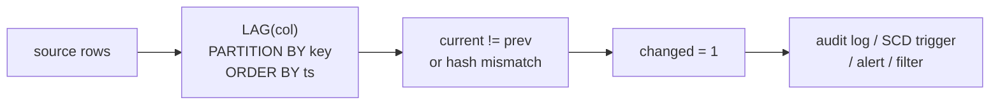

# :material-swap-horizontal: Change Detection

Detect when a column value changes between consecutive rows — the foundation for audit trails, state-transition tracking, SCD change detection, and data quality monitoring.

______________________________________________________________________

## :material-sitemap: Execution Flow



______________________________________________________________________

## :material-pin: Syntax

### Column-level change detection

```sql
SELECT
    *,
    LAG(tracked_col) OVER (
        PARTITION BY entity_key
        ORDER BY effective_date
    ) AS prev_value,
    CASE
        WHEN LAG(tracked_col) OVER (
            PARTITION BY entity_key
            ORDER BY effective_date
        ) IS NULL THEN 'NEW'
        WHEN tracked_col <=> LAG(tracked_col) OVER (
            PARTITION BY entity_key
            ORDER BY effective_date
        ) THEN 'NO_CHANGE'
        ELSE 'CHANGED'
    END AS change_status
FROM source_table;
```

### Row-hash change detection

```sql
SELECT
    *,
    md5(concat_ws('||', col1, col2, col3)) AS row_hash,
    LAG(md5(concat_ws('||', col1, col2, col3))) OVER (
        PARTITION BY entity_key
        ORDER BY effective_date
    ) AS prev_hash
FROM source_table;
```

| Technique           | Best for                         | Trade-off                                                           |
| ------------------- | -------------------------------- | ------------------------------------------------------------------- |
| Single-column `LAG` | Tracking one attribute           | Simple, readable                                                    |
| Multi-column `LAG`  | Tracking 2-3 attributes          | Multiple comparisons needed                                         |
| Row hash (`md5`)    | Tracking many attributes at once | Any column change detected, but no detail on *which* column changed |
| Null-safe `<=>`     | Columns that may contain NULLs   | Prevents false positives from `NULL != NULL`                        |

!!! note "Null-safe comparison"

    Standard `!=` treats `NULL != NULL` as `NULL` (unknown), which means a row where both old and new values are `NULL` would not be detected as "no change." Always use the `<=>` operator for null-safe equality in Spark SQL.

______________________________________________________________________

## :material-magnify: Behavior

1. **First row per entity** — `LAG` returns `NULL` for the first row in each partition; treat this as a "NEW" record rather than a change.
2. **Null-safe comparison** — use `<=>` (null-safe equals) to correctly handle `NULL` values in both current and previous rows.
3. **Row hash approach** — `md5(concat_ws('||', ...))` creates a single fingerprint for the entire row; any column change produces a different hash. Use `'||'` as separator to avoid collisions (e.g., `'AB' || 'C'` vs `'A' || 'BC'`).
4. **Performance** — `LAG` is a single-pass window function; row hashing adds a hash computation per row. Both are efficient compared to self-join alternatives.

______________________________________________________________________

## :material-database: Sample Data

### Dataset 1: Employee attribute history

```sql
CREATE OR REPLACE TEMP VIEW employee_history AS
SELECT * FROM VALUES
    (101, DATE '2023-01-01', 'Alice',   'Engineering', 'Senior',   95000),
    (101, DATE '2023-04-01', 'Alice',   'Engineering', 'Senior',   98000),
    (101, DATE '2023-07-01', 'Alice',   'Engineering', 'Staff',   115000),
    (101, DATE '2023-10-01', 'Alice',   'Platform',    'Staff',   115000),
    (101, DATE '2024-01-01', 'Alice',   'Platform',    'Staff',   120000),
    (102, DATE '2023-01-01', 'Bob',     'Sales',       'Associate', 62000),
    (102, DATE '2023-04-01', 'Bob',     'Sales',       'Associate', 62000),
    (102, DATE '2023-07-01', 'Bob',     'Sales',       'Senior',    78000),
    (102, DATE '2023-10-01', 'Bob',     'Marketing',   'Senior',    78000),
    (102, DATE '2024-01-01', 'Bob',     'Marketing',   'Senior',    82000),
    (103, DATE '2023-07-01', 'Carol',   'Engineering', 'Junior',    65000),
    (103, DATE '2023-10-01', 'Carol',   'Engineering', 'Mid',       75000),
    (103, DATE '2024-01-01', 'Carol',   'Engineering', 'Mid',       75000)
AS t(emp_id, effective_date, name, department, title, salary);
```

### Dataset 2: Product pricing snapshots

```sql
CREATE OR REPLACE TEMP VIEW price_snapshots AS
SELECT * FROM VALUES
    ('SKU-001', DATE '2024-01-01', 'Widget Pro',    49.99,  TRUE),
    ('SKU-001', DATE '2024-02-01', 'Widget Pro',    49.99,  TRUE),
    ('SKU-001', DATE '2024-03-01', 'Widget Pro',    54.99,  TRUE),
    ('SKU-001', DATE '2024-04-01', 'Widget Pro',    54.99,  FALSE),
    ('SKU-001', DATE '2024-05-01', 'Widget Pro',    44.99,  TRUE),
    ('SKU-001', DATE '2024-06-01', 'Widget Pro+',   59.99,  TRUE),
    ('SKU-002', DATE '2024-01-01', 'Gadget Basic',  29.99,  TRUE),
    ('SKU-002', DATE '2024-02-01', 'Gadget Basic',  29.99,  TRUE),
    ('SKU-002', DATE '2024-03-01', 'Gadget Basic',  32.99,  TRUE),
    ('SKU-002', DATE '2024-04-01', 'Gadget Basic',  32.99,  TRUE),
    ('SKU-002', DATE '2024-05-01', 'Gadget Basic',  32.99,  FALSE),
    ('SKU-002', DATE '2024-06-01', 'Gadget Basic',  27.99,  TRUE)
AS t(sku, snapshot_date, product_name, price, is_active);
```

### Dataset 3: Server configuration audit

```sql
CREATE OR REPLACE TEMP VIEW config_audit AS
SELECT * FROM VALUES
    ('web-01', TIMESTAMP '2024-03-01 10:00:00', '16GB',  4, 'v2.1.0', 'nginx'),
    ('web-01', TIMESTAMP '2024-03-15 14:30:00', '16GB',  4, 'v2.2.0', 'nginx'),
    ('web-01', TIMESTAMP '2024-04-01 09:00:00', '32GB',  8, 'v2.2.0', 'nginx'),
    ('web-01', TIMESTAMP '2024-04-15 11:00:00', '32GB',  8, 'v2.3.0', 'caddy'),
    ('web-01', TIMESTAMP '2024-05-01 08:00:00', '32GB',  8, 'v2.3.0', 'caddy'),
    ('db-01',  TIMESTAMP '2024-03-01 10:00:00', '64GB', 16, 'v14.2',  'postgres'),
    ('db-01',  TIMESTAMP '2024-03-15 14:30:00', '64GB', 16, 'v14.2',  'postgres'),
    ('db-01',  TIMESTAMP '2024-04-01 09:00:00', '64GB', 16, 'v15.1',  'postgres'),
    ('db-01',  TIMESTAMP '2024-04-15 11:00:00', '128GB',32, 'v15.1',  'postgres'),
    ('db-01',  TIMESTAMP '2024-05-01 08:00:00', '128GB',32, 'v15.1',  'postgres')
AS t(server, audit_time, memory, cpu_cores, app_version, web_server);
```

______________________________________________________________________

## :material-flask-outline: Practical Examples

### 1 — Single-column change detection (department transfers)

```sql
SELECT
    emp_id,
    effective_date,
    name,
    department,
    LAG(department) OVER (
        PARTITION BY emp_id ORDER BY effective_date
    ) AS prev_department,
    CASE
        WHEN LAG(department) OVER (
            PARTITION BY emp_id ORDER BY effective_date
        ) IS NULL THEN 'HIRE'
        WHEN department <=> LAG(department) OVER (
            PARTITION BY emp_id ORDER BY effective_date
        ) THEN 'NO_CHANGE'
        ELSE 'TRANSFER'
    END AS change_type
FROM employee_history
ORDER BY emp_id, effective_date;
```

??? success "Expected output"

    | emp_id | effective_date | name  | department  | prev_department | change_type |
    | ------ | -------------- | ----- | ----------- | --------------- | ----------- |
    | 101    | 2023-01-01     | Alice | Engineering | NULL            | HIRE        |
    | 101    | 2023-04-01     | Alice | Engineering | Engineering     | NO_CHANGE   |
    | 101    | 2023-07-01     | Alice | Engineering | Engineering     | NO_CHANGE   |
    | 101    | 2023-10-01     | Alice | Platform    | Engineering     | TRANSFER    |
    | 101    | 2024-01-01     | Alice | Platform    | Platform        | NO_CHANGE   |
    | 102    | 2023-01-01     | Bob   | Sales       | NULL            | HIRE        |
    | 102    | 2023-04-01     | Bob   | Sales       | Sales           | NO_CHANGE   |
    | 102    | 2023-07-01     | Bob   | Sales       | Sales           | NO_CHANGE   |
    | 102    | 2023-10-01     | Bob   | Marketing   | Sales           | TRANSFER    |
    | 102    | 2024-01-01     | Bob   | Marketing   | Marketing       | NO_CHANGE   |
    | 103    | 2023-07-01     | Carol | Engineering | NULL            | HIRE        |
    | 103    | 2023-10-01     | Carol | Engineering | Engineering     | NO_CHANGE   |
    | 103    | 2024-01-01     | Carol | Engineering | Engineering     | NO_CHANGE   |

### 2 — Multi-column change detection (any attribute changed)

Track changes across department, title, and salary simultaneously:

```sql
SELECT
    emp_id,
    effective_date,
    name,
    department,
    title,
    salary,
    CASE
        WHEN LAG(department) OVER w IS NULL THEN 'NEW'
        WHEN NOT (
            department <=> LAG(department) OVER w
            AND title <=> LAG(title) OVER w
            AND salary <=> LAG(salary) OVER w
        ) THEN 'CHANGED'
        ELSE 'NO_CHANGE'
    END AS change_status,
    CONCAT_WS(', ',
        CASE WHEN NOT (department <=> LAG(department) OVER w) THEN 'department' END,
        CASE WHEN NOT (title <=> LAG(title) OVER w) THEN 'title' END,
        CASE WHEN NOT (salary <=> LAG(salary) OVER w) THEN 'salary' END
    ) AS changed_columns
FROM employee_history
WINDOW w AS (PARTITION BY emp_id ORDER BY effective_date)
ORDER BY emp_id, effective_date;
```

??? success "Expected output"

    | emp_id | effective_date | name  | department  | title     | salary | change_status | changed_columns |
    | ------ | -------------- | ----- | ----------- | --------- | ------ | ------------- | --------------- |
    | 101    | 2023-01-01     | Alice | Engineering | Senior    | 95000  | NEW           |                 |
    | 101    | 2023-04-01     | Alice | Engineering | Senior    | 98000  | CHANGED       | salary          |
    | 101    | 2023-07-01     | Alice | Engineering | Staff     | 115000 | CHANGED       | title, salary   |
    | 101    | 2023-10-01     | Alice | Platform    | Staff     | 115000 | CHANGED       | department      |
    | 101    | 2024-01-01     | Alice | Platform    | Staff     | 120000 | CHANGED       | salary          |
    | 102    | 2023-01-01     | Bob   | Sales       | Associate | 62000  | NEW           |                 |
    | 102    | 2023-04-01     | Bob   | Sales       | Associate | 62000  | NO_CHANGE     |                 |
    | 102    | 2023-07-01     | Bob   | Sales       | Senior    | 78000  | CHANGED       | title, salary   |
    | 102    | 2023-10-01     | Bob   | Marketing   | Senior    | 78000  | CHANGED       | department      |
    | 102    | 2024-01-01     | Bob   | Marketing   | Senior    | 82000  | CHANGED       | salary          |
    | 103    | 2023-07-01     | Carol | Engineering | Junior    | 65000  | NEW           |                 |
    | 103    | 2023-10-01     | Carol | Engineering | Mid       | 75000  | CHANGED       | title, salary   |
    | 103    | 2024-01-01     | Carol | Engineering | Mid       | 75000  | NO_CHANGE     |                 |

!!! tip "Named WINDOW clause"

    `WINDOW w AS (...)` avoids repeating the same partition/order spec in every `LAG()` call. All references to `OVER w` share the same window definition.

### 3 — Row-hash change detection

Detect any change across all tracked columns using a single hash comparison:

```sql
SELECT
    emp_id,
    effective_date,
    name,
    department,
    title,
    salary,
    md5(concat_ws('||',
        CAST(department AS STRING),
        CAST(title AS STRING),
        CAST(salary AS STRING)
    )) AS row_hash,
    LAG(md5(concat_ws('||',
        CAST(department AS STRING),
        CAST(title AS STRING),
        CAST(salary AS STRING)
    ))) OVER (
        PARTITION BY emp_id ORDER BY effective_date
    ) AS prev_hash,
    CASE
        WHEN LAG(md5(concat_ws('||',
            CAST(department AS STRING),
            CAST(title AS STRING),
            CAST(salary AS STRING)
        ))) OVER (PARTITION BY emp_id ORDER BY effective_date) IS NULL THEN 'NEW'
        WHEN md5(concat_ws('||',
            CAST(department AS STRING),
            CAST(title AS STRING),
            CAST(salary AS STRING)
        )) = LAG(md5(concat_ws('||',
            CAST(department AS STRING),
            CAST(title AS STRING),
            CAST(salary AS STRING)
        ))) OVER (PARTITION BY emp_id ORDER BY effective_date) THEN 'NO_CHANGE'
        ELSE 'CHANGED'
    END AS change_status
FROM employee_history
ORDER BY emp_id, effective_date;
```

??? success "Expected output"

    | emp_id | effective_date | name  | department  | title     | salary | row_hash | prev_hash | change_status |
    | ------ | -------------- | ----- | ----------- | --------- | ------ | -------- | --------- | ------------- |
    | 101    | 2023-01-01     | Alice | Engineering | Senior    | 95000  | a1b2...  | NULL      | NEW           |
    | 101    | 2023-04-01     | Alice | Engineering | Senior    | 98000  | c3d4...  | a1b2...   | CHANGED       |
    | 101    | 2023-07-01     | Alice | Engineering | Staff     | 115000 | e5f6...  | c3d4...   | CHANGED       |
    | 101    | 2023-10-01     | Alice | Platform    | Staff     | 115000 | g7h8...  | e5f6...   | CHANGED       |
    | 101    | 2024-01-01     | Alice | Platform    | Staff     | 120000 | i9j0...  | g7h8...   | CHANGED       |
    | 102    | 2023-01-01     | Bob   | Sales       | Associate | 62000  | k1l2...  | NULL      | NEW           |
    | 102    | 2023-04-01     | Bob   | Sales       | Associate | 62000  | k1l2...  | k1l2...   | NO_CHANGE     |
    | ...    |                |       |             |           |        |          |           |               |

!!! tip "Hash vs multi-column LAG"

    The hash approach scales better when tracking 10+ columns — one comparison instead of N. The trade-off is you cannot see *which* column changed. Combine both techniques when you need efficient detection plus detailed audit.

### 4 — Filter to only changed rows (changelog extraction)

```sql
WITH hashed AS (
    SELECT
        *,
        md5(concat_ws('||',
            CAST(department AS STRING),
            CAST(title AS STRING),
            CAST(salary AS STRING)
        )) AS row_hash,
        LAG(md5(concat_ws('||',
            CAST(department AS STRING),
            CAST(title AS STRING),
            CAST(salary AS STRING)
        ))) OVER (
            PARTITION BY emp_id ORDER BY effective_date
        ) AS prev_hash
    FROM employee_history
)
SELECT
    emp_id,
    effective_date,
    name,
    department,
    title,
    salary
FROM hashed
WHERE prev_hash IS NULL
   OR row_hash != prev_hash
ORDER BY emp_id, effective_date;
```

??? success "Expected output"

    | emp_id | effective_date | name  | department  | title     | salary |
    | ------ | -------------- | ----- | ----------- | --------- | ------ |
    | 101    | 2023-01-01     | Alice | Engineering | Senior    | 95000  |
    | 101    | 2023-04-01     | Alice | Engineering | Senior    | 98000  |
    | 101    | 2023-07-01     | Alice | Engineering | Staff     | 115000 |
    | 101    | 2023-10-01     | Alice | Platform    | Staff     | 115000 |
    | 101    | 2024-01-01     | Alice | Platform    | Staff     | 120000 |
    | 102    | 2023-01-01     | Bob   | Sales       | Associate | 62000  |
    | 102    | 2023-07-01     | Bob   | Sales       | Senior    | 78000  |
    | 102    | 2023-10-01     | Bob   | Marketing   | Senior    | 78000  |
    | 102    | 2024-01-01     | Bob   | Marketing   | Senior    | 82000  |
    | 103    | 2023-07-01     | Carol | Engineering | Junior    | 65000  |
    | 103    | 2023-10-01     | Carol | Engineering | Mid       | 75000  |

!!! note "Deduplication effect"

    Bob's 2023-04-01 row (no change) and Carol's 2024-01-01 row (no change) are excluded. This produces a compact changelog with only meaningful transitions.

### 5 — Price change tracking with delta and direction

```sql
SELECT
    sku,
    snapshot_date,
    product_name,
    price,
    LAG(price) OVER (PARTITION BY sku ORDER BY snapshot_date) AS prev_price,
    ROUND(price - COALESCE(LAG(price) OVER (PARTITION BY sku ORDER BY snapshot_date), price), 2) AS price_delta,
    CASE
        WHEN LAG(price) OVER (PARTITION BY sku ORDER BY snapshot_date) IS NULL THEN 'INITIAL'
        WHEN price > LAG(price) OVER (PARTITION BY sku ORDER BY snapshot_date) THEN 'INCREASE'
        WHEN price < LAG(price) OVER (PARTITION BY sku ORDER BY snapshot_date) THEN 'DECREASE'
        ELSE 'UNCHANGED'
    END AS price_direction,
    is_active
FROM price_snapshots
ORDER BY sku, snapshot_date;
```

??? success "Expected output"

    | sku     | snapshot_date | product_name | price | prev_price | price_delta | price_direction | is_active |
    | ------- | ------------- | ------------ | ----- | ---------- | ----------- | --------------- | --------- |
    | SKU-001 | 2024-01-01    | Widget Pro   | 49.99 | NULL       | 0.00        | INITIAL         | true      |
    | SKU-001 | 2024-02-01    | Widget Pro   | 49.99 | 49.99      | 0.00        | UNCHANGED       | true      |
    | SKU-001 | 2024-03-01    | Widget Pro   | 54.99 | 49.99      | 5.00        | INCREASE        | true      |
    | SKU-001 | 2024-04-01    | Widget Pro   | 54.99 | 54.99      | 0.00        | UNCHANGED       | false     |
    | SKU-001 | 2024-05-01    | Widget Pro   | 44.99 | 54.99      | -10.00      | DECREASE        | true      |
    | SKU-001 | 2024-06-01    | Widget Pro+  | 59.99 | 44.99      | 15.00       | INCREASE        | true      |
    | SKU-002 | 2024-01-01    | Gadget Basic | 29.99 | NULL       | 0.00        | INITIAL         | true      |
    | SKU-002 | 2024-02-01    | Gadget Basic | 29.99 | 29.99      | 0.00        | UNCHANGED       | true      |
    | SKU-002 | 2024-03-01    | Gadget Basic | 32.99 | 29.99      | 3.00        | INCREASE        | true      |
    | SKU-002 | 2024-04-01    | Gadget Basic | 32.99 | 32.99      | 0.00        | UNCHANGED       | true      |
    | SKU-002 | 2024-05-01    | Gadget Basic | 32.99 | 32.99      | 0.00        | UNCHANGED       | false     |
    | SKU-002 | 2024-06-01    | Gadget Basic | 27.99 | 32.99      | -5.00       | DECREASE        | true      |

### 6 — Multi-attribute change summary per product

```sql
WITH changes AS (
    SELECT
        sku,
        snapshot_date,
        product_name,
        price,
        is_active,
        LAG(product_name) OVER w AS prev_name,
        LAG(price) OVER w AS prev_price,
        LAG(is_active) OVER w AS prev_active
    FROM price_snapshots
    WINDOW w AS (PARTITION BY sku ORDER BY snapshot_date)
)
SELECT
    sku,
    snapshot_date,
    CONCAT_WS(', ',
        CASE WHEN NOT (product_name <=> prev_name) THEN CONCAT('name: ', prev_name, ' -> ', product_name) END,
        CASE WHEN NOT (price <=> prev_price) THEN CONCAT('price: ', CAST(prev_price AS STRING), ' -> ', CAST(price AS STRING)) END,
        CASE WHEN NOT (is_active <=> prev_active) THEN CONCAT('active: ', CAST(prev_active AS STRING), ' -> ', CAST(is_active AS STRING)) END
    ) AS change_summary
FROM changes
WHERE prev_name IS NOT NULL
  AND NOT (
      product_name <=> prev_name
      AND price <=> prev_price
      AND is_active <=> prev_active
  )
ORDER BY sku, snapshot_date;
```

??? success "Expected output"

    | sku     | snapshot_date | change_summary                                         |
    | ------- | ------------- | ------------------------------------------------------ |
    | SKU-001 | 2024-03-01    | price: 49.99 -> 54.99                                  |
    | SKU-001 | 2024-04-01    | active: true -> false                                  |
    | SKU-001 | 2024-05-01    | price: 54.99 -> 44.99, active: false -> true           |
    | SKU-001 | 2024-06-01    | name: Widget Pro -> Widget Pro+, price: 44.99 -> 59.99 |
    | SKU-002 | 2024-03-01    | price: 29.99 -> 32.99                                  |
    | SKU-002 | 2024-05-01    | active: true -> false                                  |
    | SKU-002 | 2024-06-01    | price: 32.99 -> 27.99, active: false -> true           |

### 7 — Server configuration drift detection

```sql
WITH hashed AS (
    SELECT
        server,
        audit_time,
        memory,
        cpu_cores,
        app_version,
        web_server,
        md5(concat_ws('||', memory, CAST(cpu_cores AS STRING), app_version, web_server)) AS config_hash,
        LAG(md5(concat_ws('||', memory, CAST(cpu_cores AS STRING), app_version, web_server)))
            OVER (PARTITION BY server ORDER BY audit_time) AS prev_hash
    FROM config_audit
)
SELECT
    server,
    audit_time,
    memory,
    cpu_cores,
    app_version,
    web_server,
    CASE
        WHEN prev_hash IS NULL THEN 'BASELINE'
        WHEN config_hash = prev_hash THEN 'NO_DRIFT'
        ELSE 'DRIFT_DETECTED'
    END AS drift_status
FROM hashed
ORDER BY server, audit_time;
```

??? success "Expected output"

    | server | audit_time          | memory | cpu_cores | app_version | web_server | drift_status   |
    | ------ | ------------------- | ------ | --------- | ----------- | ---------- | -------------- |
    | db-01  | 2024-03-01 10:00:00 | 64GB   | 16        | v14.2       | postgres   | BASELINE       |
    | db-01  | 2024-03-15 14:30:00 | 64GB   | 16        | v14.2       | postgres   | NO_DRIFT       |
    | db-01  | 2024-04-01 09:00:00 | 64GB   | 16        | v15.1       | postgres   | DRIFT_DETECTED |
    | db-01  | 2024-04-15 11:00:00 | 128GB  | 32        | v15.1       | postgres   | DRIFT_DETECTED |
    | db-01  | 2024-05-01 08:00:00 | 128GB  | 32        | v15.1       | postgres   | NO_DRIFT       |
    | web-01 | 2024-03-01 10:00:00 | 16GB   | 4         | v2.1.0      | nginx      | BASELINE       |
    | web-01 | 2024-03-15 14:30:00 | 16GB   | 4         | v2.2.0      | nginx      | DRIFT_DETECTED |
    | web-01 | 2024-04-01 09:00:00 | 32GB   | 8         | v2.2.0      | nginx      | DRIFT_DETECTED |
    | web-01 | 2024-04-15 11:00:00 | 32GB   | 8         | v2.3.0      | caddy      | DRIFT_DETECTED |
    | web-01 | 2024-05-01 08:00:00 | 32GB   | 8         | v2.3.0      | caddy      | NO_DRIFT       |

### 8 — Change frequency analysis

How often does each employee's record change?

```sql
WITH changes AS (
    SELECT
        emp_id,
        name,
        effective_date,
        md5(concat_ws('||',
            CAST(department AS STRING),
            CAST(title AS STRING),
            CAST(salary AS STRING)
        )) AS row_hash,
        LAG(md5(concat_ws('||',
            CAST(department AS STRING),
            CAST(title AS STRING),
            CAST(salary AS STRING)
        ))) OVER (PARTITION BY emp_id ORDER BY effective_date) AS prev_hash
    FROM employee_history
)
SELECT
    emp_id,
    name,
    COUNT(*) AS total_snapshots,
    SUM(CASE WHEN prev_hash IS NULL OR row_hash != prev_hash THEN 1 ELSE 0 END) AS change_count,
    SUM(CASE WHEN prev_hash IS NOT NULL AND row_hash = prev_hash THEN 1 ELSE 0 END) AS unchanged_count,
    ROUND(
        SUM(CASE WHEN prev_hash IS NULL OR row_hash != prev_hash THEN 1 ELSE 0 END)
        * 100.0 / COUNT(*), 1
    ) AS change_rate_pct
FROM changes
GROUP BY emp_id, name
ORDER BY change_count DESC;
```

??? success "Expected output"

    | emp_id | name  | total_snapshots | change_count | unchanged_count | change_rate_pct |
    | ------ | ----- | --------------- | ------------ | --------------- | --------------- |
    | 101    | Alice | 5               | 5            | 0               | 100.0           |
    | 102    | Bob   | 5               | 4            | 1               | 80.0            |
    | 103    | Carol | 3               | 2            | 1               | 66.7            |

### 9 — Consecutive-unchanged streak detection

Find how long each record has been stable (useful for SCD expiry):

```sql
WITH flagged AS (
    SELECT
        emp_id,
        effective_date,
        department,
        title,
        salary,
        CASE
            WHEN LAG(md5(concat_ws('||',
                CAST(department AS STRING),
                CAST(title AS STRING),
                CAST(salary AS STRING)
            ))) OVER (PARTITION BY emp_id ORDER BY effective_date) IS NULL THEN 1
            WHEN md5(concat_ws('||',
                CAST(department AS STRING),
                CAST(title AS STRING),
                CAST(salary AS STRING)
            )) != LAG(md5(concat_ws('||',
                CAST(department AS STRING),
                CAST(title AS STRING),
                CAST(salary AS STRING)
            ))) OVER (PARTITION BY emp_id ORDER BY effective_date) THEN 1
            ELSE 0
        END AS is_change
    FROM employee_history
),
grouped AS (
    SELECT
        *,
        SUM(is_change) OVER (
            PARTITION BY emp_id
            ORDER BY effective_date
            ROWS BETWEEN UNBOUNDED PRECEDING AND CURRENT ROW
        ) AS change_group
    FROM flagged
)
SELECT
    emp_id,
    department,
    title,
    salary,
    MIN(effective_date) AS stable_since,
    MAX(effective_date) AS last_seen,
    COUNT(*) AS consecutive_periods
FROM grouped
GROUP BY emp_id, department, title, salary, change_group
ORDER BY emp_id, stable_since;
```

??? success "Expected output"

    | emp_id | department  | title     | salary | stable_since | last_seen  | consecutive_periods |
    | ------ | ----------- | --------- | ------ | ------------ | ---------- | ------------------- |
    | 101    | Engineering | Senior    | 95000  | 2023-01-01   | 2023-01-01 | 1                   |
    | 101    | Engineering | Senior    | 98000  | 2023-04-01   | 2023-04-01 | 1                   |
    | 101    | Engineering | Staff     | 115000 | 2023-07-01   | 2023-07-01 | 1                   |
    | 101    | Platform    | Staff     | 115000 | 2023-10-01   | 2023-10-01 | 1                   |
    | 101    | Platform    | Staff     | 120000 | 2024-01-01   | 2024-01-01 | 1                   |
    | 102    | Sales       | Associate | 62000  | 2023-01-01   | 2023-04-01 | 2                   |
    | 102    | Sales       | Senior    | 78000  | 2023-07-01   | 2023-07-01 | 1                   |
    | 102    | Marketing   | Senior    | 78000  | 2023-10-01   | 2023-10-01 | 1                   |
    | 102    | Marketing   | Senior    | 82000  | 2024-01-01   | 2024-01-01 | 1                   |
    | 103    | Engineering | Junior    | 65000  | 2023-07-01   | 2023-07-01 | 1                   |
    | 103    | Engineering | Mid       | 75000  | 2023-10-01   | 2024-01-01 | 2                   |

!!! note "Gaps-and-islands crossover"

    This example combines change detection with the [Gaps & Islands](../sequence/gaps-islands.md) pattern. The `SUM(is_change)` running total groups consecutive unchanged periods into islands.

### 10 — Side-by-side old vs new values for audit log

```sql
SELECT
    emp_id,
    effective_date,
    name,
    LAG(department) OVER w AS old_department,
    department AS new_department,
    LAG(title) OVER w AS old_title,
    title AS new_title,
    LAG(salary) OVER w AS old_salary,
    salary AS new_salary
FROM employee_history
WINDOW w AS (PARTITION BY emp_id ORDER BY effective_date)
HAVING NOT (
    new_department <=> old_department
    AND new_title <=> old_title
    AND new_salary <=> old_salary
)
ORDER BY emp_id, effective_date;
```

??? success "Expected output"

    | emp_id | effective_date | name  | old_department | new_department | old_title | new_title | old_salary | new_salary |
    | ------ | -------------- | ----- | -------------- | -------------- | --------- | --------- | ---------- | ---------- |
    | 101    | 2023-01-01     | Alice | NULL           | Engineering    | NULL      | Senior    | NULL       | 95000      |
    | 101    | 2023-04-01     | Alice | Engineering    | Engineering    | Senior    | Senior    | 95000      | 98000      |
    | 101    | 2023-07-01     | Alice | Engineering    | Engineering    | Senior    | Staff     | 98000      | 115000     |
    | 101    | 2023-10-01     | Alice | Engineering    | Platform       | Staff     | Staff     | 115000     | 115000     |
    | 101    | 2024-01-01     | Alice | Platform       | Platform       | Staff     | Staff     | 115000     | 120000     |
    | 102    | 2023-01-01     | Bob   | NULL           | Sales          | NULL      | Associate | NULL       | 62000      |
    | 102    | 2023-07-01     | Bob   | Sales          | Sales          | Associate | Senior    | 62000      | 78000      |
    | 102    | 2023-10-01     | Bob   | Sales          | Marketing      | Senior    | Senior    | 78000      | 78000      |
    | 102    | 2024-01-01     | Bob   | Marketing      | Marketing      | Senior    | Senior    | 78000      | 82000      |
    | 103    | 2023-07-01     | Carol | NULL           | Engineering    | NULL      | Junior    | NULL       | 65000      |
    | 103    | 2023-10-01     | Carol | Engineering    | Engineering    | Junior    | Mid       | 65000      | 75000      |

______________________________________________________________________

## :material-shield-outline: Behavior Notes

!!! warning "NULL-safe comparison is essential"

    Standard `!=` returns `NULL` when either side is `NULL`, causing false positives or missed changes. Always use `<=>` for null-safe equality in Spark SQL: `col <=> LAG(col) OVER (...)`.

!!! warning "Hash collisions"

    `md5` has an astronomically low collision probability for practical data, but it is not zero. For critical audit systems, consider `sha2(expr, 256)` for stronger guarantees.

!!! tip "Combine hash and column-level detection"

    Use the row hash for fast filtering (`WHERE hash != prev_hash`), then apply column-level `LAG` comparisons only on the changed rows to identify *which* columns changed. This two-pass approach is efficient at scale.

!!! tip "SCD Type 2 integration"

    Change detection is the first step of the [SCD Type 2](../scd/index.md) pattern. After detecting changes, expire the current row and insert a new version with updated effective dates.

______________________________________________________________________

## :material-magnify-scan: Diagnosing Performance: EXPLAIN FORMATTED

The `LAG`-based approach compiles to exactly **one shuffle**, confirmed on Spark 4.2:

```text
AdaptiveSparkPlan
+- Project
   +- Window
      +- Sort
         +- Exchange   -- hashpartitioning(entity_key, 200)
            +- <scan>
```

`Exchange` repartitions by `entity_key` so every version of an entity lands on the
same task; `Sort` orders each partition by the effective-date column; `Window`
computes `LAG` in a single pass per partition. This is the cheapest possible shape
for row-level change detection — one shuffle, no join.

Compare that to the **self-join anti-pattern** below (`b.effective_date < a.effective_date`), which plans as a join keyed on `entity_key` with the date
comparison pushed into the join condition:

```text
AdaptiveSparkPlan
+- Project
   +- BroadcastHashJoin Inner BuildRight
      Join condition: (b.effective_date < a.effective_date)
      :- <scan a>
      +- BroadcastExchange
         +- <scan b>
```

For small dimension-style history tables Spark may broadcast one side and this
looks harmless. At production scale — when history no longer fits in broadcast
memory — the same query becomes a `SortMergeJoin`/`BroadcastNestedLoopJoin` whose
output is **quadratic in the number of versions per entity**: an entity with `n`
historical rows produces `n * (n - 1) / 2` matching pairs (every row joined
against every earlier row), not `n - 1` real "change" events. Look for this
signature — a self-join on the entity key with an inequality on the ordering
column, and row counts after the join far exceeding row counts before it — as the
diagnostic for this failure mode.

## :material-alert-outline: Common Anti-Patterns

| Anti-Pattern                                                           | Why It's Wrong                                                                                                                               | Fix                                                                             |
| ---------------------------------------------------------------------- | -------------------------------------------------------------------------------------------------------------------------------------------- | ------------------------------------------------------------------------------- |
| Self-join on entity key with `<` on the date column                    | Produces `n * (n-1) / 2` rows per entity instead of `n - 1`; degrades to `SortMergeJoin`/`BroadcastNestedLoopJoin` at scale                  | Use `LAG` — one shuffle, linear in row count                                    |
| Plain `!=` between current and previous value                          | `NULL != NULL` and `NULL != 'x'` both evaluate to `NULL` (unknown), so rows are silently dropped by `WHERE`/`HAVING` instead of flagged      | Use the null-safe `<=>` operator                                                |
| Comparing floating-point columns directly for equality                 | Values written by different upstream jobs/precision (e.g. `19.999999999` vs `20.0`) compare unequal even though nothing meaningfully changed | Round to a fixed scale (`ROUND(col, 2)`) before comparing, or cast to `DECIMAL` |
| Hashing columns without a separator (`concat` instead of \`concat_ws(' |                                                                                                                                              | ', ...)\`)                                                                      |
| Treating the first row per entity (`LAG` = `NULL`) as "changed"        | Inflates change counts and change-frequency metrics with one spurious event per entity                                                       | Explicitly label `LAG(...) IS NULL` as `'NEW'`, not `'CHANGED'`                 |

## :material-microsoft-azure: Databricks/Spark-Specific Considerations

!!! info "[Databricks] Delta Change Data Feed as a native alternative"

    If the source is a Delta table with `delta.enableChangeDataFeed = true`, Databricks
    can answer "what changed?" without any `LAG`/hash logic at all:

    ```sql
    SELECT * FROM table_changes('catalog.schema.employee_history', 2, 5)
    WHERE _change_type IN ('update_postimage', 'insert');
    ```

    This reads Delta's transaction-log-tracked row-level diffs directly, which is
    cheaper than recomputing a hash/LAG comparison over the full table on every run —
    but it only detects changes made *through Delta writes* to that table. It cannot
    detect "value changed" relationships between two independently loaded snapshots
    (e.g. comparing a Delta table to a CSV extract) or business-logic-derived changes
    (e.g. "salary crossed a raise threshold") — those still need the `LAG`/hash SQL
    patterns in this page. Not verified locally (`delta-spark` is not installed in
    this environment); confirm behavior against your workspace's Delta protocol
    version.

    On open-source Spark without Delta, the `LAG`/hash approaches above are the only
    option — there is no engine-native row-diffing primitive.

______________________________________________________________________

## :material-database-search: [Databricks] Real-World Example — System Tables

!!! note "[Databricks] Unity Catalog system tables"

    `system.billing.usage` is a built-in Unity Catalog system table (no synthetic
    sample data setup needed) that records real DBU usage by workspace, SKU, and
    time window. An account admin must `GRANT USE CATALOG, USE SCHEMA, SELECT ON SCHEMA system.billing TO <principal>` before these queries will return rows.

### 11 — Day-over-day usage jump detection per workspace

```sql
-- [Databricks] Requires SELECT on system.billing.usage
WITH daily_usage AS (
    SELECT
        workspace_id,
        usage_date,
        SUM(usage_quantity) AS daily_usage_quantity
    FROM system.billing.usage
    WHERE usage_date >= DATE_SUB(CURRENT_DATE(), 30)
    GROUP BY workspace_id, usage_date
),
changes AS (
    SELECT
        workspace_id,
        usage_date,
        daily_usage_quantity,
        LAG(daily_usage_quantity) OVER (
            PARTITION BY workspace_id
            ORDER BY usage_date
        ) AS prev_daily_usage_quantity
    FROM daily_usage
)
SELECT
    workspace_id,
    usage_date,
    prev_daily_usage_quantity,
    daily_usage_quantity,
    ROUND(daily_usage_quantity - prev_daily_usage_quantity, 2) AS usage_delta,
    ROUND(
        (daily_usage_quantity - prev_daily_usage_quantity)
        * 100.0
        / NULLIF(prev_daily_usage_quantity, 0),
        1
    ) AS pct_change
FROM changes
WHERE prev_daily_usage_quantity IS NOT NULL
  AND ABS(daily_usage_quantity - prev_daily_usage_quantity) >= 500
ORDER BY ABS(daily_usage_quantity - prev_daily_usage_quantity) DESC, workspace_id, usage_date;
-- Result (illustrative):
-- workspace_id | usage_date  | prev_daily_usage_quantity | daily_usage_quantity | usage_delta | pct_change
-- -------------|-------------|---------------------------|----------------------|-------------|-----------
-- 123456789    | 2024-07-18  | 820.0                     | 1545.5               | 725.5       | 88.5
-- 123456789    | 2024-07-25  | 1510.0                    | 760.0                | -750.0      | -49.7
```

!!! tip "Same pattern, production data"

    This is the same `LAG(...) OVER (PARTITION BY ... ORDER BY ...)` pattern used
    for employee transfers or price changes above — only the entity key becomes
    `workspace_id` and the tracked value becomes a daily aggregate from a production
    system table.

______________________________________________________________________

## :material-brain: When to Use

| Scenario                             | Pattern                                                                   |
| ------------------------------------ | ------------------------------------------------------------------------- |
| Track single-column changes          | `LAG(col)` + `<=>` comparison                                             |
| Track any-column change              | \`md5(concat_ws('                                                         |
| Identify *which* columns changed     | Multi-column `LAG` + `CONCAT_WS` summary                                  |
| Extract compact changelog            | Filter `WHERE hash != prev_hash`                                          |
| Price increase / decrease tracking   | `LAG(price)` + delta + direction label                                    |
| Server configuration drift           | Row hash per audit snapshot                                               |
| Change frequency analysis            | Count hash mismatches per entity                                          |
| Consecutive-unchanged streaks        | Change flag + running `SUM` (Gaps & Islands)                              |
| Audit log with old/new values        | Side-by-side `LAG` columns                                                |
| SCD Type 2 change trigger            | Row hash comparison between source and target                             |
| Diagnose a slow change-detection job | `EXPLAIN FORMATTED`; confirm one `Exchange` + `Window`, not a self-join   |
| Source is a Delta table              | `[Databricks]` `table_changes()` (Change Data Feed) instead of `LAG`/hash |
