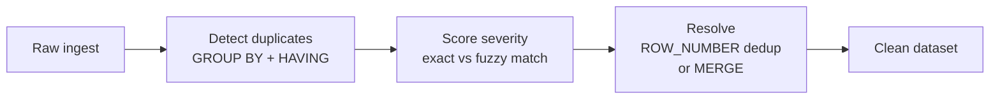

# :material-magnify: Data Quality

Detect and resolve data integrity issues — duplicates, inconsistencies, and orphan records —
before they propagate downstream.

______________________________________________________________________

## :material-sitemap: Pipeline Flow

______________________________________________________________________

## :material-book-open-variant: In This Section

| Page                             | Problem                          | Technique                                            |
| -------------------------------- | -------------------------------- | ---------------------------------------------------- |
| [Finding Duplicates](finding.md) | Identify duplicate rows          | `GROUP BY HAVING`, window functions, hash comparison |
| [Deduplication](removal.md)      | Remove duplicates, keep best row | `ROW_NUMBER`, `QUALIFY`, `MERGE`                     |

______________________________________________________________________

## :material-lightbulb-outline: When to Use

- Initial data profiling — discover quality issues before building pipelines.
- Ingestion layer — catch duplicates introduced by retry logic or late-arriving data.
- Master data management — merge customer/product records from multiple sources.

______________________________________________________________________

!!! note "Related"

    For **detection** patterns — change detection, outliers, snapshot diffs, and fraud
    signals — see the parent [Data Quality](../index.md) section.
