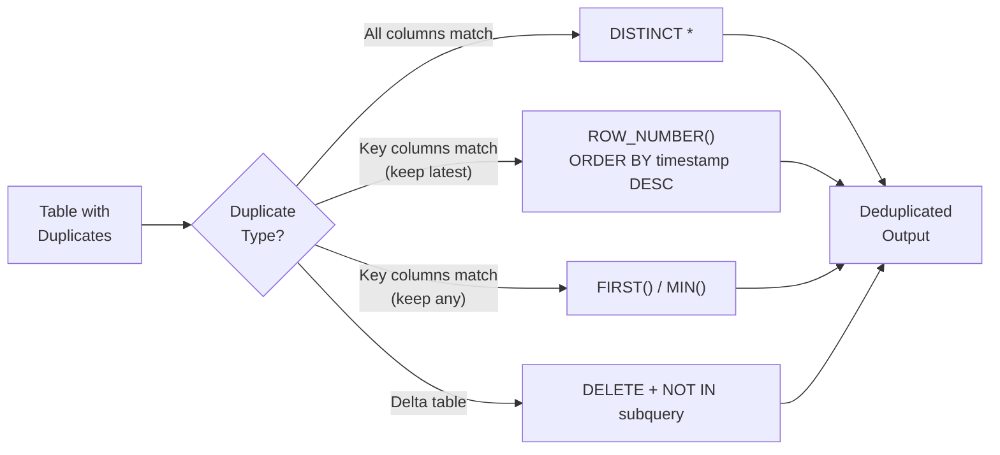

# :material-content-duplicate: Deduplication

Remove duplicate rows in Spark SQL / Databricks SQL. Choose your strategy based
on whether you need exact-match deduplication or key-based deduplication with a
tie-breaking rule.

______________________________________________________________________

## :material-sitemap: Overview



______________________________________________________________________

## :material-database: Sample Data

```sql
-- Students table with duplicate enrollments (same name+age, different timestamps)
CREATE OR REPLACE TEMP VIEW students AS
SELECT * FROM VALUES
  (1,  'Alice',   20, 'CS',      TIMESTAMP('2024-01-10 09:00:00')),
  (2,  'Bob',     22, 'Math',    TIMESTAMP('2024-01-12 10:30:00')),
  (3,  'Alice',   20, 'CS',      TIMESTAMP('2024-02-15 14:00:00')),
  (4,  'Charlie', 21, 'Physics', TIMESTAMP('2024-01-20 08:00:00')),
  (5,  'Bob',     22, 'Math',    TIMESTAMP('2024-03-01 11:00:00')),
  (6,  'Alice',   20, 'CS',      TIMESTAMP('2024-03-10 16:00:00')),
  (7,  'Diana',   23, 'CS',      TIMESTAMP('2024-01-18 12:00:00')),
  (8,  'Charlie', 21, 'Physics', TIMESTAMP('2024-02-28 15:30:00'))
AS students(id, name, age, department, created_at);
```

```sql
-- Orders with status-based priority for deduplication
CREATE OR REPLACE TEMP VIEW orders AS
SELECT * FROM VALUES
  (1001, 'ORD-100', 'shipped',   250.00, TIMESTAMP('2024-03-01 10:00:00')),
  (1002, 'ORD-100', 'pending',   250.00, TIMESTAMP('2024-02-28 09:00:00')),
  (1003, 'ORD-101', 'delivered', 180.00, TIMESTAMP('2024-03-05 14:00:00')),
  (1004, 'ORD-101', 'shipped',   180.00, TIMESTAMP('2024-03-03 11:00:00')),
  (1005, 'ORD-101', 'pending',   180.00, TIMESTAMP('2024-03-01 08:00:00')),
  (1006, 'ORD-102', 'active',    320.00, TIMESTAMP('2024-03-10 16:00:00')),
  (1007, 'ORD-103', 'cancelled',  95.00, TIMESTAMP('2024-03-12 09:00:00')),
  (1008, 'ORD-103', 'active',     95.00, TIMESTAMP('2024-03-11 10:00:00'))
AS orders(id, order_num, status, amount, created_at);
```

______________________________________________________________________

## :material-pin: Strategy Comparison

| Strategy                    | Keeps                         | Requires Order? | Best For                    |
| --------------------------- | ----------------------------- | --------------- | --------------------------- |
| `SELECT DISTINCT *`         | Any row (all cols must match) | No              | Exact duplicates only       |
| `ROW_NUMBER() WHERE rn = 1` | First or last by ORDER BY     | Yes             | Key-based, tie-break needed |
| `FIRST(col) GROUP BY key`   | Any one row per key           | No              | Simple key dedup, fast      |
| `RANK() / DENSE_RANK()`     | Top-ranked row                | Yes             | Complex tie-break rules     |
| `CTE + MIN() + JOIN`        | Deterministic first row       | Yes             | Self-join on min key        |
| `Delta DELETE`              | Keep selected row in-place    | Yes             | Modify Delta table directly |

______________________________________________________________________

## :material-check-circle-outline: Strategy 1 — DISTINCT (exact duplicates)

Remove rows where **every column** is identical.

```sql
SELECT DISTINCT *
FROM students;
```

??? success "Expected output (8 rows — no exact duplicates exist here)"

    All 8 rows are returned because even though Alice appears 3 times, the `id` and `created_at` differ.
    `DISTINCT` only removes rows where **every** column is identical.

```sql
-- Example where DISTINCT actually removes rows:
CREATE OR REPLACE TEMP VIEW exact_dupes AS
SELECT * FROM VALUES
  ('Alice', 20, 'CS'),
  ('Bob',   22, 'Math'),
  ('Alice', 20, 'CS'),
  ('Bob',   22, 'Math'),
  ('Carol', 21, 'Physics')
AS exact_dupes(name, age, department);

SELECT DISTINCT * FROM exact_dupes;
```

??? success "Expected output"

    | name  | age | department |
    | ----- | --- | ---------- |
    | Alice | 20  | CS         |
    | Bob   | 22  | Math       |
    | Carol | 21  | Physics    |

!!! note

    Only removes rows that are completely identical across all columns.
    If even one column differs (e.g., an auto-generated timestamp), rows
    are **not** considered duplicates.

### Why `DISTINCT` Is Also the Expensive Choice for Business-Key Dedup

```sql
EXPLAIN SELECT DISTINCT * FROM students;
```

```text
== Physical Plan ==
+- HashAggregate(keys=[id#.., name#.., age#.., department#.., created_at#..], functions=[])
   +- Exchange hashpartitioning(id#.., name#.., age#.., department#.., created_at#.., 200)
      +- HashAggregate(keys=[id#.., name#.., age#.., department#.., created_at#..], functions=[])
         +- LocalTableScan [...]
```

`DISTINCT *` shuffles on **every column**, including the unique `id` — since `id`
differs on every row, this shuffle can never collapse Alice's 3 rows into 1, no matter
how many times it runs. Compare that to the business-key `ROW_NUMBER()` dedup below:

```text
+- Window [row_number() ... PARTITION BY name, age ...]
   +- WindowGroupLimit [name, age], [created_at DESC], row_number(), 1, Final
      +- Sort [name ASC, age ASC, created_at DESC]
         +- Exchange hashpartitioning(name#.., age#.., 200)
            +- WindowGroupLimit [name, age], [created_at DESC], row_number(), 1, Partial
               +- Sort [name ASC, age ASC, created_at DESC]
```

The `ROW_NUMBER()` plan shuffles on just the **2-column business key**
(`name, age`) instead of all 5 columns, and Spark automatically applies a
`WindowGroupLimit` optimization for the `rn = 1` filter — pruning rows to 1-per-partition
during both the partial and final aggregation instead of materializing every row. So
`DISTINCT *` is not just the wrong tool semantically here (Strategy 1's correctness
caveat) — it's also the more expensive plan, since it must shuffle and compare wider
rows that were never going to collapse in the first place.

______________________________________________________________________

## :material-check-circle-outline: Strategy 2 — ROW_NUMBER() (keep latest row per key)

The most flexible approach — pick which row to keep using any `ORDER BY`.

```sql
SELECT id, name, age, department, created_at
FROM (
    SELECT
        *,
        ROW_NUMBER() OVER (
            PARTITION BY name, age         -- (1)!
            ORDER BY created_at DESC       -- (2)!
        ) AS rn
    FROM students
)
WHERE rn = 1 -- (3)!
ORDER BY id;
```

1. Group rows by the key that defines a duplicate.
2. Order within each group — `DESC` keeps the most recent record.
3. Keep only the first-ranked row per group.

??? success "Expected output"

    | id  | name    | age | department | created_at          |
    | --- | ------- | --- | ---------- | ------------------- |
    | 5   | Bob     | 22  | Math       | 2024-03-01 11:00:00 |
    | 6   | Alice   | 20  | CS         | 2024-03-10 16:00:00 |
    | 7   | Diana   | 23  | CS         | 2024-01-18 12:00:00 |
    | 8   | Charlie | 21  | Physics    | 2024-02-28 15:30:00 |

### Breaking Ties Deterministically When the "Latest" Timestamp Repeats

`ORDER BY created_at DESC` alone only produces a deterministic winner when
`created_at` is unique per key. Real feeds routinely violate that: a batch
upsert or bulk backfill can write two versions of the same business key with
the **identical** timestamp (same load batch, same millisecond, or a
timestamp truncated to second/day granularity). The SQL standard does not
define row order for ties, and Spark does not guarantee one either — the
"winning" row can depend on file layout, task scheduling, or an unrelated
plan change (e.g. an AQE-triggered repartition) between runs of the exact
same query.

```sql
CREATE OR REPLACE TEMP VIEW customers_raw AS
SELECT * FROM VALUES
    (101, 'jane@old.com', TIMESTAMP '2024-06-01 10:00:00', 1001),
    (101, 'jane@new.com', TIMESTAMP '2024-06-01 10:00:00', 1002), -- exact tie on updated_at
    (102, 'bob@x.com',    TIMESTAMP '2024-05-01 09:00:00', 2001)
AS t(customer_id, email, updated_at, source_offset);

-- Fragile: ties on updated_at leave the winner undefined
SELECT customer_id, email, updated_at FROM (
    SELECT *, ROW_NUMBER() OVER (
        PARTITION BY customer_id ORDER BY updated_at DESC
    ) AS rn
    FROM customers_raw
) WHERE rn = 1;

-- Deterministic: add a monotonically increasing tiebreaker as a second sort key
SELECT customer_id, email, updated_at FROM (
    SELECT *, ROW_NUMBER() OVER (
        PARTITION BY customer_id ORDER BY updated_at DESC, source_offset DESC
    ) AS rn
    FROM customers_raw
) WHERE rn = 1;
```

??? success "Expected output (deterministic version)"

    | customer_id | email        | updated_at          |
    | ----------- | ------------ | ------------------- |
    | 101         | jane@new.com | 2024-06-01 10:00:00 |
    | 102         | bob@x.com    | 2024-05-01 09:00:00 |

!!! warning "An `ORDER BY` on a non-unique column is not a tiebreaker"

    Always append a column that *is* unique/monotonic per key when the
    primary ordering column can repeat — an ingestion offset, a Kafka
    partition/offset pair, an autoincrement id, or `_metadata.file_modification_time`
    combined with the file path. Without it, "keep the latest row" silently
    becomes "keep an arbitrary row," which is a correctness bug, not just a
    style choice.

### Multi-Criteria Business-Rule Winner Selection (Validity + Priority + Recency)

Real deduplication is rarely "keep the latest row" alone — it's "keep the *best* row,"
where best is defined by a stack of business rules evaluated in priority order:
prefer a valid record over an invalid one, then prefer the higher-priority source,
and only fall back to recency as the final tiebreaker. Because `ORDER BY` in
`ROW_NUMBER()` accepts any number of columns, each rule is just one more `ORDER BY`
key — no `CASE` expression needed when the columns already sort in the direction you
want (unlike [Strategy 5](#strategy-5-rank-with-conditional-tie-break), which needs a
`CASE` because raw string statuses don't have a natural sort order):

```sql
CREATE OR REPLACE TEMP VIEW raw_events AS
SELECT * FROM VALUES
    (501, 9001, false, 1, TIMESTAMP '2024-06-01 10:00:00', 'legacy_batch'),
    (501, 9001, true,  2, TIMESTAMP '2024-06-01 09:30:00', 'streaming'),
    (501, 9001, true,  3, TIMESTAMP '2024-06-01 09:45:00', 'api'),
    (502, 9002, true,  1, TIMESTAMP '2024-06-01 08:00:00', 'legacy_batch'),
    (502, 9002, false, 5, TIMESTAMP '2024-06-01 08:30:00', 'high_priority_but_invalid')
AS t(customer_id, event_id, is_valid, source_priority, ingestion_time, source_name);

SELECT customer_id, event_id, is_valid, source_priority, ingestion_time, source_name
FROM (
    SELECT *,
        ROW_NUMBER() OVER (
            PARTITION BY customer_id, event_id
            ORDER BY
                is_valid        DESC,   -- (1)!
                source_priority DESC,   -- (2)!
                ingestion_time  DESC    -- (3)!
        ) AS rn
    FROM raw_events
)
WHERE rn = 1
ORDER BY customer_id;
```

1. Valid records always outrank invalid ones, regardless of anything else.
2. Among records of equal validity, the higher-priority source wins.
3. Only when validity and priority both tie does the most recent record win.

??? success "Expected output"

    | customer_id | event_id | is_valid | source_priority | ingestion_time      | source_name  |
    | ----------- | -------- | -------- | --------------- | ------------------- | ------------ |
    | 501         | 9001     | true     | 3               | 2024-06-01 09:45:00 | api          |
    | 502         | 9002     | true     | 1               | 2024-06-01 08:00:00 | legacy_batch |

    Verified: for `(501, 9001)`, the `api` source (priority 3, valid) wins over
    `streaming` (priority 2, valid) even though neither is the latest-arriving row —
    and both beat `legacy_batch` (priority 1, **invalid**) despite `legacy_batch`
    having the single latest `ingestion_time` (10:00:00) of the three. Validity
    strictly dominates recency, exactly as the `ORDER BY` sequence specifies. For
    `(502, 9002)`, the lone valid row wins even though a higher-priority (5) row exists
    for that key — it's simply invalid, so it never had a chance to compete on
    priority.

!!! tip "Boolean columns sort naturally in `ORDER BY` — no `CASE` required"

    `is_valid DESC` puts `true` before `false` directly; Spark SQL treats
    `BOOLEAN` as ordered (`false < true`) the same as any other type. Reach for a
    `CASE` expression (as in Strategy 5) only when the priority order doesn't match
    the column's natural sort order — e.g. ranking string statuses like `'delivered'`
    ahead of `'shipped'` alphabetically wouldn't work without one.

!!! note "`WindowGroupLimit` still applies with a multi-column `ORDER BY`"

    Verified with `EXPLAIN FORMATTED`: the `Partial`/`Final` `WindowGroupLimit`
    optimization described [above](#why-distinct-is-also-the-expensive-choice-for-business-key-dedup)
    is not limited to a single sort key — Catalyst applies it identically here,
    pre-sorting and pruning to one row per `(customer_id, event_id)` **before** the
    shuffle on all three `ORDER BY` columns at once. Adding more tie-break criteria to
    the `ORDER BY` list costs essentially nothing extra at the physical-plan level.

______________________________________________________________________

## :material-check-circle-outline: Strategy 3 — FIRST() / GROUP BY (keep any row per key)

When order does not matter — fastest deduplication approach.

```sql
SELECT
    FIRST(id)         AS id,
    name,
    age,
    FIRST(department) AS department,
    FIRST(created_at) AS created_at
FROM students
GROUP BY name, age
ORDER BY id;
```

??? success "Expected output (order of FIRST() is non-deterministic)"

    | id  | name    | age | department | created_at          |
    | --- | ------- | --- | ---------- | ------------------- |
    | 1   | Alice   | 20  | CS         | 2024-01-10 09:00:00 |
    | 2   | Bob     | 22  | Math       | 2024-01-12 10:30:00 |
    | 4   | Charlie | 21  | Physics    | 2024-01-20 08:00:00 |
    | 7   | Diana   | 23  | CS         | 2024-01-18 12:00:00 |

!!! note

    `FIRST()` returns an arbitrary row for each key — no ordering guarantee.
    Use `ROW_NUMBER()` if deterministic selection is required.

______________________________________________________________________

## :material-check-circle-outline: Strategy 4 — ROW_NUMBER() (keep earliest by timestamp)

Production pattern for CDC (Change Data Capture) pipelines — keep the original record.

```sql
SELECT id, name, age, department, created_at
FROM (
    SELECT
        *,
        ROW_NUMBER() OVER (
            PARTITION BY name, age
            ORDER BY created_at ASC -- (1)!
        ) AS rn
    FROM students
)
WHERE rn = 1
ORDER BY id;
```

1. Keeps the earliest ingested record per `(name, age)`.

??? success "Expected output"

    | id  | name    | age | department | created_at          |
    | --- | ------- | --- | ---------- | ------------------- |
    | 1   | Alice   | 20  | CS         | 2024-01-10 09:00:00 |
    | 2   | Bob     | 22  | Math       | 2024-01-12 10:30:00 |
    | 4   | Charlie | 21  | Physics    | 2024-01-20 08:00:00 |
    | 7   | Diana   | 23  | CS         | 2024-01-18 12:00:00 |

______________________________________________________________________

## :material-check-circle-outline: Strategy 5 — RANK() with conditional tie-break

Use when you need a priority-based rule (e.g., prefer `status = 'delivered'` over `'shipped'`).

```sql
SELECT id, order_num, status, amount, created_at
FROM (
    SELECT
        *,
        ROW_NUMBER() OVER (
            PARTITION BY order_num
            ORDER BY
                CASE status                 -- (1)!
                    WHEN 'delivered' THEN 1
                    WHEN 'shipped'   THEN 2
                    WHEN 'active'    THEN 3
                    WHEN 'pending'   THEN 4
                    WHEN 'cancelled' THEN 5
                    ELSE 6
                END,
                created_at DESC             -- (2)!
        ) AS rn
    FROM orders
)
WHERE rn = 1
ORDER BY order_num;
```

1. Prefer the most advanced status first.
2. Break ties by most recent timestamp.

??? success "Expected output"

    | id   | order_num | status    | amount | created_at          |
    | ---- | --------- | --------- | ------ | ------------------- |
    | 1001 | ORD-100   | shipped   | 250.00 | 2024-03-01 10:00:00 |
    | 1003 | ORD-101   | delivered | 180.00 | 2024-03-05 14:00:00 |
    | 1006 | ORD-102   | active    | 320.00 | 2024-03-10 16:00:00 |
    | 1008 | ORD-103   | active    | 95.00  | 2024-03-11 10:00:00 |

______________________________________________________________________

## :material-check-circle-outline: Strategy 6 — CTE + MIN() + INNER JOIN

Deterministic dedup using the minimum key value as the canonical row.

```sql
WITH dedup_keys AS (
    SELECT
        name,
        age,
        MIN(id) AS canonical_id -- (1)!
    FROM students
    GROUP BY name, age
)
SELECT s.*
FROM students AS s
INNER JOIN dedup_keys AS d
    ON s.id = d.canonical_id
ORDER BY s.id;
```

1. Keeps the row with the lowest `id` per `(name, age)` combination.

??? success "Expected output"

    | id  | name    | age | department | created_at          |
    | --- | ------- | --- | ---------- | ------------------- |
    | 1   | Alice   | 20  | CS         | 2024-01-10 09:00:00 |
    | 2   | Bob     | 22  | Math       | 2024-01-12 10:30:00 |
    | 4   | Charlie | 21  | Physics    | 2024-01-20 08:00:00 |
    | 7   | Diana   | 23  | CS         | 2024-01-18 12:00:00 |

______________________________________________________________________

## :material-check-circle-outline: Strategy 7 — Delta table in-place DELETE

!!! info "[Databricks]"

    This strategy requires Delta Lake. Not supported on plain Parquet or CSV tables.

Remove duplicates directly from a Delta table without rewriting it.

```sql
DELETE FROM your_table
WHERE id NOT IN (
    SELECT id
    FROM (
        SELECT
            *,
            ROW_NUMBER() OVER (
                PARTITION BY name, age
                ORDER BY id
            ) AS rn
        FROM your_table
    )
    WHERE rn = 1
);
```

??? success "Effect"

    For the `students` data, this would delete rows with `id` IN (3, 5, 6, 8) — keeping
    only the first occurrence (lowest `id`) per `(name, age)`:

    | Deleted id | name    | Reason         |
    | ---------- | ------- | -------------- |
    | 3          | Alice   | 2nd occurrence |
    | 5          | Bob     | 2nd occurrence |
    | 6          | Alice   | 3rd occurrence |
    | 8          | Charlie | 2nd occurrence |

______________________________________________________________________

## :material-check-circle-outline: Strategy 8 — MERGE for idempotent dedup

!!! info "[Databricks]"

    Requires Delta Lake tables.

Use `MERGE` to deduplicate into a clean target table:

```sql
-- Deduplicate into a clean target by merging only the latest per key
MERGE INTO students_clean AS target
USING (
    SELECT *
    FROM (
        SELECT *, ROW_NUMBER() OVER (
            PARTITION BY name, age ORDER BY created_at DESC
        ) AS rn
        FROM students
    )
    WHERE rn = 1
) AS source
ON target.name = source.name AND target.age = source.age
WHEN MATCHED THEN UPDATE SET *
WHEN NOT MATCHED THEN INSERT *;
```

______________________________________________________________________

## :material-flask-outline: Full Example with Sample Data

```sql
--8<-- "sql/application/duplicate/removal/deduplication.sql"
```

______________________________________________________________________

## :material-database-search: [Databricks] Real-World Example — System Tables

!!! note "[Databricks] Unity Catalog system tables"

    `system.billing.usage` itself should already be unique by `record_id`, but a
    raw landing table copied from it can still accumulate accidental duplicates when
    the same files or API pages are ingested twice. An account admin must
    `GRANT USE CATALOG, USE SCHEMA, SELECT ON SCHEMA system.billing TO <principal>`
    before you can validate the staging copy against the source system table.

### 9 — Keep one landed row per `record_id` with `ROW_NUMBER()`

```sql
-- [Databricks] Requires SELECT on system.billing.usage
WITH ranked AS (
    SELECT
        *,
        ROW_NUMBER() OVER (
            PARTITION BY record_id
            ORDER BY ingested_at DESC
        ) AS rn
    FROM finance.staging.billing_usage_raw
)
SELECT
    record_id,
    workspace_id,
    sku_name,
    usage_date,
    usage_quantity,
    ingested_at
FROM ranked
WHERE rn = 1
ORDER BY usage_date DESC, workspace_id, record_id;
-- Result (illustrative):
-- record_id                       | workspace_id | sku_name              | usage_date  | usage_quantity | ingested_at
-- --------------------------------|--------------|-----------------------|-------------|----------------|---------------------
-- 01f2c8de-4f7d-4b14-8e53-3b6d... | 123456789    | PREMIUM_JOBS_COMPUTE  | 2024-07-18  | 14.5           | 2024-07-19 00:17:42
-- 9237aa45-40b0-4ef2-9e9e-8ef1... | 987654321    | SERVERLESS_SQL        | 2024-07-18  |  8.0           | 2024-07-19 00:19:08
```

### 10 — Inspect which landed copies would be discarded

```sql
-- [Databricks] Requires SELECT on system.billing.usage
SELECT
    record_id,
    workspace_id,
    sku_name,
    usage_date,
    usage_quantity,
    ingested_at,
    rn
FROM (
    SELECT
        *,
        ROW_NUMBER() OVER (
            PARTITION BY record_id
            ORDER BY ingested_at DESC
        ) AS rn
    FROM finance.staging.billing_usage_raw
)
WHERE rn > 1
ORDER BY record_id, rn;
-- Result (illustrative):
-- record_id                       | workspace_id | sku_name             | usage_date  | usage_quantity | ingested_at          | rn
-- --------------------------------|--------------|----------------------|-------------|----------------|----------------------|---
-- 01f2c8de-4f7d-4b14-8e53-3b6d... | 123456789    | PREMIUM_JOBS_COMPUTE | 2024-07-18  | 14.5           | 2024-07-19 00:03:11  | 2
```

!!! tip "Same pattern, production data"

    This is the same non-destructive dedup pattern as the sample tables above:
    rank duplicate keys, keep `rn = 1`, and review `rn > 1` before rewriting a
    clean target table. The only production-specific choice is the tie-breaker —
    here `ingested_at` keeps the latest landed copy.

______________________________________________________________________

## :material-brain: When to Use

| Scenario                                                               | Recommended Strategy                                                                             |
| ---------------------------------------------------------------------- | ------------------------------------------------------------------------------------------------ |
| All columns are identical                                              | `SELECT DISTINCT *`                                                                              |
| Keep most recent by timestamp                                          | `ROW_NUMBER()` ORDER BY timestamp DESC                                                           |
| Keep earliest (original) record                                        | `ROW_NUMBER()` ORDER BY timestamp ASC                                                            |
| Keep any one row, order irrelevant                                     | `FIRST()` + `GROUP BY`                                                                           |
| Complex priority rule (status)                                         | `ROW_NUMBER()` with `CASE` ORDER BY                                                              |
| Deterministic lowest-key row                                           | CTE + `MIN(id)` + `INNER JOIN`                                                                   |
| Modify Delta table in place                                            | Delta `DELETE` + subquery                                                                        |
| Idempotent pipeline output                                             | `MERGE INTO` with deduplicated source                                                            |
| Timestamp/version column has duplicate values across the "latest" rows | Add a unique/monotonic secondary `ORDER BY` column (offset, id, file metadata) to `ROW_NUMBER()` |

!!! tip "Spark + Delta performance"

    For large Delta tables, prefer `MERGE INTO` with a deduplicated source CTE
    rather than `DELETE` — it reduces the number of files rewritten.

!!! danger "DISTINCT is not a business-key dedup shortcut"

    `SELECT DISTINCT *` only collapses rows that are byte-for-byte identical across
    **every** column — a unique id or timestamp column defeats it entirely, so it
    silently does nothing on business-key duplicates (Strategy 1). It's also the more
    expensive plan for that case: it shuffles on every column instead of just the
    business key, and gets none of the `WindowGroupLimit` optimization that
    `ROW_NUMBER() ... WHERE rn = 1` gets for free. Reach for `ROW_NUMBER()` partitioned
    on the actual business key whenever "duplicate" means "same logical entity", not
    "same row".
