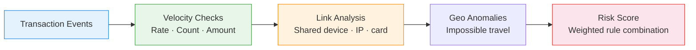

# :material-shield-alert: Fraud Pattern Detection

Detect **multiple accounts on one device, multiple cards on one IP, impossible travel,
and rapid repeated transactions** — rule-based fraud patterns using SQL window functions.

______________________________________________________________________

## :material-sitemap: Detection Pipeline



______________________________________________________________________

## :material-code-tags: Syntax

### Sample data

```sql
CREATE OR REPLACE TEMP VIEW transactions AS
SELECT * FROM VALUES
  (1,  'user_1', 'card_A', 'dev_X', '192.168.1.1', 50.00,  TIMESTAMP '2024-03-01 10:00:00', 'New York'),
  (2,  'user_1', 'card_A', 'dev_X', '192.168.1.1', 45.00,  TIMESTAMP '2024-03-01 10:02:00', 'New York'),
  (3,  'user_1', 'card_A', 'dev_X', '192.168.1.1', 48.00,  TIMESTAMP '2024-03-01 10:03:00', 'New York'),
  (4,  'user_1', 'card_A', 'dev_Y', '203.0.113.5', 2000.00,TIMESTAMP '2024-03-01 10:30:00', 'London'),
  (5,  'user_2', 'card_B', 'dev_X', '192.168.1.1', 120.00, TIMESTAMP '2024-03-01 11:00:00', 'New York'),
  (6,  'user_3', 'card_C', 'dev_X', '192.168.1.1', 95.00,  TIMESTAMP '2024-03-01 11:30:00', 'New York'),
  (7,  'user_2', 'card_D', 'dev_Z', '10.0.0.1',    300.00, TIMESTAMP '2024-03-01 14:00:00', 'Chicago'),
  (8,  'user_4', 'card_E', 'dev_Z', '10.0.0.1',    450.00, TIMESTAMP '2024-03-01 14:05:00', 'Chicago'),
  (9,  'user_1', 'card_A', 'dev_X', '192.168.1.1', 5000.00,TIMESTAMP '2024-03-01 15:00:00', 'New York'),
  (10, 'user_5', 'card_F', 'dev_W', '172.16.0.1',  25.00,  TIMESTAMP '2024-03-02 09:00:00', 'Tokyo')
AS t(txn_id, user_id, card_id, device_id, ip_address, amount, txn_time, city);
```

______________________________________________________________________

### Multiple accounts on one device

```sql
SELECT
    device_id,
    COLLECT_SET(user_id)                           AS users,
    COUNT(DISTINCT user_id)                        AS user_count,
    COUNT(DISTINCT card_id)                        AS card_count,
    SUM(amount)                                    AS total_amount
FROM transactions
GROUP BY device_id
HAVING COUNT(DISTINCT user_id) > 1
ORDER BY user_count DESC;
```

______________________________________________________________________

### Multiple cards on one IP

```sql
SELECT
    ip_address,
    COLLECT_SET(card_id)                           AS cards,
    COUNT(DISTINCT card_id)                        AS card_count,
    COUNT(DISTINCT user_id)                        AS user_count
FROM transactions
GROUP BY ip_address
HAVING COUNT(DISTINCT card_id) > 2
ORDER BY card_count DESC;
```

______________________________________________________________________

### Rapid repeated transactions (velocity)

```sql
WITH velocity AS (
    SELECT
        user_id,
        card_id,
        txn_time,
        amount,
        COUNT(*) OVER (
            PARTITION BY user_id
            ORDER BY txn_time
            RANGE BETWEEN INTERVAL 5 MINUTES PRECEDING AND CURRENT ROW
        )                                          AS txns_5min,
        SUM(amount) OVER (
            PARTITION BY user_id
            ORDER BY txn_time
            RANGE BETWEEN INTERVAL 1 HOUR PRECEDING AND CURRENT ROW
        )                                          AS amount_1hr
    FROM transactions
)
SELECT
    user_id,
    card_id,
    txn_time,
    amount,
    txns_5min,
    amount_1hr,
    CASE
        WHEN txns_5min >= 3 THEN 'RAPID_FIRE'
        WHEN amount_1hr > 3000 THEN 'HIGH_VELOCITY_AMOUNT'
        ELSE 'NORMAL'
    END                                            AS velocity_flag
FROM velocity
WHERE txns_5min >= 3 OR amount_1hr > 3000
ORDER BY user_id, txn_time;
```

______________________________________________________________________

### Impossible travel

```sql
WITH sequenced AS (
    SELECT
        user_id,
        txn_time,
        city,
        LAG(city) OVER w                           AS prev_city,
        LAG(txn_time) OVER w                       AS prev_time,
        (UNIX_TIMESTAMP(txn_time)
         - UNIX_TIMESTAMP(LAG(txn_time) OVER w)) / 3600.0
                                                   AS hours_gap
    FROM transactions
    WINDOW w AS (PARTITION BY user_id ORDER BY txn_time)
)
SELECT
    user_id,
    prev_city,
    city                                           AS current_city,
    ROUND(hours_gap, 2)                            AS hours_between,
    'IMPOSSIBLE_TRAVEL'                            AS flag
FROM sequenced
WHERE prev_city IS NOT NULL
  AND prev_city != city
  AND hours_gap < 3;
-- Result:
-- |user_id|prev_city|current_city|hours_between|flag             |
-- |user_1 |New York |London      |0.50         |IMPOSSIBLE_TRAVEL|
```

______________________________________________________________________

### Composite risk score

```sql
WITH flags AS (
    SELECT
        t.txn_id,
        t.user_id,
        t.amount,
        -- Device sharing
        CASE WHEN dev.user_count > 1 THEN 30 ELSE 0 END AS device_risk,
        -- Velocity
        CASE
            WHEN COUNT(*) OVER (
                PARTITION BY t.user_id
                ORDER BY t.txn_time
                RANGE BETWEEN INTERVAL 5 MINUTES PRECEDING AND CURRENT ROW
            ) >= 3 THEN 25 ELSE 0
        END                                        AS velocity_risk,
        -- Amount anomaly
        CASE
            WHEN t.amount > AVG(t.amount) OVER (PARTITION BY t.user_id) * 5
                THEN 20 ELSE 0
        END                                        AS amount_risk,
        -- City change
        CASE
            WHEN LAG(t.city) OVER (PARTITION BY t.user_id ORDER BY t.txn_time) != t.city
                 AND (UNIX_TIMESTAMP(t.txn_time)
                      - UNIX_TIMESTAMP(LAG(t.txn_time) OVER (
                          PARTITION BY t.user_id ORDER BY t.txn_time))) / 3600.0 < 3
                THEN 25 ELSE 0
        END                                        AS travel_risk
    FROM transactions t
    LEFT JOIN (
        SELECT device_id, COUNT(DISTINCT user_id) AS user_count
        FROM transactions GROUP BY device_id
    ) dev ON t.device_id = dev.device_id
)
SELECT
    txn_id,
    user_id,
    amount,
    device_risk + velocity_risk + amount_risk + travel_risk AS risk_score,
    CASE
        WHEN device_risk + velocity_risk + amount_risk + travel_risk >= 50 THEN 'BLOCK'
        WHEN device_risk + velocity_risk + amount_risk + travel_risk >= 30 THEN 'REVIEW'
        ELSE 'ALLOW'
    END                                            AS decision
FROM flags
ORDER BY risk_score DESC;
```

______________________________________________________________________

## :material-information-outline: Key Concepts

| Pattern                  | Rule                | Signal               |
| ------------------------ | ------------------- | -------------------- |
| **Multi-account device** | >1 user per device  | Account farming      |
| **Multi-card IP**        | >2 cards per IP     | Card testing         |
| **Rapid fire**           | ≥3 txns in 5 min    | Automated bot        |
| **Impossible travel**    | City change < 3 hrs | Credential theft     |
| **Amount spike**         | >5× user average    | Stolen card cash-out |

!!! tip "Layer rules for confidence"

    Single rules produce false positives. Combine 2+ signals into a composite
    score — legitimate users rarely trigger multiple rules simultaneously.

______________________________________________________________________

## :material-lightbulb-outline: When to Use

| Scenario         | Primary Rules                                      |
| ---------------- | -------------------------------------------------- |
| Payment fraud    | Velocity + impossible travel + amount anomaly      |
| Account takeover | New device + IP change + password reset            |
| Bonus abuse      | Multi-account device + same payment method         |
| Card testing     | Low-amount rapid transactions from one IP          |
| Money laundering | Structured amounts just below reporting thresholds |

______________________________________________________________________

## :material-database-search: [Databricks] Real-World Example — System Tables

!!! note "[Databricks] Unity Catalog system tables"

    `system.access.audit` is a built-in Unity Catalog system table (no synthetic
    sample data setup needed) that records workspace access events, actors, status
    codes, and source IP addresses. An account admin must `GRANT USE CATALOG, USE SCHEMA, SELECT ON SCHEMA system.access TO <principal>` before these queries
    will return rows.

### 6 — Users with a spike in failed login or token actions

```sql
-- [Databricks] Requires SELECT on system.access.audit
WITH daily_failures AS (
    SELECT
        event_date,
        user_identity.email AS user_email,
        COUNT(*) AS failed_action_count
    FROM system.access.audit
    WHERE event_date >= DATE_SUB(CURRENT_DATE(), 14)
      AND source_ip_address IS NOT NULL
      AND (
          LOWER(action_name) LIKE '%login%'
          OR LOWER(action_name) LIKE '%token%'
      )
      AND response.status_code <> '200'
    GROUP BY event_date, user_identity.email
),
scored AS (
    SELECT
        event_date,
        user_email,
        failed_action_count,
        AVG(failed_action_count) OVER (PARTITION BY user_email) AS avg_failures,
        STDDEV(failed_action_count) OVER (PARTITION BY user_email) AS stddev_failures
    FROM daily_failures
)
SELECT
    event_date,
    user_email,
    failed_action_count,
    ROUND(avg_failures, 2) AS avg_failures,
    ROUND(stddev_failures, 2) AS stddev_failures,
    ROUND(
        (failed_action_count - avg_failures) / NULLIF(stddev_failures, 0),
        2
    ) AS z_score
FROM scored
WHERE failed_action_count >= 5
  AND ABS((failed_action_count - avg_failures) / NULLIF(stddev_failures, 0)) >= 2
ORDER BY event_date DESC, failed_action_count DESC;
-- Result (illustrative):
-- event_date  | user_email         | failed_action_count | avg_failures | stddev_failures | z_score
-- ------------|--------------------|---------------------|--------------|-----------------|--------
-- 2024-07-19  | analyst@company.com| 14                  | 2.10         | 3.88            | 3.07
```

### 7 — Token activity from a new or rare source IP address

```sql
-- [Databricks] Requires SELECT on system.access.audit
WITH recent_token_events AS (
    SELECT
        event_time,
        user_identity.email AS user_email,
        source_ip_address,
        action_name
    FROM system.access.audit
    WHERE event_date >= DATE_SUB(CURRENT_DATE(), 7)
      AND LOWER(action_name) LIKE '%token%'
      AND source_ip_address IS NOT NULL
),
known_ips AS (
    SELECT DISTINCT
        user_identity.email AS user_email,
        source_ip_address
    FROM system.access.audit
    WHERE event_date >= DATE_SUB(CURRENT_DATE(), 37)
      AND event_date < DATE_SUB(CURRENT_DATE(), 7)
      AND source_ip_address IS NOT NULL
)
SELECT
    r.event_time,
    r.user_email,
    r.source_ip_address,
    r.action_name,
    'NEW_IP_FOR_TOKEN_ACTIVITY' AS risk_flag
FROM recent_token_events AS r
LEFT ANTI JOIN known_ips AS k
    ON r.user_email = k.user_email
   AND r.source_ip_address = k.source_ip_address
ORDER BY r.event_time DESC;
-- Result (illustrative):
-- event_time           | user_email          | source_ip_address | action_name     | risk_flag
-- ---------------------|---------------------|-------------------|-----------------|---------------------------
-- 2024-07-19 08:44:11  | analyst@company.com | 198.51.100.44     | createToken     | NEW_IP_FOR_TOKEN_ACTIVITY
```

!!! tip "Same pattern, production data"

    These are the same fraud-detection ideas as the sample transactions above:
    count suspicious events over time, compare them to a baseline, and flag unusual
    network identity changes. Audit logs simply replace cards and devices with real
    access-control signals such as `action_name`, `response.status_code`, and
    `source_ip_address`.

______________________________________________________________________

## :material-arrow-right: Related

- [Network Analysis](../structural/network-analysis.md) — IP/device/user graph mapping
- [Graph Analytics](../structural/graph-analytics.md) — connected component detection for rings
- [Event Stream Analytics](../sequence/event-stream-analytics.md) — session-based pattern matching
