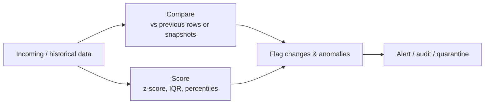

# :material-shield-check: Data Quality

Detect, quantify, and monitor data integrity problems — value drift, statistical
outliers, snapshot differences, and fraud signals — so bad data is caught before it
reaches reports and models.

______________________________________________________________________

## :material-sitemap: Detection Flow

______________________________________________________________________

## :material-view-grid: In This Section

| Page                                                        | Problem                                            | Key Technique                                           |
| ----------------------------------------------------------- | -------------------------------------------------- | ------------------------------------------------------- |
| [Change Detection](change-detection.md)                     | Spot when a value changes between consecutive rows | `LAG`, state-transition flags                           |
| [Outlier Detection](outlier-detection.md)                   | Find points that deviate from the norm             | z-score, IQR fencing, percentile thresholds             |
| [Slowly Changing Comparison](slowly-changing-comparison.md) | Diff current vs previous snapshots                 | full-outer snapshot join, column-level diff             |
| [Fraud Pattern Detection](fraud-detection.md)               | Surface suspicious multi-entity patterns           | self-joins, `COUNT(DISTINCT)`, impossible-travel checks |
| [Duplicates](duplicates/index.md)                           | Find and remove duplicate rows                     | `GROUP BY HAVING`, `ROW_NUMBER`, `QUALIFY`, `MERGE`     |
| [Validation Rules](validation-rules.md)                     | Run SQL as a standing data-validation engine       | anti-joins, `HAVING`, range checks, `NOT NULL` checks   |

______________________________________________________________________

## :material-lightbulb-outline: When to Use

- **Monitoring** — continuously watch production tables for drift and anomalies.
- **Audit trails** — record what changed, when, and by how much.
- **Incremental ETL validation** — verify each load against the prior snapshot.
- **Risk & fraud** — flag entities whose behaviour breaks expected constraints.

______________________________________________________________________

!!! note "Related"

    The [Duplicates](duplicates/index.md) sub-section covers duplicate finding and
    deduplication — the ingestion-layer integrity task that complements these detection
    patterns.
