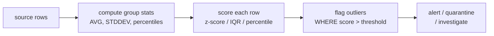

# :material-chart-scatter-plot: Outlier Detection

Identify data points that deviate significantly from the norm — using z-scores, IQR fencing, percentile thresholds, and moving-window techniques — essential for data quality, fraud detection, and anomaly alerting.

!!! note "Source"
    Full runnable example: `sql/application/data_quality/outlier_detection.sql`

---

## :material-sitemap: Execution Flow



---

## :material-pin: Syntax

### Z-score method

```sql
SELECT *,
    (value - AVG(value) OVER w) / NULLIF(STDDEV(value) OVER w, 0) AS z_score
FROM source_table
WINDOW w AS (PARTITION BY group_col);
```

### IQR fence method

```sql
WITH stats AS (
    SELECT
        group_col,
        PERCENTILE(value, 0.25) AS q1,
        PERCENTILE(value, 0.75) AS q3
    FROM source_table
    GROUP BY group_col
)
SELECT s.*, st.q1, st.q3,
    st.q3 - st.q1 AS iqr,
    CASE WHEN s.value < st.q1 - 1.5 * (st.q3 - st.q1)
           OR s.value > st.q3 + 1.5 * (st.q3 - st.q1)
         THEN TRUE ELSE FALSE
    END AS is_outlier
FROM source_table s
JOIN stats st ON s.group_col = st.group_col;
```

| Method | Best for | Sensitivity |
|--------|----------|-------------|
| Z-score (> 2 or 3) | Normally distributed data | Adjustable via threshold |
| IQR fence (1.5x) | Skewed distributions, robust to extremes | 1.5x = mild, 3x = extreme |
| Percentile (top/bottom 1%) | Any distribution | Fixed percentage cutoff |
| Modified Z-score (MAD) | Heavy-tailed distributions | More robust than standard z-score |
| Moving-window | Time-series anomalies | Adapts to local trends |

!!! note "No single best method"
    Z-scores assume approximate normality. IQR fencing is robust to skew but may miss outliers in heavy-tailed data. Combine methods or validate results manually for critical use cases.

---

## :material-magnify: Behavior

1. **Z-score** — measures how many standard deviations a value is from the mean. Values beyond +/- 2 are unusual; beyond +/- 3 are extreme.
2. **IQR fence** — values below Q1 - 1.5*IQR or above Q3 + 1.5*IQR are flagged. The 1.5 multiplier catches moderate outliers; use 3.0 for extreme-only detection.
3. **Percentile threshold** — flags values in the top or bottom N% of the distribution. Simple and distribution-agnostic but does not adapt to data shape.
4. **Window-based** — computes statistics over a sliding window, detecting values that are anomalous relative to their local neighborhood rather than the global distribution.

---

## :material-database: Sample Data

### Dataset 1: Daily transaction amounts by merchant

```sql
CREATE OR REPLACE TEMP VIEW transactions AS
SELECT * FROM VALUES
    ('merchant_A', DATE '2024-06-01',   250.00),
    ('merchant_A', DATE '2024-06-02',   310.00),
    ('merchant_A', DATE '2024-06-03',   280.00),
    ('merchant_A', DATE '2024-06-04',   295.00),
    ('merchant_A', DATE '2024-06-05',   320.00),
    ('merchant_A', DATE '2024-06-06',   270.00),
    ('merchant_A', DATE '2024-06-07',   290.00),
    ('merchant_A', DATE '2024-06-08',  4500.00),
    ('merchant_A', DATE '2024-06-09',   305.00),
    ('merchant_A', DATE '2024-06-10',   285.00),
    ('merchant_A', DATE '2024-06-11',   330.00),
    ('merchant_A', DATE '2024-06-12',    15.00),
    ('merchant_B', DATE '2024-06-01',  1200.00),
    ('merchant_B', DATE '2024-06-02',  1350.00),
    ('merchant_B', DATE '2024-06-03',  1180.00),
    ('merchant_B', DATE '2024-06-04',  1290.00),
    ('merchant_B', DATE '2024-06-05',  1410.00),
    ('merchant_B', DATE '2024-06-06',  1250.00),
    ('merchant_B', DATE '2024-06-07', 12800.00),
    ('merchant_B', DATE '2024-06-08',  1300.00),
    ('merchant_B', DATE '2024-06-09',  1220.00),
    ('merchant_B', DATE '2024-06-10',  1380.00)
AS t(merchant, txn_date, amount);
```

### Dataset 2: Hourly server response times

```sql
CREATE OR REPLACE TEMP VIEW response_times AS
SELECT * FROM VALUES
    ('api-gw', TIMESTAMP '2024-04-10 08:00:00',  120),
    ('api-gw', TIMESTAMP '2024-04-10 09:00:00',  135),
    ('api-gw', TIMESTAMP '2024-04-10 10:00:00',  128),
    ('api-gw', TIMESTAMP '2024-04-10 11:00:00',  142),
    ('api-gw', TIMESTAMP '2024-04-10 12:00:00',  890),
    ('api-gw', TIMESTAMP '2024-04-10 13:00:00',  155),
    ('api-gw', TIMESTAMP '2024-04-10 14:00:00',  130),
    ('api-gw', TIMESTAMP '2024-04-10 15:00:00',  145),
    ('api-gw', TIMESTAMP '2024-04-10 16:00:00', 1250),
    ('api-gw', TIMESTAMP '2024-04-10 17:00:00',  138),
    ('api-gw', TIMESTAMP '2024-04-10 18:00:00',  125),
    ('api-gw', TIMESTAMP '2024-04-10 19:00:00',  132),
    ('db-svc', TIMESTAMP '2024-04-10 08:00:00',   45),
    ('db-svc', TIMESTAMP '2024-04-10 09:00:00',   52),
    ('db-svc', TIMESTAMP '2024-04-10 10:00:00',   48),
    ('db-svc', TIMESTAMP '2024-04-10 11:00:00',   55),
    ('db-svc', TIMESTAMP '2024-04-10 12:00:00',  380),
    ('db-svc', TIMESTAMP '2024-04-10 13:00:00',   50),
    ('db-svc', TIMESTAMP '2024-04-10 14:00:00',   47),
    ('db-svc', TIMESTAMP '2024-04-10 15:00:00',   53)
AS t(service, ts, p95_ms);
```

### Dataset 3: Employee expense claims

```sql
CREATE OR REPLACE TEMP VIEW expense_claims AS
SELECT * FROM VALUES
    ('Engineering', 'Alice',   DATE '2024-05-01', 'Travel',  450.00),
    ('Engineering', 'Alice',   DATE '2024-05-08', 'Meals',    85.00),
    ('Engineering', 'Bob',     DATE '2024-05-02', 'Travel',  520.00),
    ('Engineering', 'Bob',     DATE '2024-05-10', 'Travel', 8200.00),
    ('Engineering', 'Carol',   DATE '2024-05-03', 'Meals',    72.00),
    ('Engineering', 'Carol',   DATE '2024-05-12', 'Travel',  490.00),
    ('Engineering', 'Dave',    DATE '2024-05-04', 'Travel',  380.00),
    ('Engineering', 'Dave',    DATE '2024-05-15', 'Meals',    95.00),
    ('Sales',       'Eve',     DATE '2024-05-01', 'Travel',  680.00),
    ('Sales',       'Eve',     DATE '2024-05-09', 'Meals',   120.00),
    ('Sales',       'Frank',   DATE '2024-05-02', 'Travel',  710.00),
    ('Sales',       'Frank',   DATE '2024-05-11', 'Meals',  1950.00),
    ('Sales',       'Grace',   DATE '2024-05-03', 'Travel',  650.00),
    ('Sales',       'Grace',   DATE '2024-05-14', 'Meals',   105.00),
    ('Sales',       'Hank',    DATE '2024-05-05', 'Travel',  590.00),
    ('Sales',       'Hank',    DATE '2024-05-16', 'Meals',    88.00)
AS t(department, employee, claim_date, category, amount);
```

---

## :material-flask-outline: Practical Examples

### 1 — Z-score outlier detection per merchant

```sql
SELECT
    merchant,
    txn_date,
    amount,
    ROUND(AVG(amount) OVER w, 2) AS group_avg,
    ROUND(STDDEV(amount) OVER w, 2) AS group_stddev,
    ROUND(
        (amount - AVG(amount) OVER w) / NULLIF(STDDEV(amount) OVER w, 0)
    , 2) AS z_score,
    CASE
        WHEN ABS((amount - AVG(amount) OVER w) / NULLIF(STDDEV(amount) OVER w, 0)) > 3 THEN 'EXTREME'
        WHEN ABS((amount - AVG(amount) OVER w) / NULLIF(STDDEV(amount) OVER w, 0)) > 2 THEN 'SUSPICIOUS'
        ELSE 'NORMAL'
    END AS flag
FROM transactions
WINDOW w AS (PARTITION BY merchant)
ORDER BY merchant, txn_date;
```

??? success "Expected output"

    | merchant | txn_date | amount | group_avg | group_stddev | z_score | flag |
    |----------|----------|--------|-----------|--------------|---------|------|
    | merchant_A | 2024-06-01 | 250.00 | 654.17 | 1210.11 | -0.33 | NORMAL |
    | merchant_A | 2024-06-02 | 310.00 | 654.17 | 1210.11 | -0.28 | NORMAL |
    | merchant_A | 2024-06-03 | 280.00 | 654.17 | 1210.11 | -0.31 | NORMAL |
    | ... | | | | | | |
    | merchant_A | 2024-06-08 | 4500.00 | 654.17 | 1210.11 | 3.18 | EXTREME |
    | ... | | | | | | |
    | merchant_A | 2024-06-12 | 15.00 | 654.17 | 1210.11 | -0.53 | NORMAL |
    | merchant_B | 2024-06-01 | 1200.00 | 2438.00 | 3629.84 | -0.34 | NORMAL |
    | ... | | | | | | |
    | merchant_B | 2024-06-07 | 12800.00 | 2438.00 | 3629.84 | 2.86 | SUSPICIOUS |
    | ... | | | | | | |

!!! note "Outlier impact on stats"
    The outlier itself inflates the mean and standard deviation, making its own z-score lower. For more robust detection, use the IQR or MAD methods.

### 2 — IQR fence method

```sql
WITH stats AS (
    SELECT
        merchant,
        PERCENTILE(amount, 0.25) AS q1,
        PERCENTILE(amount, 0.75) AS q3
    FROM transactions
    GROUP BY merchant
)
SELECT
    t.merchant,
    t.txn_date,
    t.amount,
    ROUND(s.q1, 2) AS q1,
    ROUND(s.q3, 2) AS q3,
    ROUND(s.q3 - s.q1, 2) AS iqr,
    ROUND(s.q1 - 1.5 * (s.q3 - s.q1), 2) AS lower_fence,
    ROUND(s.q3 + 1.5 * (s.q3 - s.q1), 2) AS upper_fence,
    CASE
        WHEN t.amount < s.q1 - 1.5 * (s.q3 - s.q1) THEN 'LOW_OUTLIER'
        WHEN t.amount > s.q3 + 1.5 * (s.q3 - s.q1) THEN 'HIGH_OUTLIER'
        ELSE 'NORMAL'
    END AS flag
FROM transactions t
JOIN stats s ON t.merchant = s.merchant
ORDER BY t.merchant, t.txn_date;
```

??? success "Expected output"

    | merchant | txn_date | amount | q1 | q3 | iqr | lower_fence | upper_fence | flag |
    |----------|----------|--------|------|------|------|-------------|-------------|------|
    | merchant_A | 2024-06-01 | 250.00 | 272.50 | 312.50 | 40.00 | 212.50 | 372.50 | NORMAL |
    | merchant_A | 2024-06-02 | 310.00 | 272.50 | 312.50 | 40.00 | 212.50 | 372.50 | NORMAL |
    | ... | | | | | | | | |
    | merchant_A | 2024-06-08 | 4500.00 | 272.50 | 312.50 | 40.00 | 212.50 | 372.50 | HIGH_OUTLIER |
    | ... | | | | | | | | |
    | merchant_A | 2024-06-12 | 15.00 | 272.50 | 312.50 | 40.00 | 212.50 | 372.50 | LOW_OUTLIER |
    | merchant_B | 2024-06-07 | 12800.00 | 1210.00 | 1365.00 | 155.00 | 977.50 | 1597.50 | HIGH_OUTLIER |
    | ... | | | | | | | | |

!!! tip "IQR catches both tails"
    Unlike z-scores, IQR fencing detected the `15.00` low outlier for merchant_A as well as the `4500.00` high outlier. The IQR method is more robust because quartiles are not distorted by extreme values.

### 3 — Percentile threshold (top/bottom 5%)

```sql
WITH pcts AS (
    SELECT
        merchant,
        PERCENTILE(amount, 0.05) AS p5,
        PERCENTILE(amount, 0.95) AS p95
    FROM transactions
    GROUP BY merchant
)
SELECT
    t.merchant,
    t.txn_date,
    t.amount,
    ROUND(p.p5, 2) AS p5_threshold,
    ROUND(p.p95, 2) AS p95_threshold,
    CASE
        WHEN t.amount < p.p5 THEN 'BOTTOM_5PCT'
        WHEN t.amount > p.p95 THEN 'TOP_5PCT'
        ELSE 'NORMAL'
    END AS flag
FROM transactions t
JOIN pcts p ON t.merchant = p.merchant
ORDER BY t.merchant, t.txn_date;
```

??? success "Expected output"

    | merchant | txn_date | amount | p5_threshold | p95_threshold | flag |
    |----------|----------|--------|--------------|---------------|------|
    | merchant_A | 2024-06-01 | 250.00 | 26.75 | 4291.50 | NORMAL |
    | ... | | | | | |
    | merchant_A | 2024-06-08 | 4500.00 | 26.75 | 4291.50 | TOP_5PCT |
    | merchant_A | 2024-06-12 | 15.00 | 26.75 | 4291.50 | BOTTOM_5PCT |
    | ... | | | | | |

### 4 — Modified Z-score using MAD (Median Absolute Deviation)

More robust than standard z-scores for skewed data:

```sql
WITH medians AS (
    SELECT
        merchant,
        PERCENTILE(amount, 0.5) AS median_val
    FROM transactions
    GROUP BY merchant
),
abs_devs AS (
    SELECT
        t.merchant,
        t.txn_date,
        t.amount,
        m.median_val,
        ABS(t.amount - m.median_val) AS abs_dev
    FROM transactions t
    JOIN medians m ON t.merchant = m.merchant
),
mad AS (
    SELECT
        merchant,
        PERCENTILE(abs_dev, 0.5) AS mad_val
    FROM abs_devs
    GROUP BY merchant
)
SELECT
    a.merchant,
    a.txn_date,
    a.amount,
    ROUND(a.median_val, 2) AS median_val,
    ROUND(m.mad_val, 2) AS mad,
    ROUND(0.6745 * (a.amount - a.median_val) / NULLIF(m.mad_val, 0), 2) AS modified_z,
    CASE
        WHEN ABS(0.6745 * (a.amount - a.median_val) / NULLIF(m.mad_val, 0)) > 3.5 THEN 'OUTLIER'
        ELSE 'NORMAL'
    END AS flag
FROM abs_devs a
JOIN mad m ON a.merchant = m.merchant
ORDER BY a.merchant, a.txn_date;
```

??? success "Expected output"

    | merchant | txn_date | amount | median_val | mad | modified_z | flag |
    |----------|----------|--------|------------|-----|------------|------|
    | merchant_A | 2024-06-01 | 250.00 | 292.50 | 20.00 | -1.43 | NORMAL |
    | merchant_A | 2024-06-02 | 310.00 | 292.50 | 20.00 | 0.59 | NORMAL |
    | ... | | | | | | |
    | merchant_A | 2024-06-08 | 4500.00 | 292.50 | 20.00 | 141.87 | OUTLIER |
    | merchant_A | 2024-06-12 | 15.00 | 292.50 | 20.00 | -9.35 | OUTLIER |
    | ... | | | | | | |
    | merchant_B | 2024-06-07 | 12800.00 | 1285.00 | 75.00 | 103.44 | OUTLIER |
    | ... | | | | | | |

!!! tip "Modified Z vs standard Z"
    The modified z-score uses the median and MAD instead of mean and standard deviation. The constant 0.6745 normalizes MAD to match the standard deviation of a normal distribution. This method is far more sensitive to outliers because the median and MAD are not inflated by extreme values.

### 5 — Moving-window anomaly detection (local context)

Detect spikes relative to a sliding 4-hour window rather than the global distribution:

```sql
SELECT
    service,
    ts,
    p95_ms,
    ROUND(AVG(p95_ms) OVER w, 0) AS local_avg,
    ROUND(STDDEV(p95_ms) OVER w, 0) AS local_stddev,
    ROUND(
        (p95_ms - AVG(p95_ms) OVER w) / NULLIF(STDDEV(p95_ms) OVER w, 0)
    , 2) AS local_z,
    CASE
        WHEN ABS((p95_ms - AVG(p95_ms) OVER w) / NULLIF(STDDEV(p95_ms) OVER w, 0)) > 2 THEN 'SPIKE'
        ELSE 'NORMAL'
    END AS flag
FROM response_times
WINDOW w AS (
    PARTITION BY service
    ORDER BY ts
    ROWS BETWEEN 3 PRECEDING AND CURRENT ROW
)
ORDER BY service, ts;
```

??? success "Expected output"

    | service | ts | p95_ms | local_avg | local_stddev | local_z | flag |
    |---------|-----|--------|-----------|--------------|---------|------|
    | api-gw | 08:00:00 | 120 | 120 | NULL | NULL | NORMAL |
    | api-gw | 09:00:00 | 135 | 128 | 11 | 0.71 | NORMAL |
    | api-gw | 10:00:00 | 128 | 128 | 8 | 0.06 | NORMAL |
    | api-gw | 11:00:00 | 142 | 131 | 9 | 1.16 | NORMAL |
    | api-gw | 12:00:00 | 890 | 324 | 372 | 1.52 | NORMAL |
    | api-gw | 13:00:00 | 155 | 329 | 352 | -0.49 | NORMAL |
    | api-gw | 14:00:00 | 130 | 329 | 365 | -0.55 | NORMAL |
    | api-gw | 15:00:00 | 145 | 330 | 371 | -0.50 | NORMAL |
    | api-gw | 16:00:00 | 1250 | 420 | 555 | 1.50 | NORMAL |
    | api-gw | 17:00:00 | 138 | 416 | 552 | -0.50 | NORMAL |
    | api-gw | 18:00:00 | 125 | 415 | 550 | -0.53 | NORMAL |
    | api-gw | 19:00:00 | 132 | 411 | 549 | -0.51 | NORMAL |
    | ... | | | | | | |

!!! warning "Window size matters"
    With only 4 rows in the window, a single spike inflates the local standard deviation so much that the spike itself may not exceed the z-threshold. Use a larger window (e.g., 12-24 hours) for production anomaly detection.

### 6 — Outlier-excluded statistics (trimmed mean)

Compute statistics after removing outliers to get a "clean" baseline:

```sql
WITH stats AS (
    SELECT
        merchant,
        PERCENTILE(amount, 0.25) AS q1,
        PERCENTILE(amount, 0.75) AS q3
    FROM transactions
    GROUP BY merchant
),
filtered AS (
    SELECT
        t.merchant,
        t.amount,
        CASE
            WHEN t.amount < s.q1 - 1.5 * (s.q3 - s.q1)
              OR t.amount > s.q3 + 1.5 * (s.q3 - s.q1)
            THEN TRUE ELSE FALSE
        END AS is_outlier
    FROM transactions t
    JOIN stats s ON t.merchant = s.merchant
)
SELECT
    merchant,
    COUNT(*) AS total_rows,
    SUM(CASE WHEN is_outlier THEN 1 ELSE 0 END) AS outlier_count,
    ROUND(AVG(amount), 2) AS raw_avg,
    ROUND(AVG(CASE WHEN NOT is_outlier THEN amount END), 2) AS trimmed_avg,
    ROUND(STDDEV(CASE WHEN NOT is_outlier THEN amount END), 2) AS trimmed_stddev
FROM filtered
GROUP BY merchant
ORDER BY merchant;
```

??? success "Expected output"

    | merchant | total_rows | outlier_count | raw_avg | trimmed_avg | trimmed_stddev |
    |----------|------------|---------------|---------|-------------|----------------|
    | merchant_A | 12 | 2 | 654.17 | 293.50 | 23.10 |
    | merchant_B | 10 | 1 | 2438.00 | 1286.67 | 76.16 |

### 7 — Expense claim outlier detection by department and category

```sql
WITH stats AS (
    SELECT
        department,
        category,
        ROUND(AVG(amount), 2) AS avg_amt,
        ROUND(STDDEV(amount), 2) AS stddev_amt,
        PERCENTILE(amount, 0.75) AS q3,
        PERCENTILE(amount, 0.25) AS q1
    FROM expense_claims
    GROUP BY department, category
)
SELECT
    e.department,
    e.employee,
    e.claim_date,
    e.category,
    e.amount,
    s.avg_amt,
    ROUND((e.amount - s.avg_amt) / NULLIF(s.stddev_amt, 0), 2) AS z_score,
    ROUND(s.q3 + 1.5 * (s.q3 - s.q1), 2) AS iqr_upper_fence,
    CASE
        WHEN e.amount > s.q3 + 1.5 * (s.q3 - s.q1) THEN 'IQR_OUTLIER'
        WHEN ABS((e.amount - s.avg_amt) / NULLIF(s.stddev_amt, 0)) > 2 THEN 'Z_OUTLIER'
        ELSE 'NORMAL'
    END AS flag
FROM expense_claims e
JOIN stats s ON e.department = s.department AND e.category = s.category
WHERE e.amount > s.q3 + 1.5 * (s.q3 - s.q1)
   OR ABS((e.amount - s.avg_amt) / NULLIF(s.stddev_amt, 0)) > 2
ORDER BY e.department, e.category, e.amount DESC;
```

??? success "Expected output"

    | department | employee | claim_date | category | amount | avg_amt | z_score | iqr_upper_fence | flag |
    |------------|----------|------------|----------|--------|---------|---------|-----------------|------|
    | Engineering | Bob | 2024-05-10 | Travel | 8200.00 | 460.00 | 5.63 | 610.00 | IQR_OUTLIER |
    | Sales | Frank | 2024-05-11 | Meals | 1950.00 | 565.75 | 1.71 | 161.25 | IQR_OUTLIER |

### 8 — Multi-method consensus (flag if 2+ methods agree)

Reduce false positives by requiring agreement across detection methods:

```sql
WITH base AS (
    SELECT
        merchant,
        txn_date,
        amount,
        AVG(amount) OVER w AS grp_avg,
        STDDEV(amount) OVER w AS grp_stddev,
        PERCENTILE(amount, 0.25) OVER w AS q1,
        PERCENTILE(amount, 0.75) OVER w AS q3,
        PERCENTILE(amount, 0.05) OVER w AS p5,
        PERCENTILE(amount, 0.95) OVER w AS p95
    FROM transactions
    WINDOW w AS (PARTITION BY merchant)
),
scored AS (
    SELECT
        *,
        CASE WHEN ABS((amount - grp_avg) / NULLIF(grp_stddev, 0)) > 2 THEN 1 ELSE 0 END AS z_flag,
        CASE WHEN amount < q1 - 1.5 * (q3 - q1) OR amount > q3 + 1.5 * (q3 - q1) THEN 1 ELSE 0 END AS iqr_flag,
        CASE WHEN amount < p5 OR amount > p95 THEN 1 ELSE 0 END AS pct_flag
    FROM base
)
SELECT
    merchant,
    txn_date,
    amount,
    z_flag,
    iqr_flag,
    pct_flag,
    z_flag + iqr_flag + pct_flag AS agreement_count,
    CASE WHEN z_flag + iqr_flag + pct_flag >= 2 THEN 'CONFIRMED_OUTLIER' ELSE 'NORMAL' END AS verdict
FROM scored
WHERE z_flag + iqr_flag + pct_flag >= 1
ORDER BY agreement_count DESC, merchant, txn_date;
```

??? success "Expected output"

    | merchant | txn_date | amount | z_flag | iqr_flag | pct_flag | agreement_count | verdict |
    |----------|----------|--------|--------|----------|----------|-----------------|---------|
    | merchant_A | 2024-06-08 | 4500.00 | 1 | 1 | 1 | 3 | CONFIRMED_OUTLIER |
    | merchant_A | 2024-06-12 | 15.00 | 0 | 1 | 1 | 2 | CONFIRMED_OUTLIER |
    | merchant_B | 2024-06-07 | 12800.00 | 1 | 1 | 1 | 3 | CONFIRMED_OUTLIER |

!!! tip "Consensus reduces false positives"
    Requiring 2+ methods to agree significantly reduces false positives. merchant_A's `15.00` is flagged by IQR and percentile but not z-score (z = -0.53), yet the consensus still catches it because two methods agree.

### 9 — Outlier summary report per group

```sql
WITH stats AS (
    SELECT
        merchant,
        PERCENTILE(amount, 0.25) AS q1,
        PERCENTILE(amount, 0.75) AS q3
    FROM transactions
    GROUP BY merchant
),
flagged AS (
    SELECT
        t.merchant,
        t.amount,
        CASE
            WHEN t.amount < s.q1 - 1.5 * (s.q3 - s.q1) OR t.amount > s.q3 + 1.5 * (s.q3 - s.q1)
            THEN TRUE ELSE FALSE
        END AS is_outlier
    FROM transactions t
    JOIN stats s ON t.merchant = s.merchant
)
SELECT
    merchant,
    COUNT(*) AS total_txns,
    SUM(CASE WHEN is_outlier THEN 1 ELSE 0 END) AS outlier_count,
    ROUND(SUM(CASE WHEN is_outlier THEN 1 ELSE 0 END) * 100.0 / COUNT(*), 1) AS outlier_pct,
    ROUND(SUM(CASE WHEN is_outlier THEN amount ELSE 0 END), 2) AS outlier_total_amount,
    ROUND(SUM(amount), 2) AS total_amount,
    ROUND(SUM(CASE WHEN is_outlier THEN amount ELSE 0 END) * 100.0 / SUM(amount), 1) AS outlier_amount_pct
FROM flagged
GROUP BY merchant
ORDER BY outlier_count DESC;
```

??? success "Expected output"

    | merchant | total_txns | outlier_count | outlier_pct | outlier_total_amount | total_amount | outlier_amount_pct |
    |----------|------------|---------------|-------------|----------------------|--------------|---------------------|
    | merchant_A | 12 | 2 | 16.7 | 4515.00 | 7850.00 | 57.5 |
    | merchant_B | 10 | 1 | 10.0 | 12800.00 | 24380.00 | 52.5 |

!!! note "Outsized impact"
    Though outliers represent only 10-17% of rows, they account for over 50% of the total amount. This demonstrates why outlier handling is critical for accurate reporting.

### 10 — Quarantine outliers into a separate table

```sql
WITH stats AS (
    SELECT
        merchant,
        PERCENTILE(amount, 0.25) AS q1,
        PERCENTILE(amount, 0.75) AS q3,
        AVG(amount) AS grp_avg,
        STDDEV(amount) AS grp_stddev
    FROM transactions
    GROUP BY merchant
),
scored AS (
    SELECT
        t.*,
        ROUND((t.amount - s.grp_avg) / NULLIF(s.grp_stddev, 0), 2) AS z_score,
        CASE
            WHEN t.amount < s.q1 - 1.5 * (s.q3 - s.q1) OR t.amount > s.q3 + 1.5 * (s.q3 - s.q1)
            THEN 'IQR'
        END AS iqr_flag,
        CASE
            WHEN ABS((t.amount - s.grp_avg) / NULLIF(s.grp_stddev, 0)) > 3
            THEN 'Z_SCORE'
        END AS z_flag
    FROM transactions t
    JOIN stats s ON t.merchant = s.merchant
)
SELECT
    merchant,
    txn_date,
    amount,
    z_score,
    CONCAT_WS(', ', iqr_flag, z_flag) AS detection_methods,
    'quarantined' AS status
FROM scored
WHERE iqr_flag IS NOT NULL OR z_flag IS NOT NULL
ORDER BY merchant, txn_date;
```

??? success "Expected output"

    | merchant | txn_date | amount | z_score | detection_methods | status |
    |----------|----------|--------|---------|-------------------|--------|
    | merchant_A | 2024-06-08 | 4500.00 | 3.18 | IQR, Z_SCORE | quarantined |
    | merchant_A | 2024-06-12 | 15.00 | -0.53 | IQR | quarantined |
    | merchant_B | 2024-06-07 | 12800.00 | 2.86 | IQR | quarantined |

!!! tip "Quarantine workflow"
    In production, insert flagged rows into a `quarantine` table for manual review, then process the clean rows through the normal pipeline. This prevents outliers from distorting downstream aggregations without losing the data.

---

## :material-shield-outline: Behavior Notes

!!! warning "Z-scores assume normality"
    Standard z-scores work best for approximately normal distributions. For skewed data (e.g., transaction amounts, response times), use IQR fencing or the modified z-score (MAD) method.

!!! warning "Small sample sizes"
    With fewer than 20 data points per group, statistical outlier detection is unreliable. Consider using fixed business-rule thresholds instead (e.g., "any transaction over 10x the median").

!!! warning "Outlier masking"
    A single extreme outlier can inflate the standard deviation so much that other moderate outliers are no longer detected. The IQR and MAD methods are resistant to this masking effect.

!!! tip "Combine statistical and business-rule checks"
    Statistical methods detect *unusual* values. Business rules detect *invalid* values (e.g., negative quantities, future dates). Use both layers for comprehensive data quality.

---

## :material-brain: When to Use

| Scenario | Pattern |
|----------|---------|
| Fraud detection on transactions | Z-score or IQR per merchant/account |
| Response time spike alerting | Moving-window z-score over sliding hours |
| Expense claim review | IQR per department + category |
| Data quality quarantine | Flag and redirect outliers to a review table |
| Robust baseline statistics | Compute trimmed mean/stddev after excluding IQR outliers |
| Skewed distribution analysis | Modified z-score (MAD) instead of standard z-score |
| Fixed-percentage cutoff | Percentile threshold (top/bottom N%) |
| High-confidence detection | Multi-method consensus (2+ methods agree) |
| Outlier impact reporting | Compare outlier count/amount to totals |
| Sensor anomaly detection | Moving-window method for time-series context |
