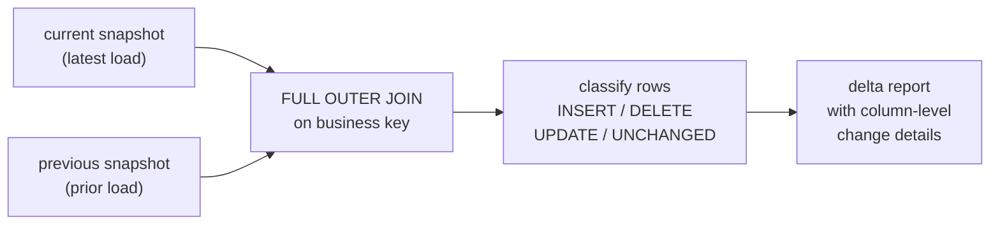

# :material-swap-horizontal: Slowly Changing Comparison

Compare current and previous versions of slowly changing data to detect, quantify, and report what changed between snapshots — essential for audit trails, data quality checks, and incremental ETL validation.

---

## :material-sitemap: Execution Flow



---

## :material-code-tags: Syntax

### Full-snapshot comparison

```sql
WITH comparison AS (
    SELECT
        COALESCE(curr.key, prev.key) AS key,
        CASE
            WHEN prev.key IS NULL THEN 'INSERT'
            WHEN curr.key IS NULL THEN 'DELETE'
            WHEN md5(concat_ws('||', curr.col1, curr.col2))
              <> md5(concat_ws('||', prev.col1, prev.col2))
                 THEN 'UPDATE'
            ELSE 'UNCHANGED'
        END AS change_type,
        prev.col1 AS prev_col1,
        curr.col1 AS curr_col1,
        prev.col2 AS prev_col2,
        curr.col2 AS curr_col2
    FROM current_snapshot curr
    FULL OUTER JOIN previous_snapshot prev
        ON curr.key = prev.key
)
SELECT * FROM comparison
WHERE change_type <> 'UNCHANGED';
```

| Technique | Purpose |
|-----------|---------|
| `FULL OUTER JOIN` on business key | Detects inserts (right-only) and deletes (left-only) alongside updates |
| `md5(concat_ws('||', ...))` row hash | Fast equality check across many columns without comparing each one |
| `<=>` null-safe comparison | Correctly handles `NULL` to value transitions (use per-column when needed) |
| `CASE` classification | Labels every row as INSERT, DELETE, UPDATE, or UNCHANGED |

!!! note "Row hash vs column-level comparison"
    Row hash (`md5`) is fast for detecting *whether* a row changed. For *what* changed, compare individual columns using `NOT (curr.col <=> prev.col)`.

---

## :material-magnify: Behavior

1. **FULL OUTER JOIN** — ensures rows existing in only one snapshot are captured (INSERTs and DELETEs).
2. **NULL handling** — use `<=>` (null-safe equals) when comparing columns that may contain NULLs; standard `=` treats `NULL = NULL` as unknown.
3. **Row hash determinism** — `concat_ws('||', ...)` with a separator avoids false matches from adjacent column concatenation (e.g., `'AB' || 'C'` vs `'A' || 'BC'`).
4. **Snapshot timing** — comparisons assume snapshots are point-in-time consistent. Partial loads will produce misleading deltas.

---

## :material-database: Sample Data

### Dataset 1: Product catalog snapshots

```sql
CREATE OR REPLACE TEMP VIEW products_previous AS
SELECT * FROM VALUES
    (101, 'Wireless Mouse',     'Electronics', 29.99,  150, TRUE),
    (102, 'USB Keyboard',       'Electronics', 49.99,  200, TRUE),
    (103, 'Monitor Stand',      'Furniture',   39.99,  75,  TRUE),
    (104, 'Desk Lamp',          'Furniture',   24.99,  120, TRUE),
    (105, 'Webcam HD',          'Electronics', 59.99,  80,  TRUE),
    (106, 'Cable Organizer',    'Accessories', 9.99,   300, TRUE),
    (107, 'Laptop Sleeve',      'Accessories', 19.99,  95,  FALSE),
    (108, 'Ergonomic Chair',    'Furniture',   299.99, 30,  TRUE)
AS t(product_id, name, category, price, stock, active);

CREATE OR REPLACE TEMP VIEW products_current AS
SELECT * FROM VALUES
    (101, 'Wireless Mouse',     'Electronics', 24.99,  180, TRUE),
    (102, 'USB Keyboard',       'Electronics', 49.99,  200, TRUE),
    (103, 'Monitor Stand',      'Furniture',   44.99,  60,  TRUE),
    (104, 'Desk Lamp',          'Lighting',    24.99,  120, TRUE),
    (105, 'Webcam HD Pro',      'Electronics', 69.99,  80,  TRUE),
    (106, 'Cable Organizer',    'Accessories', 9.99,   300, TRUE),
    (108, 'Ergonomic Chair',    'Furniture',   279.99, 45,  TRUE),
    (109, 'Standing Desk',      'Furniture',   449.99, 20,  TRUE)
AS t(product_id, name, category, price, stock, active);
```

### Dataset 2: Employee directory snapshots

```sql
CREATE OR REPLACE TEMP VIEW employees_jan AS
SELECT * FROM VALUES
    ('E001', 'Alice Chen',    'Engineering', 'Senior Engineer',   95000,  'M001', 'NYC'),
    ('E002', 'Bob Martinez',  'Engineering', 'Staff Engineer',    120000, 'M001', 'NYC'),
    ('E003', 'Carol Davis',   'Sales',       'Account Manager',   85000,  'M002', 'CHI'),
    ('E004', 'Dave Wilson',   'Sales',       'Sales Rep',         65000,  'M002', 'CHI'),
    ('E005', 'Eve Johnson',   'Marketing',   'Content Lead',      78000,  'M003', 'LA'),
    ('E006', 'Frank Brown',   'Engineering', 'Junior Engineer',   72000,  'M001', 'NYC'),
    ('E007', 'Grace Lee',     'HR',          'HR Specialist',     68000,  'M004', 'NYC')
AS t(emp_id, name, department, title, salary, manager_id, office);

CREATE OR REPLACE TEMP VIEW employees_apr AS
SELECT * FROM VALUES
    ('E001', 'Alice Chen',    'Engineering', 'Staff Engineer',    110000, 'M001', 'NYC'),
    ('E002', 'Bob Martinez',  'Engineering', 'Staff Engineer',    125000, 'M001', 'SF'),
    ('E003', 'Carol Davis',   'Sales',       'Senior Account Mgr', 92000, 'M002', 'CHI'),
    ('E004', 'Dave Wilson',   'Marketing',   'Marketing Analyst', 70000,  'M003', 'CHI'),
    ('E006', 'Frank Brown',   'Engineering', 'Mid Engineer',      80000,  'M001', 'NYC'),
    ('E007', 'Grace Lee',     'HR',          'HR Specialist',     68000,  'M004', 'NYC'),
    ('E008', 'Hank Patel',   'Engineering', 'Junior Engineer',   70000,  'M001', 'NYC')
AS t(emp_id, name, department, title, salary, manager_id, office);
```

### Dataset 3: Configuration settings snapshots

```sql
CREATE OR REPLACE TEMP VIEW config_v1 AS
SELECT * FROM VALUES
    ('app.timeout',        '30',       'Performance',   'Connection timeout in seconds'),
    ('app.max_retries',    '3',        'Performance',   'Maximum retry attempts'),
    ('app.log_level',      'INFO',     'Logging',       'Application log level'),
    ('db.pool_size',       '10',       'Database',      'Connection pool size'),
    ('db.host',            'db-prod',  'Database',      'Database hostname'),
    ('cache.ttl',          '300',      'Performance',   'Cache TTL in seconds'),
    ('cache.enabled',      'true',     'Performance',   'Cache toggle'),
    ('auth.token_expiry',  '3600',     'Security',      'Token expiry seconds'),
    ('auth.mfa_required',  'false',    'Security',      'Multi-factor auth toggle')
AS t(setting_key, setting_value, category, description);

CREATE OR REPLACE TEMP VIEW config_v2 AS
SELECT * FROM VALUES
    ('app.timeout',        '60',       'Performance',   'Connection timeout in seconds'),
    ('app.max_retries',    '5',        'Performance',   'Maximum retry attempts'),
    ('app.log_level',      'WARN',     'Logging',       'Application log level'),
    ('db.pool_size',       '20',       'Database',      'Connection pool size'),
    ('db.host',            'db-prod',  'Database',      'Database hostname'),
    ('cache.ttl',          '600',      'Performance',   'Cache TTL in seconds'),
    ('cache.enabled',      'true',     'Performance',   'Cache toggle'),
    ('auth.token_expiry',  '7200',     'Security',      'Token expiry seconds'),
    ('auth.mfa_required',  'true',     'Security',      'Multi-factor auth toggle'),
    ('auth.session_limit', '5',        'Security',      'Max concurrent sessions')
AS t(setting_key, setting_value, category, description);
```

---

## :material-flask-outline: Practical Examples

### 1 — Classify all rows as INSERT, DELETE, UPDATE, or UNCHANGED

```sql
SELECT
    COALESCE(c.product_id, p.product_id) AS product_id,
    COALESCE(c.name, p.name) AS product_name,
    CASE
        WHEN p.product_id IS NULL THEN 'INSERT'
        WHEN c.product_id IS NULL THEN 'DELETE'
        WHEN md5(concat_ws('||', c.name, c.category,
                 CAST(c.price AS STRING), CAST(c.stock AS STRING),
                 CAST(c.active AS STRING)))
          <> md5(concat_ws('||', p.name, p.category,
                 CAST(p.price AS STRING), CAST(p.stock AS STRING),
                 CAST(p.active AS STRING)))
             THEN 'UPDATE'
        ELSE 'UNCHANGED'
    END AS change_type
FROM products_current c
FULL OUTER JOIN products_previous p
    ON c.product_id = p.product_id
ORDER BY COALESCE(c.product_id, p.product_id);
```

??? success "Expected output"

    | product_id | product_name | change_type |
    |------------|--------------|-------------|
    | 101 | Wireless Mouse | UPDATE |
    | 102 | USB Keyboard | UNCHANGED |
    | 103 | Monitor Stand | UPDATE |
    | 104 | Desk Lamp | UPDATE |
    | 105 | Webcam HD Pro | UPDATE |
    | 106 | Cable Organizer | UNCHANGED |
    | 107 | Laptop Sleeve | DELETE |
    | 108 | Ergonomic Chair | UPDATE |
    | 109 | Standing Desk | INSERT |

### 2 — Change summary counts

```sql
WITH comparison AS (
    SELECT
        CASE
            WHEN p.product_id IS NULL THEN 'INSERT'
            WHEN c.product_id IS NULL THEN 'DELETE'
            WHEN md5(concat_ws('||', c.name, c.category,
                     CAST(c.price AS STRING), CAST(c.stock AS STRING),
                     CAST(c.active AS STRING)))
              <> md5(concat_ws('||', p.name, p.category,
                     CAST(p.price AS STRING), CAST(p.stock AS STRING),
                     CAST(p.active AS STRING)))
                 THEN 'UPDATE'
            ELSE 'UNCHANGED'
        END AS change_type
    FROM products_current c
    FULL OUTER JOIN products_previous p
        ON c.product_id = p.product_id
)
SELECT
    change_type,
    COUNT(*) AS row_count,
    ROUND(COUNT(*) * 100.0 / SUM(COUNT(*)) OVER (), 1) AS pct
FROM comparison
GROUP BY change_type
ORDER BY
    CASE change_type
        WHEN 'INSERT' THEN 1
        WHEN 'UPDATE' THEN 2
        WHEN 'DELETE' THEN 3
        ELSE 4
    END;
```

??? success "Expected output"

    | change_type | row_count | pct |
    |-------------|-----------|-----|
    | INSERT | 1 | 11.1 |
    | UPDATE | 5 | 55.6 |
    | DELETE | 1 | 11.1 |
    | UNCHANGED | 2 | 22.2 |

### 3 — Column-level change detection (what exactly changed)

```sql
SELECT
    COALESCE(c.product_id, p.product_id) AS product_id,
    CASE WHEN NOT (c.name <=> p.name) THEN TRUE ELSE FALSE END AS name_changed,
    CASE WHEN NOT (c.category <=> p.category) THEN TRUE ELSE FALSE END AS category_changed,
    CASE WHEN NOT (c.price <=> p.price) THEN TRUE ELSE FALSE END AS price_changed,
    CASE WHEN NOT (c.stock <=> p.stock) THEN TRUE ELSE FALSE END AS stock_changed,
    CASE WHEN NOT (c.active <=> p.active) THEN TRUE ELSE FALSE END AS active_changed
FROM products_current c
FULL OUTER JOIN products_previous p
    ON c.product_id = p.product_id
WHERE p.product_id IS NOT NULL
    AND c.product_id IS NOT NULL
    AND md5(concat_ws('||', c.name, c.category,
            CAST(c.price AS STRING), CAST(c.stock AS STRING),
            CAST(c.active AS STRING)))
     <> md5(concat_ws('||', p.name, p.category,
            CAST(p.price AS STRING), CAST(p.stock AS STRING),
            CAST(p.active AS STRING)))
ORDER BY product_id;
```

??? success "Expected output"

    | product_id | name_changed | category_changed | price_changed | stock_changed | active_changed |
    |------------|--------------|------------------|---------------|---------------|----------------|
    | 101 | false | false | true | true | false |
    | 103 | false | false | true | true | false |
    | 104 | false | true | false | false | false |
    | 105 | true | false | true | false | false |
    | 108 | false | false | true | true | false |

!!! tip "Column flags vs row hash"
    The row hash identifies *which* rows changed quickly. Column-level boolean flags show *what* changed within each row. Use both together for efficient delta reports.

### 4 — Before/after values for changed columns only

```sql
SELECT
    COALESCE(c.product_id, p.product_id) AS product_id,
    p.name AS prev_name,
    c.name AS curr_name,
    CASE WHEN NOT (c.name <=> p.name) THEN 'CHANGED' END AS name_status,
    p.category AS prev_category,
    c.category AS curr_category,
    CASE WHEN NOT (c.category <=> p.category) THEN 'CHANGED' END AS category_status,
    p.price AS prev_price,
    c.price AS curr_price,
    CASE WHEN NOT (c.price <=> p.price) THEN 'CHANGED' END AS price_status,
    c.price - p.price AS price_delta
FROM products_current c
JOIN products_previous p
    ON c.product_id = p.product_id
WHERE md5(concat_ws('||', c.name, c.category,
          CAST(c.price AS STRING), CAST(c.stock AS STRING),
          CAST(c.active AS STRING)))
   <> md5(concat_ws('||', p.name, p.category,
          CAST(p.price AS STRING), CAST(p.stock AS STRING),
          CAST(p.active AS STRING)))
ORDER BY product_id;
```

??? success "Expected output"

    | product_id | prev_name | curr_name | name_status | prev_category | curr_category | category_status | prev_price | curr_price | price_status | price_delta |
    |------------|-----------|-----------|-------------|---------------|---------------|-----------------|------------|------------|--------------|-------------|
    | 101 | Wireless Mouse | Wireless Mouse | null | Electronics | Electronics | null | 29.99 | 24.99 | CHANGED | -5.00 |
    | 103 | Monitor Stand | Monitor Stand | null | Furniture | Furniture | null | 39.99 | 44.99 | CHANGED | 5.00 |
    | 104 | Desk Lamp | Desk Lamp | null | Furniture | Lighting | CHANGED | 24.99 | 24.99 | null | 0.00 |
    | 105 | Webcam HD | Webcam HD Pro | CHANGED | Electronics | Electronics | null | 59.99 | 69.99 | CHANGED | 10.00 |
    | 108 | Ergonomic Chair | Ergonomic Chair | null | Furniture | Furniture | null | 299.99 | 279.99 | CHANGED | -20.00 |

### 5 — Employee change report with multi-column diff

```sql
WITH changes AS (
    SELECT
        COALESCE(c.emp_id, p.emp_id) AS emp_id,
        COALESCE(c.name, p.name) AS name,
        CASE
            WHEN p.emp_id IS NULL THEN 'NEW HIRE'
            WHEN c.emp_id IS NULL THEN 'DEPARTURE'
            ELSE 'ACTIVE'
        END AS status,
        CASE WHEN NOT (c.title <=> p.title) THEN concat(p.title, ' -> ', c.title) END AS title_change,
        CASE WHEN NOT (c.salary <=> p.salary) THEN concat(CAST(p.salary AS STRING), ' -> ', CAST(c.salary AS STRING)) END AS salary_change,
        CASE WHEN NOT (c.department <=> p.department) THEN concat(p.department, ' -> ', c.department) END AS dept_change,
        CASE WHEN NOT (c.office <=> p.office) THEN concat(p.office, ' -> ', c.office) END AS office_change,
        COALESCE(c.salary, 0) - COALESCE(p.salary, 0) AS salary_delta
    FROM employees_apr c
    FULL OUTER JOIN employees_jan p
        ON c.emp_id = p.emp_id
)
SELECT *
FROM changes
WHERE status <> 'ACTIVE'
   OR title_change IS NOT NULL
   OR salary_change IS NOT NULL
   OR dept_change IS NOT NULL
   OR office_change IS NOT NULL
ORDER BY emp_id;
```

??? success "Expected output"

    | emp_id | name | status | title_change | salary_change | dept_change | office_change | salary_delta |
    |--------|------|--------|--------------|---------------|-------------|---------------|--------------|
    | E001 | Alice Chen | ACTIVE | Senior Engineer -> Staff Engineer | 95000 -> 110000 | null | null | 15000 |
    | E002 | Bob Martinez | ACTIVE | null | 120000 -> 125000 | null | NYC -> SF | 5000 |
    | E003 | Carol Davis | ACTIVE | Account Manager -> Senior Account Mgr | 85000 -> 92000 | null | null | 7000 |
    | E004 | Dave Wilson | ACTIVE | Sales Rep -> Marketing Analyst | 65000 -> 70000 | Sales -> Marketing | null | 5000 |
    | E005 | Eve Johnson | DEPARTURE | null | null | null | null | -78000 |
    | E006 | Frank Brown | ACTIVE | Junior Engineer -> Mid Engineer | 72000 -> 80000 | null | null | 8000 |
    | E008 | Hank Patel | NEW HIRE | null | null | null | null | 70000 |

### 6 — Change frequency by column (which columns change most)

```sql
WITH col_changes AS (
    SELECT
        c.emp_id,
        CASE WHEN NOT (c.title <=> p.title) THEN 1 ELSE 0 END AS title_chg,
        CASE WHEN NOT (c.salary <=> p.salary) THEN 1 ELSE 0 END AS salary_chg,
        CASE WHEN NOT (c.department <=> p.department) THEN 1 ELSE 0 END AS dept_chg,
        CASE WHEN NOT (c.office <=> p.office) THEN 1 ELSE 0 END AS office_chg,
        CASE WHEN NOT (c.manager_id <=> p.manager_id) THEN 1 ELSE 0 END AS mgr_chg
    FROM employees_apr c
    JOIN employees_jan p ON c.emp_id = p.emp_id
)
SELECT
    'title' AS column_name,
    SUM(title_chg) AS changes,
    ROUND(SUM(title_chg) * 100.0 / COUNT(*), 1) AS pct_rows
FROM col_changes
UNION ALL
SELECT 'salary', SUM(salary_chg), ROUND(SUM(salary_chg) * 100.0 / COUNT(*), 1) FROM col_changes
UNION ALL
SELECT 'department', SUM(dept_chg), ROUND(SUM(dept_chg) * 100.0 / COUNT(*), 1) FROM col_changes
UNION ALL
SELECT 'office', SUM(office_chg), ROUND(SUM(office_chg) * 100.0 / COUNT(*), 1) FROM col_changes
UNION ALL
SELECT 'manager_id', SUM(mgr_chg), ROUND(SUM(mgr_chg) * 100.0 / COUNT(*), 1) FROM col_changes
ORDER BY changes DESC;
```

??? success "Expected output"

    | column_name | changes | pct_rows |
    |-------------|---------|----------|
    | title | 4 | 66.7 |
    | salary | 5 | 83.3 |
    | department | 1 | 16.7 |
    | office | 1 | 16.7 |
    | manager_id | 1 | 16.7 |

### 7 — Configuration drift detection

```sql
SELECT
    COALESCE(c.setting_key, p.setting_key) AS setting_key,
    COALESCE(c.category, p.category) AS category,
    CASE
        WHEN p.setting_key IS NULL THEN 'ADDED'
        WHEN c.setting_key IS NULL THEN 'REMOVED'
        WHEN NOT (c.setting_value <=> p.setting_value) THEN 'MODIFIED'
        ELSE 'UNCHANGED'
    END AS drift_status,
    p.setting_value AS old_value,
    c.setting_value AS new_value
FROM config_v2 c
FULL OUTER JOIN config_v1 p
    ON c.setting_key = p.setting_key
WHERE p.setting_key IS NULL
   OR c.setting_key IS NULL
   OR NOT (c.setting_value <=> p.setting_value)
ORDER BY category, setting_key;
```

??? success "Expected output"

    | setting_key | category | drift_status | old_value | new_value |
    |-------------|----------|--------------|-----------|-----------|
    | db.pool_size | Database | MODIFIED | 10 | 20 |
    | app.log_level | Logging | MODIFIED | INFO | WARN |
    | app.max_retries | Performance | MODIFIED | 3 | 5 |
    | app.timeout | Performance | MODIFIED | 30 | 60 |
    | cache.ttl | Performance | MODIFIED | 300 | 600 |
    | auth.mfa_required | Security | MODIFIED | false | true |
    | auth.session_limit | Security | ADDED | null | 5 |
    | auth.token_expiry | Security | MODIFIED | 3600 | 7200 |

### 8 — Drift summary by category

```sql
WITH drift AS (
    SELECT
        COALESCE(c.category, p.category) AS category,
        CASE
            WHEN p.setting_key IS NULL THEN 'ADDED'
            WHEN c.setting_key IS NULL THEN 'REMOVED'
            WHEN NOT (c.setting_value <=> p.setting_value) THEN 'MODIFIED'
            ELSE 'UNCHANGED'
        END AS drift_status
    FROM config_v2 c
    FULL OUTER JOIN config_v1 p
        ON c.setting_key = p.setting_key
)
SELECT
    category,
    COUNT(*) AS total_settings,
    SUM(CASE WHEN drift_status = 'MODIFIED' THEN 1 ELSE 0 END) AS modified,
    SUM(CASE WHEN drift_status = 'ADDED' THEN 1 ELSE 0 END) AS added,
    SUM(CASE WHEN drift_status = 'REMOVED' THEN 1 ELSE 0 END) AS removed,
    SUM(CASE WHEN drift_status = 'UNCHANGED' THEN 1 ELSE 0 END) AS unchanged,
    ROUND(
        SUM(CASE WHEN drift_status <> 'UNCHANGED' THEN 1 ELSE 0 END) * 100.0
        / COUNT(*), 1
    ) AS drift_pct
FROM drift
GROUP BY category
ORDER BY drift_pct DESC;
```

??? success "Expected output"

    | category | total_settings | modified | added | removed | unchanged | drift_pct |
    |----------|----------------|----------|-------|---------|-----------|-----------|
    | Security | 3 | 2 | 1 | 0 | 0 | 100.0 |
    | Logging | 1 | 1 | 0 | 0 | 0 | 100.0 |
    | Performance | 4 | 3 | 0 | 0 | 1 | 75.0 |
    | Database | 2 | 1 | 0 | 0 | 1 | 50.0 |

### 9 — Salary impact analysis by department

```sql
WITH salary_changes AS (
    SELECT
        COALESCE(c.department, p.department) AS department,
        COALESCE(c.emp_id, p.emp_id) AS emp_id,
        CASE
            WHEN p.emp_id IS NULL THEN 'NEW_HIRE'
            WHEN c.emp_id IS NULL THEN 'DEPARTURE'
            ELSE 'EXISTING'
        END AS emp_status,
        COALESCE(p.salary, 0) AS prev_salary,
        COALESCE(c.salary, 0) AS curr_salary
    FROM employees_apr c
    FULL OUTER JOIN employees_jan p
        ON c.emp_id = p.emp_id
)
SELECT
    department,
    SUM(CASE WHEN emp_status = 'NEW_HIRE' THEN 1 ELSE 0 END) AS hires,
    SUM(CASE WHEN emp_status = 'DEPARTURE' THEN 1 ELSE 0 END) AS departures,
    SUM(curr_salary) AS current_payroll,
    SUM(prev_salary) AS previous_payroll,
    SUM(curr_salary) - SUM(prev_salary) AS payroll_delta,
    ROUND(
        (SUM(curr_salary) - SUM(prev_salary)) * 100.0
        / NULLIF(SUM(prev_salary), 0), 1
    ) AS pct_change
FROM salary_changes
GROUP BY department
ORDER BY payroll_delta DESC;
```

??? success "Expected output"

    | department | hires | departures | current_payroll | previous_payroll | payroll_delta | pct_change |
    |------------|-------|------------|-----------------|------------------|---------------|------------|
    | Engineering | 1 | 0 | 385000 | 287000 | 98000 | 34.1 |
    | Sales | 0 | 0 | 92000 | 150000 | -58000 | -38.7 |
    | Marketing | 0 | 1 | 70000 | 78000 | -8000 | -10.3 |
    | HR | 0 | 0 | 68000 | 68000 | 0 | 0.0 |

!!! note "Department transfers"
    Dave Wilson moved from Sales to Marketing. His salary appears under Marketing (current) but was previously under Sales. This cross-department movement affects both departments' payroll deltas.

### 10 — Multi-version comparison across three snapshots

Compare two consecutive deltas to identify trends:

```sql
CREATE OR REPLACE TEMP VIEW config_v3 AS
SELECT * FROM VALUES
    ('app.timeout',        '90',       'Performance',   'Connection timeout in seconds'),
    ('app.max_retries',    '5',        'Performance',   'Maximum retry attempts'),
    ('app.log_level',      'ERROR',    'Logging',       'Application log level'),
    ('db.pool_size',       '20',       'Database',      'Connection pool size'),
    ('db.host',            'db-prod',  'Database',      'Database hostname'),
    ('cache.ttl',          '600',      'Performance',   'Cache TTL in seconds'),
    ('cache.enabled',      'false',    'Performance',   'Cache toggle'),
    ('auth.token_expiry',  '7200',     'Security',      'Token expiry seconds'),
    ('auth.mfa_required',  'true',     'Security',      'Multi-factor auth toggle'),
    ('auth.session_limit', '3',        'Security',      'Max concurrent sessions')
AS t(setting_key, setting_value, category, description);

SELECT
    COALESCE(v3.setting_key, v2.setting_key, v1.setting_key) AS setting_key,
    v1.setting_value AS v1_value,
    v2.setting_value AS v2_value,
    v3.setting_value AS v3_value,
    CASE
        WHEN NOT (v1.setting_value <=> v2.setting_value)
         AND NOT (v2.setting_value <=> v3.setting_value)
             THEN 'TRENDING'
        WHEN (v1.setting_value <=> v2.setting_value)
         AND NOT (v2.setting_value <=> v3.setting_value)
             THEN 'NEW_CHANGE'
        WHEN NOT (v1.setting_value <=> v2.setting_value)
         AND (v2.setting_value <=> v3.setting_value)
             THEN 'STABILIZED'
        ELSE 'STABLE'
    END AS trend
FROM config_v1 v1
FULL OUTER JOIN config_v2 v2 ON v1.setting_key = v2.setting_key
FULL OUTER JOIN config_v3 v3 ON v2.setting_key = v3.setting_key
WHERE NOT (
    (v1.setting_value <=> v2.setting_value)
    AND (v2.setting_value <=> v3.setting_value)
)
ORDER BY trend, setting_key;
```

??? success "Expected output"

    | setting_key | v1_value | v2_value | v3_value | trend |
    |-------------|----------|----------|----------|-------|
    | cache.enabled | true | true | false | NEW_CHANGE |
    | auth.session_limit | null | 5 | 3 | NEW_CHANGE |
    | cache.ttl | 300 | 600 | 600 | STABILIZED |
    | auth.mfa_required | false | true | true | STABILIZED |
    | auth.token_expiry | 3600 | 7200 | 7200 | STABILIZED |
    | db.pool_size | 10 | 20 | 20 | STABILIZED |
    | app.max_retries | 3 | 5 | 5 | STABILIZED |
    | app.log_level | INFO | WARN | ERROR | TRENDING |
    | app.timeout | 30 | 60 | 90 | TRENDING |

!!! tip "Trend classification"
    **TRENDING** = changed in both v1→v2 and v2→v3 (ongoing drift). **NEW_CHANGE** = stable then changed. **STABILIZED** = changed once then held. This helps prioritise which configuration drift to investigate.

---

## :material-shield-outline: Behavior Notes

!!! warning "Column ordering in row hash"
    `concat_ws('||', col1, col2)` is sensitive to column order. Always list columns in the same order for both snapshots — mismatched ordering produces false positives.

!!! warning "Type casting"
    Numeric and boolean columns must be explicitly `CAST` to `STRING` before `concat_ws` — otherwise implicit casting differences between snapshots can cause phantom changes.

!!! tip "Performance on large tables"
    For tables with hundreds of millions of rows, pre-filter using partition columns or watermark timestamps before the `FULL OUTER JOIN`. The join itself is expensive at scale.

!!! note "NULL-to-value transitions"
    Standard `<>` treats `NULL <> 'value'` as unknown (not TRUE). Always use `<=>` for null-safe comparison, or wrap with `COALESCE` when detecting changes involving NULLs.

---

## :material-brain: When to Use

| Scenario | Approach |
|----------|----------|
| Detect inserts, updates, deletes between loads | `FULL OUTER JOIN` + `CASE` classification |
| Fast row-level change detection | `md5(concat_ws('||', ...))` row hash comparison |
| Column-level change details | `NOT (curr.col <=> prev.col)` per column |
| Before/after delta report | Side-by-side columns with change flags |
| Change frequency analysis | Count per-column change flags across all rows |
| Configuration drift audit | Compare key-value pairs across versions |
| Payroll / budget impact | Aggregate deltas by category with hire/departure handling |
| Multi-version trend detection | Chain `FULL OUTER JOIN` across 3+ snapshots |
| Data quality validation | Compare source vs target counts and hashes |
| Incremental ETL verification | Confirm delta loads match expected change volume |
