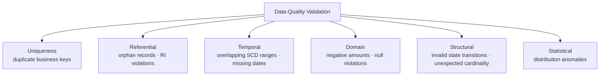

# :material-shield-search: Data-Quality Validation Rules

SQL doubles as a **validation engine** — every one of these checks is a `SELECT`
statement that returns the rows violating a business rule. Run them as standing
checks in a scheduled job (fail the pipeline, or write results to a quarantine/audit
table) rather than one-off debugging queries.

______________________________________________________________________

## :material-sitemap: Validation Categories



______________________________________________________________________

## :material-database: Sample Data

```sql
CREATE OR REPLACE TEMP VIEW customer AS
SELECT * FROM VALUES (1), (2), (2), (3) AS t(customer_id);

CREATE OR REPLACE TEMP VIEW orders AS
SELECT * FROM VALUES (101, 1), (102, 2), (103, 99) AS t(order_id, customer_id);

CREATE OR REPLACE TEMP VIEW dim_customer_scd2 AS
SELECT * FROM VALUES
  (1, 'NY', DATE '2024-01-01', DATE '2024-06-01'),
  (1, 'TX', DATE '2024-05-01', DATE '2024-12-31'),  -- overlaps May 1 – Jun 1
  (2, 'CA', DATE '2024-01-01', DATE '2024-12-31')
AS t(customer_id, state, valid_from, valid_to);

CREATE OR REPLACE TEMP VIEW daily_snapshot AS
SELECT * FROM VALUES (DATE '2024-01-01'), (DATE '2024-01-02'), (DATE '2024-01-04')
AS t(snapshot_date);

CREATE OR REPLACE TEMP VIEW payments AS
SELECT * FROM VALUES (1, 100.0), (2, -50.0), (3, 20.0) AS t(payment_id, amount);

CREATE OR REPLACE TEMP VIEW leads AS
SELECT * FROM VALUES (1, 'a@x.com'), (2, CAST(NULL AS STRING)), (3, 'c@x.com')
AS t(lead_id, email);

CREATE OR REPLACE TEMP VIEW order_shipment AS
SELECT * FROM VALUES (1001, 'S1'), (1001, 'S2'), (1002, 'S3')
AS t(order_id, shipment_id);
```

______________________________________________________________________

## :material-numeric-1-circle: Duplicate Business Keys

```sql
SELECT customer_id
FROM customer
GROUP BY customer_id
HAVING COUNT(*) > 1;
```

| customer_id |
| ----------- |
| 2           |

Verified: `customer_id = 2` appears twice. See [Finding Duplicates](duplicates/finding.md)
for five more approaches (CTE + join for full rows, `ROW_NUMBER`, candidate-key checks).

______________________________________________________________________

## :material-numeric-2-circle: Orphan Records / Referential-Integrity Violations

Spark has no enforced foreign keys — a fact row can reference a dimension key that
was never loaded, deleted, or mistyped. `LEFT ANTI JOIN` finds every fact row with no
matching dimension row in one scan:

```sql
SELECT o.order_id, o.customer_id
FROM orders o
LEFT ANTI JOIN customer c
    ON o.customer_id = c.customer_id;
```

| order_id | customer_id |
| -------- | ----------- |
| 103      | 99          |

Verified: order `103` references `customer_id = 99`, which doesn't exist in
`customer`. Run this check after every incremental load of the fact table — it's the
one integrity guarantee a foreign-key constraint would give you in a traditional RDBMS,
recreated as a query. See [Set-Based Business Problems](../../querying/operator/set.md)
for why `LEFT ANTI JOIN` is the right tool here, not `NOT IN` (which silently returns
zero rows if the dimension table has any `NULL` key).

______________________________________________________________________

## :material-numeric-3-circle: Overlapping SCD Ranges

```sql
SELECT a.customer_id, a.valid_from AS a_from, a.valid_to AS a_to,
       b.valid_from AS b_from, b.valid_to AS b_to
FROM dim_customer_scd2 a
JOIN dim_customer_scd2 b
    ON a.customer_id = b.customer_id
   AND a.valid_from < b.valid_to
   AND b.valid_from < a.valid_to
   AND a.valid_from < b.valid_from;   -- report each overlapping pair once
```

| customer_id | a_from     | a_to       | b_from     | b_to       |
| ----------- | ---------- | ---------- | ---------- | ---------- |
| 1           | 2024-01-01 | 2024-06-01 | 2024-05-01 | 2024-12-31 |

Verified: customer 1 has two SCD Type 2 rows both claiming validity during May 2024 —
a sign of a corrupted `MERGE` or a race between two loaders. See
[SCD — Advanced Complications](../scd/index.md#advanced-complications) for how this
happens and how backdated corrections must split rows instead of inserting overlaps.

______________________________________________________________________

## :material-numeric-4-circle: Missing Dates (Gaps in a Required Series)

```sql
WITH bounds AS (
    SELECT MIN(snapshot_date) AS lo, MAX(snapshot_date) AS hi FROM daily_snapshot
),
calendar AS (
    SELECT EXPLODE(SEQUENCE(lo, hi, INTERVAL 1 DAY)) AS expected_date FROM bounds
)
SELECT c.expected_date
FROM calendar c
LEFT ANTI JOIN daily_snapshot d
    ON c.expected_date = d.snapshot_date;
```

| expected_date |
| ------------- |
| 2024-01-03    |

Verified: `SEQUENCE` materializes every day between the earliest and latest snapshot,
and the anti-join surfaces the missing `2024-01-03`. This is the validation-engine
counterpart to [Gaps & Islands](../sequence/gaps-islands.md) — that page finds gaps in
data that exists; this check finds gaps against a required calendar, which also
catches a completely missing day at the start or end if you anchor `bounds` to an
external expected range instead of `MIN`/`MAX` of the data itself.

______________________________________________________________________

## :material-numeric-5-circle: Negative Amounts (Domain / Range Violations)

```sql
SELECT payment_id, amount
FROM payments
WHERE amount < 0;
```

| payment_id | amount |
| ---------- | ------ |
| 2          | -50.0  |

The simplest validation shape — a direct `WHERE` predicate encoding a business rule
("payments are never negative"). Generalizes to any bounded-domain check: `amount > 1_000_000` (implausibly large), `quantity <= 0`, `discount_pct NOT BETWEEN 0 AND 1`.

______________________________________________________________________

## :material-numeric-6-circle: Null Violations (Required Field Missing)

```sql
SELECT lead_id
FROM leads
WHERE email IS NULL;
```

| lead_id |
| ------- |
| 2       |

For multiple required columns, combine with `OR` and report which column failed:

```sql
SELECT
    lead_id,
    ARRAY_JOIN(
        FILTER(
            ARRAY(
                IF(email IS NULL, 'email', NULL),
                IF(lead_id IS NULL, 'lead_id', NULL)
            ),
            x -> x IS NOT NULL
        ),
        ', '
    ) AS missing_fields
FROM leads
WHERE email IS NULL OR lead_id IS NULL;
```

This uses the array `FILTER`/`ARRAY_JOIN` pattern from
[Array/Map SQL](../../functions/lambda/patterns.md) to report every failing column in
a single row per bad record, instead of one query per column.

______________________________________________________________________

## :material-numeric-7-circle: Invalid State Transitions

```sql
-- valid_transitions(from_state, to_state) enumerates every allowed edge
SELECT o.order_id, o.prev_state, o.event_type AS attempted_state
FROM (
    SELECT *,
        LAG(event_type) OVER (PARTITION BY order_id ORDER BY event_time) AS prev_state
    FROM order_events
) o
LEFT JOIN valid_transitions v
    ON o.prev_state = v.from_state AND o.event_type = v.to_state
WHERE o.prev_state IS NOT NULL
  AND v.from_state IS NULL;    -- no matching allowed edge
```

Already fully worked out, including a verified example that correctly flags a
`PAID → DELIVERED` transition that skips `SHIPPED`, in
[State-Machine Analysis — Order Lifecycle](../sequence/state-machine.md).

______________________________________________________________________

## :material-numeric-8-circle: Unexpected Cardinality

```sql
SELECT order_id, COUNT(*) AS shipment_count
FROM order_shipment
GROUP BY order_id
HAVING COUNT(*) > 1;
```

| order_id | shipment_count |
| -------- | -------------- |
| 1001     | 2              |

Verified: order `1001` has two shipment rows where the business rule expects exactly
one. This is the same `GROUP BY HAVING COUNT(*)` shape as duplicate-key detection —
the only difference is which relationship you're asserting (1:1 vs 1:many) and
therefore which count is "wrong." It's also the root-cause check behind
[join-explosion bugs](../../querying/joins/issues/data-explosion.md) — validate cardinality on both
sides of a join *before* trusting its output, not after debugging a mysteriously
inflated row count.

______________________________________________________________________

## :material-numeric-9-circle: Distribution Anomalies

Already fully covered — see [Outlier Detection](outlier-detection.md) for z-score,
IQR-fence, percentile-threshold, and modified-Z-score (MAD) approaches, plus a
multi-method consensus pattern and a ready-to-use quarantine-table example.

______________________________________________________________________

## :material-database-search: [Databricks] Real-World Example — System Tables

!!! note "[Databricks] Unity Catalog system tables"

    `system.access.audit` and `system.information_schema.columns` are built-in Unity
    Catalog system tables (no synthetic sample data setup needed) that let you run
    validation checks against real platform activity and real table metadata. An
    account admin must `GRANT USE CATALOG, USE SCHEMA, SELECT ON SCHEMA system.access TO <principal>` and the equivalent access for `system.information_schema` before
    these queries will return rows.

### 10 — Audit-log response validation rules

```sql
-- [Databricks] Requires SELECT on system.access.audit
SELECT
    event_time,
    user_identity.email AS user_email,
    action_name,
    response.status_code,
    response.error_message
FROM system.access.audit
WHERE event_date >= DATE_SUB(CURRENT_DATE(), 7)
  AND (
      response.status_code NOT IN ('200', '201', '400', '401', '403', '404', '429', '500')
      OR (response.status_code IN ('200', '201') AND response.error_message IS NOT NULL)
      OR (response.status_code NOT IN ('200', '201') AND response.error_message IS NULL)
  )
ORDER BY event_time DESC;
-- Result (illustrative):
-- event_time           | user_email          | action_name  | status_code | error_message
-- ---------------------|---------------------|--------------|-------------|-------------------------
-- 2024-07-19 09:14:22  | analyst@company.com | createToken  | 200         | Permission denied
-- 2024-07-19 09:21:10  | svc@datacorp.com    | login        | 599         | Upstream timeout
```

### 11 — Schema-conformance check for required columns and types

```sql
-- [Databricks] Requires SELECT on system.information_schema.columns
WITH expected_columns AS (
    SELECT * FROM VALUES
        ('customer_id', 'bigint'),
        ('email', 'string'),
        ('created_at', 'timestamp')
    AS t(column_name, expected_type)
)
SELECT
    e.column_name,
    e.expected_type,
    c.data_type AS actual_type,
    CASE
        WHEN c.column_name IS NULL THEN 'MISSING'
        WHEN LOWER(c.data_type) <> e.expected_type THEN 'TYPE_MISMATCH'
        ELSE 'VALID'
    END AS validation_status
FROM expected_columns AS e
LEFT JOIN system.information_schema.columns AS c
    ON c.table_catalog = 'main'
   AND c.table_schema = 'gold'
   AND c.table_name = 'customers'
   AND LOWER(c.column_name) = e.column_name
WHERE c.column_name IS NULL
   OR LOWER(c.data_type) <> e.expected_type
ORDER BY e.column_name;
-- Result (illustrative):
-- column_name | expected_type | actual_type | validation_status
-- ------------|---------------|-------------|------------------
-- created_at  | timestamp     | string      | TYPE_MISMATCH
-- email       | string        | NULL        | MISSING
```

!!! tip "Same pattern, production data"

    Validation rules remain just `SELECT` statements that return violations. The
    only difference is that production system tables give you authoritative
    operational data and metadata — so the same rule-checking pattern can validate
    audit events, schemas, and governance standards without any sample setup.

______________________________________________________________________

## :material-brain: When to Use

| Check                               | Technique                                              | Page                                                                   |
| ----------------------------------- | ------------------------------------------------------ | ---------------------------------------------------------------------- |
| Duplicate business keys             | `GROUP BY HAVING COUNT(*) > 1`                         | [Finding Duplicates](duplicates/finding.md)                            |
| Orphan records / RI violations      | `LEFT ANTI JOIN`                                       | This page                                                              |
| Overlapping SCD ranges              | Self-join on interval overlap                          | This page, [SCD Complications](../scd/index.md#advanced-complications) |
| Missing dates                       | `SEQUENCE` + `LEFT ANTI JOIN`                          | This page, [Gaps & Islands](../sequence/gaps-islands.md)               |
| Negative amounts / range violations | `WHERE` domain predicate                               | This page                                                              |
| Invalid state transitions           | `LAG` + anti-join to a transitions table               | [State-Machine Analysis](../sequence/state-machine.md)                 |
| Unexpected cardinality              | `GROUP BY HAVING COUNT(*) <> expected`                 | This page                                                              |
| Null violations                     | `WHERE col IS NULL`, or array-based multi-column check | This page                                                              |
| Distribution anomalies              | z-score, IQR, percentile, MAD                          | [Outlier Detection](outlier-detection.md)                              |

______________________________________________________________________

!!! note "Related"

    [Duplicates](duplicates/index.md) and [Outlier Detection](outlier-detection.md)
    are the two validation categories substantial enough to warrant their own pages;
    this page covers the remaining checks and cross-links back to every pattern page
    where a check is already worked out in depth.
