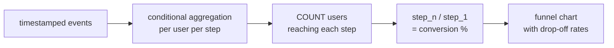

# :material-filter-variant: Funnel Analysis

Measure how users progress through an ordered sequence of steps — sign-up flows, purchase checkouts, onboarding wizards — and identify where they drop off, using conditional aggregation, window functions, and self-joins.

---

## :material-sitemap: Execution Flow



---

## :material-pin: Syntax

### Conditional-aggregation approach (simplest)

```sql
SELECT
    COUNT(DISTINCT user_id) AS total_users,
    COUNT(DISTINCT CASE WHEN event = 'step_1' THEN user_id END) AS step_1,
    COUNT(DISTINCT CASE WHEN event = 'step_2' THEN user_id END) AS step_2,
    COUNT(DISTINCT CASE WHEN event = 'step_3' THEN user_id END) AS step_3
FROM events;
```

### Sequential funnel (order-aware)

```sql
WITH step_times AS (
    SELECT
        user_id,
        MIN(CASE WHEN event = 'step_1' THEN event_time END) AS t1,
        MIN(CASE WHEN event = 'step_2' THEN event_time END) AS t2,
        MIN(CASE WHEN event = 'step_3' THEN event_time END) AS t3
    FROM events
    GROUP BY user_id
)
SELECT
    COUNT(*) AS total_users,
    SUM(CASE WHEN t1 IS NOT NULL THEN 1 ELSE 0 END) AS reached_step_1,
    SUM(CASE WHEN t2 IS NOT NULL AND t2 > t1 THEN 1 ELSE 0 END) AS reached_step_2,
    SUM(CASE WHEN t3 IS NOT NULL AND t3 > t2 THEN 1 ELSE 0 END) AS reached_step_3
FROM step_times;
```

| Approach | Enforces order | Handles repeats | Complexity |
|----------|----------------|-----------------|------------|
| Conditional aggregation | No | Yes (COUNT DISTINCT) | Low |
| Sequential MIN timestamps | Yes (`t2 > t1`) | First occurrence only | Medium |
| Window-based step matching | Yes | Configurable | High |

!!! note "Sequential vs non-sequential"
    A non-sequential funnel counts users who performed each step *at any time*. A sequential funnel requires steps to occur in order (`t2 > t1 > t0`). Most conversion funnels should be sequential to avoid counting users who skipped steps.

---

## :material-magnify: Behavior

1. **Step ordering** — sequential funnels use `MIN(event_time)` per step and compare timestamps to enforce the correct progression.
2. **Repeated events** — users may trigger the same event multiple times; `MIN()` takes the first occurrence, `COUNT(DISTINCT)` deduplicates.
3. **Drop-off calculation** — conversion rate at step N = `step_N / step_1 * 100`. Step-to-step drop-off = `(step_N - step_N+1) / step_N * 100`.
4. **Time-bounded funnels** — add a maximum time window (e.g., 7 days) between first and last step to measure timely conversions.

---

## :material-database: Sample Data

### Dataset 1: E-commerce checkout funnel

```sql
CREATE OR REPLACE TEMP VIEW checkout_events AS
SELECT * FROM VALUES
    ('u01', TIMESTAMP '2024-06-01 10:00:00', 'view_product'),
    ('u01', TIMESTAMP '2024-06-01 10:05:00', 'add_to_cart'),
    ('u01', TIMESTAMP '2024-06-01 10:08:00', 'begin_checkout'),
    ('u01', TIMESTAMP '2024-06-01 10:12:00', 'add_payment'),
    ('u01', TIMESTAMP '2024-06-01 10:15:00', 'purchase'),
    ('u02', TIMESTAMP '2024-06-01 11:00:00', 'view_product'),
    ('u02', TIMESTAMP '2024-06-01 11:03:00', 'add_to_cart'),
    ('u02', TIMESTAMP '2024-06-01 11:10:00', 'begin_checkout'),
    ('u02', TIMESTAMP '2024-06-01 11:25:00', 'add_payment'),
    ('u03', TIMESTAMP '2024-06-01 12:00:00', 'view_product'),
    ('u03', TIMESTAMP '2024-06-01 12:02:00', 'add_to_cart'),
    ('u03', TIMESTAMP '2024-06-01 12:04:00', 'begin_checkout'),
    ('u03', TIMESTAMP '2024-06-01 12:06:00', 'add_payment'),
    ('u03', TIMESTAMP '2024-06-01 12:08:00', 'purchase'),
    ('u04', TIMESTAMP '2024-06-01 13:00:00', 'view_product'),
    ('u04', TIMESTAMP '2024-06-01 13:05:00', 'add_to_cart'),
    ('u05', TIMESTAMP '2024-06-01 14:00:00', 'view_product'),
    ('u05', TIMESTAMP '2024-06-01 14:10:00', 'view_product'),
    ('u06', TIMESTAMP '2024-06-01 15:00:00', 'view_product'),
    ('u06', TIMESTAMP '2024-06-01 15:04:00', 'add_to_cart'),
    ('u06', TIMESTAMP '2024-06-01 15:08:00', 'begin_checkout'),
    ('u06', TIMESTAMP '2024-06-01 15:30:00', 'add_payment'),
    ('u06', TIMESTAMP '2024-06-01 15:32:00', 'purchase'),
    ('u07', TIMESTAMP '2024-06-01 16:00:00', 'view_product'),
    ('u07', TIMESTAMP '2024-06-01 16:03:00', 'add_to_cart'),
    ('u07', TIMESTAMP '2024-06-01 16:06:00', 'begin_checkout'),
    ('u08', TIMESTAMP '2024-06-01 17:00:00', 'view_product')
AS t(user_id, event_time, event);
```

### Dataset 2: SaaS onboarding funnel

```sql
CREATE OR REPLACE TEMP VIEW onboarding_events AS
SELECT * FROM VALUES
    ('org_A', TIMESTAMP '2024-07-01 09:00:00', 'signup'),
    ('org_A', TIMESTAMP '2024-07-01 09:05:00', 'email_verified'),
    ('org_A', TIMESTAMP '2024-07-01 09:20:00', 'profile_completed'),
    ('org_A', TIMESTAMP '2024-07-02 10:00:00', 'first_project'),
    ('org_A', TIMESTAMP '2024-07-03 14:00:00', 'invite_team'),
    ('org_A', TIMESTAMP '2024-07-05 11:00:00', 'first_deploy'),
    ('org_B', TIMESTAMP '2024-07-01 10:00:00', 'signup'),
    ('org_B', TIMESTAMP '2024-07-01 10:02:00', 'email_verified'),
    ('org_B', TIMESTAMP '2024-07-01 11:00:00', 'profile_completed'),
    ('org_B', TIMESTAMP '2024-07-02 09:00:00', 'first_project'),
    ('org_B', TIMESTAMP '2024-07-03 15:00:00', 'invite_team'),
    ('org_C', TIMESTAMP '2024-07-01 11:00:00', 'signup'),
    ('org_C', TIMESTAMP '2024-07-01 11:05:00', 'email_verified'),
    ('org_C', TIMESTAMP '2024-07-02 08:00:00', 'profile_completed'),
    ('org_C', TIMESTAMP '2024-07-03 10:00:00', 'first_project'),
    ('org_D', TIMESTAMP '2024-07-01 12:00:00', 'signup'),
    ('org_D', TIMESTAMP '2024-07-01 12:30:00', 'email_verified'),
    ('org_D', TIMESTAMP '2024-07-02 09:00:00', 'profile_completed'),
    ('org_E', TIMESTAMP '2024-07-01 13:00:00', 'signup'),
    ('org_E', TIMESTAMP '2024-07-01 13:10:00', 'email_verified'),
    ('org_F', TIMESTAMP '2024-07-01 14:00:00', 'signup'),
    ('org_G', TIMESTAMP '2024-07-02 08:00:00', 'signup'),
    ('org_G', TIMESTAMP '2024-07-02 08:05:00', 'email_verified'),
    ('org_G', TIMESTAMP '2024-07-02 08:30:00', 'profile_completed'),
    ('org_G', TIMESTAMP '2024-07-02 09:00:00', 'first_project'),
    ('org_G', TIMESTAMP '2024-07-02 10:00:00', 'invite_team'),
    ('org_G', TIMESTAMP '2024-07-02 14:00:00', 'first_deploy')
AS t(org_id, event_time, event);
```

### Dataset 3: Daily cohort signups

```sql
CREATE OR REPLACE TEMP VIEW cohort_events AS
SELECT * FROM VALUES
    ('2024-W26', 'u10', TIMESTAMP '2024-06-24 10:00:00', 'signup'),
    ('2024-W26', 'u10', TIMESTAMP '2024-06-24 10:05:00', 'activate'),
    ('2024-W26', 'u10', TIMESTAMP '2024-06-25 09:00:00', 'first_use'),
    ('2024-W26', 'u10', TIMESTAMP '2024-06-28 11:00:00', 'subscribe'),
    ('2024-W26', 'u11', TIMESTAMP '2024-06-24 11:00:00', 'signup'),
    ('2024-W26', 'u11', TIMESTAMP '2024-06-24 11:10:00', 'activate'),
    ('2024-W26', 'u11', TIMESTAMP '2024-06-26 14:00:00', 'first_use'),
    ('2024-W26', 'u12', TIMESTAMP '2024-06-25 08:00:00', 'signup'),
    ('2024-W26', 'u12', TIMESTAMP '2024-06-25 08:05:00', 'activate'),
    ('2024-W26', 'u13', TIMESTAMP '2024-06-25 09:00:00', 'signup'),
    ('2024-W27', 'u14', TIMESTAMP '2024-07-01 10:00:00', 'signup'),
    ('2024-W27', 'u14', TIMESTAMP '2024-07-01 10:03:00', 'activate'),
    ('2024-W27', 'u14', TIMESTAMP '2024-07-01 14:00:00', 'first_use'),
    ('2024-W27', 'u14', TIMESTAMP '2024-07-03 10:00:00', 'subscribe'),
    ('2024-W27', 'u15', TIMESTAMP '2024-07-01 11:00:00', 'signup'),
    ('2024-W27', 'u15', TIMESTAMP '2024-07-01 11:05:00', 'activate'),
    ('2024-W27', 'u15', TIMESTAMP '2024-07-02 09:00:00', 'first_use'),
    ('2024-W27', 'u15', TIMESTAMP '2024-07-05 10:00:00', 'subscribe'),
    ('2024-W27', 'u16', TIMESTAMP '2024-07-02 08:00:00', 'signup'),
    ('2024-W27', 'u16', TIMESTAMP '2024-07-02 08:10:00', 'activate'),
    ('2024-W27', 'u16', TIMESTAMP '2024-07-03 11:00:00', 'first_use'),
    ('2024-W27', 'u17', TIMESTAMP '2024-07-02 09:00:00', 'signup'),
    ('2024-W27', 'u17', TIMESTAMP '2024-07-02 09:05:00', 'activate')
AS t(cohort, user_id, event_time, event);
```

---

## :material-flask-outline: Practical Examples

### 1 — Basic checkout funnel (non-sequential)

```sql
SELECT
    COUNT(DISTINCT user_id) AS total_users,
    COUNT(DISTINCT CASE WHEN event = 'view_product'    THEN user_id END) AS step_1_view,
    COUNT(DISTINCT CASE WHEN event = 'add_to_cart'     THEN user_id END) AS step_2_cart,
    COUNT(DISTINCT CASE WHEN event = 'begin_checkout'  THEN user_id END) AS step_3_checkout,
    COUNT(DISTINCT CASE WHEN event = 'add_payment'     THEN user_id END) AS step_4_payment,
    COUNT(DISTINCT CASE WHEN event = 'purchase'        THEN user_id END) AS step_5_purchase
FROM checkout_events;
```

??? success "Expected output"

    | total_users | step_1_view | step_2_cart | step_3_checkout | step_4_payment | step_5_purchase |
    |-------------|-------------|------------|-----------------|----------------|-----------------|
    | 8 | 8 | 6 | 5 | 4 | 3 |

### 2 — Sequential funnel with conversion rates

```sql
WITH step_times AS (
    SELECT
        user_id,
        MIN(CASE WHEN event = 'view_product'   THEN event_time END) AS t_view,
        MIN(CASE WHEN event = 'add_to_cart'    THEN event_time END) AS t_cart,
        MIN(CASE WHEN event = 'begin_checkout' THEN event_time END) AS t_checkout,
        MIN(CASE WHEN event = 'add_payment'    THEN event_time END) AS t_payment,
        MIN(CASE WHEN event = 'purchase'       THEN event_time END) AS t_purchase
    FROM checkout_events
    GROUP BY user_id
),
reached AS (
    SELECT
        COUNT(*) AS total,
        SUM(CASE WHEN t_view IS NOT NULL THEN 1 ELSE 0 END) AS s1,
        SUM(CASE WHEN t_cart IS NOT NULL AND t_cart > t_view THEN 1 ELSE 0 END) AS s2,
        SUM(CASE WHEN t_checkout IS NOT NULL AND t_checkout > t_cart THEN 1 ELSE 0 END) AS s3,
        SUM(CASE WHEN t_payment IS NOT NULL AND t_payment > t_checkout THEN 1 ELSE 0 END) AS s4,
        SUM(CASE WHEN t_purchase IS NOT NULL AND t_purchase > t_payment THEN 1 ELSE 0 END) AS s5
    FROM step_times
)
SELECT
    s1 AS view_product,
    s2 AS add_to_cart,
    s3 AS begin_checkout,
    s4 AS add_payment,
    s5 AS purchase,
    ROUND(s2 * 100.0 / NULLIF(s1, 0), 1) AS view_to_cart_pct,
    ROUND(s3 * 100.0 / NULLIF(s2, 0), 1) AS cart_to_checkout_pct,
    ROUND(s4 * 100.0 / NULLIF(s3, 0), 1) AS checkout_to_payment_pct,
    ROUND(s5 * 100.0 / NULLIF(s4, 0), 1) AS payment_to_purchase_pct,
    ROUND(s5 * 100.0 / NULLIF(s1, 0), 1) AS overall_conversion_pct
FROM reached;
```

??? success "Expected output"

    | view_product | add_to_cart | begin_checkout | add_payment | purchase | view_to_cart_pct | cart_to_checkout_pct | checkout_to_payment_pct | payment_to_purchase_pct | overall_conversion_pct |
    |--------------|------------|----------------|-------------|----------|------------------|----------------------|-------------------------|-------------------------|------------------------|
    | 8 | 6 | 5 | 4 | 3 | 75.0 | 83.3 | 80.0 | 75.0 | 37.5 |

### 3 — Funnel with step-to-step drop-off counts

```sql
WITH step_times AS (
    SELECT
        user_id,
        MIN(CASE WHEN event = 'view_product'   THEN event_time END) AS t1,
        MIN(CASE WHEN event = 'add_to_cart'    THEN event_time END) AS t2,
        MIN(CASE WHEN event = 'begin_checkout' THEN event_time END) AS t3,
        MIN(CASE WHEN event = 'add_payment'    THEN event_time END) AS t4,
        MIN(CASE WHEN event = 'purchase'       THEN event_time END) AS t5
    FROM checkout_events
    GROUP BY user_id
),
counts AS (
    SELECT
        SUM(CASE WHEN t1 IS NOT NULL THEN 1 ELSE 0 END) AS s1,
        SUM(CASE WHEN t2 IS NOT NULL AND t2 > t1 THEN 1 ELSE 0 END) AS s2,
        SUM(CASE WHEN t3 IS NOT NULL AND t3 > t2 THEN 1 ELSE 0 END) AS s3,
        SUM(CASE WHEN t4 IS NOT NULL AND t4 > t3 THEN 1 ELSE 0 END) AS s4,
        SUM(CASE WHEN t5 IS NOT NULL AND t5 > t4 THEN 1 ELSE 0 END) AS s5
    FROM step_times
)
SELECT * FROM VALUES
    ('1. view_product',   s1, 0,       100.0),
    ('2. add_to_cart',    s2, s1 - s2, ROUND(s2 * 100.0 / s1, 1)),
    ('3. begin_checkout', s3, s2 - s3, ROUND(s3 * 100.0 / s1, 1)),
    ('4. add_payment',    s4, s3 - s4, ROUND(s4 * 100.0 / s1, 1)),
    ('5. purchase',       s5, s4 - s5, ROUND(s5 * 100.0 / s1, 1))
AS funnel(step, users_reached, dropped, pct_of_top)
FROM counts;
```

??? success "Expected output"

    | step | users_reached | dropped | pct_of_top |
    |------|---------------|---------|------------|
    | 1. view_product | 8 | 0 | 100.0 |
    | 2. add_to_cart | 6 | 2 | 75.0 |
    | 3. begin_checkout | 5 | 1 | 62.5 |
    | 4. add_payment | 4 | 1 | 50.0 |
    | 5. purchase | 3 | 1 | 37.5 |

### 4 — Unpivoted funnel (dynamic-friendly output)

Produce one row per step instead of one column per step — easier to chart in BI tools:

```sql
WITH step_times AS (
    SELECT
        user_id,
        MIN(CASE WHEN event = 'view_product'   THEN event_time END) AS t1,
        MIN(CASE WHEN event = 'add_to_cart'    THEN event_time END) AS t2,
        MIN(CASE WHEN event = 'begin_checkout' THEN event_time END) AS t3,
        MIN(CASE WHEN event = 'add_payment'    THEN event_time END) AS t4,
        MIN(CASE WHEN event = 'purchase'       THEN event_time END) AS t5
    FROM checkout_events
    GROUP BY user_id
),
per_user AS (
    SELECT user_id, 1 AS step_num, 'view_product'   AS step_name, t1 AS step_time FROM step_times WHERE t1 IS NOT NULL
    UNION ALL
    SELECT user_id, 2, 'add_to_cart',    t2 FROM step_times WHERE t2 IS NOT NULL AND t2 > t1
    UNION ALL
    SELECT user_id, 3, 'begin_checkout', t3 FROM step_times WHERE t3 IS NOT NULL AND t3 > t2
    UNION ALL
    SELECT user_id, 4, 'add_payment',    t4 FROM step_times WHERE t4 IS NOT NULL AND t4 > t3
    UNION ALL
    SELECT user_id, 5, 'purchase',       t5 FROM step_times WHERE t5 IS NOT NULL AND t5 > t4
)
SELECT
    step_num,
    step_name,
    COUNT(DISTINCT user_id) AS users_reached
FROM per_user
GROUP BY step_num, step_name
ORDER BY step_num;
```

??? success "Expected output"

    | step_num | step_name | users_reached |
    |----------|-----------|---------------|
    | 1 | view_product | 8 |
    | 2 | add_to_cart | 6 |
    | 3 | begin_checkout | 5 |
    | 4 | add_payment | 4 |
    | 5 | purchase | 3 |

### 5 — SaaS onboarding funnel with median time between steps

```sql
WITH step_times AS (
    SELECT
        org_id,
        MIN(CASE WHEN event = 'signup'            THEN event_time END) AS t1,
        MIN(CASE WHEN event = 'email_verified'    THEN event_time END) AS t2,
        MIN(CASE WHEN event = 'profile_completed' THEN event_time END) AS t3,
        MIN(CASE WHEN event = 'first_project'     THEN event_time END) AS t4,
        MIN(CASE WHEN event = 'invite_team'       THEN event_time END) AS t5,
        MIN(CASE WHEN event = 'first_deploy'      THEN event_time END) AS t6
    FROM onboarding_events
    GROUP BY org_id
)
SELECT
    COUNT(*) AS total_orgs,
    SUM(CASE WHEN t1 IS NOT NULL THEN 1 ELSE 0 END) AS signup,
    SUM(CASE WHEN t2 IS NOT NULL AND t2 > t1 THEN 1 ELSE 0 END) AS verified,
    SUM(CASE WHEN t3 IS NOT NULL AND t3 > t2 THEN 1 ELSE 0 END) AS profile,
    SUM(CASE WHEN t4 IS NOT NULL AND t4 > t3 THEN 1 ELSE 0 END) AS project,
    SUM(CASE WHEN t5 IS NOT NULL AND t5 > t4 THEN 1 ELSE 0 END) AS team,
    SUM(CASE WHEN t6 IS NOT NULL AND t6 > t5 THEN 1 ELSE 0 END) AS deploy,
    ROUND(PERCENTILE(
        CASE WHEN t2 > t1 THEN (BIGINT(t2) - BIGINT(t1)) / 60.0 END, 0.5
    ), 1) AS median_min_to_verify,
    ROUND(PERCENTILE(
        CASE WHEN t4 > t3 THEN (BIGINT(t4) - BIGINT(t3)) / 3600.0 END, 0.5
    ), 1) AS median_hrs_to_project
FROM step_times;
```

??? success "Expected output"

    | total_orgs | signup | verified | profile | project | team | deploy | median_min_to_verify | median_hrs_to_project |
    |------------|--------|----------|---------|---------|------|--------|----------------------|-----------------------|
    | 7 | 7 | 6 | 5 | 4 | 3 | 2 | 5.0 | 23.0 |

### 6 — Identify users who dropped off at each step

```sql
WITH step_times AS (
    SELECT
        user_id,
        MIN(CASE WHEN event = 'view_product'   THEN event_time END) AS t1,
        MIN(CASE WHEN event = 'add_to_cart'    THEN event_time END) AS t2,
        MIN(CASE WHEN event = 'begin_checkout' THEN event_time END) AS t3,
        MIN(CASE WHEN event = 'add_payment'    THEN event_time END) AS t4,
        MIN(CASE WHEN event = 'purchase'       THEN event_time END) AS t5
    FROM checkout_events
    GROUP BY user_id
),
classified AS (
    SELECT
        user_id,
        CASE
            WHEN t5 IS NOT NULL AND t5 > t4 THEN 'completed'
            WHEN t4 IS NOT NULL AND t4 > t3 THEN 'dropped_at_payment'
            WHEN t3 IS NOT NULL AND t3 > t2 THEN 'dropped_at_checkout'
            WHEN t2 IS NOT NULL AND t2 > t1 THEN 'dropped_at_cart'
            WHEN t1 IS NOT NULL              THEN 'dropped_at_view'
            ELSE 'no_activity'
        END AS drop_off_stage
    FROM step_times
)
SELECT
    drop_off_stage,
    COUNT(*) AS user_count,
    COLLECT_LIST(user_id) AS users
FROM classified
GROUP BY drop_off_stage
ORDER BY
    CASE drop_off_stage
        WHEN 'completed'            THEN 1
        WHEN 'dropped_at_payment'   THEN 2
        WHEN 'dropped_at_checkout'  THEN 3
        WHEN 'dropped_at_cart'      THEN 4
        WHEN 'dropped_at_view'      THEN 5
        ELSE 6
    END;
```

??? success "Expected output"

    | drop_off_stage | user_count | users |
    |----------------|------------|-------|
    | completed | 3 | [u01, u03, u06] |
    | dropped_at_payment | 1 | [u02] |
    | dropped_at_checkout | 1 | [u07] |
    | dropped_at_cart | 1 | [u04] |
    | dropped_at_view | 2 | [u05, u08] |

### 7 — Time-bounded funnel (convert within 15 minutes)

Only count users who complete the entire funnel within a time window:

```sql
WITH step_times AS (
    SELECT
        user_id,
        MIN(CASE WHEN event = 'view_product'   THEN event_time END) AS t1,
        MIN(CASE WHEN event = 'add_to_cart'    THEN event_time END) AS t2,
        MIN(CASE WHEN event = 'begin_checkout' THEN event_time END) AS t3,
        MIN(CASE WHEN event = 'add_payment'    THEN event_time END) AS t4,
        MIN(CASE WHEN event = 'purchase'       THEN event_time END) AS t5
    FROM checkout_events
    GROUP BY user_id
),
bounded AS (
    SELECT
        *,
        CASE WHEN t5 IS NOT NULL AND t5 > t4
             AND (BIGINT(t5) - BIGINT(t1)) <= 900
             THEN TRUE ELSE FALSE
        END AS converted_in_15min,
        ROUND((BIGINT(COALESCE(t5, t4, t3, t2, t1)) - BIGINT(t1)) / 60.0, 1) AS elapsed_min
    FROM step_times
)
SELECT
    user_id,
    t1 AS first_event,
    COALESCE(t5, t4, t3, t2, t1) AS last_event,
    elapsed_min,
    converted_in_15min
FROM bounded
ORDER BY user_id;
```

??? success "Expected output"

    | user_id | first_event | last_event | elapsed_min | converted_in_15min |
    |---------|-------------|------------|-------------|---------------------|
    | u01 | 2024-06-01 10:00:00 | 2024-06-01 10:15:00 | 15.0 | true |
    | u02 | 2024-06-01 11:00:00 | 2024-06-01 11:25:00 | 25.0 | false |
    | u03 | 2024-06-01 12:00:00 | 2024-06-01 12:08:00 | 8.0 | true |
    | u04 | 2024-06-01 13:00:00 | 2024-06-01 13:05:00 | 5.0 | false |
    | u05 | 2024-06-01 14:00:00 | 2024-06-01 14:10:00 | 10.0 | false |
    | u06 | 2024-06-01 15:00:00 | 2024-06-01 15:32:00 | 32.0 | false |
    | u07 | 2024-06-01 16:00:00 | 2024-06-01 16:06:00 | 6.0 | false |
    | u08 | 2024-06-01 17:00:00 | 2024-06-01 17:00:00 | 0.0 | false |

!!! note "u01 boundary"
    u01 completes in exactly 15 minutes (900 seconds). The `<=` comparison includes the boundary. Use `<` for strict bounds.

### 8 — Cohort-based funnel comparison

Compare funnel metrics across weekly signup cohorts:

```sql
WITH step_times AS (
    SELECT
        cohort,
        user_id,
        MIN(CASE WHEN event = 'signup'    THEN event_time END) AS t1,
        MIN(CASE WHEN event = 'activate'  THEN event_time END) AS t2,
        MIN(CASE WHEN event = 'first_use' THEN event_time END) AS t3,
        MIN(CASE WHEN event = 'subscribe' THEN event_time END) AS t4
    FROM cohort_events
    GROUP BY cohort, user_id
)
SELECT
    cohort,
    COUNT(*) AS signups,
    SUM(CASE WHEN t2 IS NOT NULL AND t2 > t1 THEN 1 ELSE 0 END) AS activated,
    SUM(CASE WHEN t3 IS NOT NULL AND t3 > t2 THEN 1 ELSE 0 END) AS first_used,
    SUM(CASE WHEN t4 IS NOT NULL AND t4 > t3 THEN 1 ELSE 0 END) AS subscribed,
    ROUND(
        SUM(CASE WHEN t4 IS NOT NULL AND t4 > t3 THEN 1 ELSE 0 END)
        * 100.0 / COUNT(*), 1
    ) AS conversion_pct
FROM step_times
GROUP BY cohort
ORDER BY cohort;
```

??? success "Expected output"

    | cohort | signups | activated | first_used | subscribed | conversion_pct |
    |--------|---------|-----------|------------|------------|----------------|
    | 2024-W26 | 4 | 3 | 2 | 1 | 25.0 |
    | 2024-W27 | 4 | 4 | 3 | 2 | 50.0 |

### 9 — Average time per step (step latency analysis)

```sql
WITH step_times AS (
    SELECT
        user_id,
        MIN(CASE WHEN event = 'view_product'   THEN event_time END) AS t1,
        MIN(CASE WHEN event = 'add_to_cart'    THEN event_time END) AS t2,
        MIN(CASE WHEN event = 'begin_checkout' THEN event_time END) AS t3,
        MIN(CASE WHEN event = 'add_payment'    THEN event_time END) AS t4,
        MIN(CASE WHEN event = 'purchase'       THEN event_time END) AS t5
    FROM checkout_events
    GROUP BY user_id
)
SELECT * FROM VALUES
    ('view -> cart',
        ROUND(AVG(CASE WHEN t2 > t1 THEN (BIGINT(t2) - BIGINT(t1)) / 60.0 END), 1)),
    ('cart -> checkout',
        ROUND(AVG(CASE WHEN t3 > t2 THEN (BIGINT(t3) - BIGINT(t2)) / 60.0 END), 1)),
    ('checkout -> payment',
        ROUND(AVG(CASE WHEN t4 > t3 THEN (BIGINT(t4) - BIGINT(t3)) / 60.0 END), 1)),
    ('payment -> purchase',
        ROUND(AVG(CASE WHEN t5 > t4 THEN (BIGINT(t5) - BIGINT(t4)) / 60.0 END), 1))
AS latency(step_transition, avg_minutes)
FROM step_times;
```

??? success "Expected output"

    | step_transition | avg_minutes |
    |-----------------|-------------|
    | view -> cart | 4.2 |
    | cart -> checkout | 3.3 |
    | checkout -> payment | 8.5 |
    | payment -> purchase | 2.7 |

!!! tip "Bottleneck identification"
    The checkout-to-payment step takes the longest on average (8.5 min). This suggests friction in the payment form — a high-impact area for UX improvement.

### 10 — Reverse funnel: users who purchased without viewing

Detect users who skipped steps (possible data quality issue or deep-link entry):

```sql
WITH step_flags AS (
    SELECT
        user_id,
        MAX(CASE WHEN event = 'view_product'   THEN 1 ELSE 0 END) AS did_view,
        MAX(CASE WHEN event = 'add_to_cart'    THEN 1 ELSE 0 END) AS did_cart,
        MAX(CASE WHEN event = 'begin_checkout' THEN 1 ELSE 0 END) AS did_checkout,
        MAX(CASE WHEN event = 'add_payment'    THEN 1 ELSE 0 END) AS did_payment,
        MAX(CASE WHEN event = 'purchase'       THEN 1 ELSE 0 END) AS did_purchase
    FROM checkout_events
    GROUP BY user_id
)
SELECT
    user_id,
    did_view,
    did_cart,
    did_checkout,
    did_payment,
    did_purchase,
    CASE
        WHEN did_purchase = 1 AND did_view = 0 THEN 'purchased_without_viewing'
        WHEN did_purchase = 1 AND did_cart = 0 THEN 'purchased_without_cart'
        WHEN did_checkout = 1 AND did_cart = 0 THEN 'checkout_without_cart'
        ELSE 'normal_flow'
    END AS anomaly
FROM step_flags
ORDER BY user_id;
```

??? success "Expected output"

    | user_id | did_view | did_cart | did_checkout | did_payment | did_purchase | anomaly |
    |---------|----------|---------|--------------|-------------|--------------|---------|
    | u01 | 1 | 1 | 1 | 1 | 1 | normal_flow |
    | u02 | 1 | 1 | 1 | 1 | 0 | normal_flow |
    | u03 | 1 | 1 | 1 | 1 | 1 | normal_flow |
    | u04 | 1 | 1 | 0 | 0 | 0 | normal_flow |
    | u05 | 1 | 0 | 0 | 0 | 0 | normal_flow |
    | u06 | 1 | 1 | 1 | 1 | 1 | normal_flow |
    | u07 | 1 | 1 | 1 | 0 | 0 | normal_flow |
    | u08 | 1 | 0 | 0 | 0 | 0 | normal_flow |

---

## :material-shield-outline: Behavior Notes

!!! warning "Non-sequential funnels overcount"
    A non-sequential funnel counts a user at step 3 even if they never did step 2. This inflates conversion rates. Always use the sequential pattern (`t3 > t2 > t1`) for accurate drop-off analysis.

!!! warning "Repeated events"
    Users may trigger the same event multiple times (e.g., multiple `view_product` events). Using `MIN(event_time)` ensures you capture the *first* occurrence at each step. If you need the *last* occurrence, use `MAX()` instead.

!!! tip "NULLIF for safe division"
    Always wrap funnel denominators with `NULLIF(..., 0)` to avoid division-by-zero errors when a step has zero users.

!!! tip "Combine with sessionization"
    For per-session funnels (not per-user lifetime), first sessionize the events using the [Sessionization](sessionization.md) pattern, then run the funnel analysis within each session.

---

## :material-brain: When to Use

| Scenario | Pattern |
|----------|---------|
| Quick step counts (order not enforced) | Conditional aggregation with `COUNT(DISTINCT CASE ...)` |
| Ordered conversion funnel | Sequential `MIN` timestamps with `t2 > t1` guards |
| Step-to-step drop-off report | Compute deltas between consecutive step counts |
| BI-friendly output (one row per step) | Unpivoted funnel via `UNION ALL` |
| SaaS onboarding completion | 5-6 step sequential funnel with median latency |
| Identify specific drop-off users | `CASE` classification per user |
| Time-bounded conversion (e.g., 15 min) | Add elapsed-time filter to sequential funnel |
| Cohort comparison | `GROUP BY cohort` on top of the funnel CTE |
| Step latency / bottleneck detection | `AVG(t_next - t_prev)` per transition |
| Skip-step anomaly detection | Flag users with later steps but missing earlier ones |
