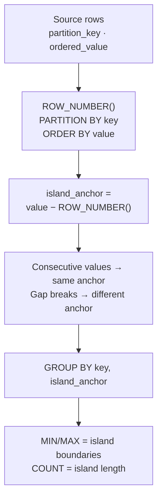

# :material-island: Gaps & Islands

Detect **islands** (consecutive sequences of rows) and **gaps** (breaks in sequences) — a classic SQL problem for detecting outages, sessions, streaks, and missing data.

---

## :material-sitemap: Core Logic — The ROW_NUMBER Delta Trick



### Why it works

For a sequence of consecutive dates, subtracting an increasing integer (ROW_NUMBER) from each date always produces the **same constant** — the "island anchor". When there's a gap, the anchor changes.

```sql
-- Walkthrough: Alice's login dates
-- login_date  | rn | login_date − rn (anchor)
-- ------------|----|--------------------------
-- 2024-01-01  | 1  | 2023-12-31  ← island 1
-- 2024-01-02  | 2  | 2023-12-31  ← same
-- 2024-01-03  | 3  | 2023-12-31  ← same
-- 2024-01-05  | 4  | 2024-01-01  ← NEW island (gap on Jan 4)
-- 2024-01-06  | 5  | 2024-01-01  ← same
-- 2024-01-07  | 6  | 2024-01-01  ← same
-- 2024-01-10  | 7  | 2024-01-03  ← NEW island (gap on Jan 8-9)
```

---

## :material-database: Core Sample Data

```sql
-- Daily user logins — one row per user per active day
CREATE OR REPLACE TEMP VIEW login_log AS
SELECT * FROM VALUES
  ('alice', DATE '2024-01-01'),
  ('alice', DATE '2024-01-02'),
  ('alice', DATE '2024-01-03'),
  ('alice', DATE '2024-01-05'),   -- gap: no login on 2024-01-04
  ('alice', DATE '2024-01-06'),
  ('alice', DATE '2024-01-07'),
  ('alice', DATE '2024-01-10'),   -- gap: 2024-01-08 and 09 missing
  ('bob',   DATE '2024-01-01'),
  ('bob',   DATE '2024-01-04'),   -- gaps: 02 and 03 missing
  ('bob',   DATE '2024-01-05'),
  ('bob',   DATE '2024-01-06')
AS t(username, login_date);
```

---

## :material-flask-outline: Core Pattern — Island Detection

```sql
WITH ranked AS (
    SELECT
        username,
        login_date,
        ROW_NUMBER() OVER (PARTITION BY username ORDER BY login_date) AS rn,
        DATE_SUB(login_date, ROW_NUMBER() OVER (PARTITION BY username ORDER BY login_date)) AS island_anchor
    FROM login_log
)
SELECT
    username,
    MIN(login_date)                                AS streak_start,
    MAX(login_date)                                AS streak_end,
    DATEDIFF(MAX(login_date), MIN(login_date)) + 1 AS streak_days
FROM ranked
GROUP BY username, island_anchor
ORDER BY username, streak_start;
```

??? success "Expected output"

    | username | streak_start | streak_end | streak_days |
    |----------|--------------|------------|-------------|
    | alice    | 2024-01-01   | 2024-01-03 | 3           |
    | alice    | 2024-01-05   | 2024-01-07 | 3           |
    | alice    | 2024-01-10   | 2024-01-10 | 1           |
    | bob      | 2024-01-01   | 2024-01-01 | 1           |
    | bob      | 2024-01-04   | 2024-01-06 | 3           |

---

## :material-flask-outline: Core Pattern — Gap Detection

Find the **gaps** between islands — periods with no activity.

```sql
WITH ranked AS (
    SELECT
        username,
        login_date,
        DATE_SUB(login_date, ROW_NUMBER() OVER (PARTITION BY username ORDER BY login_date)) AS island_anchor
    FROM login_log
),
islands AS (
    SELECT
        username,
        MIN(login_date) AS island_start,
        MAX(login_date) AS island_end
    FROM ranked
    GROUP BY username, island_anchor
),
gaps AS (
    SELECT
        username,
        DATE_ADD(island_end, 1) AS gap_start,
        DATE_SUB(LEAD(island_start) OVER (PARTITION BY username ORDER BY island_start), 1) AS gap_end
    FROM islands
)
SELECT
    username,
    gap_start,
    gap_end,
    DATEDIFF(gap_end, gap_start) + 1 AS gap_days
FROM gaps
WHERE gap_end IS NOT NULL
ORDER BY username, gap_start;
```

??? success "Expected output"

    | username | gap_start  | gap_end    | gap_days |
    |----------|------------|------------|----------|
    | alice    | 2024-01-04 | 2024-01-04 | 1        |
    | alice    | 2024-01-08 | 2024-01-09 | 2        |
    | bob      | 2024-01-02 | 2024-01-03 | 2        |

---

## :material-flask-outline: Core Pattern — Longest Streak Per User

```sql
WITH ranked AS (
    SELECT
        username,
        login_date,
        DATE_SUB(login_date, ROW_NUMBER() OVER (PARTITION BY username ORDER BY login_date)) AS island_anchor
    FROM login_log
),
streaks AS (
    SELECT
        username,
        MIN(login_date)                                AS streak_start,
        MAX(login_date)                                AS streak_end,
        DATEDIFF(MAX(login_date), MIN(login_date)) + 1 AS streak_days
    FROM ranked
    GROUP BY username, island_anchor
)
SELECT username, streak_start, streak_end, streak_days
FROM streaks
QUALIFY RANK() OVER (PARTITION BY username ORDER BY streak_days DESC) = 1
ORDER BY username;
```

??? success "Expected output"

    | username | streak_start | streak_end | streak_days |
    |----------|--------------|------------|-------------|
    | alice    | 2024-01-01   | 2024-01-03 | 3           |
    | alice    | 2024-01-05   | 2024-01-07 | 3           |
    | bob      | 2024-01-04   | 2024-01-06 | 3           |

    Alice has two streaks of length 3 (tied), so both appear.

---

## :material-animation-play: Interactive Demo

> Hover any dot to see the date, user, and island assignment.
> Filled dots are login days (colored by island streak). Dashed rings are gap days.

<div id="viz-gaps-islands" class="ts-viz"></div>

---
---

## :material-application-brackets: Scenario Examples

---

### Scenario 1: Server Uptime / Outage Detection

Detect status-change islands from a monitoring system — group consecutive rows with the same status.

```sql
CREATE OR REPLACE TEMP VIEW server_status AS
SELECT * FROM VALUES
  (1,  'web-01', 'UP',   TIMESTAMP '2024-06-01 00:00:00'),
  (2,  'web-01', 'UP',   TIMESTAMP '2024-06-01 01:00:00'),
  (3,  'web-01', 'DOWN', TIMESTAMP '2024-06-01 02:00:00'),
  (4,  'web-01', 'DOWN', TIMESTAMP '2024-06-01 03:00:00'),
  (5,  'web-01', 'DOWN', TIMESTAMP '2024-06-01 04:00:00'),
  (6,  'web-01', 'UP',   TIMESTAMP '2024-06-01 05:00:00'),
  (7,  'web-01', 'UP',   TIMESTAMP '2024-06-01 06:00:00'),
  (8,  'web-01', 'UP',   TIMESTAMP '2024-06-01 07:00:00'),
  (9,  'web-01', 'DOWN', TIMESTAMP '2024-06-01 08:00:00'),
  (10, 'web-01', 'UP',   TIMESTAMP '2024-06-01 09:00:00')
AS t(id, server, status, recorded_at);
```

**Technique**: Use `LAG()` to detect status changes, then `SUM()` running total to assign island IDs.

```sql
WITH flagged AS (
    SELECT
        server,
        status,
        recorded_at,
        CASE WHEN status != LAG(status, 1, '') OVER (PARTITION BY server ORDER BY recorded_at)
             THEN 1 ELSE 0 END AS is_new_island
    FROM server_status
),
island_numbered AS (
    SELECT *,
        SUM(is_new_island) OVER (PARTITION BY server ORDER BY recorded_at) AS island_id
    FROM flagged
)
SELECT
    server,
    status,
    MIN(recorded_at)  AS period_start,
    MAX(recorded_at)  AS period_end,
    COUNT(*)          AS check_count,
    (UNIX_TIMESTAMP(MAX(recorded_at)) - UNIX_TIMESTAMP(MIN(recorded_at))) / 3600 AS duration_hours
FROM island_numbered
GROUP BY server, status, island_id
ORDER BY period_start;
```

??? success "Expected output"

    | server | status | period_start        | period_end          | check_count | duration_hours |
    |--------|--------|---------------------|---------------------|-------------|----------------|
    | web-01 | UP     | 2024-06-01 00:00:00 | 2024-06-01 01:00:00 | 2           | 1.0            |
    | web-01 | DOWN   | 2024-06-01 02:00:00 | 2024-06-01 04:00:00 | 3           | 2.0            |
    | web-01 | UP     | 2024-06-01 05:00:00 | 2024-06-01 07:00:00 | 3           | 2.0            |
    | web-01 | DOWN   | 2024-06-01 08:00:00 | 2024-06-01 08:00:00 | 1           | 0.0            |
    | web-01 | UP     | 2024-06-01 09:00:00 | 2024-06-01 09:00:00 | 1           | 0.0            |

---

### Scenario 2: Employee Attendance Streaks

Track consecutive working days and absences for payroll / HR reporting.

```sql
CREATE OR REPLACE TEMP VIEW attendance AS
SELECT * FROM VALUES
  ('emp-101', DATE '2024-03-04', 'present'),
  ('emp-101', DATE '2024-03-05', 'present'),
  ('emp-101', DATE '2024-03-06', 'present'),
  ('emp-101', DATE '2024-03-07', 'absent'),
  ('emp-101', DATE '2024-03-08', 'absent'),
  ('emp-101', DATE '2024-03-11', 'present'),
  ('emp-101', DATE '2024-03-12', 'present'),
  ('emp-101', DATE '2024-03-13', 'absent'),
  ('emp-101', DATE '2024-03-14', 'present'),
  ('emp-101', DATE '2024-03-15', 'present')
AS t(employee_id, work_date, status);
```

```sql
WITH flagged AS (
    SELECT *,
        CASE WHEN status != LAG(status, 1, '') OVER (PARTITION BY employee_id ORDER BY work_date)
             THEN 1 ELSE 0 END AS new_block
    FROM attendance
),
blocks AS (
    SELECT *,
        SUM(new_block) OVER (PARTITION BY employee_id ORDER BY work_date) AS block_id
    FROM flagged
)
SELECT
    employee_id,
    status,
    MIN(work_date) AS block_start,
    MAX(work_date) AS block_end,
    COUNT(*)       AS consecutive_days
FROM blocks
GROUP BY employee_id, status, block_id
ORDER BY block_start;
```

??? success "Expected output"

    | employee_id | status  | block_start | block_end  | consecutive_days |
    |-------------|---------|-------------|------------|------------------|
    | emp-101     | present | 2024-03-04  | 2024-03-06 | 3                |
    | emp-101     | absent  | 2024-03-07  | 2024-03-08 | 2                |
    | emp-101     | present | 2024-03-11  | 2024-03-12 | 2                |
    | emp-101     | absent  | 2024-03-13  | 2024-03-13 | 1                |
    | emp-101     | present | 2024-03-14  | 2024-03-15 | 2                |

---

### Scenario 3: Subscription Lifecycle (Active / Churned / Reactivated)

Identify subscription periods and churn gaps for SaaS analytics.

```sql
CREATE OR REPLACE TEMP VIEW subscription_events AS
SELECT * FROM VALUES
  ('user-A', DATE '2023-01-15', 'activated'),
  ('user-A', DATE '2023-06-30', 'cancelled'),
  ('user-A', DATE '2023-09-10', 'activated'),
  ('user-A', DATE '2024-02-28', 'cancelled'),
  ('user-B', DATE '2023-03-01', 'activated'),
  ('user-B', DATE '2024-03-01', 'cancelled'),
  ('user-C', DATE '2023-05-20', 'activated'),
  ('user-C', DATE '2023-08-15', 'cancelled'),
  ('user-C', DATE '2023-10-01', 'activated'),
  ('user-C', DATE '2023-12-31', 'cancelled'),
  ('user-C', DATE '2024-04-01', 'activated')
AS t(user_id, event_date, event_type);
```

```sql
-- Pair each activation with its cancellation to form subscription periods
WITH paired AS (
    SELECT
        user_id,
        event_date AS period_start,
        LEAD(event_date) OVER (PARTITION BY user_id ORDER BY event_date) AS period_end,
        event_type
    FROM subscription_events
)
SELECT
    user_id,
    period_start,
    period_end,
    DATEDIFF(period_end, period_start) AS duration_days,
    CASE
        WHEN event_type = 'activated' THEN 'active'
        WHEN event_type = 'cancelled' THEN 'churned'
    END AS period_type
FROM paired
WHERE period_end IS NOT NULL OR event_type = 'activated'
ORDER BY user_id, period_start;
```

??? success "Expected output"

    | user_id | period_start | period_end | duration_days | period_type |
    |---------|--------------|------------|---------------|-------------|
    | user-A  | 2023-01-15   | 2023-06-30 | 166           | active      |
    | user-A  | 2023-06-30   | 2023-09-10 | 72            | churned     |
    | user-A  | 2023-09-10   | 2024-02-28 | 171           | active      |
    | user-B  | 2023-03-01   | 2024-03-01 | 366           | active      |
    | user-C  | 2023-05-20   | 2023-08-15 | 87            | active      |
    | user-C  | 2023-08-15   | 2023-10-01 | 47            | churned     |
    | user-C  | 2023-10-01   | 2023-12-31 | 91            | active      |
    | user-C  | 2023-12-31   | 2024-04-01 | 92            | churned     |

---

### Scenario 4: Consecutive Number Sequence Gaps

Find missing IDs in a sequence — useful for invoice numbers, ticket IDs, or batch numbers.

```sql
CREATE OR REPLACE TEMP VIEW invoice_ids AS
SELECT * FROM VALUES
  (1001), (1002), (1003),
  (1005), (1006),           -- gap: 1004 missing
  (1010), (1011), (1012),   -- gap: 1007-1009 missing
  (1015)                     -- gap: 1013-1014 missing
AS t(invoice_id);
```

```sql
-- Find gaps in the integer sequence
WITH boundaries AS (
    SELECT
        invoice_id,
        LEAD(invoice_id) OVER (ORDER BY invoice_id) AS next_id
    FROM invoice_ids
)
SELECT
    invoice_id + 1    AS gap_start,
    next_id - 1       AS gap_end,
    next_id - invoice_id - 1 AS missing_count
FROM boundaries
WHERE next_id - invoice_id > 1
ORDER BY gap_start;
```

??? success "Expected output"

    | gap_start | gap_end | missing_count |
    |-----------|---------|---------------|
    | 1004      | 1004    | 1             |
    | 1007      | 1009    | 3             |
    | 1013      | 1014    | 2             |

---

### Scenario 5: Session Detection from Clickstream

Group page views into sessions using a timeout threshold (30-minute inactivity = new session).

```sql
CREATE OR REPLACE TEMP VIEW clickstream AS
SELECT * FROM VALUES
  ('user-X', TIMESTAMP '2024-07-20 10:00:00', '/home'),
  ('user-X', TIMESTAMP '2024-07-20 10:02:00', '/products'),
  ('user-X', TIMESTAMP '2024-07-20 10:05:00', '/products/123'),
  ('user-X', TIMESTAMP '2024-07-20 10:08:00', '/cart'),
  ('user-X', TIMESTAMP '2024-07-20 11:00:00', '/home'),         -- 52 min gap → new session
  ('user-X', TIMESTAMP '2024-07-20 11:03:00', '/products'),
  ('user-X', TIMESTAMP '2024-07-20 11:10:00', '/checkout'),
  ('user-X', TIMESTAMP '2024-07-20 14:30:00', '/home'),         -- 3h20m gap → new session
  ('user-X', TIMESTAMP '2024-07-20 14:32:00', '/account')
AS t(user_id, event_time, page_url);
```

```sql
WITH with_gap AS (
    SELECT *,
        CASE
            WHEN (UNIX_TIMESTAMP(event_time)
                  - UNIX_TIMESTAMP(LAG(event_time) OVER (PARTITION BY user_id ORDER BY event_time)))
                 > 30 * 60  -- 30-minute timeout
            THEN 1
            ELSE 0
        END AS is_new_session
    FROM clickstream
),
sessioned AS (
    SELECT *,
        SUM(is_new_session) OVER (PARTITION BY user_id ORDER BY event_time) AS session_id
    FROM with_gap
)
SELECT
    user_id,
    session_id,
    MIN(event_time)  AS session_start,
    MAX(event_time)  AS session_end,
    COUNT(*)         AS page_views,
    (UNIX_TIMESTAMP(MAX(event_time)) - UNIX_TIMESTAMP(MIN(event_time))) / 60 AS duration_minutes
FROM sessioned
GROUP BY user_id, session_id
ORDER BY session_start;
```

??? success "Expected output"

    | user_id | session_id | session_start       | session_end         | page_views | duration_minutes |
    |---------|------------|---------------------|---------------------|------------|------------------|
    | user-X  | 0          | 2024-07-20 10:00:00 | 2024-07-20 10:08:00 | 4          | 8.0              |
    | user-X  | 1          | 2024-07-20 11:00:00 | 2024-07-20 11:10:00 | 3          | 10.0             |
    | user-X  | 2          | 2024-07-20 14:30:00 | 2024-07-20 14:32:00 | 2          | 2.0              |

---

### Scenario 6: Price Band Changes (Financial)

Detect when a stock moves between price bands (e.g., below/above a threshold).

```sql
CREATE OR REPLACE TEMP VIEW daily_prices AS
SELECT * FROM VALUES
  ('AAPL', DATE '2024-07-01', 192.00),
  ('AAPL', DATE '2024-07-02', 195.00),
  ('AAPL', DATE '2024-07-03', 198.00),
  ('AAPL', DATE '2024-07-05', 201.00),   -- crossed above 200
  ('AAPL', DATE '2024-07-08', 203.00),
  ('AAPL', DATE '2024-07-09', 199.00),   -- dropped below 200
  ('AAPL', DATE '2024-07-10', 197.00),
  ('AAPL', DATE '2024-07-11', 202.00),   -- crossed above 200 again
  ('AAPL', DATE '2024-07-12', 205.00),
  ('AAPL', DATE '2024-07-15', 208.00)
AS t(symbol, trade_date, close_price);
```

```sql
WITH banded AS (
    SELECT *,
        CASE WHEN close_price >= 200 THEN 'above_200' ELSE 'below_200' END AS band
    FROM daily_prices
),
flagged AS (
    SELECT *,
        CASE WHEN band != LAG(band, 1, '') OVER (PARTITION BY symbol ORDER BY trade_date)
             THEN 1 ELSE 0 END AS band_change
    FROM banded
),
grouped AS (
    SELECT *,
        SUM(band_change) OVER (PARTITION BY symbol ORDER BY trade_date) AS band_island
    FROM flagged
)
SELECT
    symbol,
    band,
    MIN(trade_date) AS period_start,
    MAX(trade_date) AS period_end,
    COUNT(*)        AS trading_days,
    ROUND(MIN(close_price), 2) AS period_low,
    ROUND(MAX(close_price), 2) AS period_high
FROM grouped
GROUP BY symbol, band, band_island
ORDER BY period_start;
```

??? success "Expected output"

    | symbol | band      | period_start | period_end | trading_days | period_low | period_high |
    |--------|-----------|--------------|------------|--------------|------------|-------------|
    | AAPL   | below_200 | 2024-07-01   | 2024-07-03 | 3            | 192.00     | 198.00      |
    | AAPL   | above_200 | 2024-07-05   | 2024-07-08 | 2            | 201.00     | 203.00      |
    | AAPL   | below_200 | 2024-07-09   | 2024-07-10 | 2            | 197.00     | 199.00      |
    | AAPL   | above_200 | 2024-07-11   | 2024-07-15 | 3            | 202.00     | 208.00      |

---

## :material-lightbulb-outline: When to Use

| Scenario | Technique | Key Idea |
|----------|-----------|----------|
| Login streaks, consecutive days | Date − ROW_NUMBER() | Same anchor = same island |
| Missing dates / SLA breaches | LEAD() on island boundaries | Gap between island_end and next island_start |
| Outage duration from status logs | LAG() + SUM() running total | Status change = new island |
| Session detection from events | Timestamp diff > threshold | Inactivity gap = new session |
| Sequence gaps (invoice/ticket IDs) | LEAD() on ordered values | next_id − current_id > 1 |
| Price band / state transitions | CASE band + LAG() | Band change = new island |
| Subscription churn/reactivation | Event pairs with LEAD() | Activation → cancellation = period |

---

## :material-magnify: Behavior Notes

1. The **date − ROW_NUMBER** trick works only for strictly consecutive values (dates, integers). For irregular timestamps, use the **LAG + threshold** approach.
2. Always `PARTITION BY` the entity key (user, server, symbol) to avoid cross-entity island merging.
3. `QUALIFY` filters after window functions — use it instead of a subquery wrapper when supported.
4. For large tables, ensure the partition + order columns are indexed or Z-ordered for performance.
5. Islands and gaps are **complementary** — detecting one trivially gives you the other via `LEAD()` / `LAG()` on boundaries.
