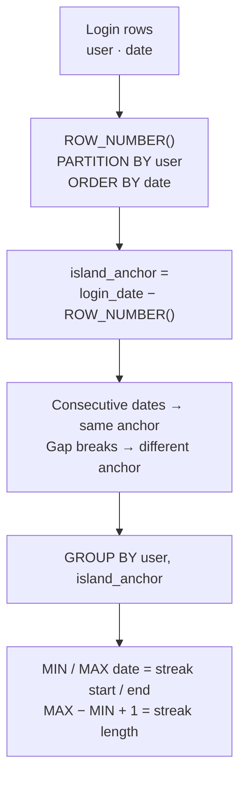

# :material-island: Gaps & Islands

Detect **islands** (consecutive sequences of rows) and **gaps** (breaks in sequences) — a classic SQL problem for detecting outages, sessions, and streaks.

---

## :material-sitemap: The ROW_NUMBER Delta Trick



---

## :material-animation-play: Interactive Demo

> Hover any dot to see the date, user, and island assignment.  
> Filled dots are login days (colored by island streak). Dashed rings are gap days.

<div id="viz-gaps-islands" class="ts-viz"></div>

---

## :material-toy-brick: Sample Data

```sql
-- login_log — tracks daily user logins (one row per user per active day)
CREATE OR REPLACE TEMP VIEW login_log AS
SELECT * FROM VALUES
  ('alice', DATE '2024-01-01'),
  ('alice', DATE '2024-01-02'),
  ('alice', DATE '2024-01-03'),
  ('alice', DATE '2024-01-05'),   -- gap: no login on 2024-01-04
  ('alice', DATE '2024-01-06'),
  ('alice', DATE '2024-01-07'),
  ('alice', DATE '2024-01-10'),   -- gap: 2024-01-08 and 09 missing
  ('bob',   DATE '2024-01-01'),
  ('bob',   DATE '2024-01-04'),   -- gaps: 02 and 03 missing
  ('bob',   DATE '2024-01-05'),
  ('bob',   DATE '2024-01-06')
AS t(username, login_date);
```

| username | login_date |
|---------|-----------|
| alice | 2024-01-01 |
| alice | 2024-01-02 |
| alice | 2024-01-03 |
| alice | 2024-01-05 |
| alice | 2024-01-06 |
| alice | 2024-01-07 |
| alice | 2024-01-10 |
| bob | 2024-01-01 |
| bob | 2024-01-04 |
| bob | 2024-01-05 |
| bob | 2024-01-06 |

---

## :material-numeric-1-circle: Pattern 1 — Island detection (consecutive login streaks)

**Key idea:** subtract the `ROW_NUMBER` from the date. For consecutive dates the difference is constant — rows with the same difference belong to the same island.

```sql
WITH ranked AS (
    SELECT
        username,
        login_date,
        ROW_NUMBER() OVER (PARTITION BY username ORDER BY login_date) AS rn,
        -- subtract rn days from the date; consecutive dates produce the same anchor
        DATE_SUB(login_date, ROW_NUMBER() OVER (PARTITION BY username ORDER BY login_date)) AS island_anchor
    FROM login_log
)
SELECT
    username,
    island_anchor,
    MIN(login_date)                           AS streak_start,
    MAX(login_date)                           AS streak_end,
    DATEDIFF(MAX(login_date), MIN(login_date)) + 1 AS streak_days
FROM ranked
GROUP BY username, island_anchor
ORDER BY username, streak_start;
-- Result:
-- username | island_anchor | streak_start | streak_end  | streak_days
-- ---------|---------------|--------------|-------------|-------------
-- alice    | 2023-12-31    | 2024-01-01   | 2024-01-03  |  3
-- alice    | 2024-01-01    | 2024-01-05   | 2024-01-07  |  3
-- alice    | 2024-01-04    | 2024-01-10   | 2024-01-10  |  1
-- bob      | 2023-12-31    | 2024-01-01   | 2024-01-01  |  1
-- bob      | 2024-01-01    | 2024-01-04   | 2024-01-06  |  3
```

---

## :material-numeric-2-circle: Pattern 2 — Longest streak per user

```sql
WITH ranked AS (
    SELECT
        username,
        login_date,
        DATE_SUB(login_date, ROW_NUMBER() OVER (PARTITION BY username ORDER BY login_date)) AS island_anchor
    FROM login_log
),
streaks AS (
    SELECT
        username,
        MIN(login_date)                                            AS streak_start,
        MAX(login_date)                                            AS streak_end,
        DATEDIFF(MAX(login_date), MIN(login_date)) + 1            AS streak_days
    FROM ranked
    GROUP BY username, island_anchor
)
SELECT
    username,
    streak_start,
    streak_end,
    streak_days
FROM streaks
QUALIFY RANK() OVER (PARTITION BY username ORDER BY streak_days DESC) = 1
ORDER BY username;
-- Result:
-- username | streak_start | streak_end  | streak_days
-- ---------|--------------|-------------|-------------
-- alice    | 2024-01-01   | 2024-01-03  |  3      (tied with 2024-01-05 streak)
-- bob      | 2024-01-04   | 2024-01-06  |  3
```

---

## :material-numeric-3-circle: Pattern 3 — Gap detection (missing dates)

Find the **gaps** between islands — the periods with no activity.

```sql
WITH ranked AS (
    SELECT
        username,
        login_date,
        DATE_SUB(login_date, ROW_NUMBER() OVER (PARTITION BY username ORDER BY login_date)) AS island_anchor
    FROM login_log
),
islands AS (
    SELECT
        username,
        MIN(login_date) AS island_start,
        MAX(login_date) AS island_end
    FROM ranked
    GROUP BY username, island_anchor
),
gaps AS (
    SELECT
        username,
        DATE_ADD(island_end, 1)                   AS gap_start,
        DATE_SUB(LEAD(island_start) OVER (PARTITION BY username ORDER BY island_start), 1) AS gap_end
    FROM islands
)
SELECT
    username,
    gap_start,
    gap_end,
    DATEDIFF(gap_end, gap_start) + 1 AS gap_days
FROM gaps
WHERE gap_end IS NOT NULL            -- NULL means no next island (trailing period)
ORDER BY username, gap_start;
-- Result:
-- username | gap_start   | gap_end     | gap_days
-- ---------|-------------|-------------|----------
-- alice    | 2024-01-04  | 2024-01-04  |  1
-- alice    | 2024-01-08  | 2024-01-09  |  2
-- bob      | 2024-01-02  | 2024-01-03  |  2
```

---

## :material-numeric-4-circle: Pattern 4 — Number islands (status change variant)

Sometimes rows aren't dates but statuses — detect runs of the same status value.

```sql
-- server_status — consecutive records from a monitoring system
CREATE OR REPLACE TEMP VIEW server_status AS
SELECT * FROM VALUES
  (1, 'server-a', 'UP',   TIMESTAMP '2024-06-01 00:00:00'),
  (2, 'server-a', 'UP',   TIMESTAMP '2024-06-01 01:00:00'),
  (3, 'server-a', 'DOWN', TIMESTAMP '2024-06-01 02:00:00'),
  (4, 'server-a', 'DOWN', TIMESTAMP '2024-06-01 03:00:00'),
  (5, 'server-a', 'DOWN', TIMESTAMP '2024-06-01 04:00:00'),
  (6, 'server-a', 'UP',   TIMESTAMP '2024-06-01 05:00:00'),
  (7, 'server-a', 'UP',   TIMESTAMP '2024-06-01 06:00:00')
AS t(id, server, status, recorded_at);

WITH flagged AS (
    SELECT
        server,
        status,
        recorded_at,
        -- mark first row of each new status run
        CASE WHEN status <> LAG(status, 1, status) OVER (PARTITION BY server ORDER BY recorded_at)
             THEN 1 ELSE 0 END AS is_new_island
    FROM server_status
),
island_numbered AS (
    SELECT
        server, status, recorded_at,
        SUM(is_new_island) OVER (PARTITION BY server ORDER BY recorded_at) AS island_id
    FROM flagged
)
SELECT
    server,
    status,
    island_id,
    MIN(recorded_at) AS period_start,
    MAX(recorded_at) AS period_end,
    (UNIX_TIMESTAMP(MAX(recorded_at)) - UNIX_TIMESTAMP(MIN(recorded_at))) / 3600 AS duration_hours
FROM island_numbered
GROUP BY server, status, island_id
ORDER BY island_id;
-- Result:
-- server   | status | island_id | period_start        | period_end          | duration_hours
-- ---------|--------|-----------|---------------------|---------------------|---------------
-- server-a | UP     |  0        | 2024-06-01 00:00:00 | 2024-06-01 01:00:00 |  1.0
-- server-a | DOWN   |  1        | 2024-06-01 02:00:00 | 2024-06-01 04:00:00 |  2.0
-- server-a | UP     |  2        | 2024-06-01 05:00:00 | 2024-06-01 06:00:00 |  1.0
```

---

## :material-lightbulb-outline: When to Use

| Scenario | Pattern |
|----------|---------|
| User login streaks / churn detection | Island detection with date delta |
| Missing dates (SLA breaches, data gaps) | Gap detection between islands |
| Outage duration from status logs | Status-change island variant |
| Longest consecutive sequence | Island detection + `QUALIFY RANK() = 1` |
| Session timeout grouping | Status island on timestamp difference |
