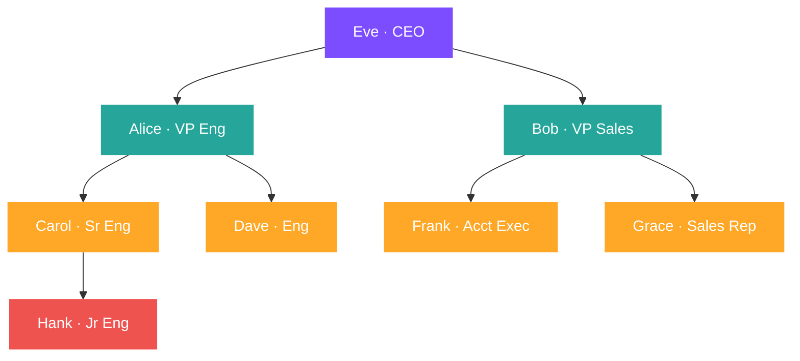

# :material-family-tree: Hierarchy

Query parent-child structures — org charts, product categories, bill-of-materials, file systems — using self-joins and recursive CTEs.

---

## :material-sitemap: Org Chart Structure



---

## :material-database: Sample Data

### Dataset 1: Org chart (employees)

```sql
CREATE OR REPLACE TEMP VIEW employees AS
SELECT * FROM VALUES
  (1,  'Eve',    NULL, 'CEO',              200000),
  (2,  'Alice',  1,    'VP Engineering',   150000),
  (3,  'Bob',    1,    'VP Sales',         140000),
  (4,  'Carol',  2,    'Senior Engineer',   95000),
  (5,  'Dave',   2,    'Engineer',          92000),
  (6,  'Frank',  3,    'Account Exec',      70000),
  (7,  'Grace',  3,    'Sales Rep',         68000),
  (8,  'Hank',   4,    'Junior Engineer',   60000)
AS t(emp_id, name, manager_id, title, salary);
```

### Dataset 2: Product categories (multi-level taxonomy)

```sql
CREATE OR REPLACE TEMP VIEW categories AS
SELECT * FROM VALUES
  (1,   'All Products',    NULL),
  (2,   'Electronics',     1),
  (3,   'Clothing',        1),
  (4,   'Home & Garden',   1),
  (5,   'Computers',       2),
  (6,   'Phones',          2),
  (7,   'Men',             3),
  (8,   'Women',           3),
  (9,   'Laptops',         5),
  (10,  'Desktops',        5),
  (11,  'Smartphones',     6),
  (12,  'Accessories',     6),
  (13,  'T-Shirts',        7),
  (14,  'Jeans',           7),
  (15,  'Dresses',         8)
AS t(cat_id, cat_name, parent_id);
```

### Dataset 3: Bill of Materials (BOM)

```sql
CREATE OR REPLACE TEMP VIEW bom AS
SELECT * FROM VALUES
  ('BIKE-100',  NULL,        'Mountain Bike',     1,     899.99),
  ('FRAME-01',  'BIKE-100',  'Aluminium Frame',   1,     250.00),
  ('WHEEL-01',  'BIKE-100',  'Front Wheel',       1,      85.00),
  ('WHEEL-02',  'BIKE-100',  'Rear Wheel',        1,      95.00),
  ('GEAR-01',   'BIKE-100',  'Gear Assembly',      1,     120.00),
  ('SPOKE-01',  'WHEEL-01',  'Spoke Set (36pc)',   1,      18.00),
  ('RIM-01',    'WHEEL-01',  'Front Rim',          1,      35.00),
  ('TIRE-01',   'WHEEL-01',  'Front Tire',         1,      22.00),
  ('SPOKE-02',  'WHEEL-02',  'Spoke Set (36pc)',   1,      18.00),
  ('RIM-02',    'WHEEL-02',  'Rear Rim',           1,      38.00),
  ('TIRE-02',   'WHEEL-02',  'Rear Tire',          1,      25.00),
  ('CHAIN-01',  'GEAR-01',   'Chain',              1,      15.00),
  ('CASS-01',   'GEAR-01',   'Cassette',           1,      45.00),
  ('DERR-01',   'GEAR-01',   'Derailleur',         1,      55.00)
AS t(part_id, parent_part_id, part_name, quantity, unit_cost);
```

---

## :material-flask-outline: Core Patterns (Org Chart)

### Pattern 1 — Direct reports (one-level self-join)

```sql
SELECT
    e.emp_id,
    e.name        AS employee,
    e.title,
    e.salary,
    m.name        AS manager,
    m.title       AS manager_title
FROM employees AS e
LEFT JOIN employees AS m
    ON e.manager_id = m.emp_id
ORDER BY m.name NULLS FIRST, e.name;
```

??? success "Expected output"

    | emp_id | employee | title           | salary | manager | manager_title  |
    |--------|----------|-----------------|--------|---------|----------------|
    | 1      | Eve      | CEO             | 200000 | NULL    | NULL           |
    | 2      | Alice    | VP Engineering  | 150000 | Eve     | CEO            |
    | 3      | Bob      | VP Sales        | 140000 | Eve     | CEO            |
    | 4      | Carol    | Senior Engineer | 95000  | Alice   | VP Engineering |
    | 5      | Dave     | Engineer        | 92000  | Alice   | VP Engineering |
    | 6      | Frank    | Account Exec    | 70000  | Bob     | VP Sales       |
    | 7      | Grace    | Sales Rep       | 68000  | Bob     | VP Sales       |
    | 8      | Hank     | Junior Engineer | 60000  | Carol   | Senior Engineer|

---

### Pattern 2 — Team size (direct report count)

```sql
SELECT
    m.emp_id,
    m.name      AS manager,
    m.title,
    COUNT(e.emp_id) AS direct_reports
FROM employees AS m
LEFT JOIN employees AS e
    ON e.manager_id = m.emp_id
GROUP BY m.emp_id, m.name, m.title
ORDER BY direct_reports DESC;
```

??? success "Expected output"

    | emp_id | manager | title           | direct_reports |
    |--------|---------|-----------------|----------------|
    | 1      | Eve     | CEO             | 2              |
    | 2      | Alice   | VP Engineering  | 2              |
    | 3      | Bob     | VP Sales        | 2              |
    | 4      | Carol   | Senior Engineer | 1              |
    | 5      | Dave    | Engineer        | 0              |
    | 6      | Frank   | Account Exec    | 0              |
    | 7      | Grace   | Sales Rep       | 0              |
    | 8      | Hank    | Junior Engineer | 0              |

---

### Pattern 3 — Two-level hierarchy (grandparent via two self-joins)

```sql
SELECT
    grandchild.name                     AS employee,
    grandchild.title,
    parent.name                         AS manager,
    grandparent.name                    AS skip_level_manager
FROM employees AS grandchild
LEFT JOIN employees AS parent
    ON grandchild.manager_id = parent.emp_id
LEFT JOIN employees AS grandparent
    ON parent.manager_id = grandparent.emp_id
ORDER BY grandparent.name NULLS FIRST, parent.name, grandchild.name;
```

??? success "Expected output"

    | employee | title           | manager | skip_level_manager |
    |----------|-----------------|---------|-------------------|
    | Eve      | CEO             | NULL    | NULL              |
    | Alice    | VP Engineering  | Eve     | NULL              |
    | Bob      | VP Sales        | Eve     | NULL              |
    | Carol    | Senior Engineer | Alice   | Eve               |
    | Dave     | Engineer        | Alice   | Eve               |
    | Frank    | Account Exec   | Bob     | Eve               |
    | Grace    | Sales Rep       | Bob     | Eve               |
    | Hank     | Junior Engineer | Carol   | Alice             |

---

### Pattern 4 — Recursive CTE (full ancestry path, any depth)

Recursive CTEs traverse the full hierarchy to any depth.

```sql
WITH RECURSIVE org_tree AS (
    -- Anchor: start from the root (no manager)
    SELECT
        emp_id, name, manager_id, title, salary,
        0                    AS depth,
        CAST(name AS STRING) AS path
    FROM employees
    WHERE manager_id IS NULL

    UNION ALL

    -- Recursive step: join each employee to their manager row
    SELECT
        e.emp_id, e.name, e.manager_id, e.title, e.salary,
        ot.depth + 1,
        ot.path || ' > ' || e.name
    FROM employees AS e
    JOIN org_tree AS ot ON e.manager_id = ot.emp_id
)
SELECT
    emp_id,
    REPEAT('  ', depth) || name AS org_chart,
    title,
    salary,
    depth,
    path
FROM org_tree
ORDER BY path;
```

??? success "Expected output"

    | emp_id | org_chart          | title           | salary | depth | path                         |
    |--------|--------------------|-----------------|--------|-------|------------------------------|
    | 1      | Eve                | CEO             | 200000 | 0     | Eve                          |
    | 2      |   Alice            | VP Engineering  | 150000 | 1     | Eve > Alice                  |
    | 4      |     Carol          | Senior Engineer | 95000  | 2     | Eve > Alice > Carol          |
    | 8      |       Hank         | Junior Engineer | 60000  | 3     | Eve > Alice > Carol > Hank   |
    | 5      |     Dave           | Engineer        | 92000  | 2     | Eve > Alice > Dave           |
    | 3      |   Bob              | VP Sales        | 140000 | 1     | Eve > Bob                    |
    | 6      |     Frank          | Account Exec    | 70000  | 2     | Eve > Bob > Frank            |
    | 7      |     Grace          | Sales Rep       | 68000  | 2     | Eve > Bob > Grace            |

---

### Pattern 5 — Subtree salary rollup (total under each manager)

```sql
WITH RECURSIVE subtree AS (
    SELECT emp_id, emp_id AS root_id, salary
    FROM employees

    UNION ALL

    SELECT e.emp_id, s.root_id, e.salary
    FROM employees AS e
    JOIN subtree AS s ON e.manager_id = s.emp_id
)
SELECT
    m.emp_id,
    m.name                      AS manager,
    m.title,
    SUM(s.salary)               AS team_total_salary,
    COUNT(*) - 1                AS headcount_under
FROM subtree AS s
JOIN employees AS m ON s.root_id = m.emp_id
GROUP BY m.emp_id, m.name, m.title
ORDER BY team_total_salary DESC;
```

??? success "Expected output"

    | emp_id | manager | title           | team_total_salary | headcount_under |
    |--------|---------|-----------------|-------------------|-----------------|
    | 1      | Eve     | CEO             | 875000            | 7               |
    | 2      | Alice   | VP Engineering  | 397000            | 3               |
    | 3      | Bob     | VP Sales        | 278000            | 2               |
    | 4      | Carol   | Senior Engineer | 155000            | 1               |
    | 5      | Dave    | Engineer        | 92000             | 0               |
    | 6      | Frank   | Account Exec    | 70000             | 0               |
    | 7      | Grace   | Sales Rep       | 68000             | 0               |
    | 8      | Hank    | Junior Engineer | 60000             | 0               |

---

### Pattern 6 — Leaf nodes (employees with no reports)

```sql
SELECT e.emp_id, e.name, e.title, e.salary
FROM employees AS e
LEFT JOIN employees AS r ON r.manager_id = e.emp_id
WHERE r.emp_id IS NULL
ORDER BY e.name;
```

??? success "Expected output"

    | emp_id | name  | title           | salary |
    |--------|-------|-----------------|--------|
    | 5      | Dave  | Engineer        | 92000  |
    | 6      | Frank | Account Exec    | 70000  |
    | 7      | Grace | Sales Rep       | 68000  |
    | 8      | Hank  | Junior Engineer | 60000  |

---

### Pattern 7 — Find all ancestors of a specific node

```sql
-- Find all managers above Hank (emp_id = 8) up to the CEO
WITH RECURSIVE ancestors AS (
    SELECT emp_id, name, manager_id, title, 0 AS distance
    FROM employees
    WHERE emp_id = 8

    UNION ALL

    SELECT e.emp_id, e.name, e.manager_id, e.title, a.distance + 1
    FROM employees AS e
    JOIN ancestors AS a ON a.manager_id = e.emp_id
)
SELECT emp_id, name, title, distance
FROM ancestors
ORDER BY distance;
```

??? success "Expected output"

    | emp_id | name  | title           | distance |
    |--------|-------|-----------------|----------|
    | 8      | Hank  | Junior Engineer | 0        |
    | 4      | Carol | Senior Engineer | 1        |
    | 2      | Alice | VP Engineering  | 2        |
    | 1      | Eve   | CEO             | 3        |

---

## :material-flask-outline: Scenario: Product Category Tree

### Full category breadcrumb path

```sql
WITH RECURSIVE cat_tree AS (
    SELECT cat_id, cat_name, parent_id,
        0 AS depth,
        CAST(cat_name AS STRING) AS breadcrumb
    FROM categories
    WHERE parent_id IS NULL

    UNION ALL

    SELECT c.cat_id, c.cat_name, c.parent_id,
        ct.depth + 1,
        ct.breadcrumb || ' > ' || c.cat_name
    FROM categories AS c
    JOIN cat_tree AS ct ON c.parent_id = ct.cat_id
)
SELECT cat_id, REPEAT('  ', depth) || cat_name AS tree_view, breadcrumb, depth
FROM cat_tree
ORDER BY breadcrumb;
```

??? success "Expected output"

    | cat_id | tree_view         | breadcrumb                                   | depth |
    |--------|-------------------|----------------------------------------------|-------|
    | 1      | All Products      | All Products                                 | 0     |
    | 3      |   Clothing        | All Products > Clothing                      | 1     |
    | 7      |     Men           | All Products > Clothing > Men                | 2     |
    | 14     |       Jeans       | All Products > Clothing > Men > Jeans        | 3     |
    | 13     |       T-Shirts    | All Products > Clothing > Men > T-Shirts     | 3     |
    | 8      |     Women         | All Products > Clothing > Women              | 2     |
    | 15     |       Dresses     | All Products > Clothing > Women > Dresses    | 3     |
    | 2      |   Electronics     | All Products > Electronics                   | 1     |
    | 5      |     Computers     | All Products > Electronics > Computers       | 2     |
    | 10     |       Desktops    | All Products > Electronics > Computers > Desktops | 3 |
    | 9      |       Laptops     | All Products > Electronics > Computers > Laptops  | 3 |
    | 6      |     Phones        | All Products > Electronics > Phones          | 2     |
    | 12     |       Accessories | All Products > Electronics > Phones > Accessories | 3 |
    | 11     |       Smartphones | All Products > Electronics > Phones > Smartphones | 3 |
    | 4      |   Home & Garden   | All Products > Home & Garden                 | 1     |

---

### Count leaf categories per top-level category

```sql
WITH RECURSIVE cat_tree AS (
    SELECT cat_id, cat_name, cat_id AS root_id, cat_name AS root_name
    FROM categories
    WHERE parent_id IS NULL

    UNION ALL

    SELECT c.cat_id, c.cat_name, ct.root_id, ct.root_name
    FROM categories AS c
    JOIN cat_tree AS ct ON c.parent_id = ct.cat_id
),
leaf_cats AS (
    SELECT ct.cat_id, ct.root_name
    FROM cat_tree AS ct
    LEFT JOIN categories AS child ON child.parent_id = ct.cat_id
    WHERE child.cat_id IS NULL
)
SELECT root_name AS top_category, COUNT(*) AS leaf_count
FROM leaf_cats
GROUP BY root_name
ORDER BY leaf_count DESC;
```

??? success "Expected output"

    | top_category  | leaf_count |
    |---------------|------------|
    | All Products  | 8          |

!!! note
    Since all leaf nodes (Laptops, Desktops, Smartphones, etc.) ultimately roll up to "All Products", the count is 8. To get counts per **second-level** category, start the anchor from `WHERE depth = 1` or `WHERE parent_id = 1`.

---

## :material-flask-outline: Scenario: Bill of Materials (BOM)

### Exploded BOM — all parts with total cost

```sql
WITH RECURSIVE exploded AS (
    SELECT
        part_id, parent_part_id, part_name, quantity, unit_cost,
        0 AS depth,
        CAST(part_name AS STRING) AS assembly_path
    FROM bom
    WHERE parent_part_id IS NULL

    UNION ALL

    SELECT
        b.part_id, b.parent_part_id, b.part_name,
        b.quantity * e.quantity AS quantity,
        b.unit_cost,
        e.depth + 1,
        e.assembly_path || ' > ' || b.part_name
    FROM bom AS b
    JOIN exploded AS e ON b.parent_part_id = e.part_id
)
SELECT
    REPEAT('  ', depth) || part_name AS part_tree,
    part_id,
    quantity,
    unit_cost,
    ROUND(quantity * unit_cost, 2) AS extended_cost,
    depth,
    assembly_path
FROM exploded
ORDER BY assembly_path;
```

??? success "Expected output"

    | part_tree              | part_id  | quantity | unit_cost | extended_cost | depth |
    |------------------------|----------|----------|-----------|---------------|-------|
    | Mountain Bike          | BIKE-100 | 1        | 899.99    | 899.99        | 0     |
    |   Aluminium Frame      | FRAME-01 | 1        | 250.00    | 250.00        | 1     |
    |   Front Wheel          | WHEEL-01 | 1        | 85.00     | 85.00         | 1     |
    |     Front Rim          | RIM-01   | 1        | 35.00     | 35.00         | 2     |
    |     Front Tire         | TIRE-01  | 1        | 22.00     | 22.00         | 2     |
    |     Spoke Set (36pc)   | SPOKE-01 | 1        | 18.00     | 18.00         | 2     |
    |   Gear Assembly        | GEAR-01  | 1        | 120.00    | 120.00        | 1     |
    |     Cassette           | CASS-01  | 1        | 45.00     | 45.00         | 2     |
    |     Chain              | CHAIN-01 | 1        | 15.00     | 15.00         | 2     |
    |     Derailleur         | DERR-01  | 1        | 55.00     | 55.00         | 2     |
    |   Rear Wheel           | WHEEL-02 | 1        | 95.00     | 95.00         | 1     |
    |     Rear Rim           | RIM-02   | 1        | 38.00     | 38.00         | 2     |
    |     Rear Tire          | TIRE-02  | 1        | 25.00     | 25.00         | 2     |
    |     Spoke Set (36pc)   | SPOKE-02 | 1        | 18.00     | 18.00         | 2     |

---

### Rolled-up cost per assembly

```sql
WITH RECURSIVE cost_tree AS (
    SELECT part_id, part_id AS root_id, unit_cost, quantity
    FROM bom

    UNION ALL

    SELECT b.part_id, ct.root_id, b.unit_cost, b.quantity * ct.quantity
    FROM bom AS b
    JOIN cost_tree AS ct ON b.parent_part_id = ct.part_id
)
SELECT
    r.part_id,
    r.part_name,
    ROUND(SUM(ct.unit_cost * ct.quantity), 2) AS total_cost,
    COUNT(*) - 1                               AS sub_parts
FROM cost_tree AS ct
JOIN bom AS r ON ct.root_id = r.part_id
GROUP BY r.part_id, r.part_name
HAVING COUNT(*) > 1
ORDER BY total_cost DESC;
```

??? success "Expected output"

    | part_id  | part_name      | total_cost | sub_parts |
    |----------|----------------|------------|-----------|
    | BIKE-100 | Mountain Bike  | 1621.99    | 13        |
    | GEAR-01  | Gear Assembly  | 235.00     | 3         |
    | WHEEL-02 | Rear Wheel     | 176.00     | 3         |
    | WHEEL-01 | Front Wheel    | 160.00     | 3         |

---

## :material-animation-play: Interactive Demo

> Hover any node to see the employee's full title, salary, direct-report count, and depth in the hierarchy.

<div id="viz-hierarchy" class="ts-viz"></div>

---

## :material-swap-horizontal: Approach Comparison

| Approach | Depth supported | Complexity | Use when |
|----------|----------------|------------|----------|
| Single self-join | 1 level | Low | Direct manager only |
| Multi-level self-joins | Fixed N levels | Medium | N-level org chart with known depth |
| Recursive CTE | Unlimited | Medium | Dynamic depth, path generation |
| Recursive CTE + rollup | Unlimited | Medium-High | Subtree aggregations (salary, cost) |

!!! note "Recursive CTE support"
    `WITH RECURSIVE` requires Databricks Runtime 14.1+ or Spark 3.5+.
    For earlier versions, use iterative self-joins or flatten the hierarchy into a
    separate lookup table.

---

## :material-lightbulb-outline: When to Use

| Scenario | Pattern |
|----------|---------|
| Show employee + direct manager | Single self-join (`LEFT JOIN employees AS m`) |
| Count direct reports per manager | `LEFT JOIN` + `COUNT(*)` |
| Display indented org chart | Recursive CTE with `depth` + `REPEAT(' ', depth)` |
| Find all ancestors of a node | Recursive CTE, anchor on target node, expand upward |
| Roll up metrics to any ancestor | Recursive subtree + `GROUP BY root_id` |
| Find leaf nodes (no children) | `LEFT JOIN … WHERE child.id IS NULL` |
| Category breadcrumb path | Recursive CTE with string concatenation |
| BOM cost explosion | Recursive CTE with `quantity * parent_quantity` |

---

## :material-magnify: Behavior Notes

1. Recursive CTEs have an **anchor** (base case) and a **recursive step** — always filter the anchor to root nodes (`WHERE parent_id IS NULL`) or a specific target node.
2. Always include a `depth` counter to prevent infinite loops and enable indentation.
3. String path concatenation (`path || ' > ' || name`) creates human-readable breadcrumbs but can become long at deep levels.
4. For BOM queries, multiply `quantity` at each level to get the true count of leaf parts needed.
5. Spark limits recursive CTE depth to 100 iterations by default — set `spark.sql.cte.recursion.level.limit` to increase.
