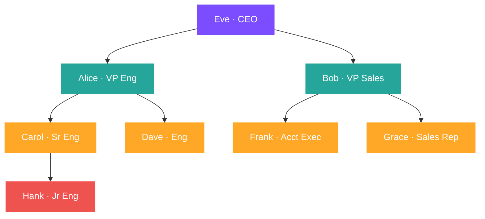

# :material-family-tree: Hierarchy

Query parent-child structures — org charts, product categories, bill-of-materials — using self-joins and recursive CTEs.

---

## :material-sitemap: Org Chart Structure



---

## :material-animation-play: Interactive Demo

> Hover any node to see the employee's full title, salary, direct-report count, and depth in the hierarchy.

<div id="viz-hierarchy" class="ts-viz"></div>

---

## :material-toy-brick: Sample Data

```sql
-- employees — classic org chart with manager_id pointing to emp_id
CREATE OR REPLACE TEMP VIEW employees AS
SELECT * FROM VALUES
  (1,  'Eve',    NULL, 'CEO',              200000),
  (2,  'Alice',  1,    'VP Engineering',   150000),
  (3,  'Bob',    1,    'VP Sales',         140000),
  (4,  'Carol',  2,    'Senior Engineer',   95000),
  (5,  'Dave',   2,    'Engineer',          92000),
  (6,  'Frank',  3,    'Account Exec',      70000),
  (7,  'Grace',  3,    'Sales Rep',         68000),
  (8,  'Hank',   4,    'Junior Engineer',   60000)
AS t(emp_id, name, manager_id, title, salary);
```

```
Eve (CEO)
├── Alice (VP Engineering)
│   ├── Carol (Senior Engineer)
│   │   └── Hank (Junior Engineer)
│   └── Dave (Engineer)
└── Bob (VP Sales)
    ├── Frank (Account Exec)
    └── Grace (Sales Rep)
```

---

## :material-numeric-1-circle: Pattern 1 — Direct reports (one-level self-join)

```sql
-- Each employee with their direct manager's name
SELECT
    e.emp_id,
    e.name        AS employee,
    e.title,
    e.salary,
    m.name        AS manager,
    m.title       AS manager_title
FROM employees AS e
LEFT JOIN employees AS m
    ON e.manager_id = m.emp_id
ORDER BY m.name NULLS FIRST, e.name;
-- Result:
-- emp_id | employee | title               | salary | manager | manager_title
-- -------|----------|---------------------|--------|---------|------------------
-- 1      | Eve      | CEO                 | 200000 | NULL    | NULL
-- 2      | Alice    | VP Engineering      | 150000 | Eve     | CEO
-- 3      | Bob      | VP Sales            | 140000 | Eve     | CEO
-- 4      | Carol    | Senior Engineer     |  95000 | Alice   | VP Engineering
-- 5      | Dave     | Engineer            |  92000 | Alice   | VP Engineering
-- 6      | Frank    | Account Exec        |  70000 | Bob     | VP Sales
-- 7      | Grace    | Sales Rep           |  68000 | Bob     | VP Sales
-- 8      | Hank     | Junior Engineer     |  60000 | Carol   | Senior Engineer
```

---

## :material-numeric-2-circle: Pattern 2 — Team size (direct report count)

```sql
SELECT
    m.emp_id,
    m.name      AS manager,
    m.title,
    COUNT(e.emp_id) AS direct_reports
FROM employees AS m
LEFT JOIN employees AS e
    ON e.manager_id = m.emp_id
GROUP BY m.emp_id, m.name, m.title
ORDER BY direct_reports DESC;
-- Result:
-- emp_id | manager | title           | direct_reports
-- -------|---------|-----------------|---------------
-- 1      | Eve     | CEO             |  2
-- 2      | Alice   | VP Engineering  |  2
-- 3      | Bob     | VP Sales        |  2
-- 4      | Carol   | Senior Engineer |  1
-- 5      | Dave    | Engineer        |  0
-- 6      | Frank   | Account Exec    |  0
-- 7      | Grace   | Sales Rep       |  0
-- 8      | Hank    | Junior Engineer |  0
```

---

## :material-numeric-3-circle: Pattern 3 — Two-level hierarchy (grandparent via two self-joins)

```sql
SELECT
    grandchild.name                     AS employee,
    grandchild.title,
    parent.name                         AS manager,
    grandparent.name                    AS skip_level_manager
FROM employees AS grandchild
LEFT JOIN employees AS parent
    ON grandchild.manager_id = parent.emp_id
LEFT JOIN employees AS grandparent
    ON parent.manager_id = grandparent.emp_id
ORDER BY grandparent.name NULLS FIRST, parent.name, grandchild.name;
-- Result:
-- employee | title               | manager | skip_level_manager
-- ---------|---------------------|---------|-------------------
-- Alice    | VP Engineering      | Eve     | NULL
-- Bob      | VP Sales            | Eve     | NULL
-- Eve      | CEO                 | NULL    | NULL
-- Carol    | Senior Engineer     | Alice   | Eve
-- Dave     | Engineer            | Alice   | Eve
-- Frank    | Account Exec        | Bob     | Eve
-- Grace    | Sales Rep           | Bob     | Eve
-- Hank     | Junior Engineer     | Carol   | Alice
```

---

## :material-numeric-4-circle: Pattern 4 — Recursive CTE (full ancestry path, any depth)

Recursive CTEs traverse the full hierarchy to any depth — no need to know the number of levels upfront.

```sql
WITH RECURSIVE org_tree AS (
    -- Anchor: start from the root (no manager)
    SELECT
        emp_id,
        name,
        manager_id,
        title,
        salary,
        0                  AS depth,
        CAST(name AS STRING) AS path      -- breadcrumb path
    FROM employees
    WHERE manager_id IS NULL

    UNION ALL

    -- Recursive step: join each employee to their manager row
    SELECT
        e.emp_id,
        e.name,
        e.manager_id,
        e.title,
        e.salary,
        ot.depth + 1,
        ot.path || ' > ' || e.name
    FROM employees AS e
    JOIN org_tree AS ot
        ON e.manager_id = ot.emp_id
)
SELECT
    emp_id,
    REPEAT('  ', depth) || name   AS org_chart,    -- indented by depth
    title,
    salary,
    depth,
    path
FROM org_tree
ORDER BY path;
-- Result:
-- emp_id | org_chart                | title               | salary | depth | path
-- -------|--------------------------|---------------------|--------|-------|------------------------------
-- 1      | Eve                      | CEO                 | 200000 |  0    | Eve
-- 2      |   Alice                  | VP Engineering      | 150000 |  1    | Eve > Alice
-- 4      |     Carol                | Senior Engineer     |  95000 |  2    | Eve > Alice > Carol
-- 8      |       Hank               | Junior Engineer     |  60000 |  3    | Eve > Alice > Carol > Hank
-- 5      |     Dave                 | Engineer            |  92000 |  2    | Eve > Alice > Dave
-- 3      |   Bob                    | VP Sales            | 140000 |  1    | Eve > Bob
-- 6      |     Frank                | Account Exec        |  70000 |  2    | Eve > Bob > Frank
-- 7      |     Grace                | Sales Rep           |  68000 |  2    | Eve > Bob > Grace
```

---

## :material-numeric-5-circle: Pattern 5 — Subtree salary rollup (total under each manager)

```sql
WITH RECURSIVE subtree AS (
    SELECT emp_id, emp_id AS root_id, salary
    FROM employees

    UNION ALL

    SELECT e.emp_id, s.root_id, e.salary
    FROM employees AS e
    JOIN subtree AS s
        ON e.manager_id = s.emp_id
)
SELECT
    m.emp_id,
    m.name                      AS manager,
    m.title,
    SUM(s.salary)               AS team_total_salary,
    COUNT(*) - 1                AS headcount_under   -- subtract manager themselves
FROM subtree AS s
JOIN employees AS m ON s.root_id = m.emp_id
GROUP BY m.emp_id, m.name, m.title
ORDER BY team_total_salary DESC;
-- Result:
-- emp_id | manager | title           | team_total_salary | headcount_under
-- -------|---------|-----------------|-------------------|----------------
-- 1      | Eve     | CEO             | 875000            |  7
-- 2      | Alice   | VP Engineering  | 397000            |  3
-- 3      | Bob     | VP Sales        | 278000            |  2
-- 4      | Carol   | Senior Engineer | 155000            |  1
-- 5      | Dave    | Engineer        |  92000            |  0
-- 6      | Frank   | Account Exec    |  70000            |  0
-- 7      | Grace   | Sales Rep       |  68000            |  0
-- 8      | Hank    | Junior Engineer |  60000            |  0
```

---

## :material-numeric-6-circle: Pattern 6 — Leaf nodes (employees with no reports)

```sql
SELECT e.emp_id, e.name, e.title, e.salary
FROM employees AS e
LEFT JOIN employees AS r ON r.manager_id = e.emp_id
WHERE r.emp_id IS NULL         -- no row has this emp as manager → leaf node
ORDER BY e.name;
-- Result:
-- emp_id | name  | title               | salary
-- -------|-------|---------------------|-------
-- 5      | Dave  | Engineer            | 92000
-- 6      | Frank | Account Exec        | 70000
-- 7      | Grace | Sales Rep           | 68000
-- 8      | Hank  | Junior Engineer     | 60000
```

---

## :material-swap-horizontal: Approach Comparison

| Approach | Depth supported | Complexity | Use when |
|----------|----------------|------------|----------|
| Single self-join | 1 level | Low | Direct manager only |
| Multi-level self-joins | Fixed N levels | Medium | N-level org chart with known depth |
| Recursive CTE | Unlimited | Medium | Dynamic depth, path generation |
| Recursive CTE + rollup | Unlimited | Medium-High | Subtree aggregations (salary, count) |

!!! note "Recursive CTE support"
    `WITH RECURSIVE` requires Databricks Runtime 14.1+ or Spark 3.5+.
    For earlier versions, use iterative self-joins or flatten the hierarchy into a
    separate lookup table.

---

## :material-lightbulb-outline: When to Use

| Scenario | Pattern |
|----------|---------|
| Show employee + direct manager | Single self-join (`LEFT JOIN employees AS m`) |
| Count direct reports per manager | `LEFT JOIN` + `COUNT(*)` |
| Display indented org chart | Recursive CTE with `depth` + `REPEAT(' ', depth)` |
| Find all ancestors of a node | Recursive CTE, anchor on target node, expand upward |
| Roll up metrics to any ancestor | Recursive subtree + `GROUP BY root_id` |
| Find leaf nodes (no children) | `LEFT JOIN … WHERE child.id IS NULL` |
