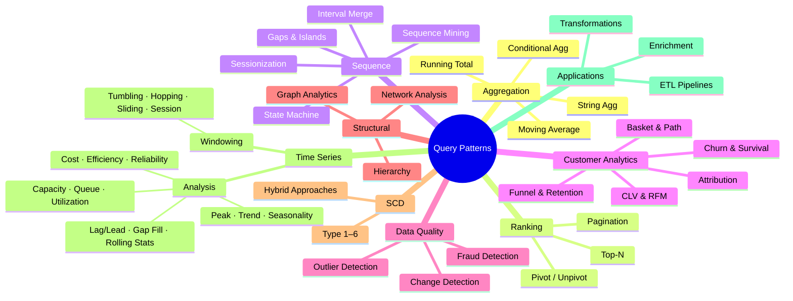
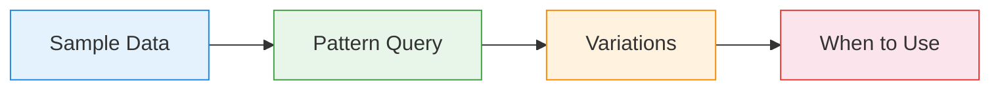

# :material-puzzle: Query Patterns

Self-contained Spark SQL recipes — each pattern includes inline sample data, the query, and the exact result output so you can read, run, and adapt immediately.

---

## :material-sitemap: Pattern Taxonomy



---

## :material-pin: Pattern Catalogue

### :material-sigma: Aggregation

| Pattern | Problem | Key Technique |
|---------|---------|---------------|
| [Running Total](aggregation/running_total.md) | Cumulative sums | `SUM() OVER (ORDER BY)` |
| [Moving Average](aggregation/moving_average.md) | Smoothed trends | `AVG() OVER (ROWS BETWEEN)` |
| [Growing Window](aggregation/growing_window.md) | Expanding aggregates | Unbounded preceding frame |
| [Conditional Aggregation](aggregation/conditional_agg.md) | Pivot without `PIVOT` | `SUM(CASE WHEN ...)` |
| [String Aggregation](aggregation/string_agg.md) | Concatenate values | `COLLECT_LIST`, `ARRAY_JOIN` |

### :material-podium: Ranking

| Pattern | Problem | Key Technique |
|---------|---------|---------------|
| [Top-N](ranking/top_n.md) | Highest/lowest per group | `ROW_NUMBER`, `DENSE_RANK` |
| [Pagination](ranking/pagination.md) | Page through results | `LIMIT` / `OFFSET`, keyset cursor |

### :material-transit-connection-variant: Sequence

| Pattern | Problem | Key Technique |
|---------|---------|---------------|
| [Gaps & Islands](sequence/gaps_islands.md) | Consecutive sequences and breaks | `ROW_NUMBER` delta grouping |
| [Sessionization](sequence/sessionization.md) | Session boundary detection | Gap-based splitting |
| [Interval Merge](sequence/interval_merge.md) | Merge overlapping ranges | Running max of end times |
| [Period Comparison](sequence/period_comparison.md) | YoY / MoM change | `LAG`, `LEAD`, `DATE_TRUNC` |
| [Nearest Time](sequence/nearest_time.md) | Find closest timestamp | `ABS(DATEDIFF)`, window min |
| [Event Stream Analytics](sequence/event_stream_analytics.md) | Process clickstreams | `LAG`/`LEAD`, session gaps |
| [Sequence Mining](sequence/sequence_mining.md) | Ordered event patterns | N-grams, support, confidence |
| [State Machine Analysis](sequence/state_machine.md) | Validate state transitions | Transition rules, loop detection |

### :material-account-group: Customer Analytics

| Pattern | Problem | Key Technique |
|---------|---------|---------------|
| [Funnel Analysis](customer_analytics/funnel_analysis.md) | Conversion drop-off | `COUNT(IF(...))`, window funcs |
| [Retention](customer_analytics/retention.md) | Cohort return rates | `DATE_TRUNC`, cohort join |
| [Churn Detection](customer_analytics/churn_detection.md) | Identify at-risk customers | Inactivity thresholds, scoring |
| [Survival Analysis](customer_analytics/survival_analysis.md) | Time-to-event modelling | Kaplan-Meier, censoring |
| [CLV](customer_analytics/clv.md) | Customer lifetime value | AOV × frequency × lifespan |
| [RFM Segmentation](customer_analytics/rfm_segmentation.md) | Behavioural segmentation | `NTILE`, composite scoring |
| [Basket Analysis](customer_analytics/basket_analysis.md) | Products bought together | Self-join, support, lift |
| [Path Analysis](customer_analytics/path_analysis.md) | Navigation sequences | `LEAD`/`LAG`, `COLLECT_LIST` |
| [Attribution Modeling](customer_analytics/attribution_modeling.md) | Channel revenue credit | First/last touch, time decay |
| [ABC Classification](customer_analytics/abc_classification.md) | Pareto segmentation | Cumulative %, `NTILE` |
| [Pareto](customer_analytics/pareto.md) | 80/20 analysis | Running sum percentage |

### :material-shield-check: Data Quality

| Pattern | Problem | Key Technique |
|---------|---------|---------------|
| [Change Detection](data_quality/change_detection.md) | Find row-level changes | Hash comparison, `EXCEPT` |
| [Outlier Detection](data_quality/outlier_detection.md) | Spot anomalous values | Z-score, IQR, percentiles |
| [Slowly Changing Comparison](data_quality/slowly_changing_comparison.md) | Compare dimension snapshots | Full outer join, `<=>` |
| [Fraud Pattern Detection](data_quality/fraud_detection.md) | Multi-account, velocity, impossible travel | Window counts, self-join |

### :material-file-tree: Structural

| Pattern | Problem | Key Technique |
|---------|---------|---------------|
| [Hierarchy](structural/hierarchy.md) | Parent-child traversal | Recursive CTE, self-join |
| [Graph Analytics](structural/graph_analytics.md) | Relationship networks | Connected components, BFS |
| [Network Analysis](structural/network_analysis.md) | IP-device-user mapping | Multi-factor link analysis |

### :material-delta: SCD

| Pattern | Problem | Key Technique |
|---------|---------|---------------|
| [SCD Overview](scd/index.md) | Track dimension history | Type 1–6, merge patterns |

### :material-chart-timeline-variant: Time Series — Windowing

| Pattern | Problem | Key Technique |
|---------|---------|---------------|
| [Tumbling Window](timeseries/windowing/tumbling_window.md) | Fixed non-overlapping intervals | `DATE_TRUNC`, `GROUP BY` |
| [Hopping Window](timeseries/windowing/hopping_window.md) | Fixed overlapping intervals | `EXPLODE` + `SEQUENCE` |
| [Sliding Window](timeseries/windowing/sliding_window.md) | Per-row rolling window | `ROWS BETWEEN n PRECEDING` |
| [Session Window](timeseries/windowing/session_window.md) | Activity-based intervals | Gap detection + grouping |

### :material-chart-timeline-variant: Time Series — Analysis

| Pattern | Problem | Key Technique |
|---------|---------|---------------|
| [Time Aggregation](timeseries/analysis/time_aggregation.md) | Temporal GROUP BY | `DATE_TRUNC` |
| [Lag & Lead](timeseries/analysis/lag_and_lead.md) | Previous/next value | `LAG`, `LEAD` |
| [Gap Filling](timeseries/analysis/gap_filling.md) | Missing timestamps | `SEQUENCE` + `EXPLODE` + left join |
| [Forecast Features](timeseries/analysis/forecast_features.md) | ML-ready lag features | `LAG(n)`, rolling AVG/MAX |
| [Feature Engineering](timeseries/analysis/feature_engineering.md) | General ML features | Category counts, composite scores |
| [Seasonality Detection](timeseries/analysis/seasonality_detection.md) | WoW / MoM / YoY | `LAG`, seasonal index |
| [Rolling Statistics](timeseries/analysis/rolling_statistics.md) | Median, variance, stddev | `PERCENTILE_APPROX`, `STDDEV` OVER |
| [Peak Detection](timeseries/analysis/peak_detection.md) | Maximum values, local peaks | `ROW_NUMBER`, `LAG`/`LEAD` comparison |
| [Trend Detection](timeseries/analysis/trend_detection.md) | Upward/downward trends | Consecutive streaks, rolling slope |
| [Utilization Analysis](timeseries/analysis/utilization_analysis.md) | Busy/idle/maintenance time | `LEAD` duration, conditional SUM |
| [Queue Analysis](timeseries/analysis/queue_analysis.md) | Wait time, queue length | Arrival/start/end timing |
| [Capacity Planning](timeseries/analysis/capacity_planning.md) | Forecast resource exhaustion | Growth rate, linear projection |
| [Inventory Analytics](timeseries/analysis/inventory_analytics.md) | Turnover, stock-outs, DOI | Demand rate, threshold alerts |
| [Interval Analytics](timeseries/analysis/interval_analytics.md) | Overlaps, concurrency, gaps | Self-join on time range |
| [Time Allocation](timeseries/analysis/time_allocation.md) | State-based time split | Conditional aggregation |
| [Resource Contention](timeseries/analysis/resource_contention.md) | Competing jobs | Running sum ±1 concurrency |
| [Reliability Metrics](timeseries/analysis/reliability_metrics.md) | MTBF, MTTR, availability | Failure/recovery intervals |
| [Workload Classification](timeseries/analysis/workload_classification.md) | Interactive/Batch/ETL/BI/ML | Rule-based query tagging |
| [Cost Attribution](timeseries/analysis/cost_attribution.md) | Per-query/user/warehouse cost | DBU aggregation **[Databricks]** |
| [Idle Time Analysis](timeseries/analysis/idle_time_analysis.md) | Wasted compute periods | Gap detection, auto-suspend |
| [Resource Efficiency](timeseries/analysis/resource_efficiency.md) | CPU, cache, queries/DBU | Efficiency scorecard |

### :material-application-cog: Applications

| Pattern | Problem | Key Technique |
|---------|---------|---------------|
| [Applications Overview](application/index.md) | End-to-end pipeline patterns | CTE chains, ETL recipes |
| [Pivot / Unpivot](application/transformation/pivot/index.md) | Reshape rows ↔ columns | `PIVOT`, `UNPIVOT`, `STACK` |

---

## :material-animation-play: Interactive Demo

Explore the pattern landscape — click a category to see its patterns and complexity.

<div id="viz-patterns-overview" class="ts-viz"></div>

---

## :material-information-outline: How to Read Each Pattern

Every page follows the same structure:



1. **Sample Data** — a `VALUES`-based temp view you can run directly.
2. **Pattern Query** — the SQL with inline `-- Result:` annotations.
3. **Variations** — alternative approaches for edge cases.
4. **When to Use** — decision table for choosing the right pattern.

---

## :material-toy-brick: Shared Dataset

Several patterns share a common `orders` and `employees` dataset.

```sql
-- orders — used in pagination, period comparison, conditional aggregation
CREATE OR REPLACE TEMP VIEW orders AS
SELECT * FROM VALUES
  (1,  'alice',  'electronics', 1200.00, DATE '2024-01-15'),
  (2,  'bob',    'clothing',     89.50, DATE '2024-01-22'),
  (3,  'alice',  'books',        34.99, DATE '2024-02-03'),
  (4,  'carol',  'electronics',  799.00, DATE '2024-02-14'),
  (5,  'bob',    'electronics',  249.00, DATE '2024-03-01'),
  (6,  'alice',  'clothing',     125.00, DATE '2024-03-10'),
  (7,  'carol',  'books',         19.99, DATE '2024-04-05'),
  (8,  'dave',   'electronics',  599.00, DATE '2024-04-18'),
  (9,  'alice',  'electronics',  349.00, DATE '2024-05-02'),
  (10, 'bob',    'clothing',      67.00, DATE '2024-05-20'),
  (11, 'carol',  'electronics', 1099.00, DATE '2023-11-10'),
  (12, 'dave',   'books',         45.00, DATE '2023-12-22')
AS t(order_id, customer, category, amount, order_date);

-- employees — used in hierarchy pattern
CREATE OR REPLACE TEMP VIEW employees AS
SELECT * FROM VALUES
  (1,  'Eve',    NULL, 'CEO',        200000),
  (2,  'Alice',  1,    'VP Eng',     150000),
  (3,  'Bob',    1,    'VP Sales',   140000),
  (4,  'Carol',  2,    'Engineer',    95000),
  (5,  'Dave',   2,    'Engineer',    92000),
  (6,  'Frank',  3,    'Sales Rep',   70000),
  (7,  'Grace',  3,    'Sales Rep',   68000),
  (8,  'Hank',   4,    'Junior Eng',  60000)
AS t(emp_id, name, manager_id, title, salary);
```
