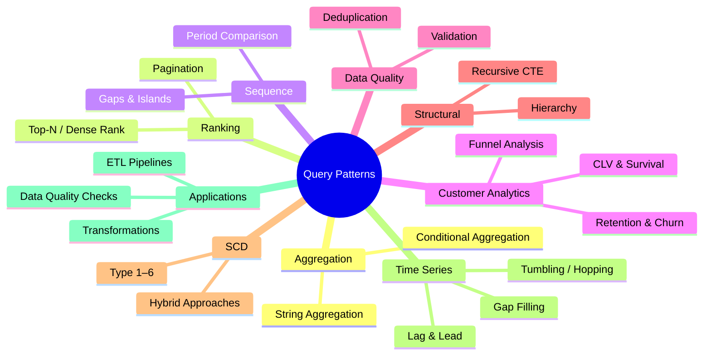
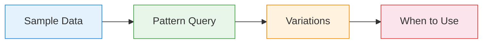

# :material-puzzle: Query Patterns

Self-contained Spark SQL recipes — each pattern includes inline sample data, the query, and the exact result output so you can read, run, and adapt immediately.

---

## :material-sitemap: Pattern Taxonomy



---

## :material-pin: Pattern Catalogue

| Category | Pattern | Problem | Key Technique |
|----------|---------|---------|---------------|
| :material-sigma: Aggregation | [String Aggregation](aggregation/string_agg.md) | Concatenate values across rows | `COLLECT_LIST`, `ARRAY_JOIN` |
| :material-sigma: Aggregation | [Conditional Aggregation](aggregation/conditional_agg.md) | Pivot counts / sums without `PIVOT` | `SUM(CASE WHEN ...)` |
| :material-podium: Ranking | [Pagination](ranking/pagination.md) | Page through large result sets | `LIMIT` / `OFFSET`, keyset cursor |
| :material-transit-connection-variant: Sequence | [Gaps & Islands](sequence/gaps_islands.md) | Detect consecutive sequences and breaks | `ROW_NUMBER` delta grouping |
| :material-transit-connection-variant: Sequence | [Period Comparison](sequence/period_comparison.md) | Year-over-year / month-over-month change | `LAG`, `LEAD`, `DATE_TRUNC` |
| :material-file-tree: Structural | [Hierarchy](structural/hierarchy.md) | Parent-child traversal, org charts | Self-join, recursive CTE |
| :material-account-group: Customer | [Funnel Analysis](customer_analytics/funnel_analysis.md) | Conversion drop-off analysis | `COUNT(IF(...))`, window funcs |
| :material-account-group: Customer | [CLV](customer_analytics/clv.md) | Estimate total customer value | Cohort analysis, NTILE |
| :material-delta: SCD | [SCD Overview](scd/index.md) | Track dimension history | Type 1–6, merge patterns |
| :material-chart-timeline-variant: Time Series | [Time Series Overview](timeseries/index.md) | Temporal windowing & analysis | Window frames, gap-fill |
| :material-application-cog: Applications | [Applications Overview](application/index.md) | End-to-end pipeline patterns | CTE chains, ETL recipes |

---

## :material-animation-play: Interactive Demo

Explore the pattern landscape — click a category to see its patterns and complexity.

<div id="viz-patterns-overview" class="ts-viz"></div>

---

## :material-information-outline: How to Read Each Pattern

Every page follows the same structure:



1. **Sample Data** — a `VALUES`-based temp view you can run directly.
2. **Pattern Query** — the SQL with inline `-- Result:` annotations.
3. **Variations** — alternative approaches for edge cases.
4. **When to Use** — decision table for choosing the right pattern.

---

## :material-toy-brick: Shared Dataset

Several patterns share a common `orders` and `employees` dataset.

```sql
-- orders — used in pagination, period comparison, conditional aggregation
CREATE OR REPLACE TEMP VIEW orders AS
SELECT * FROM VALUES
  (1,  'alice',  'electronics', 1200.00, DATE '2024-01-15'),
  (2,  'bob',    'clothing',     89.50, DATE '2024-01-22'),
  (3,  'alice',  'books',        34.99, DATE '2024-02-03'),
  (4,  'carol',  'electronics',  799.00, DATE '2024-02-14'),
  (5,  'bob',    'electronics',  249.00, DATE '2024-03-01'),
  (6,  'alice',  'clothing',     125.00, DATE '2024-03-10'),
  (7,  'carol',  'books',         19.99, DATE '2024-04-05'),
  (8,  'dave',   'electronics',  599.00, DATE '2024-04-18'),
  (9,  'alice',  'electronics',  349.00, DATE '2024-05-02'),
  (10, 'bob',    'clothing',      67.00, DATE '2024-05-20'),
  (11, 'carol',  'electronics', 1099.00, DATE '2023-11-10'),
  (12, 'dave',   'books',         45.00, DATE '2023-12-22')
AS t(order_id, customer, category, amount, order_date);

-- employees — used in hierarchy pattern
CREATE OR REPLACE TEMP VIEW employees AS
SELECT * FROM VALUES
  (1,  'Eve',    NULL, 'CEO',        200000),
  (2,  'Alice',  1,    'VP Eng',     150000),
  (3,  'Bob',    1,    'VP Sales',   140000),
  (4,  'Carol',  2,    'Engineer',    95000),
  (5,  'Dave',   2,    'Engineer',    92000),
  (6,  'Frank',  3,    'Sales Rep',   70000),
  (7,  'Grace',  3,    'Sales Rep',   68000),
  (8,  'Hank',   4,    'Junior Eng',  60000)
AS t(emp_id, name, manager_id, title, salary);
```
