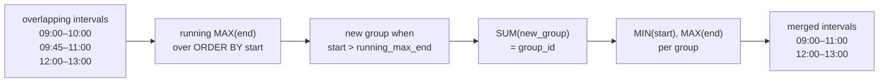

# :material-set-merge: Interval Merging

Merge overlapping or adjacent time ranges into consolidated, non-overlapping intervals — essential for availability windows, shift scheduling, license usage, and network session consolidation.

---

## :material-sitemap: Execution Flow



---

## :material-pin: Syntax

### Core merging pattern

```sql
WITH ordered AS (
    SELECT *,
        MAX(interval_end) OVER (
            PARTITION BY key
            ORDER BY interval_start
            ROWS BETWEEN UNBOUNDED PRECEDING AND 1 PRECEDING
        ) AS max_end_before
    FROM intervals
),
flagged AS (
    SELECT *,
        CASE WHEN max_end_before IS NULL
              OR interval_start > max_end_before
             THEN 1 ELSE 0
        END AS new_group
    FROM ordered
),
grouped AS (
    SELECT *,
        SUM(new_group) OVER (
            PARTITION BY key
            ORDER BY interval_start
            ROWS BETWEEN UNBOUNDED PRECEDING AND CURRENT ROW
        ) AS group_id
    FROM flagged
)
SELECT
    key,
    MIN(interval_start) AS merged_start,
    MAX(interval_end)   AS merged_end
FROM grouped
GROUP BY key, group_id
ORDER BY key, merged_start;
```

| Step | Purpose |
|------|---------|
| `MAX(end) OVER (... ROWS ... 1 PRECEDING)` | Running maximum of all end times *before* the current row |
| Gap detection | If `start > max_end_before`, the current interval does not overlap any prior one — start a new group |
| `SUM(new_group)` running total | Assigns a monotonically increasing group ID to each merged cluster |
| `MIN(start), MAX(end) GROUP BY group_id` | Collapses each cluster into a single merged interval |

!!! note "Adjacent vs overlapping"
    The pattern above treats adjacent intervals (end = next start) as **non-overlapping** because `start > max_end_before` uses strict greater-than. To merge adjacent intervals too, change to `start >= max_end_before` or adjust to `start > max_end_before + INTERVAL 1 SECOND` depending on your precision needs.

---

## :material-magnify: Behavior

1. **Order dependency** — intervals must be processed in `start` order. The running `MAX(end)` tracks the farthest reach of any prior interval.
2. **Enclosure** — a short interval entirely enclosed by a longer one (e.g., 09:00–11:00 contains 09:30–10:00) is automatically absorbed — `MAX(end)` does not decrease.
3. **Partition isolation** — `PARTITION BY key` ensures intervals from different entities (rooms, users, servers) are merged independently.
4. **NULL handling** — `MAX(end)` returns `NULL` for the first row in each partition; the `CASE` treats `NULL` as a new group start.

---

## :material-database: Sample Data

### Dataset 1: Meeting room bookings

```sql
CREATE OR REPLACE TEMP VIEW room_bookings AS
SELECT * FROM VALUES
    ('Room-A', TIMESTAMP '2024-08-05 09:00:00', TIMESTAMP '2024-08-05 10:00:00', 'Alice',   'Standup'),
    ('Room-A', TIMESTAMP '2024-08-05 09:45:00', TIMESTAMP '2024-08-05 11:00:00', 'Bob',     'Design review'),
    ('Room-A', TIMESTAMP '2024-08-05 11:00:00', TIMESTAMP '2024-08-05 12:00:00', 'Carol',   'Sprint planning'),
    ('Room-A', TIMESTAMP '2024-08-05 12:00:00', TIMESTAMP '2024-08-05 13:00:00', 'Dave',    'Lunch meeting'),
    ('Room-A', TIMESTAMP '2024-08-05 14:00:00', TIMESTAMP '2024-08-05 15:30:00', 'Eve',     'Workshop'),
    ('Room-A', TIMESTAMP '2024-08-05 15:00:00', TIMESTAMP '2024-08-05 16:00:00', 'Frank',   'All-hands'),
    ('Room-A', TIMESTAMP '2024-08-05 17:00:00', TIMESTAMP '2024-08-05 18:00:00', 'Grace',   'Retro'),
    ('Room-B', TIMESTAMP '2024-08-05 08:00:00', TIMESTAMP '2024-08-05 09:30:00', 'Hank',    'Morning sync'),
    ('Room-B', TIMESTAMP '2024-08-05 09:00:00', TIMESTAMP '2024-08-05 10:00:00', 'Irene',   'One-on-one'),
    ('Room-B', TIMESTAMP '2024-08-05 09:15:00', TIMESTAMP '2024-08-05 09:45:00', 'Jack',    'Quick chat'),
    ('Room-B', TIMESTAMP '2024-08-05 11:00:00', TIMESTAMP '2024-08-05 12:30:00', 'Karen',   'Interview'),
    ('Room-B', TIMESTAMP '2024-08-05 12:00:00', TIMESTAMP '2024-08-05 13:00:00', 'Leo',     'Interview 2'),
    ('Room-B', TIMESTAMP '2024-08-05 15:00:00', TIMESTAMP '2024-08-05 16:00:00', 'Mona',    'Training')
AS t(room, start_time, end_time, booked_by, purpose);
```

### Dataset 2: Server maintenance windows

```sql
CREATE OR REPLACE TEMP VIEW maintenance_windows AS
SELECT * FROM VALUES
    ('prod-db-01', DATE '2024-09-07', DATE '2024-09-09', 'Patch upgrade'),
    ('prod-db-01', DATE '2024-09-08', DATE '2024-09-10', 'Security scan'),
    ('prod-db-01', DATE '2024-09-10', DATE '2024-09-11', 'Index rebuild'),
    ('prod-db-01', DATE '2024-09-15', DATE '2024-09-16', 'Backup test'),
    ('prod-db-01', DATE '2024-09-20', DATE '2024-09-22', 'OS upgrade'),
    ('prod-db-01', DATE '2024-09-21', DATE '2024-09-23', 'Disk migration'),
    ('prod-db-01', DATE '2024-09-22', DATE '2024-09-24', 'Validation'),
    ('web-app-01', DATE '2024-09-07', DATE '2024-09-08', 'Deploy v3.1'),
    ('web-app-01', DATE '2024-09-12', DATE '2024-09-13', 'Deploy v3.2'),
    ('web-app-01', DATE '2024-09-12', DATE '2024-09-14', 'Load test'),
    ('web-app-01', DATE '2024-09-18', DATE '2024-09-19', 'Config change')
AS t(server, start_date, end_date, description);
```

### Dataset 3: Employee shift schedule

```sql
CREATE OR REPLACE TEMP VIEW shifts AS
SELECT * FROM VALUES
    ('Support', 'Alice',   TIMESTAMP '2024-10-01 06:00:00', TIMESTAMP '2024-10-01 14:00:00'),
    ('Support', 'Bob',     TIMESTAMP '2024-10-01 08:00:00', TIMESTAMP '2024-10-01 16:00:00'),
    ('Support', 'Carol',   TIMESTAMP '2024-10-01 14:00:00', TIMESTAMP '2024-10-01 22:00:00'),
    ('Support', 'Dave',    TIMESTAMP '2024-10-01 20:00:00', TIMESTAMP '2024-10-02 04:00:00'),
    ('Support', 'Eve',     TIMESTAMP '2024-10-02 06:00:00', TIMESTAMP '2024-10-02 14:00:00'),
    ('Ops',     'Frank',   TIMESTAMP '2024-10-01 00:00:00', TIMESTAMP '2024-10-01 08:00:00'),
    ('Ops',     'Grace',   TIMESTAMP '2024-10-01 07:00:00', TIMESTAMP '2024-10-01 15:00:00'),
    ('Ops',     'Hank',    TIMESTAMP '2024-10-01 18:00:00', TIMESTAMP '2024-10-02 02:00:00'),
    ('Ops',     'Irene',   TIMESTAMP '2024-10-02 01:00:00', TIMESTAMP '2024-10-02 09:00:00')
AS t(team, employee, shift_start, shift_end);
```

---

## :material-flask-outline: Practical Examples

### 1 — Basic interval merging (meeting rooms)

```sql
WITH ordered AS (
    SELECT
        room,
        start_time,
        end_time,
        MAX(end_time) OVER (
            PARTITION BY room
            ORDER BY start_time
            ROWS BETWEEN UNBOUNDED PRECEDING AND 1 PRECEDING
        ) AS max_end_before
    FROM room_bookings
),
flagged AS (
    SELECT *,
        CASE WHEN max_end_before IS NULL OR start_time > max_end_before
             THEN 1 ELSE 0
        END AS new_group
    FROM ordered
),
grouped AS (
    SELECT *,
        SUM(new_group) OVER (
            PARTITION BY room
            ORDER BY start_time
            ROWS BETWEEN UNBOUNDED PRECEDING AND CURRENT ROW
        ) AS group_id
    FROM flagged
)
SELECT
    room,
    MIN(start_time) AS merged_start,
    MAX(end_time) AS merged_end,
    COUNT(*) AS bookings_merged,
    ROUND((BIGINT(MAX(end_time)) - BIGINT(MIN(start_time))) / 3600.0, 1) AS block_hours
FROM grouped
GROUP BY room, group_id
ORDER BY room, merged_start;
```

??? success "Expected output"

    | room | merged_start | merged_end | bookings_merged | block_hours |
    |------|--------------|------------|-----------------|-------------|
    | Room-A | 2024-08-05 09:00:00 | 2024-08-05 13:00:00 | 4 | 4.0 |
    | Room-A | 2024-08-05 14:00:00 | 2024-08-05 16:00:00 | 2 | 2.0 |
    | Room-A | 2024-08-05 17:00:00 | 2024-08-05 18:00:00 | 1 | 1.0 |
    | Room-B | 2024-08-05 08:00:00 | 2024-08-05 10:00:00 | 3 | 2.0 |
    | Room-B | 2024-08-05 11:00:00 | 2024-08-05 13:00:00 | 2 | 2.0 |
    | Room-B | 2024-08-05 15:00:00 | 2024-08-05 16:00:00 | 1 | 1.0 |

!!! note "Adjacent intervals"
    Room-A's 10:00-11:00 booking starts exactly when the merged block ends — it is treated as adjacent and merged because `start_time > max_end_before` is `FALSE` when they are equal. Change to `>=` to split adjacent intervals.

### 2 — Merge with original booking details preserved

```sql
WITH ordered AS (
    SELECT *,
        MAX(end_time) OVER (
            PARTITION BY room ORDER BY start_time
            ROWS BETWEEN UNBOUNDED PRECEDING AND 1 PRECEDING
        ) AS max_end_before
    FROM room_bookings
),
flagged AS (
    SELECT *,
        CASE WHEN max_end_before IS NULL OR start_time > max_end_before THEN 1 ELSE 0 END AS new_group
    FROM ordered
),
grouped AS (
    SELECT *,
        SUM(new_group) OVER (
            PARTITION BY room ORDER BY start_time
            ROWS BETWEEN UNBOUNDED PRECEDING AND CURRENT ROW
        ) AS group_id
    FROM flagged
)
SELECT
    room,
    group_id,
    MIN(start_time) OVER (PARTITION BY room, group_id) AS block_start,
    MAX(end_time) OVER (PARTITION BY room, group_id) AS block_end,
    start_time,
    end_time,
    booked_by,
    purpose
FROM grouped
ORDER BY room, start_time;
```

??? success "Expected output"

    | room | group_id | block_start | block_end | start_time | end_time | booked_by | purpose |
    |------|----------|-------------|-----------|------------|----------|-----------|---------|
    | Room-A | 1 | 09:00 | 13:00 | 09:00 | 10:00 | Alice | Standup |
    | Room-A | 1 | 09:00 | 13:00 | 09:45 | 11:00 | Bob | Design review |
    | Room-A | 1 | 09:00 | 13:00 | 11:00 | 12:00 | Carol | Sprint planning |
    | Room-A | 1 | 09:00 | 13:00 | 12:00 | 13:00 | Dave | Lunch meeting |
    | Room-A | 2 | 14:00 | 16:00 | 14:00 | 15:30 | Eve | Workshop |
    | Room-A | 2 | 14:00 | 16:00 | 15:00 | 16:00 | Frank | All-hands |
    | Room-A | 3 | 17:00 | 18:00 | 17:00 | 18:00 | Grace | Retro |
    | ... | | | | | | | |

### 3 — Merge server maintenance windows (date-based)

```sql
WITH ordered AS (
    SELECT *,
        MAX(end_date) OVER (
            PARTITION BY server ORDER BY start_date
            ROWS BETWEEN UNBOUNDED PRECEDING AND 1 PRECEDING
        ) AS max_end_before
    FROM maintenance_windows
),
flagged AS (
    SELECT *,
        CASE WHEN max_end_before IS NULL OR start_date > max_end_before THEN 1 ELSE 0 END AS new_group
    FROM ordered
),
grouped AS (
    SELECT *,
        SUM(new_group) OVER (
            PARTITION BY server ORDER BY start_date
            ROWS BETWEEN UNBOUNDED PRECEDING AND CURRENT ROW
        ) AS group_id
    FROM flagged
)
SELECT
    server,
    MIN(start_date) AS window_start,
    MAX(end_date) AS window_end,
    DATEDIFF(MAX(end_date), MIN(start_date)) AS total_days,
    COUNT(*) AS tasks_merged,
    COLLECT_LIST(description) AS tasks
FROM grouped
GROUP BY server, group_id
ORDER BY server, window_start;
```

??? success "Expected output"

    | server | window_start | window_end | total_days | tasks_merged | tasks |
    |--------|--------------|------------|------------|--------------|-------|
    | prod-db-01 | 2024-09-07 | 2024-09-11 | 4 | 3 | [Patch upgrade, Security scan, Index rebuild] |
    | prod-db-01 | 2024-09-15 | 2024-09-16 | 1 | 1 | [Backup test] |
    | prod-db-01 | 2024-09-20 | 2024-09-24 | 4 | 3 | [OS upgrade, Disk migration, Validation] |
    | web-app-01 | 2024-09-07 | 2024-09-08 | 1 | 1 | [Deploy v3.1] |
    | web-app-01 | 2024-09-12 | 2024-09-14 | 2 | 2 | [Deploy v3.2, Load test] |
    | web-app-01 | 2024-09-18 | 2024-09-19 | 1 | 1 | [Config change] |

### 4 — Coverage hours per team (shift merging)

Merge overlapping employee shifts to find continuous coverage windows:

```sql
WITH ordered AS (
    SELECT *,
        MAX(shift_end) OVER (
            PARTITION BY team ORDER BY shift_start
            ROWS BETWEEN UNBOUNDED PRECEDING AND 1 PRECEDING
        ) AS max_end_before
    FROM shifts
),
flagged AS (
    SELECT *,
        CASE WHEN max_end_before IS NULL OR shift_start > max_end_before THEN 1 ELSE 0 END AS new_group
    FROM ordered
),
grouped AS (
    SELECT *,
        SUM(new_group) OVER (
            PARTITION BY team ORDER BY shift_start
            ROWS BETWEEN UNBOUNDED PRECEDING AND CURRENT ROW
        ) AS group_id
    FROM flagged
)
SELECT
    team,
    MIN(shift_start) AS coverage_start,
    MAX(shift_end) AS coverage_end,
    ROUND((BIGINT(MAX(shift_end)) - BIGINT(MIN(shift_start))) / 3600.0, 1) AS coverage_hours,
    COUNT(*) AS staff_count,
    COLLECT_LIST(employee) AS staff
FROM grouped
GROUP BY team, group_id
ORDER BY team, coverage_start;
```

??? success "Expected output"

    | team | coverage_start | coverage_end | coverage_hours | staff_count | staff |
    |------|----------------|--------------|----------------|-------------|-------|
    | Ops | 2024-10-01 00:00:00 | 2024-10-01 15:00:00 | 15.0 | 2 | [Frank, Grace] |
    | Ops | 2024-10-01 18:00:00 | 2024-10-02 09:00:00 | 15.0 | 2 | [Hank, Irene] |
    | Support | 2024-10-01 06:00:00 | 2024-10-02 04:00:00 | 22.0 | 4 | [Alice, Bob, Carol, Dave] |
    | Support | 2024-10-02 06:00:00 | 2024-10-02 14:00:00 | 8.0 | 1 | [Eve] |

!!! tip "Coverage gap detection"
    Ops has a 3-hour gap (15:00–18:00) between coverage blocks. Support has a 2-hour gap (04:00–06:00). Gaps between merged blocks reveal unstaffed periods.

### 5 — Find gaps between merged intervals

```sql
WITH ordered AS (
    SELECT *,
        MAX(shift_end) OVER (
            PARTITION BY team ORDER BY shift_start
            ROWS BETWEEN UNBOUNDED PRECEDING AND 1 PRECEDING
        ) AS max_end_before
    FROM shifts
),
flagged AS (
    SELECT *,
        CASE WHEN max_end_before IS NULL OR shift_start > max_end_before THEN 1 ELSE 0 END AS new_group
    FROM ordered
),
grouped AS (
    SELECT *,
        SUM(new_group) OVER (
            PARTITION BY team ORDER BY shift_start
            ROWS BETWEEN UNBOUNDED PRECEDING AND CURRENT ROW
        ) AS group_id
    FROM flagged
),
merged AS (
    SELECT
        team,
        MIN(shift_start) AS coverage_start,
        MAX(shift_end) AS coverage_end
    FROM grouped
    GROUP BY team, group_id
),
with_next AS (
    SELECT
        team,
        coverage_start,
        coverage_end,
        LEAD(coverage_start) OVER (PARTITION BY team ORDER BY coverage_start) AS next_start
    FROM merged
)
SELECT
    team,
    coverage_end AS gap_start,
    next_start AS gap_end,
    ROUND((BIGINT(next_start) - BIGINT(coverage_end)) / 3600.0, 1) AS gap_hours
FROM with_next
WHERE next_start IS NOT NULL
ORDER BY team, gap_start;
```

??? success "Expected output"

    | team | gap_start | gap_end | gap_hours |
    |------|-----------|---------|-----------|
    | Ops | 2024-10-01 15:00:00 | 2024-10-01 18:00:00 | 3.0 |
    | Support | 2024-10-02 04:00:00 | 2024-10-02 06:00:00 | 2.0 |

### 6 — Utilisation rate (occupied vs total time)

```sql
WITH ordered AS (
    SELECT *,
        MAX(end_time) OVER (
            PARTITION BY room ORDER BY start_time
            ROWS BETWEEN UNBOUNDED PRECEDING AND 1 PRECEDING
        ) AS max_end_before
    FROM room_bookings
),
flagged AS (
    SELECT *,
        CASE WHEN max_end_before IS NULL OR start_time > max_end_before THEN 1 ELSE 0 END AS new_group
    FROM ordered
),
grouped AS (
    SELECT *,
        SUM(new_group) OVER (
            PARTITION BY room ORDER BY start_time
            ROWS BETWEEN UNBOUNDED PRECEDING AND CURRENT ROW
        ) AS group_id
    FROM flagged
),
merged AS (
    SELECT
        room,
        MIN(start_time) AS block_start,
        MAX(end_time) AS block_end
    FROM grouped
    GROUP BY room, group_id
)
SELECT
    room,
    COUNT(*) AS occupied_blocks,
    ROUND(SUM((BIGINT(block_end) - BIGINT(block_start)) / 3600.0), 1) AS occupied_hours,
    10.0 AS available_hours,
    ROUND(
        SUM((BIGINT(block_end) - BIGINT(block_start)) / 3600.0) * 100.0 / 10.0, 1
    ) AS utilisation_pct
FROM merged
GROUP BY room
ORDER BY room;
```

??? success "Expected output"

    | room | occupied_blocks | occupied_hours | available_hours | utilisation_pct |
    |------|-----------------|----------------|-----------------|-----------------|
    | Room-A | 3 | 7.0 | 10.0 | 70.0 |
    | Room-B | 3 | 5.0 | 10.0 | 50.0 |

### 7 — Concurrent booking count (max overlap depth)

Find the maximum number of simultaneously active bookings:

```sql
WITH events AS (
    SELECT room, start_time AS ts, 1 AS delta FROM room_bookings
    UNION ALL
    SELECT room, end_time, -1 FROM room_bookings
),
running AS (
    SELECT
        room,
        ts,
        SUM(delta) OVER (
            PARTITION BY room
            ORDER BY ts, delta
            ROWS BETWEEN UNBOUNDED PRECEDING AND CURRENT ROW
        ) AS concurrent
    FROM events
)
SELECT
    room,
    MAX(concurrent) AS max_concurrent_bookings
FROM running
GROUP BY room
ORDER BY room;
```

??? success "Expected output"

    | room | max_concurrent_bookings |
    |------|-------------------------|
    | Room-A | 2 |
    | Room-B | 3 |

!!! tip "Sweep-line algorithm"
    This uses the classic sweep-line technique: create +1 events at each start and -1 events at each end, then compute a running sum. The peak of the running sum is the maximum concurrency.

### 8 — Merge with minimum gap tolerance (30-minute buffer)

Treat intervals separated by less than 30 minutes as continuous:

```sql
WITH extended AS (
    SELECT
        room,
        start_time,
        end_time + INTERVAL 30 MINUTES AS end_time_buffered,
        end_time AS original_end,
        booked_by
    FROM room_bookings
),
ordered AS (
    SELECT *,
        MAX(end_time_buffered) OVER (
            PARTITION BY room ORDER BY start_time
            ROWS BETWEEN UNBOUNDED PRECEDING AND 1 PRECEDING
        ) AS max_end_before
    FROM extended
),
flagged AS (
    SELECT *,
        CASE WHEN max_end_before IS NULL OR start_time > max_end_before THEN 1 ELSE 0 END AS new_group
    FROM ordered
),
grouped AS (
    SELECT *,
        SUM(new_group) OVER (
            PARTITION BY room ORDER BY start_time
            ROWS BETWEEN UNBOUNDED PRECEDING AND CURRENT ROW
        ) AS group_id
    FROM flagged
)
SELECT
    room,
    MIN(start_time) AS merged_start,
    MAX(original_end) AS merged_end,
    COUNT(*) AS bookings_merged
FROM grouped
GROUP BY room, group_id
ORDER BY room, merged_start;
```

??? success "Expected output"

    | room | merged_start | merged_end | bookings_merged |
    |------|--------------|------------|-----------------|
    | Room-A | 2024-08-05 09:00:00 | 2024-08-05 16:00:00 | 6 |
    | Room-A | 2024-08-05 17:00:00 | 2024-08-05 18:00:00 | 1 |
    | Room-B | 2024-08-05 08:00:00 | 2024-08-05 13:00:00 | 5 |
    | Room-B | 2024-08-05 15:00:00 | 2024-08-05 16:00:00 | 1 |

!!! note "Buffer effect"
    Room-A's 13:00–14:00 gap (1 hour) was bridged because the 30-minute buffer extended the first block's effective end to 13:30, and the workshop starts at 14:00 — still a 30-minute gap. With a 60-minute buffer, all Room-A bookings would merge into one block.

### 9 — Maintenance downtime summary per month

```sql
WITH ordered AS (
    SELECT *,
        MAX(end_date) OVER (
            PARTITION BY server ORDER BY start_date
            ROWS BETWEEN UNBOUNDED PRECEDING AND 1 PRECEDING
        ) AS max_end_before
    FROM maintenance_windows
),
flagged AS (
    SELECT *,
        CASE WHEN max_end_before IS NULL OR start_date > max_end_before THEN 1 ELSE 0 END AS new_group
    FROM ordered
),
grouped AS (
    SELECT *,
        SUM(new_group) OVER (
            PARTITION BY server ORDER BY start_date
            ROWS BETWEEN UNBOUNDED PRECEDING AND CURRENT ROW
        ) AS group_id
    FROM flagged
),
merged AS (
    SELECT
        server,
        MIN(start_date) AS window_start,
        MAX(end_date) AS window_end,
        DATEDIFF(MAX(end_date), MIN(start_date)) AS duration_days
    FROM grouped
    GROUP BY server, group_id
)
SELECT
    server,
    COUNT(*) AS maintenance_windows,
    SUM(duration_days) AS total_downtime_days,
    ROUND(SUM(duration_days) * 100.0 / 30, 1) AS pct_of_month
FROM merged
GROUP BY server
ORDER BY total_downtime_days DESC;
```

??? success "Expected output"

    | server | maintenance_windows | total_downtime_days | pct_of_month |
    |--------|---------------------|---------------------|--------------|
    | prod-db-01 | 3 | 9 | 30.0 |
    | web-app-01 | 3 | 4 | 13.3 |

### 10 — Overlap detection without merging

Sometimes you just need to find which intervals overlap, not merge them:

```sql
SELECT
    a.room,
    a.booked_by AS booking_1,
    a.start_time AS start_1,
    a.end_time AS end_1,
    b.booked_by AS booking_2,
    b.start_time AS start_2,
    b.end_time AS end_2,
    GREATEST(a.start_time, b.start_time) AS overlap_start,
    LEAST(a.end_time, b.end_time) AS overlap_end,
    ROUND((BIGINT(LEAST(a.end_time, b.end_time)) - BIGINT(GREATEST(a.start_time, b.start_time))) / 60.0, 0) AS overlap_minutes
FROM room_bookings a
JOIN room_bookings b
    ON a.room = b.room
    AND a.start_time < b.start_time
    AND a.end_time > b.start_time
ORDER BY a.room, a.start_time, b.start_time;
```

??? success "Expected output"

    | room | booking_1 | start_1 | end_1 | booking_2 | start_2 | end_2 | overlap_start | overlap_end | overlap_minutes |
    |------|-----------|---------|-------|-----------|---------|-------|---------------|-------------|-----------------|
    | Room-A | Alice | 09:00 | 10:00 | Bob | 09:45 | 11:00 | 09:45 | 10:00 | 15 |
    | Room-A | Eve | 14:00 | 15:30 | Frank | 15:00 | 16:00 | 15:00 | 15:30 | 30 |
    | Room-B | Hank | 08:00 | 09:30 | Irene | 09:00 | 10:00 | 09:00 | 09:30 | 30 |
    | Room-B | Hank | 08:00 | 09:30 | Jack | 09:15 | 09:45 | 09:15 | 09:30 | 15 |
    | Room-B | Irene | 09:00 | 10:00 | Jack | 09:15 | 09:45 | 09:15 | 09:45 | 30 |
    | Room-B | Karen | 11:00 | 12:30 | Leo | 12:00 | 13:00 | 12:00 | 12:30 | 30 |

!!! warning "Double-booking detection"
    This query finds all pairs of overlapping bookings — useful for validating that a room is not double-booked, or for scheduling conflict reports.

---

## :material-shield-outline: Behavior Notes

!!! warning "Sort order is critical"
    The running `MAX(end)` only works correctly when intervals are processed in `start` order. If two intervals share the same start time, add `end_time` as a secondary sort to ensure deterministic grouping.

!!! warning "Enclosed intervals"
    An interval entirely enclosed by a prior one (e.g., 09:15–09:45 inside 08:00–09:30) is automatically absorbed. `MAX(end)` does not decrease, so the enclosing interval's end is preserved.

!!! tip "Adjacent vs overlapping"
    To merge adjacent intervals (end of one equals start of next), use `start_time >= max_end_before` instead of `>`. This is a common requirement for shift scheduling where handoff times are contiguous.

!!! tip "Performance"
    The window-function approach is single-pass and efficient. Avoid self-join-based merge approaches which are O(n^2). For very large datasets, ensure the `PARTITION BY` column has reasonable cardinality to limit sort sizes.

---

## :material-brain: When to Use

| Scenario | Pattern |
|----------|---------|
| Merge overlapping meeting bookings | Running `MAX(end)` + gap detection + `GROUP BY group_id` |
| Merge adjacent time shifts | Same pattern with `>=` instead of `>` for adjacency |
| Server maintenance windows | Merge date ranges, collect task lists |
| Coverage / utilisation analysis | Merge shifts, compute occupied vs available hours |
| Gap detection between merged blocks | `LEAD(merged_start)` after merging |
| Maximum concurrency (peak overlap) | Sweep-line: +1 at start, -1 at end, running sum |
| Double-booking conflict detection | Self-join: `a.end > b.start AND a.start < b.end` |
| Merge with tolerance (buffer gap) | Extend `end_time` by buffer before merging |
| Downtime percentage reporting | Sum merged duration / total period |
| Preserve original rows with block ID | Window `MIN/MAX` over `(key, group_id)` alongside source columns |
