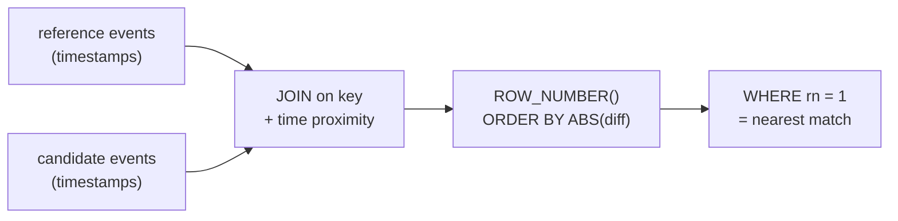

# :material-clock-fast: Nearest Neighbor (Time)

Find the closest event in time to a reference point — match sensor readings to control signals, align trades to quotes, or snap irregular timestamps to the nearest regular interval.

---

## :material-sitemap: Execution Flow



---

## :material-pin: Syntax

### LAG / LEAD approach (single stream, nearest neighbor within same table)

```sql
SELECT
    *,
    LAG(ts)  OVER (PARTITION BY key ORDER BY ts) AS prev_ts,
    LEAD(ts) OVER (PARTITION BY key ORDER BY ts) AS next_ts
FROM events;
```

### Cross-join + rank approach (two tables)

```sql
WITH distances AS (
    SELECT
        a.*,
        b.ts AS match_ts,
        ABS(BIGINT(a.ts) - BIGINT(b.ts)) AS time_diff_sec,
        ROW_NUMBER() OVER (
            PARTITION BY a.id
            ORDER BY ABS(BIGINT(a.ts) - BIGINT(b.ts))
        ) AS rn
    FROM reference a
    JOIN candidates b
        ON a.key = b.key
)
SELECT * FROM distances WHERE rn = 1;
```

| Approach | Best for | Trade-off |
|----------|----------|-----------|
| `LAG` / `LEAD` | Nearest neighbor within the same stream | Fast, single-pass window scan |
| Join + `ROW_NUMBER` | Matching between two different tables | Flexible, handles many-to-many |
| Range join with bounds | Large candidate sets | Prune candidates before ranking |
| `LAST_VALUE` with frame | Nearest preceding only | No future look-ahead |

!!! note "Performance"
    The cross-join approach can be expensive when both tables are large. Always add a bounded join condition (e.g., within 1 hour) to limit the cross-product before ranking.

---

## :material-magnify: Behavior

1. **Tie-breaking** — when two candidates are equidistant, `ROW_NUMBER` picks one arbitrarily. Add a secondary `ORDER BY` (e.g., prefer the earlier event) for deterministic results.
2. **Direction bias** — "nearest" means closest in either direction. For "nearest preceding only" or "nearest following only," add a directional filter (`b.ts <= a.ts`).
3. **NULL handling** — `LAG`/`LEAD` return `NULL` at partition boundaries; handle these edge cases with `COALESCE` or conditional logic.
4. **Time precision** — `BIGINT(ts)` converts timestamps to epoch seconds. For sub-second precision, use `UNIX_MILLIS(ts)` or `UNIX_MICROS(ts)`.

---

## :material-database: Sample Data

### Dataset 1: Sensor readings and control signals

```sql
CREATE OR REPLACE TEMP VIEW sensor_readings AS
SELECT * FROM VALUES
    ('reactor_1', TIMESTAMP '2024-05-10 08:00:12', 72.3),
    ('reactor_1', TIMESTAMP '2024-05-10 08:05:45', 73.1),
    ('reactor_1', TIMESTAMP '2024-05-10 08:10:08', 74.8),
    ('reactor_1', TIMESTAMP '2024-05-10 08:15:33', 76.2),
    ('reactor_1', TIMESTAMP '2024-05-10 08:20:19', 75.5),
    ('reactor_1', TIMESTAMP '2024-05-10 08:25:41', 77.0),
    ('reactor_1', TIMESTAMP '2024-05-10 08:30:05', 78.3),
    ('reactor_1', TIMESTAMP '2024-05-10 08:35:28', 76.9),
    ('reactor_1', TIMESTAMP '2024-05-10 08:40:14', 75.1),
    ('reactor_1', TIMESTAMP '2024-05-10 08:45:50', 74.4),
    ('reactor_2', TIMESTAMP '2024-05-10 08:01:00', 65.0),
    ('reactor_2', TIMESTAMP '2024-05-10 08:06:30', 66.2),
    ('reactor_2', TIMESTAMP '2024-05-10 08:11:15', 67.8),
    ('reactor_2', TIMESTAMP '2024-05-10 08:16:45', 68.5),
    ('reactor_2', TIMESTAMP '2024-05-10 08:21:30', 67.1)
AS t(reactor_id, reading_time, temperature);

CREATE OR REPLACE TEMP VIEW control_signals AS
SELECT * FROM VALUES
    ('reactor_1', TIMESTAMP '2024-05-10 08:00:00', 'START',       70.0),
    ('reactor_1', TIMESTAMP '2024-05-10 08:14:00', 'RAMP_UP',     75.0),
    ('reactor_1', TIMESTAMP '2024-05-10 08:28:00', 'HOLD',        77.0),
    ('reactor_1', TIMESTAMP '2024-05-10 08:42:00', 'COOL_DOWN',   72.0),
    ('reactor_2', TIMESTAMP '2024-05-10 08:00:00', 'START',       64.0),
    ('reactor_2', TIMESTAMP '2024-05-10 08:15:00', 'RAMP_UP',     68.0)
AS t(reactor_id, signal_time, command, target_temp);
```

### Dataset 2: Trade executions and market quotes

```sql
CREATE OR REPLACE TEMP VIEW trades AS
SELECT * FROM VALUES
    (1001, 'ACME', TIMESTAMP '2024-06-12 09:30:15', 152.40, 500),
    (1002, 'ACME', TIMESTAMP '2024-06-12 09:45:02', 153.10, 300),
    (1003, 'ACME', TIMESTAMP '2024-06-12 10:12:38', 154.80, 750),
    (1004, 'ACME', TIMESTAMP '2024-06-12 10:30:55', 153.50, 200),
    (1005, 'ACME', TIMESTAMP '2024-06-12 11:05:22', 155.20, 400),
    (1006, 'BOLT', TIMESTAMP '2024-06-12 09:31:10', 41.20,  1200),
    (1007, 'BOLT', TIMESTAMP '2024-06-12 10:00:45', 41.80,  800),
    (1008, 'BOLT', TIMESTAMP '2024-06-12 10:45:30', 42.50,  600)
AS t(trade_id, ticker, trade_time, price, qty);

CREATE OR REPLACE TEMP VIEW quotes AS
SELECT * FROM VALUES
    ('ACME', TIMESTAMP '2024-06-12 09:30:00', 152.30, 152.50),
    ('ACME', TIMESTAMP '2024-06-12 09:35:00', 152.50, 152.70),
    ('ACME', TIMESTAMP '2024-06-12 09:40:00', 152.80, 153.00),
    ('ACME', TIMESTAMP '2024-06-12 09:45:00', 153.00, 153.20),
    ('ACME', TIMESTAMP '2024-06-12 09:50:00', 153.10, 153.30),
    ('ACME', TIMESTAMP '2024-06-12 10:00:00', 153.50, 153.70),
    ('ACME', TIMESTAMP '2024-06-12 10:10:00', 154.20, 154.40),
    ('ACME', TIMESTAMP '2024-06-12 10:15:00', 154.80, 155.00),
    ('ACME', TIMESTAMP '2024-06-12 10:30:00', 153.40, 153.60),
    ('ACME', TIMESTAMP '2024-06-12 10:45:00', 154.00, 154.20),
    ('ACME', TIMESTAMP '2024-06-12 11:00:00', 154.90, 155.10),
    ('ACME', TIMESTAMP '2024-06-12 11:05:00', 155.10, 155.30),
    ('BOLT', TIMESTAMP '2024-06-12 09:30:00', 41.10,  41.30),
    ('BOLT', TIMESTAMP '2024-06-12 09:35:00', 41.20,  41.40),
    ('BOLT', TIMESTAMP '2024-06-12 10:00:00', 41.70,  41.90),
    ('BOLT', TIMESTAMP '2024-06-12 10:30:00', 42.00,  42.20),
    ('BOLT', TIMESTAMP '2024-06-12 10:45:00', 42.40,  42.60)
AS t(ticker, quote_time, bid, ask);
```

### Dataset 3: Irregular event log with regular grid

```sql
CREATE OR REPLACE TEMP VIEW irregular_events AS
SELECT * FROM VALUES
    ('web-01', TIMESTAMP '2024-04-01 10:02:15', 'deploy',      'v2.3.1'),
    ('web-01', TIMESTAMP '2024-04-01 10:17:42', 'alert',       'cpu_high'),
    ('web-01', TIMESTAMP '2024-04-01 10:31:05', 'scale_up',    '4->8'),
    ('web-01', TIMESTAMP '2024-04-01 10:48:20', 'alert_clear', 'cpu_normal'),
    ('web-01', TIMESTAMP '2024-04-01 11:05:55', 'deploy',      'v2.3.2'),
    ('web-01', TIMESTAMP '2024-04-01 11:22:30', 'alert',       'mem_high'),
    ('web-01', TIMESTAMP '2024-04-01 11:40:10', 'scale_up',    '8->12'),
    ('web-01', TIMESTAMP '2024-04-01 11:58:45', 'alert_clear', 'mem_normal')
AS t(server, event_time, event_type, detail);

CREATE OR REPLACE TEMP VIEW time_grid AS
SELECT * FROM VALUES
    (TIMESTAMP '2024-04-01 10:00:00'),
    (TIMESTAMP '2024-04-01 10:15:00'),
    (TIMESTAMP '2024-04-01 10:30:00'),
    (TIMESTAMP '2024-04-01 10:45:00'),
    (TIMESTAMP '2024-04-01 11:00:00'),
    (TIMESTAMP '2024-04-01 11:15:00'),
    (TIMESTAMP '2024-04-01 11:30:00'),
    (TIMESTAMP '2024-04-01 11:45:00'),
    (TIMESTAMP '2024-04-01 12:00:00')
AS t(slot);
```

---

## :material-flask-outline: Practical Examples

### 1 — Match each sensor reading to the nearest control signal

```sql
WITH distances AS (
    SELECT
        s.reactor_id,
        s.reading_time,
        s.temperature,
        c.signal_time,
        c.command,
        c.target_temp,
        ABS(BIGINT(s.reading_time) - BIGINT(c.signal_time)) AS diff_sec,
        ROW_NUMBER() OVER (
            PARTITION BY s.reactor_id, s.reading_time
            ORDER BY ABS(BIGINT(s.reading_time) - BIGINT(c.signal_time)),
                     c.signal_time DESC
        ) AS rn
    FROM sensor_readings s
    JOIN control_signals c
        ON s.reactor_id = c.reactor_id
)
SELECT
    reactor_id,
    reading_time,
    temperature,
    signal_time,
    command,
    target_temp,
    diff_sec,
    ROUND(temperature - target_temp, 1) AS temp_deviation
FROM distances
WHERE rn = 1
ORDER BY reactor_id, reading_time;
```

??? success "Expected output"

    | reactor_id | reading_time | temperature | signal_time | command | target_temp | diff_sec | temp_deviation |
    |------------|--------------|-------------|-------------|---------|-------------|----------|----------------|
    | reactor_1 | 2024-05-10 08:00:12 | 72.3 | 2024-05-10 08:00:00 | START | 70.0 | 12 | 2.3 |
    | reactor_1 | 2024-05-10 08:05:45 | 73.1 | 2024-05-10 08:00:00 | START | 70.0 | 345 | 3.1 |
    | reactor_1 | 2024-05-10 08:10:08 | 74.8 | 2024-05-10 08:14:00 | RAMP_UP | 75.0 | 232 | -0.2 |
    | reactor_1 | 2024-05-10 08:15:33 | 76.2 | 2024-05-10 08:14:00 | RAMP_UP | 75.0 | 93 | 1.2 |
    | reactor_1 | 2024-05-10 08:20:19 | 75.5 | 2024-05-10 08:14:00 | RAMP_UP | 75.0 | 379 | 0.5 |
    | reactor_1 | 2024-05-10 08:25:41 | 77.0 | 2024-05-10 08:28:00 | HOLD | 77.0 | 139 | 0.0 |
    | reactor_1 | 2024-05-10 08:30:05 | 78.3 | 2024-05-10 08:28:00 | HOLD | 77.0 | 125 | 1.3 |
    | reactor_1 | 2024-05-10 08:35:28 | 76.9 | 2024-05-10 08:28:00 | HOLD | 77.0 | 448 | -0.1 |
    | reactor_1 | 2024-05-10 08:40:14 | 75.1 | 2024-05-10 08:42:00 | COOL_DOWN | 72.0 | 106 | 3.1 |
    | reactor_1 | 2024-05-10 08:45:50 | 74.4 | 2024-05-10 08:42:00 | COOL_DOWN | 72.0 | 230 | 2.4 |
    | reactor_2 | 2024-05-10 08:01:00 | 65.0 | 2024-05-10 08:00:00 | START | 64.0 | 60 | 1.0 |
    | reactor_2 | 2024-05-10 08:06:30 | 66.2 | 2024-05-10 08:00:00 | START | 64.0 | 390 | 2.2 |
    | reactor_2 | 2024-05-10 08:11:15 | 67.8 | 2024-05-10 08:15:00 | RAMP_UP | 68.0 | 225 | -0.2 |
    | reactor_2 | 2024-05-10 08:16:45 | 68.5 | 2024-05-10 08:15:00 | RAMP_UP | 68.0 | 105 | 0.5 |
    | reactor_2 | 2024-05-10 08:21:30 | 67.1 | 2024-05-10 08:15:00 | RAMP_UP | 68.0 | 390 | -0.9 |

### 2 — Match trades to nearest preceding quote (as-of join)

Find the most recent quote at or before each trade — a classic "as-of" join:

```sql
WITH preceding_quotes AS (
    SELECT
        t.trade_id,
        t.ticker,
        t.trade_time,
        t.price AS trade_price,
        t.qty,
        q.quote_time,
        q.bid,
        q.ask,
        ROW_NUMBER() OVER (
            PARTITION BY t.trade_id
            ORDER BY q.quote_time DESC
        ) AS rn
    FROM trades t
    JOIN quotes q
        ON t.ticker = q.ticker
        AND q.quote_time <= t.trade_time
)
SELECT
    trade_id,
    ticker,
    trade_time,
    trade_price,
    qty,
    quote_time,
    bid,
    ask,
    ROUND(trade_price - ask, 2) AS slippage_vs_ask,
    BIGINT(trade_time) - BIGINT(quote_time) AS quote_staleness_sec
FROM preceding_quotes
WHERE rn = 1
ORDER BY ticker, trade_time;
```

??? success "Expected output"

    | trade_id | ticker | trade_time | trade_price | qty | quote_time | bid | ask | slippage_vs_ask | quote_staleness_sec |
    |----------|--------|------------|-------------|-----|------------|-----|-----|-----------------|---------------------|
    | 1001 | ACME | 09:30:15 | 152.40 | 500 | 09:30:00 | 152.30 | 152.50 | -0.10 | 15 |
    | 1002 | ACME | 09:45:02 | 153.10 | 300 | 09:45:00 | 153.00 | 153.20 | -0.10 | 2 |
    | 1003 | ACME | 10:12:38 | 154.80 | 750 | 10:10:00 | 154.20 | 154.40 | 0.40 | 158 |
    | 1004 | ACME | 10:30:55 | 153.50 | 200 | 10:30:00 | 153.40 | 153.60 | -0.10 | 55 |
    | 1005 | ACME | 11:05:22 | 155.20 | 400 | 11:05:00 | 155.10 | 155.30 | -0.10 | 22 |
    | 1006 | BOLT | 09:31:10 | 41.20 | 1200 | 09:30:00 | 41.10 | 41.30 | -0.10 | 70 |
    | 1007 | BOLT | 10:00:45 | 41.80 | 800 | 10:00:00 | 41.70 | 41.90 | -0.10 | 45 |
    | 1008 | BOLT | 10:45:30 | 42.50 | 600 | 10:45:00 | 42.40 | 42.60 | -0.10 | 30 |

!!! tip "As-of join"
    This is the SQL equivalent of a point-in-time "as-of" join. The key constraint is `q.quote_time <= t.trade_time` (preceding only), with `ROW_NUMBER ORDER BY quote_time DESC` picking the most recent.

### 3 — Nearest neighbor using LAG / LEAD (single stream)

Find the time gap to the previous and next reading within the same sensor stream:

```sql
SELECT
    reactor_id,
    reading_time,
    temperature,
    LAG(reading_time)  OVER w AS prev_time,
    LEAD(reading_time) OVER w AS next_time,
    BIGINT(reading_time) - BIGINT(LAG(reading_time) OVER w)  AS sec_since_prev,
    BIGINT(LEAD(reading_time) OVER w) - BIGINT(reading_time) AS sec_to_next,
    CASE
        WHEN LAG(reading_time) OVER w IS NULL THEN 'first'
        WHEN LEAD(reading_time) OVER w IS NULL THEN 'last'
        WHEN BIGINT(reading_time) - BIGINT(LAG(reading_time) OVER w)
           < BIGINT(LEAD(reading_time) OVER w) - BIGINT(reading_time)
            THEN 'closer_to_prev'
        ELSE 'closer_to_next'
    END AS nearest_direction
FROM sensor_readings
WINDOW w AS (PARTITION BY reactor_id ORDER BY reading_time)
ORDER BY reactor_id, reading_time;
```

??? success "Expected output"

    | reactor_id | reading_time | temperature | prev_time | next_time | sec_since_prev | sec_to_next | nearest_direction |
    |------------|--------------|-------------|-----------|-----------|----------------|-------------|-------------------|
    | reactor_1 | 08:00:12 | 72.3 | NULL | 08:05:45 | NULL | 333 | first |
    | reactor_1 | 08:05:45 | 73.1 | 08:00:12 | 08:10:08 | 333 | 263 | closer_to_next |
    | reactor_1 | 08:10:08 | 74.8 | 08:05:45 | 08:15:33 | 263 | 325 | closer_to_prev |
    | reactor_1 | 08:15:33 | 76.2 | 08:10:08 | 08:20:19 | 325 | 286 | closer_to_next |
    | reactor_1 | 08:20:19 | 75.5 | 08:15:33 | 08:25:41 | 286 | 322 | closer_to_prev |
    | reactor_1 | 08:25:41 | 77.0 | 08:20:19 | 08:30:05 | 322 | 264 | closer_to_next |
    | reactor_1 | 08:30:05 | 78.3 | 08:25:41 | 08:35:28 | 264 | 323 | closer_to_prev |
    | reactor_1 | 08:35:28 | 76.9 | 08:30:05 | 08:40:14 | 323 | 286 | closer_to_next |
    | reactor_1 | 08:40:14 | 75.1 | 08:35:28 | 08:45:50 | 286 | 336 | closer_to_prev |
    | reactor_1 | 08:45:50 | 74.4 | 08:40:14 | NULL | 336 | NULL | last |
    | ... | | | | | | | |

### 4 — Snap irregular events to a regular time grid

Assign each event to the nearest 15-minute slot:

```sql
WITH distances AS (
    SELECT
        e.server,
        e.event_time,
        e.event_type,
        e.detail,
        g.slot,
        ABS(BIGINT(e.event_time) - BIGINT(g.slot)) AS diff_sec,
        ROW_NUMBER() OVER (
            PARTITION BY e.server, e.event_time
            ORDER BY ABS(BIGINT(e.event_time) - BIGINT(g.slot))
        ) AS rn
    FROM irregular_events e
    CROSS JOIN time_grid g
)
SELECT
    server,
    event_time,
    event_type,
    detail,
    slot AS snapped_to,
    diff_sec AS snap_distance_sec
FROM distances
WHERE rn = 1
ORDER BY server, event_time;
```

??? success "Expected output"

    | server | event_time | event_type | detail | snapped_to | snap_distance_sec |
    |--------|------------|------------|--------|------------|-------------------|
    | web-01 | 10:02:15 | deploy | v2.3.1 | 10:00:00 | 135 |
    | web-01 | 10:17:42 | alert | cpu_high | 10:15:00 | 162 |
    | web-01 | 10:31:05 | scale_up | 4->8 | 10:30:00 | 65 |
    | web-01 | 10:48:20 | alert_clear | cpu_normal | 10:45:00 | 200 |
    | web-01 | 11:05:55 | deploy | v2.3.2 | 11:00:00 | 355 |
    | web-01 | 11:22:30 | alert | mem_high | 11:15:00 | 450 |
    | web-01 | 11:40:10 | scale_up | 8->12 | 11:45:00 | 290 |
    | web-01 | 11:58:45 | alert_clear | mem_normal | 12:00:00 | 75 |

### 5 — Snap with date_trunc (simpler alternative for rounding)

When the grid is regular, `date_trunc` or rounding arithmetic avoids the cross-join entirely:

```sql
SELECT
    server,
    event_time,
    event_type,
    detail,
    date_trunc('HOUR', event_time)
        + FLOOR(MINUTE(event_time) / 15) * INTERVAL 15 MINUTES
        AS truncated_slot,
    date_trunc('HOUR', event_time)
        + ROUND(MINUTE(event_time) / 15.0) * INTERVAL 15 MINUTES
        AS rounded_slot
FROM irregular_events
ORDER BY event_time;
```

??? success "Expected output"

    | server | event_time | event_type | detail | truncated_slot | rounded_slot |
    |--------|------------|------------|--------|----------------|--------------|
    | web-01 | 10:02:15 | deploy | v2.3.1 | 10:00:00 | 10:00:00 |
    | web-01 | 10:17:42 | alert | cpu_high | 10:15:00 | 10:15:00 |
    | web-01 | 10:31:05 | scale_up | 4->8 | 10:30:00 | 10:30:00 |
    | web-01 | 10:48:20 | alert_clear | cpu_normal | 10:45:00 | 10:45:00 |
    | web-01 | 11:05:55 | deploy | v2.3.2 | 11:00:00 | 11:00:00 |
    | web-01 | 11:22:30 | alert | mem_high | 11:15:00 | 11:15:00 |
    | web-01 | 11:40:10 | scale_up | 8->12 | 11:30:00 | 11:45:00 |
    | web-01 | 11:58:45 | alert_clear | mem_normal | 11:45:00 | 12:00:00 |

!!! tip "Truncate vs round"
    `FLOOR` always snaps backward (truncation). `ROUND` snaps to the nearest slot — forward or backward. Choose based on whether you want point-in-time correctness (truncate) or minimum time error (round).

### 6 — Bounded nearest neighbor (within 5-minute window)

Limit matches to a maximum distance to avoid spurious pairings:

```sql
WITH bounded AS (
    SELECT
        t.trade_id,
        t.ticker,
        t.trade_time,
        t.price AS trade_price,
        q.quote_time,
        q.bid,
        q.ask,
        ABS(BIGINT(t.trade_time) - BIGINT(q.quote_time)) AS diff_sec,
        ROW_NUMBER() OVER (
            PARTITION BY t.trade_id
            ORDER BY ABS(BIGINT(t.trade_time) - BIGINT(q.quote_time))
        ) AS rn
    FROM trades t
    JOIN quotes q
        ON t.ticker = q.ticker
        AND ABS(BIGINT(t.trade_time) - BIGINT(q.quote_time)) <= 300
)
SELECT
    trade_id,
    ticker,
    trade_time,
    trade_price,
    quote_time,
    bid,
    ask,
    diff_sec
FROM bounded
WHERE rn = 1
ORDER BY ticker, trade_time;
```

??? success "Expected output"

    | trade_id | ticker | trade_time | trade_price | quote_time | bid | ask | diff_sec |
    |----------|--------|------------|-------------|------------|-----|-----|----------|
    | 1001 | ACME | 09:30:15 | 152.40 | 09:30:00 | 152.30 | 152.50 | 15 |
    | 1002 | ACME | 09:45:02 | 153.10 | 09:45:00 | 153.00 | 153.20 | 2 |
    | 1003 | ACME | 10:12:38 | 154.80 | 10:10:00 | 154.20 | 154.40 | 158 |
    | 1004 | ACME | 10:30:55 | 153.50 | 10:30:00 | 153.40 | 153.60 | 55 |
    | 1005 | ACME | 11:05:22 | 155.20 | 11:05:00 | 155.10 | 155.30 | 22 |
    | 1006 | BOLT | 09:31:10 | 41.20 | 09:30:00 | 41.10 | 41.30 | 70 |
    | 1007 | BOLT | 10:00:45 | 41.80 | 10:00:00 | 41.70 | 41.90 | 45 |
    | 1008 | BOLT | 10:45:30 | 42.50 | 10:45:00 | 42.40 | 42.60 | 30 |

!!! warning "Unmatched rows"
    Trades without a quote within the 5-minute window are silently dropped. Use `LEFT JOIN` if you need to retain unmatched trades with `NULL` quote columns.

### 7 — K-nearest neighbors (closest 2 quotes per trade)

Return the 2 closest quotes for each trade instead of just 1:

```sql
WITH distances AS (
    SELECT
        t.trade_id,
        t.ticker,
        t.trade_time,
        t.price AS trade_price,
        q.quote_time,
        q.bid,
        q.ask,
        ABS(BIGINT(t.trade_time) - BIGINT(q.quote_time)) AS diff_sec,
        ROW_NUMBER() OVER (
            PARTITION BY t.trade_id
            ORDER BY ABS(BIGINT(t.trade_time) - BIGINT(q.quote_time))
        ) AS rn
    FROM trades t
    JOIN quotes q
        ON t.ticker = q.ticker
)
SELECT
    trade_id,
    ticker,
    trade_time,
    trade_price,
    rn AS neighbor_rank,
    quote_time,
    bid,
    ask,
    diff_sec
FROM distances
WHERE rn <= 2
ORDER BY ticker, trade_time, rn;
```

??? success "Expected output"

    | trade_id | ticker | trade_time | trade_price | neighbor_rank | quote_time | bid | ask | diff_sec |
    |----------|--------|------------|-------------|---------------|------------|-----|-----|----------|
    | 1001 | ACME | 09:30:15 | 152.40 | 1 | 09:30:00 | 152.30 | 152.50 | 15 |
    | 1001 | ACME | 09:30:15 | 152.40 | 2 | 09:35:00 | 152.50 | 152.70 | 285 |
    | 1002 | ACME | 09:45:02 | 153.10 | 1 | 09:45:00 | 153.00 | 153.20 | 2 |
    | 1002 | ACME | 09:45:02 | 153.10 | 2 | 09:40:00 | 152.80 | 153.00 | 302 |
    | ... | | | | | | | | |

### 8 — Time to nearest event (inter-event gap analysis)

Compute the minimum distance to any other event of a different type:

```sql
WITH pairs AS (
    SELECT
        a.server,
        a.event_time AS alert_time,
        a.event_type AS alert_type,
        a.detail AS alert_detail,
        b.event_time AS response_time,
        b.event_type AS response_type,
        b.detail AS response_detail,
        BIGINT(b.event_time) - BIGINT(a.event_time) AS response_sec,
        ROW_NUMBER() OVER (
            PARTITION BY a.server, a.event_time
            ORDER BY ABS(BIGINT(b.event_time) - BIGINT(a.event_time))
        ) AS rn
    FROM irregular_events a
    JOIN irregular_events b
        ON a.server = b.server
        AND a.event_type IN ('alert')
        AND b.event_type IN ('scale_up', 'alert_clear')
        AND b.event_time > a.event_time
)
SELECT
    server,
    alert_time,
    alert_detail,
    response_time,
    response_type,
    response_detail,
    response_sec,
    ROUND(response_sec / 60.0, 1) AS response_min
FROM pairs
WHERE rn = 1
ORDER BY alert_time;
```

??? success "Expected output"

    | server | alert_time | alert_detail | response_time | response_type | response_detail | response_sec | response_min |
    |--------|------------|--------------|---------------|---------------|-----------------|--------------|--------------|
    | web-01 | 10:17:42 | cpu_high | 10:31:05 | scale_up | 4->8 | 803 | 13.4 |
    | web-01 | 11:22:30 | mem_high | 11:40:10 | scale_up | 8->12 | 1060 | 17.7 |

### 9 — Bidirectional nearest with direction label

Find the nearest quote both before and after each trade:

```sql
WITH before AS (
    SELECT t.trade_id, q.quote_time, q.bid, q.ask,
        BIGINT(t.trade_time) - BIGINT(q.quote_time) AS diff_sec,
        ROW_NUMBER() OVER (PARTITION BY t.trade_id ORDER BY q.quote_time DESC) AS rn
    FROM trades t
    JOIN quotes q ON t.ticker = q.ticker AND q.quote_time <= t.trade_time
),
after AS (
    SELECT t.trade_id, q.quote_time, q.bid, q.ask,
        BIGINT(q.quote_time) - BIGINT(t.trade_time) AS diff_sec,
        ROW_NUMBER() OVER (PARTITION BY t.trade_id ORDER BY q.quote_time ASC) AS rn
    FROM trades t
    JOIN quotes q ON t.ticker = q.ticker AND q.quote_time > t.trade_time
)
SELECT
    t.trade_id,
    t.ticker,
    t.trade_time,
    t.price,
    b.quote_time AS prev_quote_time,
    b.bid AS prev_bid,
    b.diff_sec AS sec_after_prev,
    a.quote_time AS next_quote_time,
    a.bid AS next_bid,
    a.diff_sec AS sec_before_next
FROM trades t
LEFT JOIN before b ON t.trade_id = b.trade_id AND b.rn = 1
LEFT JOIN after  a ON t.trade_id = a.trade_id AND a.rn = 1
ORDER BY t.ticker, t.trade_time;
```

??? success "Expected output"

    | trade_id | ticker | trade_time | price | prev_quote_time | prev_bid | sec_after_prev | next_quote_time | next_bid | sec_before_next |
    |----------|--------|------------|-------|-----------------|----------|----------------|-----------------|----------|-----------------|
    | 1001 | ACME | 09:30:15 | 152.40 | 09:30:00 | 152.30 | 15 | 09:35:00 | 152.50 | 285 |
    | 1002 | ACME | 09:45:02 | 153.10 | 09:45:00 | 153.00 | 2 | 09:50:00 | 153.10 | 298 |
    | 1003 | ACME | 10:12:38 | 154.80 | 10:10:00 | 154.20 | 158 | 10:15:00 | 154.80 | 142 |
    | 1004 | ACME | 10:30:55 | 153.50 | 10:30:00 | 153.40 | 55 | 10:45:00 | 154.00 | 845 |
    | 1005 | ACME | 11:05:22 | 155.20 | 11:05:00 | 155.10 | 22 | NULL | NULL | NULL |
    | 1006 | BOLT | 09:31:10 | 41.20 | 09:30:00 | 41.10 | 70 | 09:35:00 | 41.20 | 230 |
    | 1007 | BOLT | 10:00:45 | 41.80 | 10:00:00 | 41.70 | 45 | 10:30:00 | 42.00 | 1755 |
    | 1008 | BOLT | 10:45:30 | 42.50 | 10:45:00 | 42.40 | 30 | NULL | NULL | NULL |

### 10 — LAST_VALUE as nearest-preceding (frame-based alternative)

Use a window frame to get the most recent signal without a join:

```sql
WITH combined AS (
    SELECT reactor_id, reading_time AS ts, temperature, NULL AS command, NULL AS target_temp, 'reading' AS source
    FROM sensor_readings
    UNION ALL
    SELECT reactor_id, signal_time, NULL, command, target_temp, 'signal'
    FROM control_signals
)
SELECT
    reactor_id,
    ts,
    temperature,
    LAST_VALUE(command, TRUE) OVER (
        PARTITION BY reactor_id
        ORDER BY ts
        ROWS BETWEEN UNBOUNDED PRECEDING AND CURRENT ROW
    ) AS active_command,
    LAST_VALUE(target_temp, TRUE) OVER (
        PARTITION BY reactor_id
        ORDER BY ts
        ROWS BETWEEN UNBOUNDED PRECEDING AND CURRENT ROW
    ) AS active_target
FROM combined
WHERE source = 'reading'
ORDER BY reactor_id, ts;
```

??? success "Expected output"

    | reactor_id | ts | temperature | active_command | active_target |
    |------------|-----|-------------|----------------|---------------|
    | reactor_1 | 08:00:12 | 72.3 | START | 70.0 |
    | reactor_1 | 08:05:45 | 73.1 | START | 70.0 |
    | reactor_1 | 08:10:08 | 74.8 | START | 70.0 |
    | reactor_1 | 08:15:33 | 76.2 | RAMP_UP | 75.0 |
    | reactor_1 | 08:20:19 | 75.5 | RAMP_UP | 75.0 |
    | reactor_1 | 08:25:41 | 77.0 | RAMP_UP | 75.0 |
    | reactor_1 | 08:30:05 | 78.3 | HOLD | 77.0 |
    | reactor_1 | 08:35:28 | 76.9 | HOLD | 77.0 |
    | reactor_1 | 08:40:14 | 75.1 | HOLD | 77.0 |
    | reactor_1 | 08:45:50 | 74.4 | COOL_DOWN | 72.0 |
    | ... | | | | |

!!! tip "UNION ALL + LAST_VALUE"
    This approach merges both streams into one, then uses `LAST_VALUE(col, TRUE)` (ignore NULLs) to carry forward the most recent non-null signal. It avoids a join entirely and is often faster for "most recent preceding" lookups.

---

## :material-shield-outline: Behavior Notes

!!! warning "Cross-join explosion"
    Joining every reference row to every candidate row is O(n*m). Always add a key-based join condition (`ON a.key = b.key`) and a time-bound filter (`AND ABS(diff) <= threshold`) to prune the cross-product.

!!! warning "Ties at equal distance"
    When two candidates are equidistant, `ROW_NUMBER` picks one non-deterministically. Add a tie-breaker such as `ORDER BY ABS(diff), candidate_ts DESC` to prefer the more recent event.

!!! tip "LAST_VALUE for preceding-only"
    If you only need the nearest *preceding* event (not bidirectional), `UNION ALL` both streams + `LAST_VALUE(col, TRUE) OVER (ORDER BY ts ROWS ...)` is simpler and faster than a join-based approach.

!!! tip "Range joins in Spark"
    Spark optimizes range conditions in joins when using `BETWEEN` syntax. Write `ON a.key = b.key AND b.ts BETWEEN a.ts - INTERVAL 5 MINUTES AND a.ts` for best query plan optimization.

---

## :material-brain: When to Use

| Scenario | Pattern |
|----------|---------|
| Match sensor to nearest control signal | Join + `ROW_NUMBER` by `ABS(diff)` |
| As-of join (most recent preceding) | Join with `b.ts <= a.ts` + `ORDER BY b.ts DESC` |
| Snap events to regular time grid | Cross-join grid + `ROW_NUMBER`, or `date_trunc` / `ROUND` |
| Trade-to-quote matching | Bounded join + nearest ranking |
| K-nearest neighbors in time | `ROW_NUMBER ... WHERE rn <= K` |
| Inter-event gap analysis | `LAG` / `LEAD` within same stream |
| Bidirectional nearest (before + after) | Separate preceding/following CTEs + `LEFT JOIN` |
| Carry-forward latest value | `UNION ALL` + `LAST_VALUE(col, TRUE)` |
| Alert-to-response time | Self-join with directional filter + nearest rank |
| Bounded matching (max distance) | Add `ABS(diff) <= threshold` to join condition |
