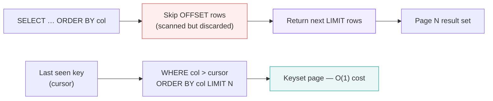

# :material-book-open-page-variant: Pagination

Page through large result sets efficiently — using `LIMIT`/`OFFSET` for simple cases and keyset (cursor) pagination for production-scale queries.

---

## :material-sitemap: How It Works



---

## :material-animation-play: Interactive Demo

> Click a page button to highlight the selected rows and see the generated `LIMIT … OFFSET` clause update live.

<div id="viz-pagination" class="ts-viz"></div>

---

## :material-toy-brick: Sample Data

```sql
CREATE OR REPLACE TEMP VIEW products AS
SELECT * FROM VALUES
  (1,  'Laptop Pro 15',    'electronics', 1299.99),
  (2,  'Wireless Mouse',   'electronics',   29.99),
  (3,  'USB-C Hub',        'electronics',   49.99),
  (4,  'Desk Lamp',        'furniture',     39.99),
  (5,  'Ergonomic Chair',  'furniture',    399.99),
  (6,  'Standing Desk',    'furniture',    549.99),
  (7,  'Python Cookbook',  'books',         44.99),
  (8,  'SQL in 10 Steps',  'books',         29.99),
  (9,  'Noise Headphones', 'electronics',  179.99),
  (10, 'Webcam HD',        'electronics',   89.99),
  (11, 'Bookshelf Oak',    'furniture',    199.99),
  (12, 'Kindle Reader',    'electronics',  129.99)
AS t(product_id, product_name, category, price);
```

| product_id | product_name | category | price |
|-----------|-------------|---------|-------|
| 1 | Laptop Pro 15 | electronics | 1299.99 |
| 2 | Wireless Mouse | electronics | 29.99 |
| … | … | … | … |
| 12 | Kindle Reader | electronics | 129.99 |

---

## :material-numeric-1-circle: Pattern 1 — LIMIT / OFFSET (offset pagination)

Simple offset-based pagination. Best for small tables or low page numbers.

```sql
-- Page size = 4, retrieve page 1 (rows 1–4)
SELECT product_id, product_name, category, price
FROM products
ORDER BY product_id
LIMIT 4 OFFSET 0;
-- Result:
-- product_id | product_name    | category    | price
-- -----------|-----------------|-------------|-------
-- 1          | Laptop Pro 15   | electronics | 1299.99
-- 2          | Wireless Mouse  | electronics |   29.99
-- 3          | USB-C Hub       | electronics |   49.99
-- 4          | Desk Lamp       | furniture   |   39.99

-- Page 2 (rows 5–8)
SELECT product_id, product_name, category, price
FROM products
ORDER BY product_id
LIMIT 4 OFFSET 4;
-- Result:
-- 5  | Ergonomic Chair  | furniture   | 399.99
-- 6  | Standing Desk    | furniture   | 549.99
-- 7  | Python Cookbook  | books       |  44.99
-- 8  | SQL in 10 Steps  | books       |  29.99
```

!!! warning "OFFSET performance"
    `OFFSET N` causes Spark to scan and discard the first N rows before returning results.
    Performance degrades linearly as page number grows — avoid for pages beyond ~100.

---

## :material-numeric-2-circle: Pattern 2 — Keyset (cursor) pagination

Use the last seen key value as a cursor. Scales to any page number with constant cost.

```sql
-- First page — no cursor
SELECT product_id, product_name, category, price
FROM products
ORDER BY price DESC, product_id ASC
LIMIT 4;
-- Result:
-- product_id | product_name    | category    | price
-- -----------|-----------------|-------------|-------
-- 1          | Laptop Pro 15   | electronics | 1299.99
-- 6          | Standing Desk   | furniture   |  549.99
-- 5          | Ergonomic Chair | furniture   |  399.99
-- 9          | Noise Headphones| electronics |  179.99
-- cursor → last row: (price=179.99, product_id=9)

-- Next page — pass last seen (price, product_id) as cursor
SELECT product_id, product_name, category, price
FROM products
WHERE (price < 179.99)
   OR (price = 179.99 AND product_id > 9)   -- tie-break on product_id
ORDER BY price DESC, product_id ASC
LIMIT 4;
-- Result:
-- product_id | product_name  | category    | price
-- -----------|---------------|-------------|-------
-- 11         | Bookshelf Oak | furniture   | 199.99
-- 12         | Kindle Reader | electronics | 129.99
-- 4          | Desk Lamp     | furniture   |  39.99
-- 8          | SQL in 10 Steps | books     |  29.99
```

---

## :material-numeric-3-circle: Pattern 3 — ROW_NUMBER window pagination

Attach a page number to every row. Useful for reporting when you need both the row and its page label.

```sql
WITH numbered AS (
    SELECT
        product_id,
        product_name,
        category,
        price,
        ROW_NUMBER() OVER (ORDER BY price DESC, product_id) AS rn,
        CEIL(ROW_NUMBER() OVER (ORDER BY price DESC, product_id) / 4.0) AS page_num
    FROM products
)
SELECT product_id, product_name, category, price, rn, page_num
FROM numbered
WHERE page_num = 2;
-- Result:
-- product_id | product_name     | category    | price  | rn | page_num
-- -----------|------------------|-------------|--------|----|----------
-- 11         | Bookshelf Oak    | furniture   | 199.99 |  5 |  2
-- 12         | Kindle Reader    | electronics | 129.99 |  6 |  2
-- 10         | Webcam HD        | electronics |  89.99 |  7 |  2
-- 7          | Python Cookbook  | books       |  44.99 |  8 |  2
```

---

## :material-numeric-4-circle: Pattern 4 — Total row count alongside each page

Return page data and total count in a single pass using a window function.

```sql
SELECT
    product_id,
    product_name,
    price,
    COUNT(*) OVER () AS total_rows,
    CEIL(COUNT(*) OVER () / 4.0) AS total_pages
FROM products
ORDER BY price DESC, product_id
LIMIT 4 OFFSET 0;
-- Result:
-- product_id | product_name    | price   | total_rows | total_pages
-- -----------|-----------------|---------|------------|------------
-- 1          | Laptop Pro 15   | 1299.99 |  12        |  3
-- 6          | Standing Desk   |  549.99 |  12        |  3
-- 5          | Ergonomic Chair |  399.99 |  12        |  3
-- 9          | Noise Headphones|  179.99 |  12        |  3
```

---

## :material-swap-horizontal: Pagination Methods Compared

| Method | Consistent order | Scales to page N | Supports random access | Use when |
|--------|-----------------|-----------------|----------------------|----------|
| `LIMIT` / `OFFSET` | Yes | No — O(N) cost | Yes | Small tables, low page numbers |
| Keyset cursor | Yes | Yes — O(1) cost | No — sequential only | Production APIs, large tables |
| `ROW_NUMBER` window | Yes | Yes | Yes | Reporting, page-label labeling |

---

## :material-lightbulb-outline: When to Use

| Scenario | Pattern |
|----------|---------|
| Quick prototyping / small data | `LIMIT N OFFSET M` |
| API "next page" with large tables | Keyset cursor on an indexed column |
| Report with total page count | `ROW_NUMBER` + `COUNT(*) OVER ()` |
| Jump to arbitrary page | `ROW_NUMBER` window + `WHERE page_num = N` |
