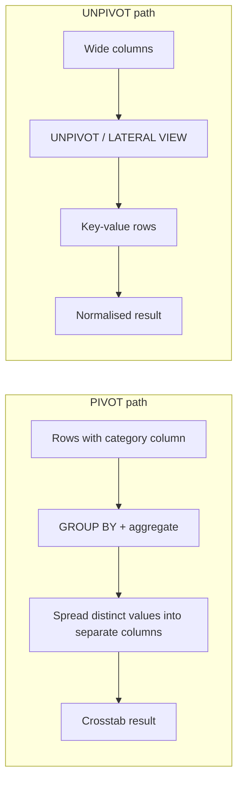

# :material-rotate-3d-variant: Pivot / Unpivot

Turn rows into columns (PIVOT) or columns into rows (UNPIVOT) — essential for crosstab reports, ETL normalisation/denormalisation, and sparse-to-dense transforms.

---

## :material-sitemap: Execution Flow



---

## :material-code-tags: Syntax

### PIVOT clause

```sql
SELECT *
FROM (
    SELECT group_col, pivot_col, measure_col
    FROM source_table
) src
PIVOT (
    SUM(measure_col) AS total
    FOR pivot_col IN (
        'Jan' AS jan,
        'Feb' AS feb,
        'Mar' AS mar
    )
) p;
```

### UNPIVOT clause

```sql
SELECT *
FROM source_table
UNPIVOT (
    measure_value
    FOR measure_name IN (
        math,
        science,
        english,
        history
    )
) u;
```

### Manual pivot fallback with conditional aggregation

```sql
SELECT
    group_col,
    SUM(CASE WHEN pivot_col = 'Jan' THEN measure_col END) AS jan_total,
    SUM(CASE WHEN pivot_col = 'Feb' THEN measure_col END) AS feb_total,
    SUM(CASE WHEN pivot_col = 'Mar' THEN measure_col END) AS mar_total
FROM source_table
GROUP BY group_col;
```

| Pattern | Use when | Notes |
|---------|----------|-------|
| `PIVOT` | Value list is known and you want concise crosstab SQL | Best readability for fixed columns |
| `UNPIVOT` | Wide columns must become attribute-value rows | Ideal for normalisation before downstream joins or filters |
| `SUM(CASE WHEN ...)` | You need manual control or generated SQL | Same logical result as `PIVOT` |

---

## :material-magnify: Behavior

1. `PIVOT` always aggregates, so duplicates inside the same group/value bucket are collapsed by the aggregate function.
2. Missing row/value combinations become `NULL` cells in the pivoted output unless you wrap them with `COALESCE`.
3. `UNPIVOT` turns column names into data values, which is useful for filtering, ranking, and joining across formerly wide attributes.
4. Multiple aggregates in one `PIVOT` generate multiple derived columns per pivot value, typically using the aggregate alias as a suffix.
5. Manual `CASE WHEN` pivots are functionally equivalent to `PIVOT` and remain useful when you need generated SQL or custom expressions.

---

## :material-database: Sample Data

### Dataset 1: Monthly sales

```sql
CREATE OR REPLACE TEMP VIEW monthly_sales AS
SELECT * FROM VALUES
  ('alice', 'east',  'Jan', 12000),
  ('alice', 'east',  'Feb', 13500),
  ('alice', 'east',  'Apr', 14200),
  ('bob',   'west',  'Jan',  9800),
  ('bob',   'west',  'Mar', 10400),
  ('bob',   'west',  'May', 11050),
  ('carol', 'east',  'Jan',  8700),
  ('carol', 'east',  'Mar',  9200),
  ('carol', 'east',  'Jun', 10100),
  ('dave',  'south', 'Feb',  8900),
  ('dave',  'south', 'Apr',  9400),
  ('dave',  'south', 'Jun',  9700)
AS t(salesperson, region, month, revenue);
```

### Dataset 2: Student grades (wide)

```sql
CREATE OR REPLACE TEMP VIEW student_grades AS
SELECT * FROM VALUES
  (1001, 'anika', 88, 91, 84, 79),
  (1002, 'ben',   72, 65, 70, 68),
  (1003, 'chloe', 95, 89, 93, 90),
  (1004, 'diego', 58, 61, 55, 64),
  (1005, 'eva',   81, 78, 85, 88),
  (1006, 'farah', 67, 74, 69, 71),
  (1007, 'gabe',  90, 92, 87, 94),
  (1008, 'hana',  76, 83, 80, 77)
AS t(student_id, student_name, math, science, english, history);
```

### Dataset 3: Quarterly metrics

```sql
CREATE OR REPLACE TEMP VIEW quarterly_metrics AS
SELECT * FROM VALUES
  ('finance',     'headcount',      12,      12,      13,      13),
  ('finance',     'budget',     500000,  520000,  540000,  560000),
  ('finance',     'spend',      470000,  515000,  538000,  552000),
  ('finance',     'revenue',    620000,  640000,  655000,  670000),
  ('engineering', 'headcount',      45,      48,      50,      52),
  ('engineering', 'budget',    1800000, 1850000, 1900000, 2000000),
  ('engineering', 'spend',     1750000, 1820000, 1880000, 1985000),
  ('engineering', 'revenue',   2200000, 2280000, 2350000, 2440000)
AS t(department, metric_name, q1, q2, q3, q4);
```

---

## :material-flask-outline: Practical Examples

### 1 — Basic PIVOT: monthly sales crosstab

```sql
SELECT *
FROM (
    SELECT salesperson, month, revenue
    FROM monthly_sales
) src
PIVOT (
    SUM(revenue)
    FOR month IN (
        'Jan' AS jan,
        'Feb' AS feb,
        'Mar' AS mar,
        'Apr' AS apr,
        'May' AS may,
        'Jun' AS jun
    )
) p
ORDER BY salesperson;
```

??? success "Expected output"

    | salesperson | jan | feb | mar | apr | may | jun |
    |-------------|-----|-----|-----|-----|-----|-----|
    | alice | 12000 | 13500 | NULL | 14200 | NULL | NULL |
    | bob | 9800 | NULL | 10400 | NULL | 11050 | NULL |
    | carol | 8700 | NULL | 9200 | NULL | NULL | 10100 |
    | dave | NULL | 8900 | NULL | 9400 | NULL | 9700 |

### 2 — PIVOT with multiple aggregations

```sql
SELECT *
FROM (
    SELECT region, month, revenue
    FROM monthly_sales
    WHERE month IN ('Jan', 'Feb', 'Mar')
) src
PIVOT (
    SUM(revenue) AS revenue,
    COUNT(*) AS deals
    FOR month IN (
        'Jan' AS jan,
        'Feb' AS feb,
        'Mar' AS mar
    )
) p
ORDER BY region;
```

??? success "Expected output"

    | region | jan_revenue | jan_deals | feb_revenue | feb_deals | mar_revenue | mar_deals |
    |--------|-------------|-----------|-------------|-----------|-------------|-----------|
    | east | 20700 | 2 | 13500 | 1 | 9200 | 1 |
    | south | NULL | NULL | 8900 | 1 | NULL | NULL |
    | west | 9800 | 1 | NULL | NULL | 10400 | 1 |

### 3 — PIVOT by region: revenue by region as columns

```sql
SELECT *
FROM (
    SELECT month, region, revenue
    FROM monthly_sales
) src
PIVOT (
    SUM(revenue)
    FOR region IN (
        'east' AS east,
        'south' AS south,
        'west' AS west
    )
) p
ORDER BY CASE month
    WHEN 'Jan' THEN 1
    WHEN 'Feb' THEN 2
    WHEN 'Mar' THEN 3
    WHEN 'Apr' THEN 4
    WHEN 'May' THEN 5
    WHEN 'Jun' THEN 6
END;
```

??? success "Expected output"

    | month | east | south | west |
    |-------|------|-------|------|
    | Jan | 20700 | NULL | 9800 |
    | Feb | 13500 | 8900 | NULL |
    | Mar | 9200 | NULL | 10400 |
    | Apr | 14200 | 9400 | NULL |
    | May | NULL | NULL | 11050 |
    | Jun | 10100 | 9700 | NULL |

### 4 — Manual pivot with CASE WHEN

```sql
SELECT
    salesperson,
    SUM(CASE WHEN month = 'Jan' THEN revenue ELSE 0 END) AS jan_revenue,
    SUM(CASE WHEN month = 'Feb' THEN revenue ELSE 0 END) AS feb_revenue,
    SUM(CASE WHEN month = 'Mar' THEN revenue ELSE 0 END) AS mar_revenue,
    SUM(CASE WHEN month = 'Apr' THEN revenue ELSE 0 END) AS apr_revenue,
    SUM(CASE WHEN month = 'May' THEN revenue ELSE 0 END) AS may_revenue,
    SUM(CASE WHEN month = 'Jun' THEN revenue ELSE 0 END) AS jun_revenue,
    SUM(revenue)                                          AS h1_revenue
FROM monthly_sales
GROUP BY salesperson
ORDER BY salesperson;
```

??? success "Expected output"

    | salesperson | jan_revenue | feb_revenue | mar_revenue | apr_revenue | may_revenue | jun_revenue | h1_revenue |
    |-------------|-------------|-------------|-------------|-------------|-------------|-------------|------------|
    | alice | 12000 | 13500 | 0 | 14200 | 0 | 0 | 39700 |
    | bob | 9800 | 0 | 10400 | 0 | 11050 | 0 | 31250 |
    | carol | 8700 | 0 | 9200 | 0 | 0 | 10100 | 28000 |
    | dave | 0 | 8900 | 0 | 9400 | 0 | 9700 | 28000 |

### 5 — Basic UNPIVOT: student grades wide-to-long

```sql
SELECT
    student_id,
    student_name,
    subject,
    grade
FROM student_grades
UNPIVOT (
    grade
    FOR subject IN (
        math,
        science,
        english,
        history
    )
) u
WHERE student_id IN (1001, 1002)
ORDER BY student_id, subject;
```

??? success "Expected output"

    | student_id | student_name | subject | grade |
    |------------|--------------|---------|-------|
    | 1001 | anika | english | 84 |
    | 1001 | anika | history | 79 |
    | 1001 | anika | math | 88 |
    | 1001 | anika | science | 91 |
    | 1002 | ben | english | 70 |
    | 1002 | ben | history | 68 |
    | 1002 | ben | math | 72 |
    | 1002 | ben | science | 65 |

### 6 — UNPIVOT with filtering: only failing grades

```sql
SELECT
    student_id,
    student_name,
    subject,
    grade
FROM student_grades
UNPIVOT (
    grade
    FOR subject IN (
        math,
        science,
        english,
        history
    )
) u
WHERE grade < 60
ORDER BY student_id, subject;
```

??? success "Expected output"

    | student_id | student_name | subject | grade |
    |------------|--------------|---------|-------|
    | 1004 | diego | english | 55 |
    | 1004 | diego | math | 58 |

### 7 — UNPIVOT quarterly metrics into long format

```sql
SELECT
    department,
    metric_name,
    quarter,
    metric_value
FROM quarterly_metrics
UNPIVOT (
    metric_value
    FOR quarter IN (
        q1,
        q2,
        q3,
        q4
    )
) u
WHERE department = 'engineering'
  AND metric_name IN ('budget', 'spend')
ORDER BY metric_name, quarter;
```

??? success "Expected output"

    | department | metric_name | quarter | metric_value |
    |------------|-------------|---------|--------------|
    | engineering | budget | q1 | 1800000 |
    | engineering | budget | q2 | 1850000 |
    | engineering | budget | q3 | 1900000 |
    | engineering | budget | q4 | 2000000 |
    | engineering | spend | q1 | 1750000 |
    | engineering | spend | q2 | 1820000 |
    | engineering | spend | q3 | 1880000 |
    | engineering | spend | q4 | 1985000 |

### 8 — Round-trip: PIVOT then UNPIVOT

```sql
WITH dense_sales AS (
    SELECT * FROM VALUES
      ('alice', 'Jan', 12000),
      ('alice', 'Feb', 13500),
      ('bob',   'Jan',  9800),
      ('bob',   'Feb', 10250)
    AS t(salesperson, month, revenue)
),
pivoted AS (
    SELECT *
    FROM dense_sales
    PIVOT (
        SUM(revenue)
        FOR month IN (
            'Jan' AS jan,
            'Feb' AS feb
        )
    )
),
round_tripped AS (
    SELECT
        salesperson,
        month,
        revenue
    FROM pivoted
    UNPIVOT (
        revenue
        FOR month IN (
            jan AS 'Jan',
            feb AS 'Feb'
        )
    ) u
)
SELECT *
FROM round_tripped
ORDER BY salesperson, month;
```

??? success "Expected output"

    | salesperson | month | revenue |
    |-------------|-------|---------|
    | alice | Feb | 13500 |
    | alice | Jan | 12000 |
    | bob | Feb | 10250 |
    | bob | Jan | 9800 |

### 9 — Dynamic-like pivot with COLLECT_LIST + MAP

```sql
SELECT
    salesperson,
    TO_JSON(
        MAP_FROM_ENTRIES(
            COLLECT_LIST(NAMED_STRUCT('key', month, 'value', revenue))
        )
    ) AS month_revenue_map,
    COUNT(*) AS populated_months
FROM monthly_sales
GROUP BY salesperson
ORDER BY salesperson;
```

??? success "Expected output"

    | salesperson | month_revenue_map | populated_months |
    |-------------|-------------------|------------------|
    | alice | {"Jan":12000,"Feb":13500,"Apr":14200} | 3 |
    | bob | {"Jan":9800,"Mar":10400,"May":11050} | 3 |
    | carol | {"Jan":8700,"Mar":9200,"Jun":10100} | 3 |
    | dave | {"Feb":8900,"Apr":9400,"Jun":9700} | 3 |

### 10 — Multi-level pivot: region + quarter crosstab

```sql
WITH sales_by_quarter AS (
    SELECT
        salesperson,
        CONCAT(
            region,
            '_',
            CASE
                WHEN month IN ('Jan', 'Feb', 'Mar') THEN 'q1'
                ELSE 'q2'
            END
        ) AS region_quarter,
        revenue
    FROM monthly_sales
)
SELECT *
FROM sales_by_quarter
PIVOT (
    SUM(revenue)
    FOR region_quarter IN (
        'east_q1' AS east_q1,
        'east_q2' AS east_q2,
        'south_q1' AS south_q1,
        'south_q2' AS south_q2,
        'west_q1' AS west_q1,
        'west_q2' AS west_q2
    )
) p
ORDER BY salesperson;
```

??? success "Expected output"

    | salesperson | east_q1 | east_q2 | south_q1 | south_q2 | west_q1 | west_q2 |
    |-------------|---------|---------|----------|----------|---------|---------|
    | alice | 25500 | 14200 | NULL | NULL | NULL | NULL |
    | bob | NULL | NULL | NULL | NULL | 20200 | 11050 |
    | carol | 17900 | 10100 | NULL | NULL | NULL | NULL |
    | dave | NULL | NULL | 8900 | 19100 | NULL | NULL |

---

## :material-shield-outline: Behavior Notes

!!! warning
    `PIVOT` requires an explicit `IN` value list in Spark SQL; pure SQL cannot discover the output columns dynamically without generated SQL.

!!! tip
    Missing combinations become `NULL` in pivoted cells. Wrap measures with `COALESCE` after the pivot when reports need zero-filled output.

!!! note
    `UNPIVOT` excludes `NULL` source values by default. Use `INCLUDE NULLS` on Spark 3.4+ when the absence of a value must remain visible.

!!! note
    Pivoted column names come from the `IN` list. Add aliases such as `'Jan' AS jan` to keep output names predictable and readable.

!!! success
    `PIVOT` is mostly syntactic sugar over `GROUP BY` plus conditional aggregation, so readability usually matters more than raw performance.

---

## :material-brain: When to Use

| Scenario | Approach |
|----------|----------|
| Crosstab report with known categories | `PIVOT` with an explicit value list |
| BI export that expects one column per month or region | `PIVOT` into a dense wide table |
| ETL normalisation from spreadsheet-style source data | `UNPIVOT` wide attributes into key-value rows |
| Survey answers stored as one column per question | `UNPIVOT` before filtering and aggregation |
| Sparse category totals that should read as one row | `PIVOT` plus `COALESCE` for display defaults |
| Dynamic category sets that cannot be hard-coded | Generated SQL or `COLLECT_LIST` + `MAP` fallback |
| Time-series features for ML or downstream exports | `PIVOT` periods into feature columns |
| Quarterly or monthly metrics stored across many columns | `UNPIVOT` before joins, ranking, or window functions |
| Need exact control over derived expressions per output column | Manual `SUM(CASE WHEN ...)` pivot |
