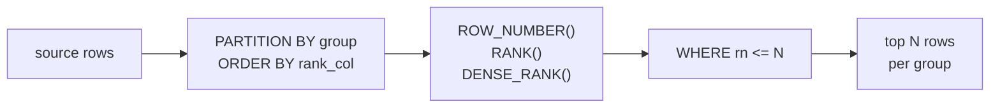

# :material-podium: Top-N Per Group

Select the highest, lowest, or most recent N rows within each group — a foundational pattern for leaderboards, "best seller per category" reports, and deduplication by recency.

---

## :material-sitemap: Execution Flow



---

## :material-pin: Syntax

### ROW_NUMBER approach (exactly N rows per group)

```sql
WITH ranked AS (
    SELECT
        *,
        ROW_NUMBER() OVER (
            PARTITION BY group_col
            ORDER BY rank_col DESC
        ) AS rn
    FROM source_table
)
SELECT * FROM ranked WHERE rn <= N;
```

### RANK approach (include ties)

```sql
WITH ranked AS (
    SELECT
        *,
        RANK() OVER (
            PARTITION BY group_col
            ORDER BY rank_col DESC
        ) AS rnk
    FROM source_table
)
SELECT * FROM ranked WHERE rnk <= N;
```

| Function | Ties | Gaps | Use when |
|----------|------|------|----------|
| `ROW_NUMBER()` | Breaks ties arbitrarily | No gaps | You need exactly N rows per group |
| `RANK()` | Same rank for ties | Gaps after ties | Ties should share the same position |
| `DENSE_RANK()` | Same rank for ties | No gaps | You want N distinct rank levels, not N rows |

---

## :material-magnify: Behavior

1. **ROW_NUMBER tie-breaking** — when multiple rows tie on the `ORDER BY` column, `ROW_NUMBER()` assigns ranks non-deterministically. Add a secondary sort column (e.g., `ORDER BY revenue DESC, product_name`) for repeatable results.
2. **RANK vs DENSE_RANK** — `RANK()` with ties at position 1 skips position 2 (next rank = 3). `DENSE_RANK()` always uses consecutive integers (next rank = 2). Choose based on whether you want "top N positions" or "top N distinct levels."
3. **CTE + filter pattern** — Spark SQL does not support `QUALIFY`, so the standard approach is a CTE (or subquery) that computes the ranking, then an outer `WHERE` filter.
4. **NULL ordering** — NULLs sort last in ascending order and first in descending order by default. Use `NULLS FIRST` or `NULLS LAST` to control placement explicitly.

---

## :material-database: Sample Data

### Dataset 1: Product sales by category

```sql
CREATE OR REPLACE TEMP VIEW product_sales AS
SELECT * FROM VALUES
    ('Electronics', 'Laptop Pro',       95000.00,  142),
    ('Electronics', 'Wireless Earbuds', 28500.00,  890),
    ('Electronics', 'Smart Watch',      42000.00,  520),
    ('Electronics', 'USB-C Hub',        12000.00, 1200),
    ('Electronics', 'Tablet Mini',      67000.00,  310),
    ('Electronics', '4K Monitor',       54000.00,  185),
    ('Clothing',    'Winter Jacket',    18500.00,  370),
    ('Clothing',    'Running Shoes',    32000.00,  680),
    ('Clothing',    'Polo Shirt',        8200.00, 1450),
    ('Clothing',    'Slim Jeans',       14500.00,  520),
    ('Clothing',    'Wool Sweater',     11200.00,  290),
    ('Home',        'Air Fryer',        22000.00,  440),
    ('Home',        'Robot Vacuum',     48000.00,  195),
    ('Home',        'Coffee Maker',     15500.00,  620),
    ('Home',        'Standing Desk',    35000.00,  110),
    ('Home',        'LED Lamp Set',      6800.00,  950)
AS t(category, product, revenue, units_sold);
```

### Dataset 2: Employee performance by department

```sql
CREATE OR REPLACE TEMP VIEW employee_scores AS
SELECT * FROM VALUES
    ('Engineering', 'Alice',   92, 145000),
    ('Engineering', 'Bob',     88, 138000),
    ('Engineering', 'Carol',   95, 152000),
    ('Engineering', 'Dave',    88, 140000),
    ('Engineering', 'Eve',     91, 148000),
    ('Sales',       'Frank',   97, 125000),
    ('Sales',       'Grace',   85, 108000),
    ('Sales',       'Hank',    92, 118000),
    ('Sales',       'Irene',   97, 122000),
    ('Sales',       'Jack',    78, 102000),
    ('Marketing',   'Karen',   90, 115000),
    ('Marketing',   'Leo',     86, 105000),
    ('Marketing',   'Mona',    93, 120000),
    ('Marketing',   'Nate',    89, 110000)
AS t(department, employee, score, salary);
```

### Dataset 3: Daily web page views by site section

```sql
CREATE OR REPLACE TEMP VIEW page_views AS
SELECT * FROM VALUES
    (DATE '2024-07-01', '/blog',     'spark-sql-tips',     4200),
    (DATE '2024-07-01', '/blog',     'delta-lake-intro',   3800),
    (DATE '2024-07-01', '/blog',     'python-best',        5100),
    (DATE '2024-07-01', '/blog',     'data-eng-career',    2900),
    (DATE '2024-07-01', '/docs',     'getting-started',    8500),
    (DATE '2024-07-01', '/docs',     'api-reference',      6200),
    (DATE '2024-07-01', '/docs',     'migration-guide',    4100),
    (DATE '2024-07-01', '/docs',     'faq',                3400),
    (DATE '2024-07-01', '/product',  'pricing',           12000),
    (DATE '2024-07-01', '/product',  'features',           9800),
    (DATE '2024-07-01', '/product',  'enterprise',         7500),
    (DATE '2024-07-01', '/product',  'changelog',          2100),
    (DATE '2024-07-02', '/blog',     'spark-sql-tips',     4500),
    (DATE '2024-07-02', '/blog',     'delta-lake-intro',   5200),
    (DATE '2024-07-02', '/blog',     'python-best',        4800),
    (DATE '2024-07-02', '/blog',     'data-eng-career',    3100),
    (DATE '2024-07-02', '/docs',     'getting-started',    9200),
    (DATE '2024-07-02', '/docs',     'api-reference',      5800),
    (DATE '2024-07-02', '/docs',     'migration-guide',    4600),
    (DATE '2024-07-02', '/docs',     'faq',                3900),
    (DATE '2024-07-02', '/product',  'pricing',           11500),
    (DATE '2024-07-02', '/product',  'features',          10200),
    (DATE '2024-07-02', '/product',  'enterprise',         8100),
    (DATE '2024-07-02', '/product',  'changelog',          2400)
AS t(view_date, section, page, views);
```

---

## :material-flask-outline: Practical Examples

### 1 — Top 3 products by revenue per category (ROW_NUMBER)

```sql
WITH ranked AS (
    SELECT
        category,
        product,
        revenue,
        units_sold,
        ROW_NUMBER() OVER (
            PARTITION BY category
            ORDER BY revenue DESC
        ) AS rn
    FROM product_sales
)
SELECT category, product, revenue, units_sold, rn
FROM ranked
WHERE rn <= 3
ORDER BY category, rn;
```

??? success "Expected output"

    | category | product | revenue | units_sold | rn |
    |----------|---------|---------|------------|----|
    | Clothing | Running Shoes | 32000.00 | 680 | 1 |
    | Clothing | Winter Jacket | 18500.00 | 370 | 2 |
    | Clothing | Slim Jeans | 14500.00 | 520 | 3 |
    | Electronics | Laptop Pro | 95000.00 | 142 | 1 |
    | Electronics | Tablet Mini | 67000.00 | 310 | 2 |
    | Electronics | 4K Monitor | 54000.00 | 185 | 3 |
    | Home | Robot Vacuum | 48000.00 | 195 | 1 |
    | Home | Standing Desk | 35000.00 | 110 | 2 |
    | Home | Air Fryer | 22000.00 | 440 | 3 |

### 2 — Top 2 employees by score with RANK (ties included)

```sql
WITH ranked AS (
    SELECT
        department,
        employee,
        score,
        salary,
        RANK() OVER (
            PARTITION BY department
            ORDER BY score DESC
        ) AS rnk
    FROM employee_scores
)
SELECT department, employee, score, salary, rnk
FROM ranked
WHERE rnk <= 2
ORDER BY department, rnk, employee;
```

??? success "Expected output"

    | department | employee | score | salary | rnk |
    |------------|----------|-------|--------|-----|
    | Engineering | Carol | 95 | 152000 | 1 |
    | Engineering | Alice | 92 | 145000 | 2 |
    | Marketing | Mona | 93 | 120000 | 1 |
    | Marketing | Karen | 90 | 115000 | 2 |
    | Sales | Frank | 97 | 125000 | 1 |
    | Sales | Irene | 97 | 122000 | 1 |
    | Sales | Hank | 92 | 118000 | 3 |

!!! note "RANK includes ties"
    Sales has two employees tied at score 97, so both appear at rank 1. Hank at rank 3 is excluded because `rnk <= 2` filters him out. With `ROW_NUMBER`, only one of Frank/Irene would appear at rank 1 (non-deterministically).

### 3 — Top 2 with DENSE_RANK (N distinct rank levels)

```sql
WITH ranked AS (
    SELECT
        department,
        employee,
        score,
        DENSE_RANK() OVER (
            PARTITION BY department
            ORDER BY score DESC
        ) AS drnk
    FROM employee_scores
)
SELECT department, employee, score, drnk
FROM ranked
WHERE drnk <= 2
ORDER BY department, drnk, employee;
```

??? success "Expected output"

    | department | employee | score | drnk |
    |------------|----------|-------|------|
    | Engineering | Carol | 95 | 1 |
    | Engineering | Alice | 92 | 2 |
    | Marketing | Mona | 93 | 1 |
    | Marketing | Karen | 90 | 2 |
    | Sales | Frank | 97 | 1 |
    | Sales | Irene | 97 | 1 |
    | Sales | Hank | 92 | 2 |

!!! tip "DENSE_RANK vs RANK"
    With `DENSE_RANK`, Hank (score 92) gets rank 2 instead of 3, so he is included. Use `DENSE_RANK` when you want "the top 2 score tiers" rather than "positions 1 and 2."

### 4 — Bottom-N: lowest revenue products per category

Flip the `ORDER BY` to ascending for "worst performers":

```sql
WITH ranked AS (
    SELECT
        category,
        product,
        revenue,
        units_sold,
        ROW_NUMBER() OVER (
            PARTITION BY category
            ORDER BY revenue ASC
        ) AS rn
    FROM product_sales
)
SELECT category, product, revenue, units_sold, rn
FROM ranked
WHERE rn <= 2
ORDER BY category, rn;
```

??? success "Expected output"

    | category | product | revenue | units_sold | rn |
    |----------|---------|---------|------------|----|
    | Clothing | Polo Shirt | 8200.00 | 1450 | 1 |
    | Clothing | Wool Sweater | 11200.00 | 290 | 2 |
    | Electronics | USB-C Hub | 12000.00 | 1200 | 1 |
    | Electronics | Wireless Earbuds | 28500.00 | 890 | 2 |
    | Home | LED Lamp Set | 6800.00 | 950 | 1 |
    | Home | Coffee Maker | 15500.00 | 620 | 2 |

### 5 — Top page per section per day

Most-viewed page in each section for each day:

```sql
WITH ranked AS (
    SELECT
        view_date,
        section,
        page,
        views,
        ROW_NUMBER() OVER (
            PARTITION BY view_date, section
            ORDER BY views DESC
        ) AS rn
    FROM page_views
)
SELECT view_date, section, page, views
FROM ranked
WHERE rn = 1
ORDER BY view_date, section;
```

??? success "Expected output"

    | view_date | section | page | views |
    |-----------|---------|------|-------|
    | 2024-07-01 | /blog | python-best | 5100 |
    | 2024-07-01 | /docs | getting-started | 8500 |
    | 2024-07-01 | /product | pricing | 12000 |
    | 2024-07-02 | /blog | delta-lake-intro | 5200 |
    | 2024-07-02 | /docs | getting-started | 9200 |
    | 2024-07-02 | /product | pricing | 11500 |

### 6 — Top-N with percentage of group total

Show each top product's share of its category revenue:

```sql
WITH ranked AS (
    SELECT
        category,
        product,
        revenue,
        SUM(revenue) OVER (PARTITION BY category) AS category_total,
        ROW_NUMBER() OVER (
            PARTITION BY category
            ORDER BY revenue DESC
        ) AS rn
    FROM product_sales
)
SELECT
    category,
    product,
    revenue,
    category_total,
    ROUND(revenue * 100.0 / category_total, 1) AS pct_of_category,
    rn
FROM ranked
WHERE rn <= 3
ORDER BY category, rn;
```

??? success "Expected output"

    | category | product | revenue | category_total | pct_of_category | rn |
    |----------|---------|---------|----------------|-----------------|-----|
    | Clothing | Running Shoes | 32000.00 | 84400.00 | 37.9 | 1 |
    | Clothing | Winter Jacket | 18500.00 | 84400.00 | 21.9 | 2 |
    | Clothing | Slim Jeans | 14500.00 | 84400.00 | 17.2 | 3 |
    | Electronics | Laptop Pro | 95000.00 | 298500.00 | 31.8 | 1 |
    | Electronics | Tablet Mini | 67000.00 | 298500.00 | 22.4 | 2 |
    | Electronics | 4K Monitor | 54000.00 | 298500.00 | 18.1 | 3 |
    | Home | Robot Vacuum | 48000.00 | 127300.00 | 37.7 | 1 |
    | Home | Standing Desk | 35000.00 | 127300.00 | 27.5 | 2 |
    | Home | Air Fryer | 22000.00 | 127300.00 | 17.3 | 3 |

### 7 — Deduplication: keep latest record per key

A common ETL pattern — keep only the most recent row for each entity:

```sql
CREATE OR REPLACE TEMP VIEW customer_updates AS
SELECT * FROM VALUES
    (101, 'Alice', 'alice@v1.com', TIMESTAMP '2024-06-01 10:00:00'),
    (101, 'Alice', 'alice@v2.com', TIMESTAMP '2024-06-15 14:30:00'),
    (101, 'Alice', 'alice@v3.com', TIMESTAMP '2024-07-02 09:15:00'),
    (102, 'Bob',   'bob@v1.com',   TIMESTAMP '2024-06-05 11:00:00'),
    (102, 'Bob',   'bob@v2.com',   TIMESTAMP '2024-06-20 16:45:00'),
    (103, 'Carol', 'carol@v1.com', TIMESTAMP '2024-06-10 08:30:00')
AS t(customer_id, name, email, updated_at);

WITH latest AS (
    SELECT
        *,
        ROW_NUMBER() OVER (
            PARTITION BY customer_id
            ORDER BY updated_at DESC
        ) AS rn
    FROM customer_updates
)
SELECT customer_id, name, email, updated_at
FROM latest
WHERE rn = 1
ORDER BY customer_id;
```

??? success "Expected output"

    | customer_id | name | email | updated_at |
    |-------------|------|-------|------------|
    | 101 | Alice | alice@v3.com | 2024-07-02 09:15:00 |
    | 102 | Bob | bob@v2.com | 2024-06-20 16:45:00 |
    | 103 | Carol | carol@v1.com | 2024-06-10 08:30:00 |

!!! tip "Dedup = Top-1 per group"
    Deduplication is simply the Top-1 case of this pattern. `ROW_NUMBER() ... WHERE rn = 1` is the standard Spark SQL approach for keeping the latest, earliest, or highest-priority record per key.

### 8 — Top-N with "everything else" summary row

Show the top 3 products per category and roll up the remainder into an "Other" row:

```sql
WITH ranked AS (
    SELECT
        category,
        product,
        revenue,
        ROW_NUMBER() OVER (
            PARTITION BY category
            ORDER BY revenue DESC
        ) AS rn
    FROM product_sales
),
labelled AS (
    SELECT
        category,
        CASE WHEN rn <= 3 THEN product ELSE 'Other' END AS product_label,
        revenue,
        rn
    FROM ranked
)
SELECT
    category,
    product_label,
    ROUND(SUM(revenue), 2) AS total_revenue,
    COUNT(*) AS product_count
FROM labelled
GROUP BY category, product_label
ORDER BY category,
    CASE WHEN product_label = 'Other' THEN 999
         ELSE MIN(rn)
    END;
```

??? success "Expected output"

    | category | product_label | total_revenue | product_count |
    |----------|---------------|---------------|---------------|
    | Clothing | Running Shoes | 32000.00 | 1 |
    | Clothing | Winter Jacket | 18500.00 | 1 |
    | Clothing | Slim Jeans | 14500.00 | 1 |
    | Clothing | Other | 19400.00 | 2 |
    | Electronics | Laptop Pro | 95000.00 | 1 |
    | Electronics | Tablet Mini | 67000.00 | 1 |
    | Electronics | 4K Monitor | 54000.00 | 1 |
    | Electronics | Other | 82500.00 | 3 |
    | Home | Robot Vacuum | 48000.00 | 1 |
    | Home | Standing Desk | 35000.00 | 1 |
    | Home | Air Fryer | 22000.00 | 1 |
    | Home | Other | 22300.00 | 2 |

### 9 — Top-N across multiple ranking criteria

Rank products by revenue, then by units sold, and find products that are top-3 in either:

```sql
WITH by_revenue AS (
    SELECT category, product, revenue, units_sold,
        ROW_NUMBER() OVER (PARTITION BY category ORDER BY revenue DESC) AS rev_rank
    FROM product_sales
),
by_units AS (
    SELECT category, product, revenue, units_sold,
        ROW_NUMBER() OVER (PARTITION BY category ORDER BY units_sold DESC) AS unit_rank
    FROM product_sales
)
SELECT
    COALESCE(r.category, u.category)  AS category,
    COALESCE(r.product, u.product)    AS product,
    COALESCE(r.revenue, u.revenue)    AS revenue,
    COALESCE(r.units_sold, u.units_sold) AS units_sold,
    r.rev_rank,
    u.unit_rank
FROM by_revenue r
FULL OUTER JOIN by_units u
    ON r.category = u.category AND r.product = u.product
WHERE COALESCE(r.rev_rank, 999) <= 3
   OR COALESCE(u.unit_rank, 999) <= 3
ORDER BY COALESCE(r.category, u.category),
    LEAST(COALESCE(r.rev_rank, 999), COALESCE(u.unit_rank, 999));
```

??? success "Expected output"

    | category | product | revenue | units_sold | rev_rank | unit_rank |
    |----------|---------|---------|------------|----------|-----------|
    | Clothing | Running Shoes | 32000.00 | 680 | 1 | 2 |
    | Clothing | Polo Shirt | 8200.00 | 1450 | 5 | 1 |
    | Clothing | Winter Jacket | 18500.00 | 370 | 2 |  |
    | Clothing | Slim Jeans | 14500.00 | 520 | 3 | 3 |
    | Electronics | Laptop Pro | 95000.00 | 142 | 1 |  |
    | Electronics | USB-C Hub | 12000.00 | 1200 | 6 | 1 |
    | Electronics | Tablet Mini | 67000.00 | 310 | 2 |  |
    | Electronics | Wireless Earbuds | 28500.00 | 890 | 4 | 2 |
    | Electronics | 4K Monitor | 54000.00 | 185 | 3 |  |
    | Electronics | Smart Watch | 42000.00 | 520 |  | 3 |
    | Home | Robot Vacuum | 48000.00 | 195 | 1 |  |
    | Home | LED Lamp Set | 6800.00 | 950 | 5 | 1 |
    | Home | Standing Desk | 35000.00 | 110 | 2 |  |
    | Home | Coffee Maker | 15500.00 | 620 |  | 2 |
    | Home | Air Fryer | 22000.00 | 440 | 3 | 3 |

### 10 — Top-N per group using ARRAY_AGG (compact output)

Collapse the top-3 products into a single array per category:

```sql
WITH ranked AS (
    SELECT
        category,
        product,
        revenue,
        ROW_NUMBER() OVER (
            PARTITION BY category
            ORDER BY revenue DESC
        ) AS rn
    FROM product_sales
    WHERE TRUE
)
SELECT
    category,
    COLLECT_LIST(product) AS top_3_products,
    COLLECT_LIST(CAST(revenue AS STRING)) AS top_3_revenues
FROM ranked
WHERE rn <= 3
GROUP BY category
ORDER BY category;
```

??? success "Expected output"

    | category | top_3_products | top_3_revenues |
    |----------|----------------|----------------|
    | Clothing | [Running Shoes, Winter Jacket, Slim Jeans] | [32000.0, 18500.0, 14500.0] |
    | Electronics | [Laptop Pro, Tablet Mini, 4K Monitor] | [95000.0, 67000.0, 54000.0] |
    | Home | [Robot Vacuum, Standing Desk, Air Fryer] | [48000.0, 35000.0, 22000.0] |

!!! note "Order within array"
    `COLLECT_LIST` preserves insertion order, but only if the input is pre-sorted. The CTE with `ROW_NUMBER` guarantees the rows arrive in revenue-descending order, so the arrays are correctly ranked.

---

## :material-shield-outline: Behavior Notes

!!! warning "Non-deterministic ROW_NUMBER with ties"
    If two rows have the same `ORDER BY` value, `ROW_NUMBER()` assigns them different ranks in an arbitrary order. This means repeated runs may return different rows at the boundary. Always add a tie-breaker column to make the result deterministic: `ORDER BY revenue DESC, product`.

!!! warning "RANK can return more than N rows"
    `RANK() ... WHERE rnk <= 3` can return 4 or more rows if multiple rows tie at rank 3. If you need a hard limit, use `ROW_NUMBER()` instead or add `LIMIT` on top.

!!! tip "Anti-pattern: subquery with LIMIT"
    A correlated subquery with `LIMIT N` per group does not work in Spark SQL. Always use the window-function CTE approach.

!!! tip "Performance: filter before ranking"
    If you can eliminate rows before ranking (e.g., `WHERE revenue > 0`), do so in the CTE input. Fewer rows in the window partition means a smaller sort.

---

## :material-brain: When to Use

| Scenario | Pattern |
|----------|---------|
| Top-N products by revenue per category | `ROW_NUMBER() OVER (PARTITION BY category ORDER BY revenue DESC)` |
| Include ties at the boundary | `RANK()` or `DENSE_RANK()` instead of `ROW_NUMBER()` |
| Deduplication (keep latest per key) | `ROW_NUMBER() ... ORDER BY updated_at DESC WHERE rn = 1` |
| Bottom-N (worst performers) | Same pattern with `ORDER BY ... ASC` |
| Top-N with "Other" rollup | CTE + `CASE WHEN rn <= N` + `GROUP BY` |
| Top-N percentage of group total | Combine `ROW_NUMBER` with `SUM() OVER (PARTITION BY group)` |
| Multi-criteria ranking | Separate CTEs per criterion + `FULL OUTER JOIN` |
| Compact top-N as array | `COLLECT_LIST` over pre-ranked CTE |
| Most-viewed page per section per day | `PARTITION BY date, section ORDER BY views DESC` |
| N distinct rank levels (not N rows) | `DENSE_RANK()` to count distinct tiers |
