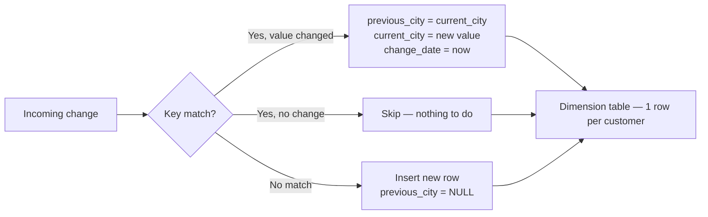

# :material-table-column-plus-after: SCD Type 3

SCD **Type 3** tracks limited history by adding **extra columns** to the same row —
one column for the current value and one for the previous value of each tracked attribute.
No new rows are inserted when a change occurs; the existing row is updated in place.



---

## :material-animation-play: Interactive Demo

<div id="viz-scd-type3" class="ts-viz"></div>

---

## :material-check-circle-outline: When to Use

!!! success "Good fit"
    - You need exactly **one level of history** for one or two slowly-changing attributes
    - Analysts must compare **current vs previous** value in a single row without a join
    - Common examples: previous city, previous department, previous job title, previous tier
    - Storage or schema simplicity is a priority

!!! failure "Not a good fit"
    - More than one previous value must be retained — each generation needs a new column pair, which is unsustainable
    - Full audit trail required — use Type 2
    - The attribute changes frequently — the previous value is overwritten on every change, losing all earlier history
    - Point-in-time fact joins are needed — use Type 2 with a surrogate key

---

## :material-toy-brick: Table Design

### Single tracked attribute (`city`)

```sql
CREATE TABLE IF NOT EXISTS dim_customer (
    customer_id    STRING     NOT NULL,   -- natural / business key
    name           STRING,
    current_city   STRING,               -- Type 3: latest value
    previous_city  STRING,               -- Type 3: value before the last change (NULL if never changed)
    city_changed_at TIMESTAMP,           -- when the city last changed
    updated_at     TIMESTAMP
)
USING DELTA;
```

### Multiple tracked attributes (`city` + `department`)

Add a `previous_` / `current_` column pair and a change timestamp for each attribute:

```sql
CREATE TABLE IF NOT EXISTS dim_employee (
    employee_id          STRING     NOT NULL,
    name                 STRING,
    current_city         STRING,
    previous_city        STRING,
    city_changed_at      TIMESTAMP,
    current_department   STRING,
    previous_department  STRING,
    dept_changed_at      TIMESTAMP,
    updated_at           TIMESTAMP
)
USING DELTA;
```

!!! warning "Schema growth limit"
    Every new tracked attribute adds two columns.  Beyond two or three tracked attributes
    the schema becomes unwieldy — consider switching to Type 6 (single table, full history)
    or Type 4/5 (separate history table).

---

## :material-database-import: Seed Data

```sql
INSERT INTO dim_customer
    (customer_id, name, current_city, previous_city, city_changed_at, updated_at)
VALUES
    ('cust1', 'Alice', 'NY', NULL, NULL, TIMESTAMP '2024-01-01 00:00:00'),
    ('cust2', 'Bob',   'CA', NULL, NULL, TIMESTAMP '2024-01-01 00:00:00');
```

---

## :material-tray-arrow-down: Incoming Staging Data

```sql
CREATE OR REPLACE TEMP VIEW staging_customer AS
SELECT *
FROM VALUES
    ('cust1', 'Alice',   'NY'),   -- no change
    ('cust2', 'Bobby',   'TX'),   -- name + city changed (CA → TX)
    ('cust3', 'Charlie', 'WA')    -- new customer
AS t(customer_id, name, city);
```

---

## :material-repeat: SCD Type 3 MERGE

A single MERGE handles all three cases: update-with-change, no-op (unchanged), and insert.

```sql
MERGE INTO dim_customer AS tgt
USING staging_customer AS src
ON src.customer_id = tgt.customer_id

-- Attribute changed: shift current → previous, apply new current
WHEN MATCHED AND src.city <> tgt.current_city THEN
    UPDATE SET
        name             = src.name,
        previous_city    = tgt.current_city,
        current_city     = src.city,
        city_changed_at  = current_timestamp(),
        updated_at       = current_timestamp()

-- No change: do nothing (implicit — no WHEN MATCHED clause fires)

-- New customer: insert with NULL previous value
WHEN NOT MATCHED THEN
    INSERT (customer_id, name, current_city, previous_city, city_changed_at, updated_at)
    VALUES (src.customer_id, src.name, src.city, NULL, NULL, current_timestamp());
```

!!! tip "NULL-safe comparison"
    If `current_city` can be NULL (e.g. on initial load), replace `src.city <> tgt.current_city`
    with `NOT (src.city <=> tgt.current_city)` to avoid NULL comparisons returning UNKNOWN.

---

## :material-format-list-bulleted-type: Variant Patterns

### Two sequential attribute changes

After a second batch where `cust2` moves again (TX → FL), the third city (CA) is permanently lost.
This is the key limitation of Type 3:

```sql
-- Batch 2 staging
CREATE OR REPLACE TEMP VIEW staging_batch2 AS
SELECT * FROM VALUES ('cust2', 'Bobby', 'FL') AS t(customer_id, name, city);

MERGE INTO dim_customer AS tgt
USING staging_batch2 AS src
ON src.customer_id = tgt.customer_id
WHEN MATCHED AND src.city <> tgt.current_city THEN
    UPDATE SET
        previous_city   = tgt.current_city,   -- TX (CA is now gone)
        current_city    = src.city,            -- FL
        city_changed_at = current_timestamp(),
        updated_at      = current_timestamp();
```

| customer_id | current_city | previous_city | Note |
|-------------|-------------|---------------|------|
| cust2       | FL          | TX            | CA (the original) is permanently overwritten |

### Track two attributes independently

```sql
MERGE INTO dim_employee AS tgt
USING staging_employee AS src
ON src.employee_id = tgt.employee_id

WHEN MATCHED AND (
    src.city       <> tgt.current_city
    OR src.department <> tgt.current_department
) THEN
    UPDATE SET
        -- city tracking
        previous_city       = CASE WHEN src.city <> tgt.current_city
                                   THEN tgt.current_city
                                   ELSE tgt.previous_city END,
        current_city        = src.city,
        city_changed_at     = CASE WHEN src.city <> tgt.current_city
                                   THEN current_timestamp()
                                   ELSE tgt.city_changed_at END,
        -- department tracking
        previous_department = CASE WHEN src.department <> tgt.current_department
                                   THEN tgt.current_department
                                   ELSE tgt.previous_department END,
        current_department  = src.department,
        dept_changed_at     = CASE WHEN src.department <> tgt.current_department
                                   THEN current_timestamp()
                                   ELSE tgt.dept_changed_at END,
        updated_at          = current_timestamp()

WHEN NOT MATCHED THEN
    INSERT (employee_id, name, current_city, previous_city, city_changed_at,
            current_department, previous_department, dept_changed_at, updated_at)
    VALUES (src.employee_id, src.name, src.city, NULL, NULL,
            src.department, NULL, NULL, current_timestamp());
```

### Add `ADD COLUMN` for a new tracked attribute (schema evolution)

```sql
ALTER TABLE dim_customer ADD COLUMNS (
    current_tier   STRING,
    previous_tier  STRING,
    tier_changed_at TIMESTAMP
);
```

---

## :material-check-circle-outline: Final Output

After processing the staging batch:

| customer_id | name    | current_city | previous_city | city_changed_at     | updated_at          |
|-------------|---------|-------------|---------------|---------------------|---------------------|
| cust1       | Alice   | NY          | NULL          | NULL                | 2024-01-01 00:00:00 |
| cust2       | Bobby   | TX          | CA            | 2024-06-15 09:00:00 | 2024-06-15 09:00:00 |
| cust3       | Charlie | WA          | NULL          | NULL                | 2024-06-15 09:00:00 |

Key observations:

- `cust1` — unchanged, `updated_at` preserved from seed.
- `cust2` — `current_city` flipped to TX, `previous_city` now holds CA, `city_changed_at` set.
- `cust3` — inserted with `previous_city = NULL` (first version, no prior city).

---

## :material-flask-outline: Analytical Queries

### Current state of all customers

```sql
SELECT customer_id, name, current_city, previous_city, city_changed_at
FROM dim_customer
ORDER BY customer_id;
```

### Customers who have changed city at least once

```sql
SELECT customer_id, name, previous_city, current_city, city_changed_at
FROM dim_customer
WHERE previous_city IS NOT NULL
ORDER BY city_changed_at DESC;
```

### Customers who moved to a specific city

```sql
SELECT customer_id, name, previous_city, current_city
FROM dim_customer
WHERE current_city = 'TX';
```

### Migration matrix — how many customers moved between each city pair

```sql
SELECT
    previous_city,
    current_city,
    COUNT(*) AS migrations
FROM dim_customer
WHERE previous_city IS NOT NULL
GROUP BY previous_city, current_city
ORDER BY migrations DESC;
```

### Days since last city change per customer

```sql
SELECT
    customer_id,
    name,
    current_city,
    city_changed_at,
    DATEDIFF(current_timestamp(), city_changed_at) AS days_since_change
FROM dim_customer
WHERE city_changed_at IS NOT NULL
ORDER BY days_since_change;
```

### Fact-table join — enrich orders with the city at query time

```sql
-- Type 3 cannot do point-in-time joins. This gives the CURRENT city only.
SELECT
    o.order_id,
    o.order_date,
    o.amount,
    c.name,
    c.current_city,
    c.previous_city
FROM orders        AS o
JOIN dim_customer  AS c USING (customer_id);
```

!!! warning "Type 3 cannot reconstruct the past"
    If `cust2` placed an order when they lived in CA, the join above will show TX (current).
    Use Type 2 with a surrogate key for accurate point-in-time attribution.

---

## :material-shield-outline: Common Pitfalls

| Pitfall | Consequence | Solution |
|---------|-------------|---------|
| Comparing NULL with `<>` | NULL city never triggers the update | Use `NOT (src.city <=> tgt.current_city)` |
| Multiple tracked attributes with a single `OR` | One attribute change overwrites BOTH `previous_*` columns | Use `CASE WHEN` per attribute (see variant above) |
| Applying Type 3 to high-churn attributes | `previous_city` overwritten constantly — no meaningful history | Use Type 2 for frequently changing columns |
| Forgetting `city_changed_at` column | Cannot tell when the city last changed | Add a `*_changed_at` timestamp per tracked attribute |
| Schema grows unboundedly | Table definition becomes unmanageable | Hard limit: max 2–3 tracked attributes per table |

---

## :material-swap-horizontal: SCD Type Comparison

| Scenario | Recommended Type |
|----------|-----------------|
| Only current values, no history | Type 1 |
| Full history with point-in-time accuracy | Type 2 |
| **Current + one previous value per attribute** | **Type 3** |
| Current table + separate history table | Type 4 |
| Current table + history table with FK link | Type 5 |
| Current + history + previous value, single table | Type 6 |
